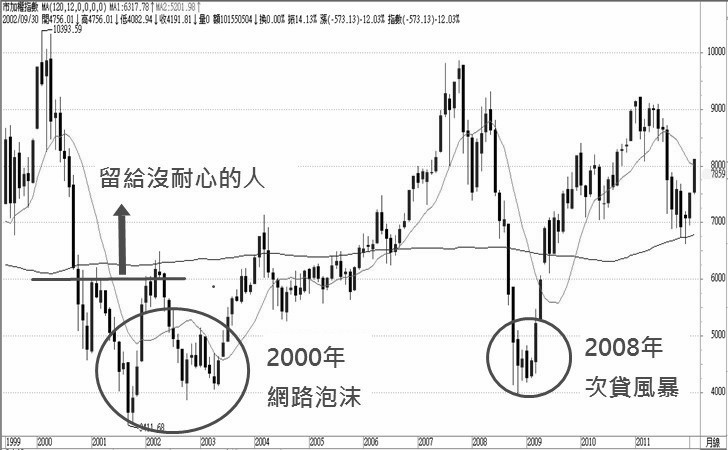
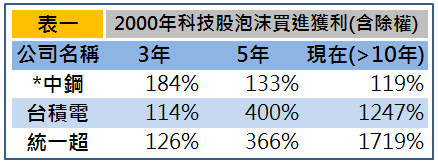

# 致富，你需要的是耐心：當股災來時，眼睛放亮點以文找文

 `今天我們要來思考為什麼一次的股災入市可以抵過十次的波段獲利。`
 
 
 「如果一個人的耐心程度將計算到個人財富裡，那麼有些人早已破產。」 –富朋友

我因為進入股市投資的時間早，所以跟同年齡的人比起來，我的股齡顯得操老許多。
好在這種操老是偏向愈老愈有價值，所以有時別人聽到我的投資年齡後，都會主動跟我討論
想進一步了解投資獲利的「秘訣」。其中我常被問到的是：「你都怎麼在股市賺到錢的？」

答：「我很會等！」

這四字箴言是我每次都想脫口而出的第一句話，簡短又能突顯我的核心觀念。
只是若我真的這樣回答，應該就四海之內皆無朋友了吧！藏私、暗槓、冷漠、愛耍神祕
可能是我在別人心中的印象。所以為了友誼，通常我都會說明一些投資心態，偶爾加些圖表
來增加說明的力道，以及進場時要注意的指標。
但說實在，最重要還是四個字：「要耐心等。」

  懂得等待，一次投資抵過別人十次
股市本來就是個動盪的市場，金融危機或突發事件（SARS、兩顆子彈…）層出不窮，所以
每隔幾年股票市場就會來個大跳水，不過攤開歷史數據及股市線圖，近十年嚴格定義
危機重創股市的還是這兩件跟美國有直接關聯的事：2000年的科技股泡沫與2008年的次貸風暴。
以下圖表可以清楚看到這兩事件當時從高點掉落的慘況及事後報酬回升的可觀。

