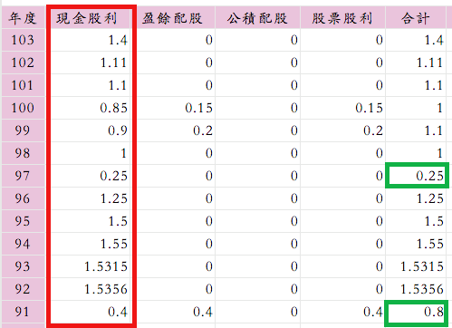
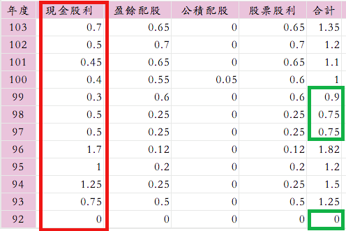
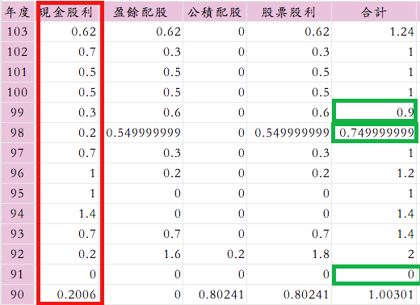
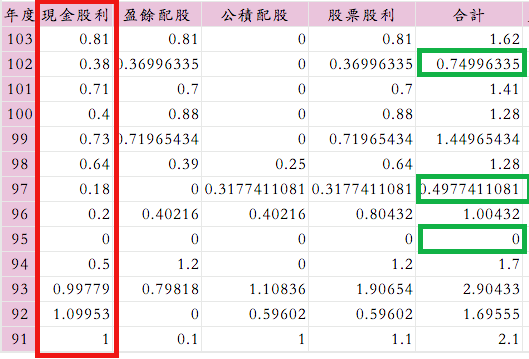
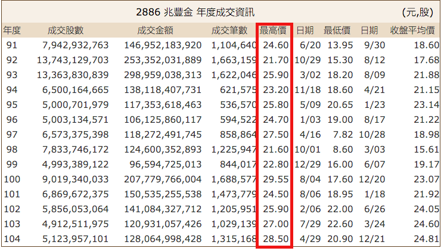
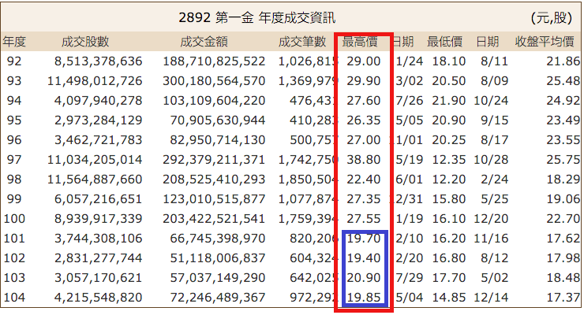
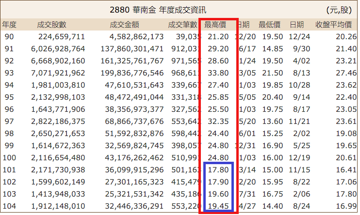
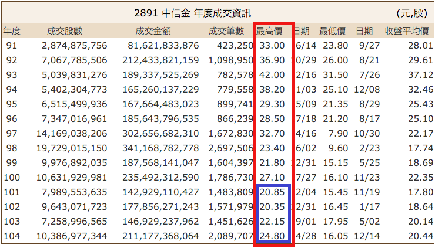

# 金融股分析

網友提問關於金融股買點問題:
金融股的財報不是很容易了解.不過大致上可以從逾放比,備抵呆帳覆蓋率,資本適足率等數據來研判銀行的體質是否良好?
如果挑選的個股在所有金控的前段班,再來談投資的問題.較為安全.傳統上金融股的買點多以股價淨值比來看.
```
兆豐金 每股淨值 21.01元
第一金 每股淨值 16.09元
華南金 每股淨值 15.11元
中信金 每股淨值 14.47元
```

我所挑選的四檔金融股.股利發放的時間約13~14年.若以現金股息而言<br>
當屬2886兆豐金最為優異,穩健!<br>
其他三檔勤於發放股票股利或現金增資.現金股息也較不穩定.反映到股價上也是趨勢向下.若是極度保守投資人應該投資兆豐金比較好.因為現金股息可預期性較高.<br>
前陣子大家都在流行買第一金,中信金<br> 因為配發股票股利比較可以享受到股票資產的時間複利.但未來風險就是一旦銀行獲利衰退？股價將重挫回應.也是極為正常的事.<br>
接下來開始回應網友提問....<br>
我不認為可以一套標準通吃所有金融股的買點問題.因為這牽扯到金融機構的營運體質,股利發放比率,外資法人認同度等等.<br>
歷年高低點正是投資人對這家公司極度樂觀與極度悲觀的股價波動範圍.但偶爾遇到全面性股災或單一事件重大利空,股價也可能跌破歷史低點.讓投資人嚇破膽.這是抱股票資產無法避免的情事.要去習慣它.<br>
目前這四檔金融股,只有兆豐金可以直接套用歷年股價高低點範圍去尋找相對的便宜買點.<br>
若以股息殖利率6%為滿足點,未來股息假設1元.<br>
則 買進價16.7元應屬於可投資的價位.<br>
第一金,華南金,中信金 則以『股利』報酬率來判斷.含股票股利.因為我們實在很難預估他們下一年現金股息的比例.<br>
網友若是細心一點,可以發現近四年<br> 第一金,華南金,中信金的年度股價高點已經下修.不復當年的高.年度低點差不多就是現在這個時間點.關於買點,我的看法不管是用上市以來的平均股利報酬率或n年.皆可.並沒有標準答案.我會用法人過去對這家公司的股價淨值比範圍跟股利報酬率8%當作參考點.
想跟大家溝通一個觀念,不管我們是如何研判買點.都有可能買的比市價高.此時的我們應該學習一笑置之!不要再去事後懊惱.因為市場未必是理性的.但我們應該保持樂觀的心態持續抱緊股票資產.這也是我可以無視於股價震盪的原因.與大家分享~
.
.
.
巴小智 2016.1.28
--------------------------------------
對於[金控股每年配股]現況下，您是如何考量其[相對歷史低點]?
A:可以請教您，您是如何評價[買進的價格]的嗎? 
B:目前是以近10年殖利率平均值到達個人的目標為準(6%以上)...
A:可以再請教您，是純現金配息嗎?還是配股也列入?
這用在金控股，評出來的買進價是天壤之別!
B:小弟大多以現金殖利率評估為主,近期嘗試買進金融股則以現金及配股加總考量...
A:[買進金融股則以現金及配股加總考量]
這，可以分享[這次不一樣]的考量嗎? 
B:當然也是會考量相對歷史低點,以第一金為例,目前成本14.×,我個人認為還算安全...
A:[也是會考量相對歷史低點]---巴大的投資邏輯。
價格，總是上上下下漲漲跌跌的，誰知道明天會如何?
小弟想學的是:如何評價[買進的價格]? 
可以有2套不同的標準嗎? 若可，那如何裁量[配股可列入]的時機?


###2886兆豐金



###2892 第一金


### 2880華南金

### 2891中信金




### 2886兆豐金的年度高點變化不大



### 2892第一金近四年股價高點已經下修

### 2880華南金近四年股價高點已經下修


### 2891中信金近四年股價高點已經下修



