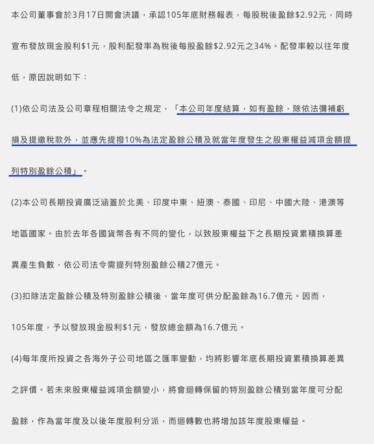
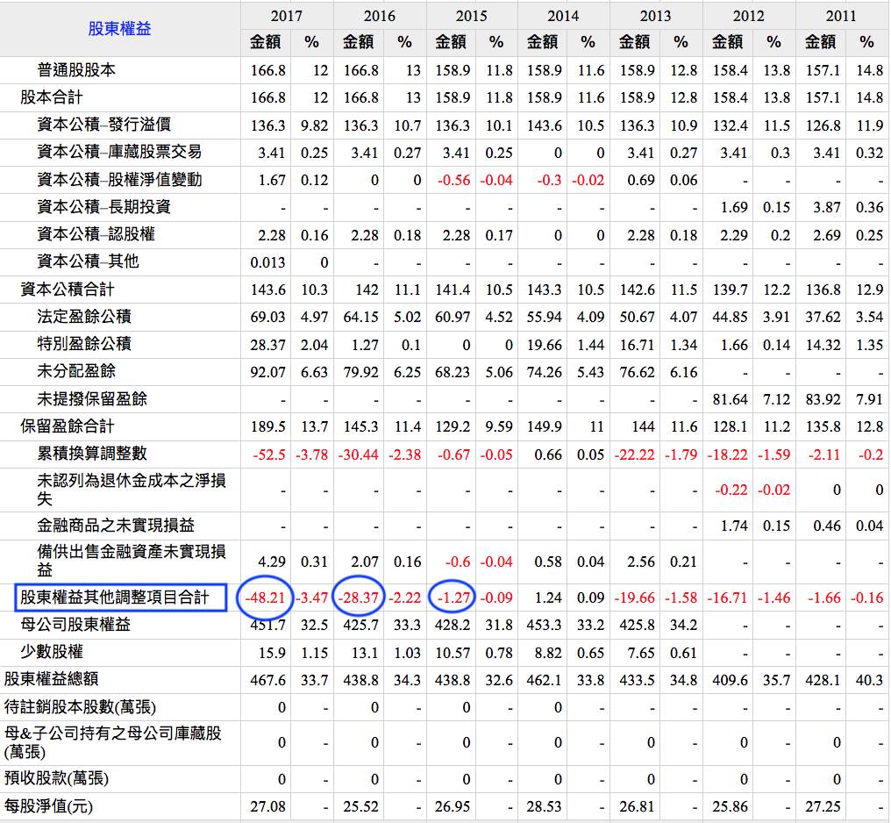
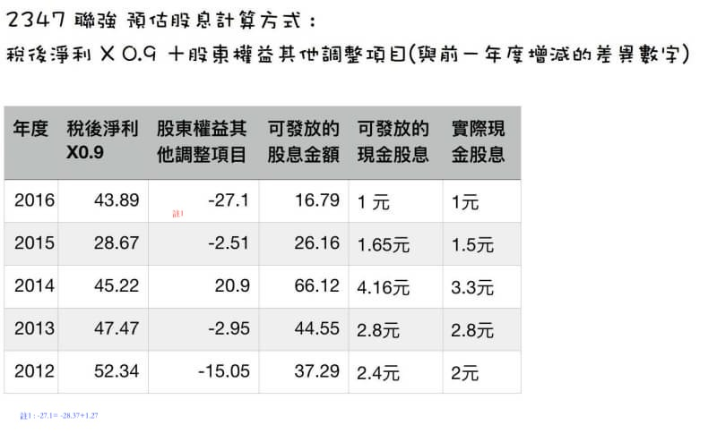

# 如何預估2347聯強股利範圍？

去年聯強股利意外的才發放1元,但2016年eps 是 2.92元。
當時引發投資人一陣錯愕,後來聯強特別為此發佈一則新聞解釋原因。

原來聯強的股息發放標準是以此原則！請留意標示的藍色底線。
簡單講就是
稅後淨利X0.9 + 股東權益其他調整項目合計 數字 （數字為負代表須提列的金額,為正代表可以回補的金額）

2016年第四季是-28.37億元 
2017年第四季是-48.21億元 

代表-48.21+28.37=-19.84億元 （代表2017年度需再認列金額）
代表去年賺的錢要扣掉19.84億元才能發放
跟2016年度遇到同樣認列問題

未來只要此一數字低於-48.21億元就是代表可以回補到股利可發放金額,也就是股利將會增加。
過去在2014年度曾經發生 股東權益其他調整項目合計 數字 由負轉正,隔年股利發放增加。
2014年度eps 3.16元,隔年股利發出3.3元正是這個原因造成。

2017年度稅後淨利 61.15億元 
依據上述計算公式 
可發放的股息是 61.15X0.9-19.84=35.2億元 
聯強股本是166.8億元 
可發放的現金股息 2.11元 
實際發放金額是2.2元 

未來只要公布年報相關數字,稅後淨利、股東權益其他調整項目合計 數字
投資人就可以輕鬆推估2347聯強的股利發放範圍。 
但這僅限於聯強,因為每家公司的股利發放標準不同所致。 
希望這篇文章對於中長期投資聯強的網友有所助益。謝謝～

巴小智 2018.3.22