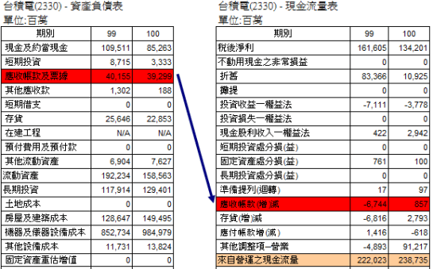
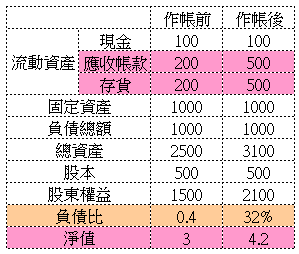
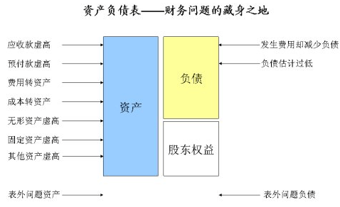

# [ 應收帳款(增)減] 與 [應付帳款增(減)] 在財報上的流動方向

一般投資人在觀察財報的時候，大多集中心力在資產負債表與損益表身上…
若要完整的看出金錢的流動方向則要將`現金流量表一併納入考量`

在觀察報表的過程中，比較容易混淆的部分在於應收與應付帳款的加減號
意義在甚麼地方….

常見的問題在於:`為何資產負債表中應收帳款減少在現金流量表上卻是增加`

我們先來談一個簡單的概念….資產負債表的英文為[  Balance Sheet ] 
Balance 有`平衡`的意義存在….也就是說有有增加必有減少，兩者相加必為零..
換言之，`財報的表示形式為 1 – 1 = 0`

我們取2330 台積電 的財報來說明此一現象

左側的資產負債表應收帳款由 40155 -> 39299

表示流動資產減少，其中的對於客戶的應收帳款減少了8.56億

而在現金流量表就可以看見應收帳款(增)減 流入了8.56億的金額…

兩者相抵扣則為零

在`資產負債表`上

應收帳款是屬於客戶對於台積電的債務

也就是說當台積電出貨8.56億的產品交給客戶後，客戶並沒有支付任何的現金

而是以一張三個月後到期支付的支票，在這三個月期間公司實質上有出貨但是沒有收到現金

此時因為有出貨的事實存在故計為應收帳款增加8.56億….

當客戶支票到期之後，得以請領實際的金額入帳，此時應收帳款計為減損 (已收到帳務)

那`現金流量表`則是`相反`的概念

當收到支票表時表示沒收到現金但有出貨的事實

故在現金流量上計為減損 8.56億 (有出貨而無現金)

請領現金入帳後則計為增加 8.56億

一來一回就可以看出現金流動的方向….

從這裡比較敏感的投資人就會質疑那..

如果只要出貨就可以計為應收帳款納入流動資產內

資產負債表上的應收帳款不就有可能只是一個`空包彈`

假裝出貨來虛灌應收與應收帳款 `使得流動資產增加進而膨脹淨值`?!

是的….完全沒有錯誤

我們進一步來看幾個速算計算公式…

##資產總額 = 流動資產 + 固定資產 + 負債總額
##流動資產 = 現金 + 應收帳款 + 存貨

看見了嗎…要虛灌資產怎麼做最快…

那就是假出貨、堆庫存來膨脹流動資產…..

下表快速的表示 若公司透過`假出貨、堆庫存的方式`

怎麼來美化一些常見的比例數字….

可以看見..作帳後……

`負債比下降了、淨值提升了`  // 負債比是 0.32% 上面打錯

## 負債比
1000 / 2500 = 0.4% // 原本

1000 / 3100 = 0.32%  // 作帳後

##淨值
500 / 1500 = 3  // 原本

500 / 2100 = 4.2   // 作帳後

但是應收帳款與存貨增加表示沒有現金流入…….

若一間公司持續的增加應收帳款與存貨卻未能在現金流量表看見現金流入…

就要小心…..該公司可能在持續的作帳美化帳面與資產負債表…..

可參考 [ 科風 – 太陽能類股假帳危機爆發 ] 內的解析手法….

 

投資人看見公司的資產負債表持續轉好先不要太高興…

先看看是那個東西增加造成的…..

若是存貨與應收帳款增加所造成的….

就不用太高興…..

###對於公司而言 [資產負債表] 上的存貨與應收帳款算是`債務`而不是資產

` 資產負債表是個容易造假的地方要多加小心`