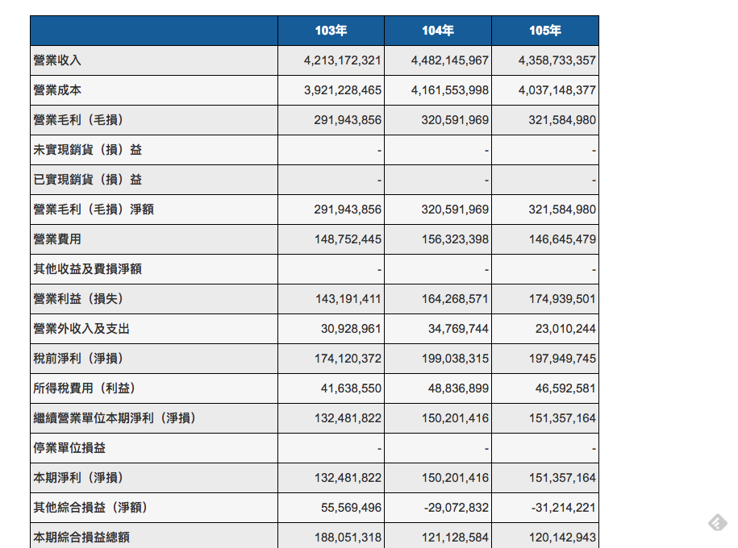
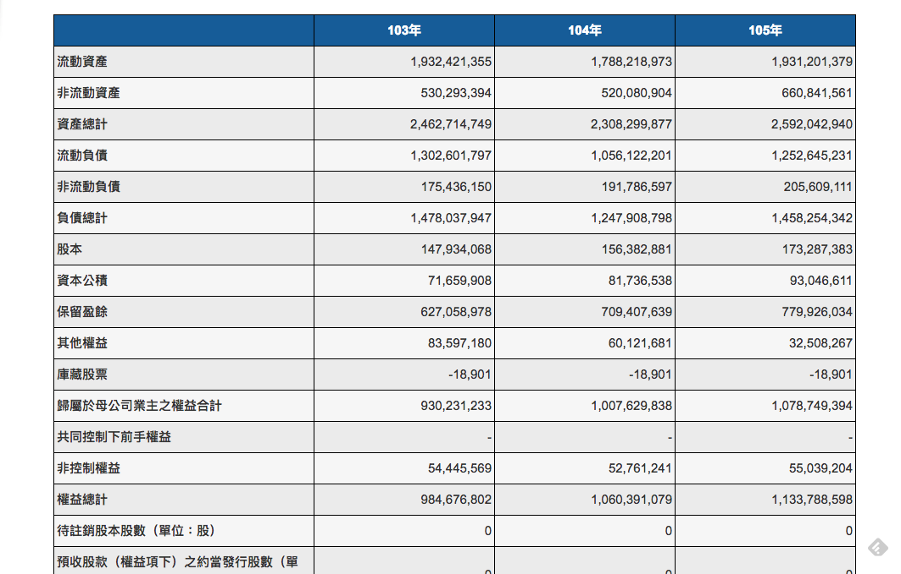
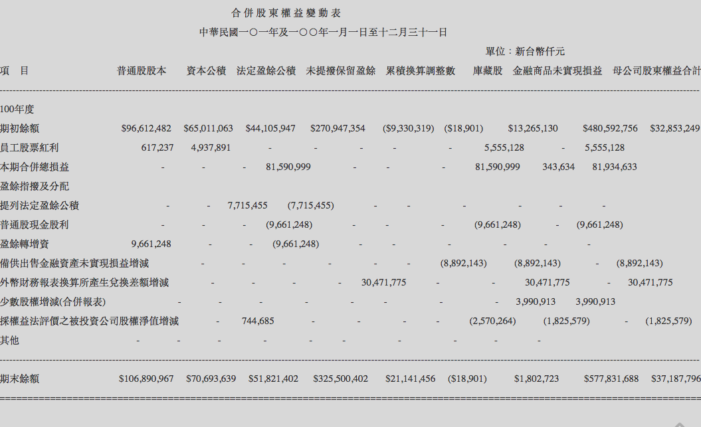
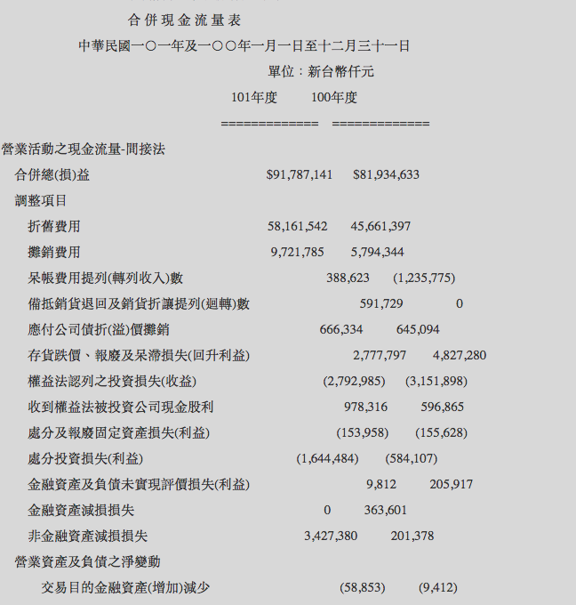

# 財報分析入門筆記

##前言
財務報表是一家公司的體質檢查表，透過財務報表可以了解這家公司的財務狀況和營運狀況，也就是說可以透過財務報表去一窺公司的身體健康是否硬朗或是漸漸亮起紅燈。許多人以為財務報表晦澀難懂，只有經營者、會計師或是財務分析師才需要了解。事實上，財務報表的觀念並不難懂，不管是投資大眾甚至是公司員工應該都要對自己投資和工作的公司要有所掌握，一般投資人若能了解財報就有機會從中挖掘被低估的優質股票進而獲取相對報酬（賺錢），而一般員工若能掌握財報資訊，更能全面性了解公司營運狀況和未來發展方向，為自己的職涯加分。

一般來說財務報表有分為損益表、資產負債表、現金流量表和股東權益變動表等。其中損益表代表公司的營業收益狀況，資產負債表代表公司的資產和負債的組成元素，股東權益變動表則是記錄了股東權益的變動情況，而現金流量表則是呈現了公司現金流的狀況。以下就讓我們用財報獲利性分析、安全性分析、價值評估、成長性分析一一來探索。

## 財務報表

### 損益表

損益表彙整了企業過去一段時間的營運狀況（一季、半年和一年）。從中可以看出企業銷貨收入、營業毛利、營業費用、淨利或是淨損和每股盈餘的狀況，進一步了解公司生意狀況和是否賺錢？

###資產負債表
資產負債表呈現了企業在某一個特定日下的財務狀況，表中列出企業的資產和負債狀況，可以了解企業的存貨、土地、廠房以及長短期債務狀況。

###股東權益變動表
想知道股東分紅，未分配的盈餘有多少，經營團隊是否為股東創造價值則可以透過股東權益變動表去了解。

### 現金流量表
現金流量表以現金流入、流出為基準，說明企業在某一特定期間營業活動、投資活動、融資活動的現金變化，了解企業運用現金的方式和現金來源。

## 財報分析

### 獲利性分析：公司是否可以穩定獲利？

財報分析中最重要的就是獲利性分析，在商業世界中開公司就是要賺錢，所以公司是否穩定賺錢是最重要的事情，而且公司的獲利狀況往往會和公司股價高度相關，所以當我們投資或是找工作時公司的獲利狀況往往是考量的重點。在獲利性分析中我們主要看的指標主要有：有毛利率、營益率、淨利率和股東權益報酬率等。

1. 毛利率：產品競爭力（較適用於製造業）
`毛利率 = (營業收入 - 營業成本) / 營業收入 * 100%`
一般而言，製造業毛利率若能 > 20% 就算是不錯的表現，但像是一些網路、軟體公司和 IC 設計公司其研發費用佔的是大宗，營業成本不高，所以毛利通常會比較高。

2. 營益率/純益率：企業本業賺錢能力
`營益率 = (營業毛利 - 營業費用) / 營業收入 * 100%`
營業費用包含了管銷費用和研發費用等，營業毛利真正扣除營業費用才是真正的本業獲利。

3. 淨利率
`淨利率 = (營業淨利 - 營業外收入及利益) / 營業收入 * 100%`
扣除業外損益（轉投資、買賣土地廠房收入）就是營業淨利，建議 > 10%。一般看財報時不會把業外收入列入競爭力強弱指標（尤其要避開一次性的賣土地或是資產的收益狀況）

4. ROE 股東權益報酬率
`股東權益報酬率 = 稅前淨利 / 股東權益總額 * 100%`
一家公司長期獲利表現最好的指標莫過於 ROE，許多投資人多半會希望一家公司過去 5 年的 ROE 可以大於 15% 或 > 10 %。一家為維持高 ROE 的公司就算是持續能考高分的績優學生，當然能挨過 6-8 年景氣循環更好。

- 杜邦分析
杜邦分析最早起源於杜邦公司，其運用了 1. 企業的獲利能力 2. 運用資產的效率 3. 財務槓桿 來分析企業價值。

    - `ROE = 淨利 / 營收 * 營收 / 資產總額 * 資產總額 / 股東權益總額 * 100%`

    - `ROE = 淨利率(稅後純益率) * 總資產週轉率 * 股東權益乘數 * 100%`

    - `ROE = 獲利能力 * 資產運用效率 * 財務槓桿 * 100%`

    - 利用杜邦分析，拆解 ROE 可以透視一間公司的獲利能力、管理能力、還有財務結果。並根據公司所處的位置，預測公司之後的走向。若 ROE 來自稅後純益代表產品競爭力佳，若能強化資產運用效率則可以創造更高的 ROE。若 ROE 來自於資產使用效率則代表可以使用較少的資產創造更高的獲益，若有擴廠消息和擴大資本支出則可以提高 ROE，若 ROE 來自於財務槓桿則企業營運績效並不健全。

5. ROA 總資產報酬率 
`總資產報酬率 = 稅後淨利 / 資產總額 * 100%`
ROA 表示企業運用資產賺錢的本事，若是 ROA 長期往下通常代表公司投資的資產過多但賺錢效率不如以往，一般認為 ROA 有 8% 的才算是表現不錯，但還是要看產業別和過去同時間比較

##安全性分析：公司的財務狀況健康嗎？

安全性分析主要是分析公司體質是否安全？公司會不會倒？許多公司看似驚人的獲利往往是不斷燒錢所創造出來的假象，安全性分析則是透過舉債以及財務槓桿操作的情況讓你避開這樣的地雷公司和股票。

1. 獲利含金量 
`獲利含金量 = 營業現金流入 / 稅後淨利 * 100%` 
代表企業營運真正帶回多少現金，是否真正賺到錢。一般建議獲利含金量 > 80%

2. 自由現金流量 
`自由現金流量 = 營業現金流量流入 - 投資現金流量流出` 
看公司是燒錢還是賺錢，一般而言過去 5-8 年大部分的自由現金流量必需大於 0，長期向上

3. 長短期金融負債比 
`長短期金融負債比 = 長短期金融借款 / 資產總計 * 100%`  
如果單單看負債比容易錯過好公司，我們可以採取長短期金融負債比（長短期負債包括：短期借款、應付短期票據、一年到期長期負債、長期負債等）來看衡量真正造成企業還債壓力的債務狀況。一般而言建議 30% - 40% 以下