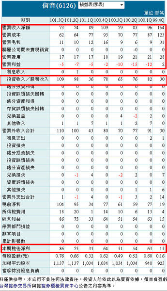
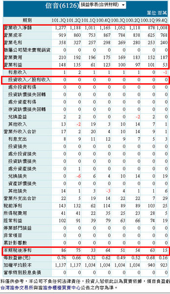
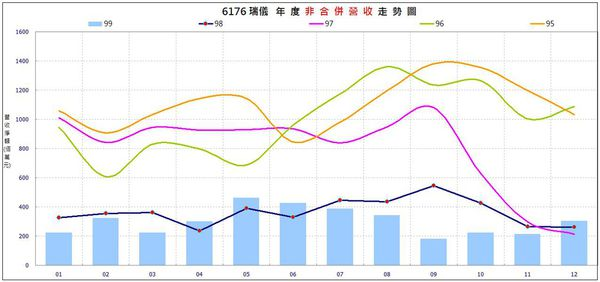
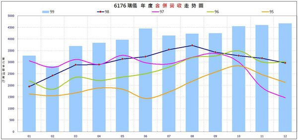

# 合併財務數字VS.非合併財務數字

那到底合併與非合併的差異為何？

對投資又有什麼影響？

現行法規又是如何？就定義上來說，非合併財報與非合併營收都只列入母公司營收，而合併財報與合併營收必須列入子公司的數據，那何謂子公司？

也就是「`受母公司控制之企業`」，當然還有更清楚的定義，大家可以自己去找找，但記得主要差異即可。

##非合併 = 母公司

##合併  = 母公司 + 具有控制權的子公司孫公司

那到底重要差異為何？

很簡單，大家試想一件事，台灣是電子代工出口的國家，近幾年有非常多的公司到國外設廠，到了海外會在海外新設公司，而這些公司通常不是台灣母公司完全投資，就是最大股東，大多數這些新設的公司，主要還是在進行公司原本的業務，也就是原本做連接器的，到了海外還是做連接器，不會突然變成做食品業，那請問各位，這樣算不算本業？

當然也算，所以很多人喜歡看合併的資料就在於此，因為如果碰到一家重心設點在國外的公司，從合併資料才能真實呈現其營運狀況。

因此，這裡有一個非常非常重要的概念產生了，那合併與非合併在同一家公司公布的資料中，最後的獲利數字會不同嗎？

###請記得，不管是合併或非合併，`但最後一家公司的獲利總數一定一樣`。

##為什麼會這樣呢？

因為當公布的資料為非合併時，這些子公司孫公司`只會把最後的獲利或虧損總數直接認列到業外的項目中`，但如果公布的資料為合併時，會把這些子公司孫公司的營收、營業成本、營業費用等細項從業外抽出來後，加回母公司的數據中。

這段話不好理解，看不懂就多看幾次，我們一起看看下面這個例子！

第一張圖是6126信音的非合併損益表，請大家看看我畫起來的三個框框

發現了嗎？

 

如果看非合併財報，從第一個框框來看，基本上最近幾季的營業利益都是負的，營收數字也都不大，看到第二個框框可以發現近幾季在業外的投資收入都很多，對吧！

可是如果看合併損益表呢？

讓我們看看

先看到第一個框框，有沒有發現營收、營業成本、營業費用、營業利益的數字都大幅增加了呢？

 

這就是我剛剛說的，會把具有控制權的子公司孫公司的數字拆開後加回來，所以哪個數字會不見呢？

沒錯，就是第二個框框的業外投資收入，看到了吧！

好，請你對照這兩張表的第三個框框，結果一不一樣呢？

##`這就是我剛剛一直強調的，不管是合併或非合併，獲利總數一定一樣`。

這樣了解了嗎？

好，再回頭仔細想想剛剛說的，你應該就恍然大悟了，當看的是非合併時，就算是本業，但這些子公司孫公司還是要認列到業外，如果是合併時，你就清楚知道本業是否賺錢囉！

那有沒有不管是合併或非合併的資料，投資收入這一塊還是一樣複雜呢？

有的，這就代表他的轉投資是比較複雜，可能不單純只有在海外設廠，還有投資一些其他行業或是其他公司，大家可以看看1704榮化的損益表，自己練習看看。

同樣的，不只在損益表有這樣的情形，資產負債表與現金流量表，也會看到南轅北轍的情況，所以才常常會有人說：`有合併還是看合併`。

但偏偏台灣並未強制上市櫃公司要公布合併資料，所以變得很不統一，相對的有些公司透明度就降低，有些甚至會在第三屬地的免稅天堂設立公司，方便調整美化財務數字。

有聽說明年要強制實施公布合併財報這件事，但還是等確定實施再說吧！

大家也別忘了，合併與非合併在目前現行法規下，公布的時間並不一樣。

`有些人可能這樣還搞不清楚，那兔兔再舉一個例子吧`！

假設目前有一家A公司做的是PCB，在大陸百分百持股設立了一家B公司，也是用來代工PCB，可是這家公司另外轉投資了少許比例、不具控制權的PCB藥水的C公司，那這樣財報上會看到什麼現象。

##非合併
營收、營業成本、營業費用、營業利益：認列A公司資料 
業外：認列B公司與C公司的盈虧 

##合併
營收、營業成本、營業費用、營業利益：認列A公司與B公司的資料 
業外：認列C公司的盈虧 

這樣大家應該會比較了解了吧！

那這些數據跟實際投資有什麼關係？

那關係可就大囉！

很多公司在非合併還沒看到成長時，有時會在合併先顯現出來，這種就是海外投資可能開始量產或是開始有所收益，這樣的公司可就值得注意囉！

讓我們來看看底下這檔例子

這是6176瑞儀在2011年1月公布2010年之前的非合併營收圖，有什麼感覺？

 

但實際上我們來看看合併營收給你的感覺是不是一樣？

同樣的，除了合併營收以外，在合併財報中所衍生的，毛利率、營益率…等相關數字也都常常與非合併大大的不同，所以你說看合併資料重不重要？

自然存在著一些重要性，但大多數的好公司，還是可以透過非合併資料找到，只是自然要很勤勞做功課喔！

以上就是合併資料與非合併資料的說明，如果有錯誤的地方還請指正，有問題的地方也歡迎討論！