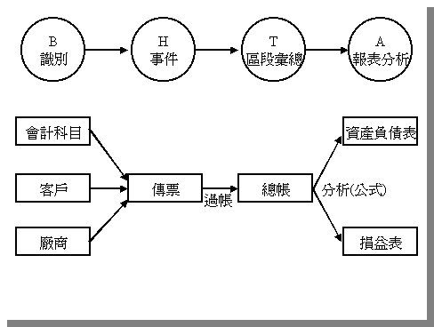
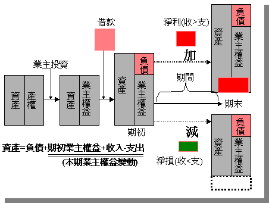
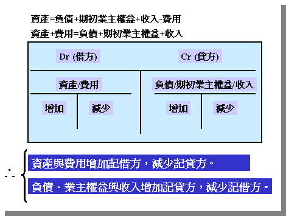
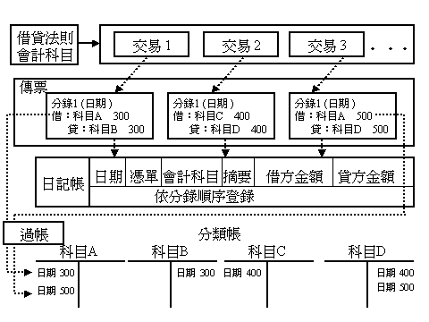
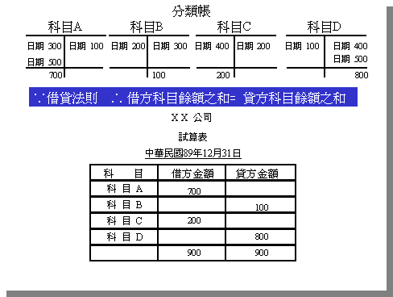
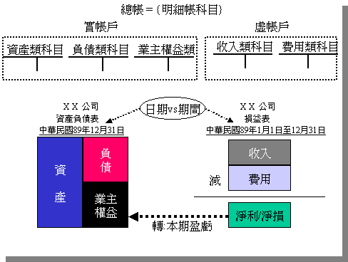
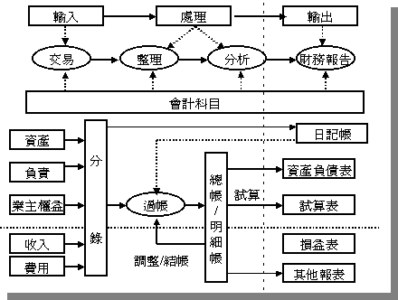

# 會計觀念篇-財務報表

##會計基本觀念

　　企業的各項功能(生產、銷售、人事、研發、財務)所造成的各項活動，均靠會

計正確地加以記錄。但應該注意到所謂活動是指能以貨幣來加以衡量且對企業之

資產、負債、業主權益產生影響的的經濟活動。這些會計記錄的事項稱為交易。

因此，所有會計的重點可以分成：

(1) 對於交易之認定、衡量、記錄 (i.e. Input)。

　　可想而知，首先要解決的是：要認定What、衡量What、記錄What。因此，需要有

　　一套明確的交易標的物(會計要素)，就是會計科目。你可想像會計科目是一組從事

　　會計相關活動所熟悉的名詞，發生任何交易時，會計人員知道如何利用這些名詞與

　　系統化方式(就是一般公認會計原則與借貸法則)加以認定、衡量、記錄。

(2) 將記錄根據會計科目的分類來加以彙總與分析（i.e. Process）)並製作報表

　（i.e.Output），以充分地將會計記錄之資訊表達出來。

　　在此，處理的活動含過帳、試算、調整來達成彙總與分析之目的。

(3) 會計資訊的使用者會將報表所提供的資訊，加以評估與判斷，以便制定決策。

(4) 當然，有些內部使用者所制定的決策(例如投資資金於生產設備)，將會產生新的

　  交易。
　  
　  

`圖一：會計基本觀念`

圖一之右半側可視為會計的循環，重點在於有系統地認定、衡量、記錄、彙總

與報告會計資料，而左半側才有關於決策制定。但整個體系的核心卻是會計要素

(會計科目)，可見會計科目在會計上的角色。故所有學習會計者都應該了解會計科

目的本質與分類。

## 會計衡等式

前面曾提到企業使用會計來記錄對企業之資產、負債、業主權益產生影響的

經濟活動。但所有的活動的記錄都始於最基本之會計衡等式。本文以圖二來解釋

這個重要的概念。當企業開始要營運前是空無一物的，也無任何資源供其使用，

無法去買生產設備。若要投入任何資產於此企業，也必須了解資產來源與歸屬，

也就是產權。所以就行成了`資產=產權` 這個衡等關係。

如業主拿出100萬出來，以提供企業營運，此時必須從兩個觀點來看這100萬。

第一，從此時開始企業便擁有100萬的現金資產可供使用。第二，業主就擁有這個

企業100萬的產權。所以，衡等關係可表示成 `資產=業主權益`  。當然，除了企業主

自行投資外，企業亦可透過融資來取得資金。例如向銀行貸款50萬，此時除了原先

業主投資之100萬，企業可用資金為150萬，此150萬即資主投資與銀行貸款之和。

所以，此時之衡等關係可表示成`資產=負債+業主權益 `。

企業在營運之交易活動時產生收入，與相對的費用(支出)。一般企業營運總希望

能夠產生利潤。當然，只有在收入大於費用的情況下才會有淨利。如果費用大於收

入的情況下就會有淨損。但是賺錢或虧錢可不關銀行的事，而是由業主承擔。如果

有淨利，企業資產多了，則業主對此企業的產權相對的也增加。反之有淨損，企業

資產少了，則業主對此企業的產權相對的減少，而等式兩邊依舊相等，可延伸為

`資產=負債+期初業主權益+收入-費用` 。

圖二：會計衡等式

## 借貸法則

所以企業在處理會計活動時，就是在找出所受交易影響之資產、負債、業主

權益、收入、費用等會計科目，利用衡等式與借貸法則來加以記錄。會計上利用

T字帳作為記錄科目變化的工具。

T字上方記錄科目名稱，左邊稱為借方（Debit），右邊稱為貸方（Credit）。

記入借方稱為借記 （動詞），記入貸方稱為貸記。 一般會計採「複式簿記」，表

示一交易發生至少影響兩個會計帳戶，其中一個採記入借方，另一個採記入貸方。

只是哪一個是借記、哪一個是貸記則又得考量到會計衡等式。而前述之衡等關係，

資產=負債+期初業主權益+收入-費用 可移項成為 

資產+費用=負債+期初業主權益+收入。

移項後之會計衡等式左側（資產、費用）科目增加計借方，減少記貸方。反

之，右側（負債、業主權益、收入） 科目增加計貸方，減少記借方。 如果一項交

易引起等式左側之資產科目增加，則可能是（1）右方之負債、期初業主權益、收

入等量增加。例如企業向銀行借款則借記資產科目（表資產增加）且貸記負債科

（表負債也增加）。或是（2）左方（資產、費用） 等量減少。例如用現金買設

備，則借記設備（表資產增加），貸記現金（表資產減少），所以只是資產換資

產而總資產不變。所以交易發生時，各個科目變化總和仍會保持衡等關係，且無

論交易如何複雜都不會改變。圖三彙整了會計衡等式、T字帳與借貸法則。

圖三：T字帳與借貸法則

## 日記帳與過帳

如圖四所示，會計事實上是依會計衡等式與借貸法則而將交易的事實製作成分

錄。每一個分錄記錄著借/貸兩方的科目名稱、交易日期、金額等項目。當然，交易

時不能空口說白話，而是需要所謂的會計憑證。會計憑證含收據、發票、領料單等

的原始憑證與記帳憑證-傳票。檢附原始憑證之傳票用來記錄借貸、簽呈與作為登帳

之基礎。

當然，每天不只僅有一組交易。會計人員必須依交易日期將當日所有的交易謄

寫於日記帳上。日記簿因將交易依發生的先後順序加以記載，所以又被稱為序時簿。

然後將日記帳中的內容，依所記載之各個會計科目轉計於分類帳中，舊稱為過帳。

但是，對現在以電腦化的處理而言，日記帳可視為傳票輸入後依日期所製造的報表

，而不必有真實存檔動作。所以圖四的表示方式並不依人工模式，而是自傳票直接

過帳到分類帳中，因為在設計系統傳票與分類帳資料都必須以資料庫作實體的儲存。

圖四：分錄、日記帳與分類帳

## 試   算

至此，會計交易被作成分錄且以傳票加以記錄，而後轉換成一組具有資產、費

用、負債、業主權益、收入其中一項的明細帳戶。既然前面曾提及一般會計採「複

式簿記」，所以每一張傳票借方總金額必等於貸方總金額。理論上在過帳後所有分

類帳之借方總金額也會等於貸方總金額；或是借方科目的餘額（借方科目之借方總

金額減貸方總金額 ）等於貸方科目的餘額

（貸方科目之借方總金額減借方總金額）。

試算的目的在於驗證分類帳之借/貸方總金額是否相等或是借餘科目餘額總和是

否等於貸餘科目餘額總和。如圖5所示，會計人員依科目順序計算出借餘或是貸餘，

並填入試算表中，最後計算所有科目之借/貸餘總和是否相等。如果不相等，則必須

依作帳過程逆向找出錯誤出處以便更正。

但是，即使最後計算所有科目之借/貸餘總和相等也不保證帳務處理完全正確。

例如重複入帳等錯誤因借貸雙方同額增減，試算便無法發現錯誤。

圖五：試算

## 財務報表

在蒐集會計資料後，企業必須提供相關財務報表以了解企業財務狀況。而資產

負債表與損益表是最最重要的報表。

　

再回到會計衡等式 `資產=負債+業主權益` 與其延伸式 `資產=負債+期初業主權益

+收入-費用`。資產負債表是用來表示原式資產=負債+業主權益 ，這三類 科目是從

企業創立起就存在，所以是永久性帳戶或稱實帳戶。而損益 表用來表示收入與費

用之關係，這兩類的帳戶僅提供在某一會計期間的損益資訊，此一會計期間結束

時便要將損益結轉至業主權益`(期初業主權益+收入-費用)`，所以是臨時性帳戶或稱

虛帳戶。 所以在製表順序上必須先編製損益表以便計算出淨利或淨損，以便計算

出累計到這個時間點上的業主權益的正確金額。

圖六：資產負債表與損益表

## 彙整會計程序　

會計本來就是資訊系統，具備有一般系統輸入、處理、輸出的特性。會計科

目實為整個系統的核心。從以會計科目作為要素輸入交易內容，並加以會計科目

來整理與分析，以製作財務報表提供會計資訊使用者參考。除了以每日交易為基

礎製作日記帳外，在經過過帳與試算後以會計科目之虛帳戶之科目(收入與費用)

製作損益表；並依會計科目之實帳戶(資產、負債、業主權益)製作資產負債表。

所以，在學習會計時應對會計科目之本質、特性、分類、編碼等問題多加留意。

圖七：彙整會計程序