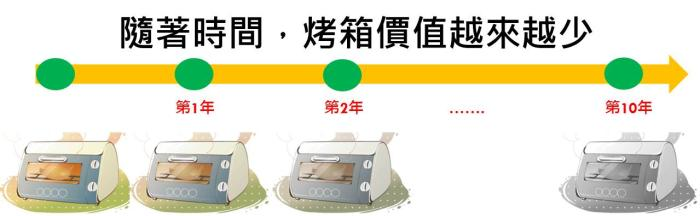
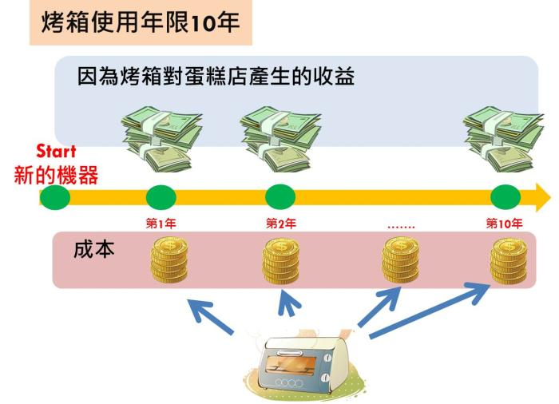
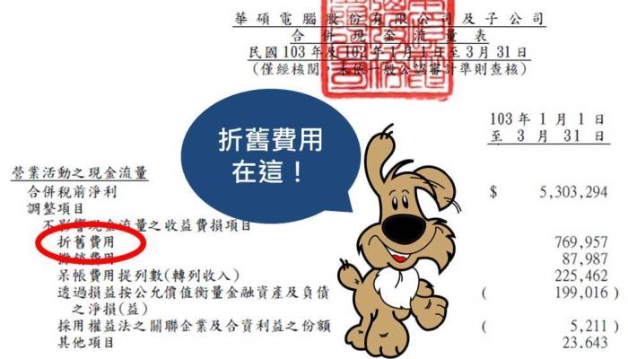
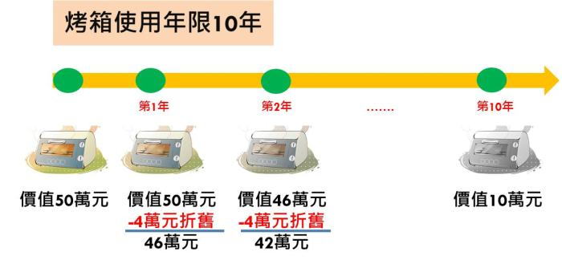
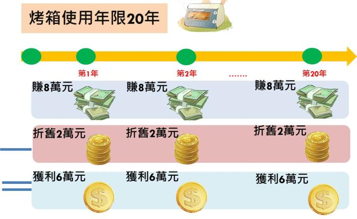

# 什麼是折舊？

##折舊(depreciation)的概念 可以從 2 個方向解釋
###1. 價值的損耗： 機器、設備老化造成價值降低

企業必須購買資產來創造收入

但土地以外的所有固定資產

都有一定的使用年限

這些機器、設備就會因為時間的增加

面臨生產效率變差

造成會計上的價值變低的問題

例如 蛋糕店烤箱 使用年限是 10 年

代表公司預計這台烤箱最多可以用 10 年

時間愈久，烤箱的剩餘價值也會越來越低。

###2. 作為企業的`準備金`
從另外一種角度來看

折舊可視為一種準備金

在未來機器設備損壞 或報廢時

用來購買新的機器設備進行汰換。

折舊費用雖然計入損益計算中的費用

但是並沒有實際的現金流出

所以企業在一開始購買設備的資本支出

會透過折舊分攤、逐漸累積

做為未來投資設備的準備金。

###折耗(deduction) 指的是天然資源的折舊

折耗的概念和折舊非常相似

差別在於

折舊處理土地以外的固定資產減少的價值

而折耗是處理天然資源減少的價值

通常礦業、石油和天然氣公司

都會有這種會計科目

然而折耗費用比折舊費用更為複雜

且牽涉到許多會計專業、法律專業的問題

所以投資人通常比較難判斷

企業的折耗費用是否正確

###分期認列折舊費用 是為了將成本平均分攤

假設蛋糕店一年可以因為這台烤箱收入 30 萬

如果第一年把買烤箱的 40 萬元

全部列為費用 ( 財報上顯示公司的花費 )

那麼第 1 年的財報可能會看到

蛋糕店 因為這台烤箱

而虧損 30 萬－40 萬＝ -10 萬

光購買烤箱就虧了 -10 萬

如果蛋糕店一次買了 10 個烤箱呢？

第 1 年就會虧 100 萬

看到這數字應該就嚇跑一堆投資人了吧！

`折舊的中心概念`

就是把買機器、設備花的錢

`分攤到使用年限的時間內`

這樣我們才能客觀的

從財報看到公司費用的分攤與資產情況。

也就是蛋糕店要把買烤箱花的 40 萬元 分成 10 份

分攤到未來 10 年的損益之中

### 折舊費用的科目放在`現金流量表`裡面

`折舊費用並不是放在損益表的科目裡面`，

(延伸閱讀：什麼是損益表)

由於不同資產的折舊會認列至不同的費用，

例如管理費用、研發費用、製造費用等，

所以我們必須在現金流量表中才能了解當期折舊的總額。

從  華碩(2357) 2014年Q1的現金流量表，

我們可以發現折舊費用。

