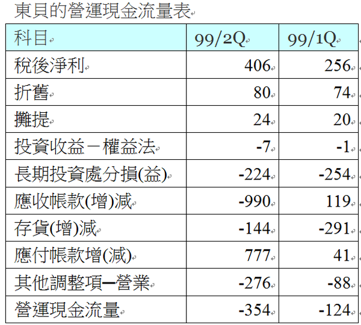
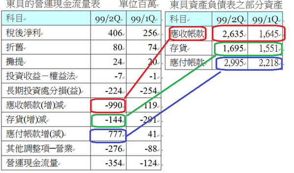
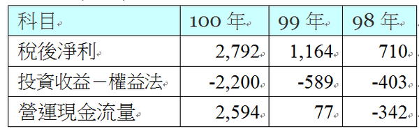

# 現金流量表分析-營運現金流量

顧名思義，從營業而產生的現金，第一個聯想到的「稅後淨利」，一般對會計完全陌生的人會認為「稅後淨利」就是一家公司賺多少的錢，然而這個錢卻不等同於現金，有些公司損益表上相當好看，但卻無法從營業中賺到現金流入，有些公司明明稅後淨利相當高，然而其營業現金流入卻低的可憐。 

小結論：負的營運現金流量通常是公司營運轉差的先兆之一，但正的營運現金流量不一定就是現金狀況健全的公司。

我們繼續以東貝(2499) 營業現金流量來作探討：

來自營運的現金大約分為幾項：

##1、稅後淨利：
稅後淨利是營運的結果，也是這個項目的開頭，簡單的講，淨利是各種收入減各種支出，而部份收入並沒有收到現金，而部分費用尚未付出現金，一頭霧水吧？我一一說明。

##2、折舊(含攤提)：
大家都知道機器廠房會提列折舊，折舊在損益表中是列為費用，但是折舊這個費用並沒有付出現金啊，花一百萬買台機器分五年折舊，每年折舊費用是20萬，這部機器早已在當初買入就付現了，所以當列折舊時其實是沒有現金流出，所以在計算現金流量時必須從稅後淨利中加回這一項數字。 

##3、投資收益-權益法：
很繞舌吧，這一個項目大多列為減項，很奇怪對吧！收益怎麼成為現金減項呢？這項目在損益表是列為收入的啊，為什麼？所謂權益法的投資就是一般我們常稱的長期投資，而國內一些公司會將海外的投資設在那些免稅天堂，而當地的稅負較低，所賺的錢多數是不會匯回母公司。

然而，現在的現金流量表也是採取合併報表的方式計算，為什麼還有權益法長期投資的調整項目呢？答案就出在孫公司，子公司所轉投資的孫公司，無需和她的祖父母公司合併申報，所以東貝的合併現金流量表中還有這個科目，那顯然就是來自於其孫公司。

##4、投資損失-權益法：
跟第三項剛好相反，若發生損失時，在損益表示需要認列損失，但是由於長期投資的現金是一開始就支出了，當長期投資的公司與標的發生損失時，是沒有再需要拿出資金來填補的，所以這塊金額列為還原稅後淨利的加項。

雖然現在的現金流量表都是母子公司合併報表，大部分公司都不會有太多的「投資損益-權益法」的現金調整項目，但由於現在轉投資的花樣與把戲越來越多，為了某些稅務或帳務的「特殊安排」，孫公司曾孫公司也越來越多見，譬如潤泰新(9945)

潤泰新(9945)部分合併現金流量表   單位百萬

潤泰新(9945)的合併現金流量表中，每年都有相當龐大的投資收益，以100年為例，投資收益的金額已經逼近全年稅後淨利，從這現象可以看出：

###1、越來越多的轉投資躲到不用編列合併報表的孫公司或備供出售項下，這類公司的財務報表透明度越來越低。

###2、龐大的投資收益根本沒有匯回母公司。

所以當投資人看到合併現金流量表中還有金額這麼龐大的「投資損益-權益法」的項目，除非你藝高人膽大，否則還是多看少碰。

##5、長期資產或投資的處分損益：
處分損失列為現金加項，收益列為現金減項，然而，投資的處分是屬於資產負債表中的資產科目的調整，其現金流量的部分屬於投資活動而非營業活動，但是處分的損益又編到損益表裡頭，所以必須先將這部分損益給拆解。譬如一家公司當初買了一塊土地1000萬，而今天以900萬賣掉，損益表上很清楚的是損失100萬，但是這個100萬的虧損並沒有發生現金流出啊，此外，不只沒有這100萬損失的現金流出，甚至還有900萬的現金流入呢，不過這900萬的現金流入則屬於現金流量表中的另一個大項「投資活動的現金流量」。

##6、應收帳款的增減：
公司的收入叫做「營業收入」，但並不是所有收入都立即收現，沒有收現的部份就叫做應收帳款，以東貝為例，該公司99年第1季應收帳款為16.45億，而99年第2季的應收帳款暴增到26.35億，等於是99年第2季的應收帳款增加了9.9億，這9.9億已經當成營業收入而列入損益表的加項當中，但事實上卻尚未收到現金，所以在營運現金流量的調整中必須將之剔除。反之，若應收帳款減少則代表收現入帳，所以是現金流量的加項。

##7、存貨增減：
簡單來說存貨減少意味著現金增加，反之則意味著現金流出；不過要特別注意的是，存貨降低有兩種成因，一是銷貨暢旺以至於降低庫存，二是打呆帳造成存貨降低，如果是打呆帳的話會在損益表中認列為損失，但這項損失實際上並沒有支付現金，所以不論存貨降低原因為何，都得列為營運資金的加項。

以東貝為例，該公司99年前兩季的存貨各自增加2.91億和2.44億，因為存貨增加並沒有增加損益表的任何費用，但不管存貨是買來的還是製造出來的，存貨增加意味著支出現金。

##8、應付帳款的增減：
應付帳款是屬於營業上的負債，注意這不是其他金融上的負債，所謂應付帳款是營業上進貨進料或分批買機器設備的支出，已經列在損益表當中的營業成本或營業費用當中，早就已經反映在稅後淨利裡頭，但是應付款款實際上還沒有支付現金啊，所以這項應付帳款的增減就必須當成現金流量的調整項，與應收帳款剛好相反，應付帳款若增加則代表營運現金的增加。 

##9、其他調整項：
這個項目幾乎每家公司都有，天下沒有編不平的現金流量表，那編不平的部份就要用調整項來調整，這項數字的疑竇很大，如果有些小公司表上的其他調整數很大且變動劇烈，就捨去不看這家公司。 