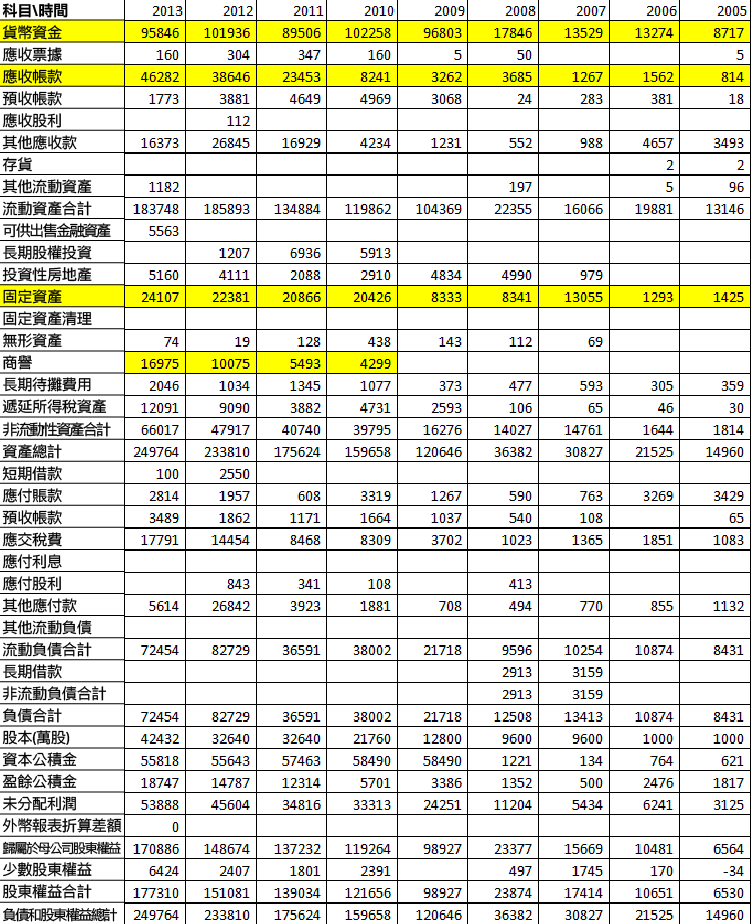

# 永遠需要優先看的報表 — 資產負債表（資產篇）

話說 500 年前出現了資產負債表，100 年前出現了利潤表，30 年前出現了現金流量表。資產負債表比任何報表都古老同時也最有效。所以分析資產負債表的能力是優秀投資者所必須具備的。分析資產負債表我個人覺得分析企業合併資產負債表就可以了，而母公司報表可以直接省略。

分析資產負債表到什麼程度才算是比較合格呢？就是拿到一張報表，大致知道其是什麼行業的企業，那麼說明你對企業的報表情況有一定的理解了。所以有志於學好財務分析的朋友，應該把這個作為你很重要的目標，當然要有這個本領，不看幾百張報表是不太能做到的。

分析資產負債表的一個重要原則，就是哪裡“胖”看哪裡。看“胖”的地方是不是應該胖了，如果不應該“胖”的地方胖了，而不應該“瘦”的地方瘦了。那我們就應該小心了。

具體而言，有幾點需要特別注意：

###(1) 貨幣資金，越多越好

我這個觀點可能很多人反對，因為大部分人的心目中，貨幣資金 (編者按：在企業生產經營過程中，處於貨幣形態的部分資金，按其形態和用途不同可分為包括庫存現金、銀行存款和其他貨幣資金。它是企業中最活躍的資金，流動性強，是重要的支付手段和流通手段。) 維持一個比例比較恰當。但我讀過的所有報表中發現，貨幣資金少的企業，大部分都是那種不是具有很強優勢的企業，只有強勢企業，才可能在報表上累積巨大的現金，為現金怎麼花而煩惱。

比如蘋果 (Apple) 這樣的企業才會有花不完現金的煩惱；而京東方科技集團股份有限公司想有很多貨幣資金也很難。  (當然我也贊成錢多分紅掉一些，但體現在報表中多點是好的。)

當然有些企業靠向銀行借貸，或者是發行債券，保留了大量的貨幣資金。這種貨幣資金是不值得欣賞的，至少我們分析的時候要把這部分貨幣資金減去。同時分析貨幣資金的時候也不要那麼侷限，你應該考慮把交易性金融資產、其他應收款中購買理財產品的資金最好算上，它們基本上與貨幣資金沒很大區別。

有些驚人的企業，上市以後募集的資金一直沒花，留在貨幣資金中。當這種企業估值低到淨資產以下足夠多，你也會發現它們很安全的，是可以明顯把握的機會。

###(2) 應收帳款，自然越少越好

有很多財務分析的書籍，告訴我們怎麼分析應收帳款周轉率，其實我個人覺得沒必要，我從來不看這個周轉率怎麼樣。你要記得如果企業要靠這種周轉率很快才能生存下來，那麼其生存狀況也是高度緊張的，不岌岌可危，也是活得夠厲害。

應收帳款你看這個大概，是不是在企業報表中它成為了一個胖子，越胖越是危險，當然如果大部分應收帳款在一年以內可以收回，那還比較正常，但無論怎麼樣，都是越少越好的。

###(3) 存貨看看值錢不

存貨首先要看是不是值錢，有些企業的存貨越來越不值錢，尤其是服裝企業，存貨一堆而且過季存貨就大大貶值，從這點上來說，存貨也是不要太多，維持合理的生存水平即可。不值錢的存貨是悲劇，到一定時間來給減值損失，就一下存貨少了很多，有時候即使還算值錢的存貨，突然少了也讓人很驚詫，獐子島就是很好的例子。但有些企業商業模式沒設計好，也可能會導致存貨大增。

有時候看到一個企業存貨很大，可能也是由於房地產業務所導致的。以雅戈爾為例其流動資產 274 億 6727.18 萬，存貨就占 205 億 6942.30 萬。

主要原因是房地產業務所導致的。這種企業最討厭，業務很多然後不同行業給我們一個合併報表，大家去具體分析企業財務狀況的時候，很容易出現偏差，尤其是利潤表的分析基本上是無效的。給報表分析帶來困難，而企業披露分部報告又不是很詳細，是讓投資者很頭疼的事。

 ###(4) 長期股權投資進去細看下

其實我個人不喜歡企業搞很多亂七八糟的投資。但長期股權投資裡還真有時候會是金子存在。股權中的企業很有價值，反而常常是隱蔽資產的來源。喜歡挖報表的人，這裡絶對是挖掘的好地方。

投資性房地產，房子一直漲對企業利潤會有高估的作用，跌就有反作用了，好像現在喜歡折騰這個的企業變得少了，金融街還在其中折騰中，有興趣的可以去看看具體的資產負債表。

###(5) 固定資產多少是判斷企業是否是重資產企業的核心指標

固定資產就是指機器廠房設備等，這些越多，在思考企業估值的時候要大打折扣，不要貿然給予太高的估值倍數。固定資產多的企業，固定資產要不斷折舊，還要不斷維修，不斷得進行資本性支出，從這些角度來看，怎麼看怎麼不好，所以我一般不喜歡固定資產多的企業，這種企業想轉型都很困難，不然一堆固定資產就沒用了。

雙匯發展也是固定資產很多的企業，我一直對它抱著深深的戒心，就怕它估值從高高在上掉下來，擔憂的最大原因就是固定資產大。

重資產有很明顯的劣勢，但在國外也有企業將自己重資產的模式轉變成輕資產的企業，就是萬豪國際酒店集團 (Marriott) ，它設計的商業模式就是資產證券化，這方式很值得一些重資產企業借鑒與思考。順便提一句，在建工程基本上跟固定資產是同一類型的資產。

###(6) 無形資產主要是土地所有權

這裡要注意土地所有權不在固定資產中，在中國土地使用權是在無形資產中，而且無形資產中主要是土地所有權，這樣的報表的無形資產才是正常的無形資產，反而是商標什麼的為主的無形資產不是正常的無形資產。

正常來說，無形資產不應該是胖的地方。這裡雖然很多無形資產沒有放入到報表，比如商標什麼的，但你可以嘗試著挖挖看，可以不可以把相關無形資產考慮回去。比如老窖的商標、老窖的窖池都屬於很好的無形資產。對企業資產重估很有幫助。

###(7) 商譽多要有戒心

商譽就是買其他人的股權買得貴了，報表不平，然後把報表強行弄平進入到資產負債表中的資產。與其說是資產，不然說就是空白。

商譽多不是什麼好事，常常在做併購的波克夏·海瑟威 (Berkshire Hathaway) 公司，它商譽也沒那麼多。

商譽多容易出問題，藍色光標是一家我一直等著它出事的企業，38% 的資產是商譽。併購越多，越容易造成業績的不斷成長，但買得太貴了，當有一天發現不這麼有價值的時候，投資者就可能有罪受。所以這種企業儘量迴避為好。

###(8) 與其他相關的資產常常說不清道不明

這種資產很恐怖，理論上是應該瘦的。有很多ST的股 (編者按：滬深股市上市的股票，因為經營虧損，中國證監會為提醒股民注意的股票。) ，就喜歡玩其他，我的意見是最好不跟企業玩其他。

順便看看，下表這間公司是什麼行業的企業呢？你能判斷嗎？

