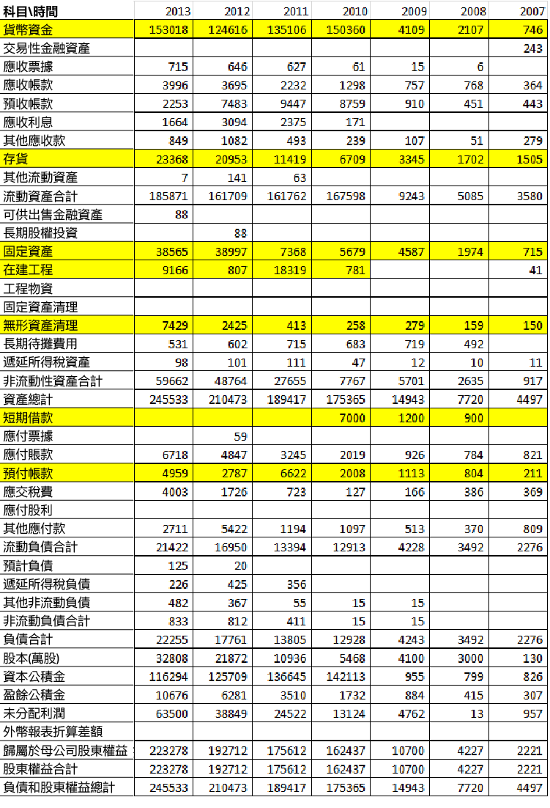
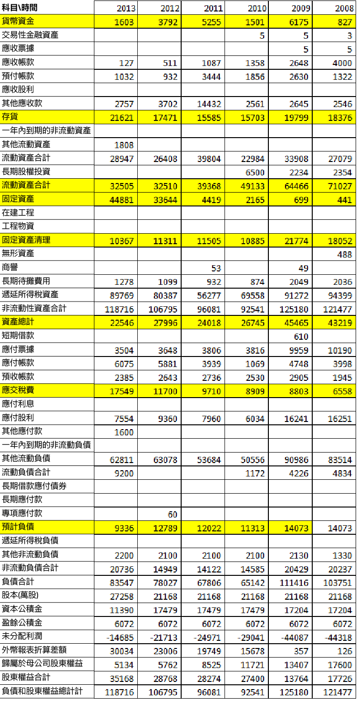

# 永遠需要優先看的報表 — 資產負債表（權益篇）

負債與所有者權益統稱權益。負債的劃分方式與資產的劃分方式是類似的，也分流動負債和非流動負債。但這種劃分對我們理解報表意義不大，最多就是告訴我們負債的流動性會怎麼樣。

我覺得負債分析的時候，大家要牢記一個字 — 真，就是負債通常是實打實的，不太可能造假，也沒有那個公司來弄點假的負債出來，因為欠人的總是要還的。而所有者權益卻是資產減去負債以後剩餘的，不用怎麼詳細去分析。當然也有幾點需要特別注意：

###(1) 應付帳款還是偏向有利於企業，但最好不要特別多

應付帳款這個帳戶是讓人糾結的帳戶，一方面應付帳款多至少能說明企業對原材料供應商有談判能力，如果議價能力很弱，誰會賒銷給你。另一方面又怕其應付帳款太多，擔心以後還不起怎麼辦。但判斷的時候，我主張還是不要太多為好。無論怎麼樣，能占款別人 (應付帳款) 總比別人占款強 (應收帳款) 。應付票據如果看不來就直接把其看出類似應付帳款好了。

###(2) 預收帳款越多越好

預收帳款我主張是多多益善的，它說明了我們企業的產品或服務，對消費者來說是多麼暢銷，或者說企業在商業模式設計的時候，把自己設計成為了一個非常有利的角色。大家要理性一些，當類似於股價淨值比的估值跟其他沒有預收帳款企業的估值差不多的時候，你要相信，有預收款的企業比沒預收款的企業要好。

跌了一兩年，跌倒了股價淨值比跟很多企業差不多，甚至還要跌。這都是市場不理性導致的，理性地說，買這類型公司肯定是比那些資產很重，又毫無預收款可言的企業，要強得多。

###(3) 各類借款越少越好

這裡講的各類借款是短期借款、一年內到期的長期借款、長期借款和應付債券等金融負債。總體而言，無論什麼借款，越少越好。當然企業為了某些市場業務的拓展，可能會需要某些負債，但無論怎麼想，能做到金融負債為 0，是很多優勢企業標誌。

好公司的報表中即使在行業很不好的時候，也基本上沒有借款的。比如我在考慮買入 A 公司的時候，它是沒有藉口的，它現金多得用不完根本就沒必要去找點借款。金融借款是槓桿的反應，如果一個企業利用槓桿賺錢比靠真實本事賺的還要多的時候，我們腦袋中需要不斷懷疑再懷疑，問問可以持續嗎？

類似短期借款、一年內到期的長期借款這種即將到期的債務，很可能是企業直接破產的原因。當然至少中國現在的上市公司看來，這種直接破產還是誇張了一點點，基本上沒發生這樣的事，所以有些聰明的投資者善於利用財務狀況壞到極點的時候買入，反而取得了不俗的收益，但沒有本事的人最好還是別玩。所以找好公司還是找那種金融負債比較少的上市公司吧。

###(4) 所有者權益的變化更能體現企業成長了多少

我喜歡用所有者權益來衡量企業成長了多少，因為會計準則的原因，有些企業利潤有變化但不一定代表真的賺到了錢，也可能利潤沒變化但不代表沒賺到錢。這就是利潤的缺陷，導致利潤很多時候衡量企業真實業績出現偏差。

所有者權益包括實收資本 (或股本) 、資本公積、盈餘公積和未分配利潤，但一般來說如果你是比較初級的投資者，沒必要去區別那麼多，反正記住一點，這些都是你作為股東的錢。但這個錢的質量自然靠企業資產減去負債以後剩餘下來，所以自己也掂量掂量企業資產怎麼樣。

有些球友分析負債的時候會去分析應付員工薪酬怎麼樣，其實只要這個數值不太大，直接忽略過去就好了，我個人的感覺是，別指望從這裡找出很多對分析企業來說很有價值的東西。當然數值很大，就要特別關注了，這不違背分析報表的基本原則。尤其有些人會拿工資什麼的來分析期望來找出對企業優勢有影響力的東西來，那我真的很無語。

從全局上看企業資產負債表，有兩個東西腦袋裏馬上要反應出來：淨現金和資產負債率。

班傑明．葛拉漢 (Benjamin Graham) 有淨流動資產 (他是用流動資產減去全部負債) 。可以粗略的估算清算價值，其認為如果市值小於淨流動資產的三分之二或者另外一個條件是當前正在賺錢，那麼其他條件都不用看了，可以直接買入。

我說的淨現金跟其類似，思想一樣，我只是覺得沒必要算來算去，簡潔著看就可以，大致看看貨幣資金與貨幣資金等價物減去金融負債，看看這個數字大不大，越大買入就越安全，尤其是當股價淨值比在 1 以下的時候，可以多多考慮。

資產負債率主要看扣除預收帳款以後的資產負債率，如果這個還是很高，比如超過 40% (個人標準，很多是 50%) ，那你在分析資產負債表的時候，就要更加注意一點了，為什麼它要求這麼高的資產負債率，可以改變嗎？甚至你可以想想怎麼為其設計商業模式改變這一狀況。

讀資產負債表要有想像力，想像著你在跟一個企業在對話，想像出企業的基本架構來，並來對其生意做一定推測，那麼你讀報表的能力就很強了。

下面附上兩張比較美的報表與醜的報表，提供提高鑑賞能力。

