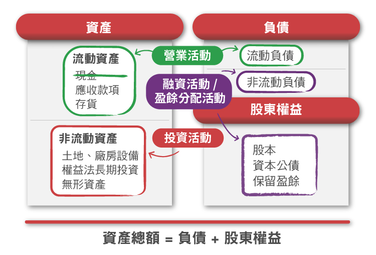
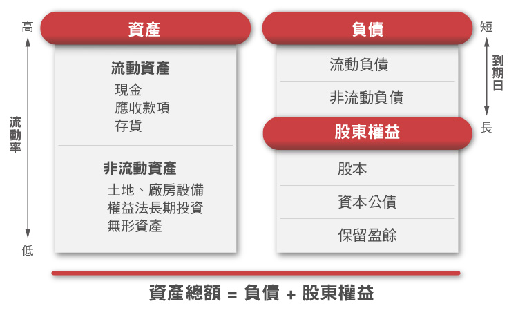

# 資產負債表─企業的財力證明

想知道另一半身家有多少？看他的財力證明就知道。不知從幾何時，社會上普遍女生的擇偶條件，已經變成有車有房。但是也別忘了有可能他的確有大額的財產，表面上看到它開的是Maserati，住的是帝寶，但實際上都是借款買來的。或者所有權根本不是他的，只是租來的。

企業也有可能發生一樣的問題，我們從損益表當中，或許可以看到它的表現真的不錯，營業收入、淨利持續的增加，但是也有可能，它只是打腫臉充胖子，實際上的交易額根本沒那麼大。從資產負債表當中，能夠觀察到一些蛛絲馬跡，對營收狀況能有更深入的了解。另一方面，資產負債表也像是企業的財力證明，我們可以看到它當時的資產有多少，負債和股東權益各是多少，來證明公司的確是實力堅強，有著穩固強大的後盾作為支撐。

在一開始，我們曾經說資產負債表，顯示的是從債權人和股東那裡獲得資金之後，所創造出來的資產價值。在會計的世界裡，所看到的資產負債表大致是長這個樣子。

資產負債表的兩邊會是平衡的，意即全部的資產是負債跟股東權益的相加。

資產的順序是依流動性的高低來作排列。流動性指的就是它轉換成現金的快慢程度，像企業可以拿著應收帳款，去跟客戶要錢，如果是月結30天，在一個月內就可以拿到錢了；但是如果是像高樓大廈，還需要透過公開市場買賣，要看有沒有成交，金額比較高的，可能還要分期付款，所以就會比較晚拿到錢，使得流動性變得比較低。

負債則是以到期日的長短來作為排列順序。這樣投資人可以從資產負債表當中的排列順序，來了解特定資產的變現能力如何，或者是對企業來說，這項負債到底急不急迫。

而股東權益則是有固定的排列順序，通常來說都是股本→資本公積→保留盈餘→其他。

對於想要找個好人家的投資人來說，到底什麼項目比較重要呢？每間公司不太一樣，金額越大的，變動越大的越重要。企業的財力證明，不僅僅是告訴你它目前的身家明細，同時也告訴你它的經營方針。我們可以透過這些變化來看企業最近做了什麼事情，並依此猜測企業未來的策略。

而這些項目，不只是靜態的當時的紀錄而已，從它的趨勢變化，我們也可以用來推估企業的發展喔！像是流動資產還有流動負債，就像是骨牌一樣，它的變化，也是營業活動的一環，會影響到損益表當中的數字。

企業的固定資產，代表了企業賺到了薪水之後，是怎麼花的，從觀察投資活動，我們可以來推測企業未來想要發展什麼；而其他的負債，像是短期負債還有股東權益，是企業賺的錢不夠的時候，用來生錢的方式，從融資活動，我們可以看出企業是怎麼生錢出來的，那些籌資方式，又會有什麼樣的差異。

至於最特別的一個科目-現金，則是這三項的綜合體，從現金這個科目，我們可以大致了解企業經營到底有沒有賺到錢，而這些錢又是從哪裡來的，這些問題我們會在企業的存摺裡告訴你。