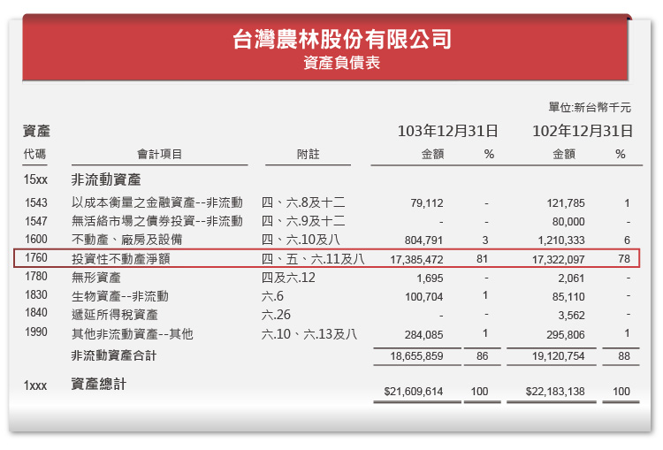
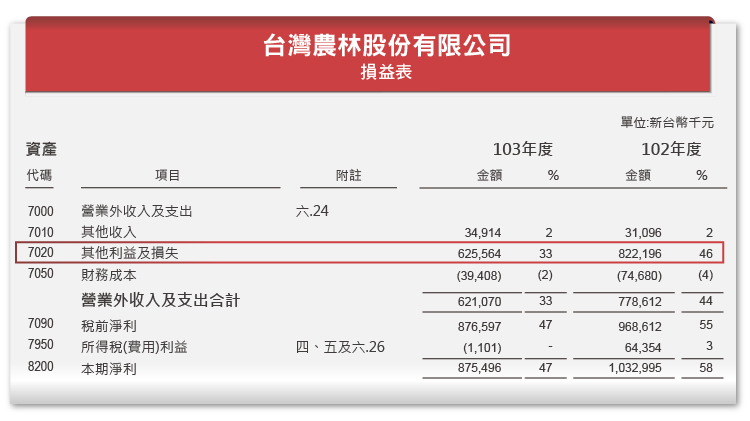
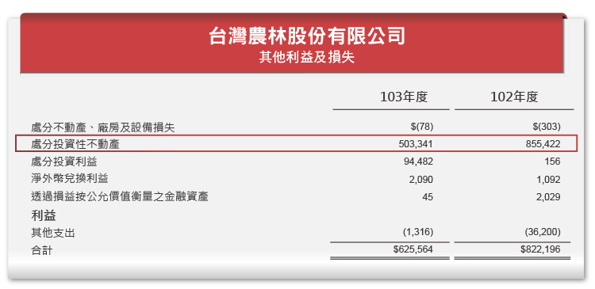
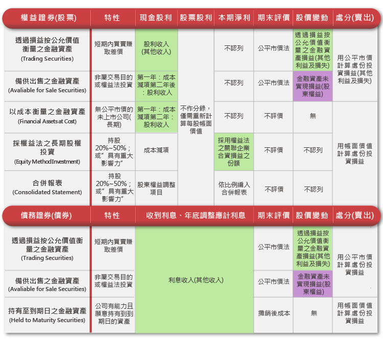

# 資產負債表和損益表的關聯性–有車 有房 沒煩惱？

不知從幾何時，有車有房，已經變成了女生挑選另一半的標準之一。越多的房產、越高級的車子，似乎能夠讓女生越放心。但也別忘了，有越多的車子，就表示未來的保養，也是一筆龐大的費用，買得起也要負擔的起才行。

對企業來說也是一樣，固定資產、無形資產越多，未來有可能發生的費用或者是損失就會越多，也會影響到損益表當中的本期淨利。接下來就讓我們來看看企業的各項投資，會如何地影響損益表：

##固定資產(Fixed Assets)
如果是有效益的擴建廠房、增添設備，能夠增加企業的產出，並讓收入增加。但是如果買進固定資產之後，產出的東西沒有人要買，或者是不值錢，也會對企業造成一種傷害，因為今天買入的固定資產，往後每年都會有折舊費用。像是在現金流量表的文章中，我們可以看到高鐵每年的損失，有大部份都來自於固定資產的折舊，是它的致命傷。

而除了折舊費用外，固定資產還有另一項和損益表相關聯那就是減損損失。在損益表當中的文章：中樂透 究竟是幸還是不幸，我們曾經提到F-TPK就是因為觸控面板產業的沒落，而認列了大幅的固定資產減損損失。

另外分享一個特殊情況：固定資產也有可能變成企業的常態性業外收入，如：本業是製茶的農林，擁有大筆的土地，從資產負債表當中可以看到固定資產中的投資性不動產佔了總資產的81%。

而從損益表當中可以看到它的淨利主要來源大部份都是其他利益及損失：

從明細當中可以看到它主要的收入來源都是處分投資性不動產。

從它最近幾年的淨利來看，它的本業收入本期淨利的比例並不高，主要的收入來源都是處份不動產。農林不僅僅擁有大批的土地，而且還善於將原本不值錢的土地，透過開發，使土地變得有價值，像是將傳統的茶園改建成觀光茶園，或者是積極地開發銅鑼、三義周邊的土地，預計未來將發展觀光旅遊業。「有土斯有財」，活化土地已儼然成為了它的主要收入來源。

##無形資產(Intangible Assets)

無形資產指的是實體不存在，可能只有一紙合約或者是認證，像是專利權、商標權、銷售權及商譽等等。無形資產跟固定資產的特性一樣，每年都要攤銷，因此在損益表當中，也會有攤銷費用、也可能發生減損的問題。最近最為人所知的就是宏碁因為錯估筆記型電腦產業的趨勢，買下子公司而提列的商譽減損，在《中樂透 究竟是幸還是不幸》的減損損失當中也有提到。無形資產和固定資產最大的不同，是它的估值問題。不像是固定資產，還有外觀可供判斷，無形資產有不同的評價方法。使用不同的評價方法所算出來的價值，也會有很大的不同，或許有第三方出具的鑑價報告可供參考，但未來能夠產生的效益預估，會受到市場環境、產業發展而有所影響，未必能百分之百準確，因此需要小心看待這項資產。以下用威盛來作為一個參考的例子：

威盛處分無形資產　獲利逾6.37億元

威盛（2388）今晚間公告，代子公司威盛電子(中國)有限公司公告處分無形資產，將3項無形資產分別以4850萬元、5500萬元以及5500萬元人民幣，以總金額1億5850萬元人民幣，出售予採權益法之被投資公司，也就是上海兆芯集成電路有限公司，預計處分利益台幣6億3756萬元。

威盛表示，因集團業務發展考量，以及業務合作與發展需要，將自行研發之無形資產出售給關係人。

威盛進一步說明，威盛(中國)是將安謀(ARM)系統單晶片相關技術賣予上海兆芯，由於上海兆芯有此技術需求，因此決定出售，此次總交易金額1億5850萬元人民幣，預計可獲利台幣6億3756萬元，。

威盛表示，該獲利將於第2季入帳，以目前股本49.33億元計算，估計將貢獻威盛每股獲利1.29元。法人推出，在此業外收益貢獻下，威盛上半年將有機會轉虧為盈。

這篇新聞箇中的奧妙，就留待讀者慢慢去體會囉！

接下來是屬於金融資產投資的部份：

我們在介紹損益表時，在《投資策略》的文章當中曾經說到，因為企業的投資目的不同，所買進的金融資產也會被歸到資產負債表當中的不同科目。以下我們整理了各個科目各有什麼樣的特性，以及它會如何影響損益表以及權益變動表：

上圖mark綠色部份，表示會影響損益表；mark紫色部份，會影響權益變動表。

固定資產、無形資產以及金融資產都可能使企業的淨利有增加以及減少的情況，投資人在分析企業的投資策略時，也需要注意成功或失敗，對未來的損益表可能造成的影響。

