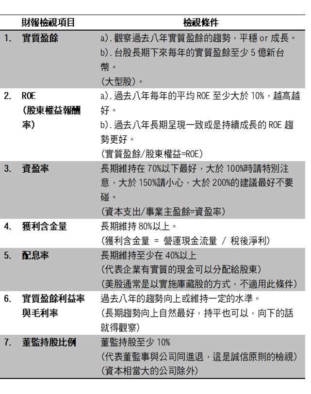
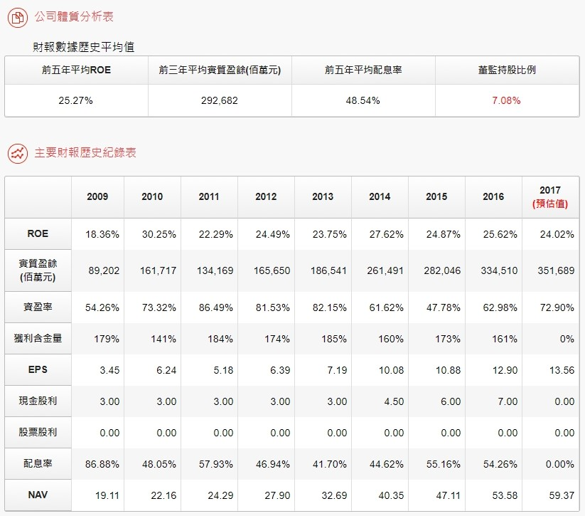
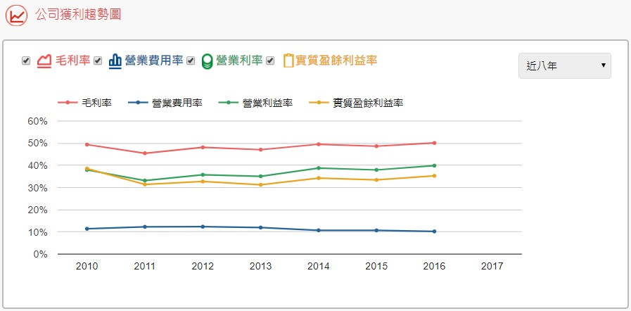
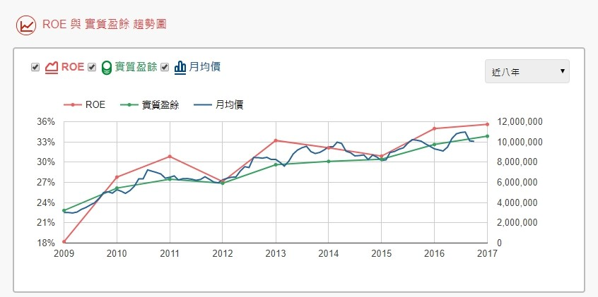
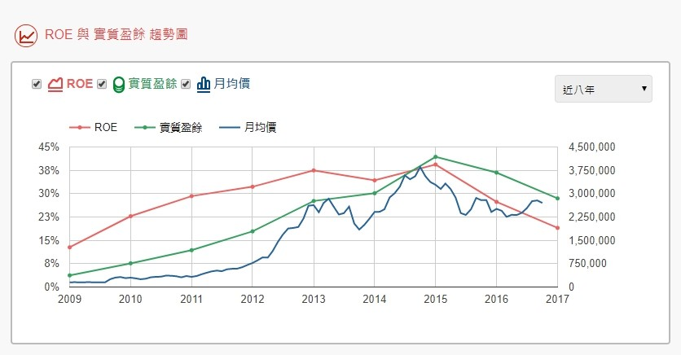
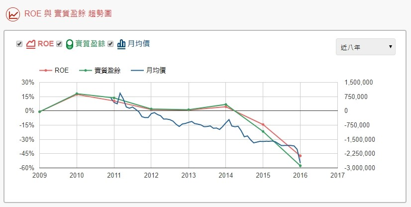
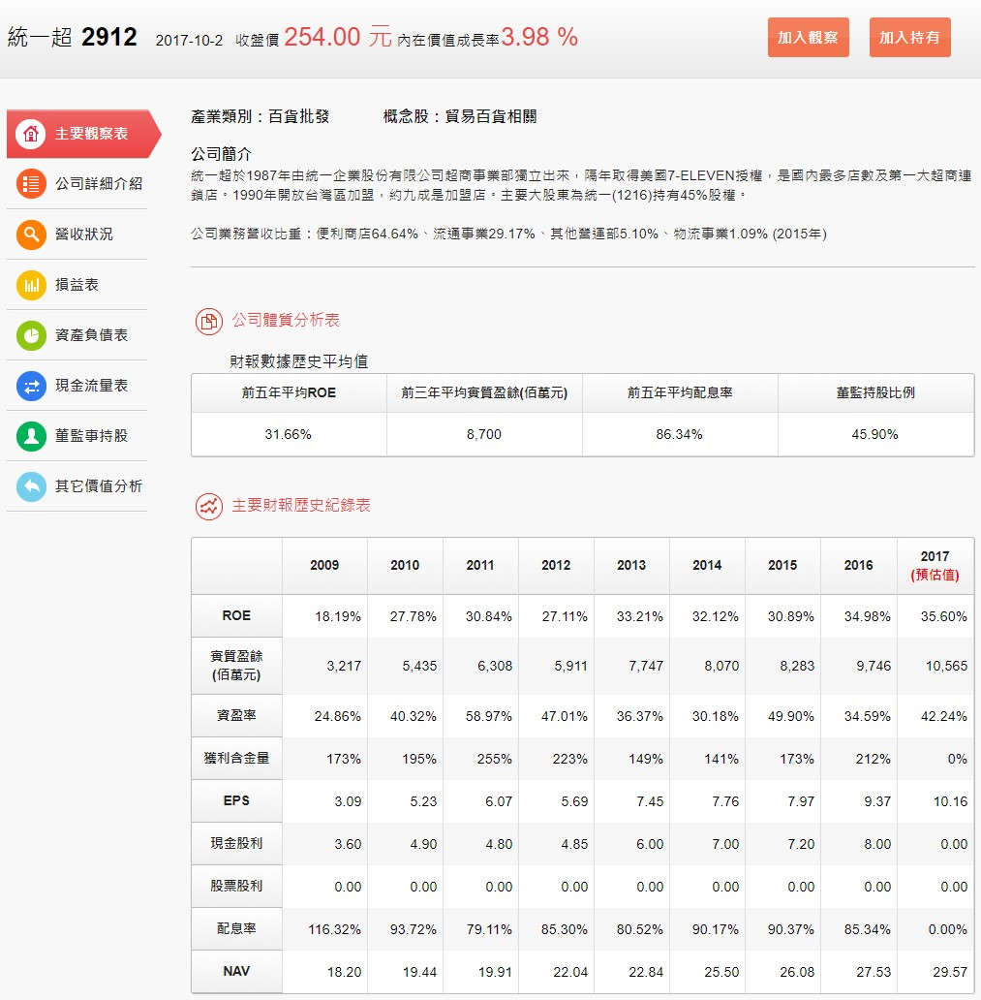
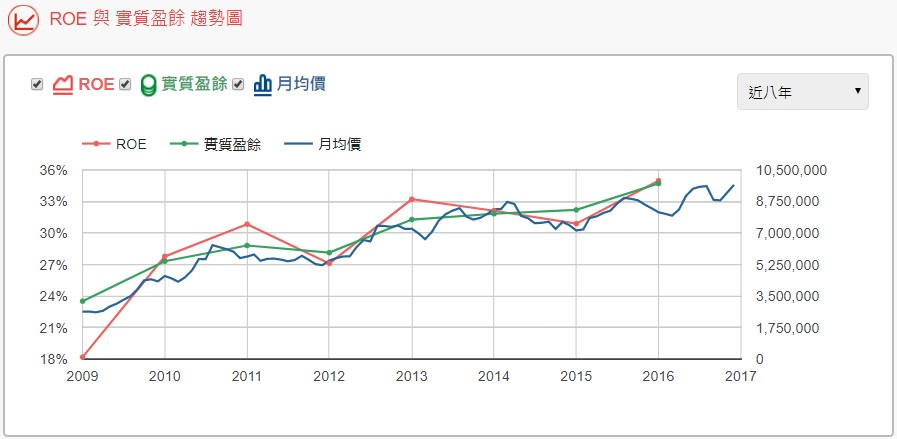
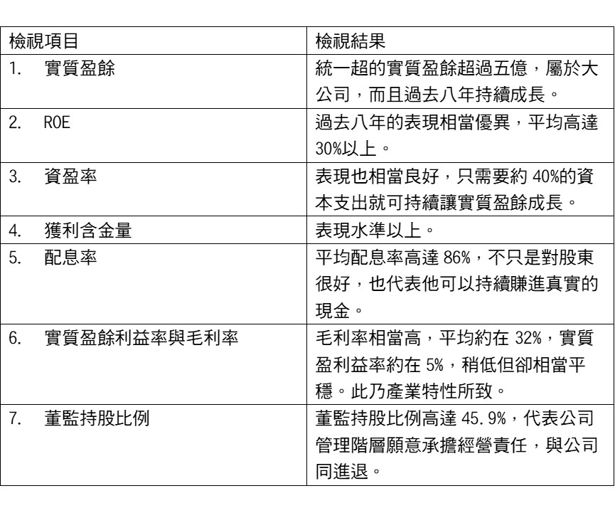
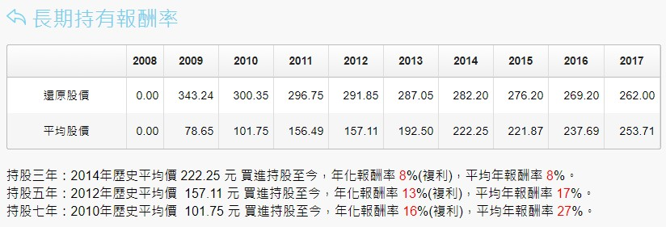

# 七項財務指標分辨好公司 (淺論篇)

整個財務指標是以巴菲特的選股原則為基礎，並同時也參考了其他大師的的選股方式，例如影響巴菲特投資觀甚深的飛利浦．費雪、Walter Schloss、威廉．歐尼爾、彼得．林區等，透過他們的投資智慧，在去蕪存菁後，選股其實只要利用以下這七項財報數據，便可幫助我們辨識一家公司過去所繳的成績單是否表現良好。

 

##七項財報數據如下：

##觀察過去5~8年的歷史財報紀錄：

有了以上的財報觀察模組，觀察一家公司過去是否具備某種競爭優勢，就變得相對簡單需多，只要一家公司過去5~8年來的歷史財報紀錄都表現在以上表格所制定的水準之上，我們幾乎就可認定他具備某總競爭優勢。

 

不過得切記，觀察一家公司的財報數據，並非只是觀察數字的高低而以，還得觀察其趨勢。

###以台積電為例：

透過以上的表格與線圖，我們便能輕而易舉看出台積電過去的歷史財報紀錄，舉凡實質盈餘、ROE、資盈率、獲利含金量、配息率、實質盈餘利益率與毛利率、董監持股比例等，台積電的表現都相當令人驚艷，也難怪這家公司的股票每年持續上漲，若是在2012年以84.08元的年度平均股價買進，並持股至2017年9月27日止，年平均報酬率為37.4%，也就是在2012年當時，你若投資台積電100萬，在過去五年之中他平均每年幫你賺取獲利37.4萬元，這就是價值投資的力量之所在。

同時，這套系統也把重要的數據圖形化，藉此，投資人便可藉由圖形來觀察與了解一家公司的成長趨勢，舉例來說，我們在觀察一家公司的實質盈餘時，除了可以藉由數值的大小來判斷一家公司的規模外，還得注重於實質盈餘的成長趨勢，尤其在辨識一家公司是否具備競爭優勢時，這點更為重要，我們直接以下列的公司作為說明：

 

 

###統一超：

統一超的實質盈餘趨勢，不用多說了，一看便知，年年穩穩上漲，股價也是跟著穩穩上漲，這樣的公司就是最理想的公司，具有強大的護城河。

 

 

###儒鴻：

儒鴻這家公司在2015年前，他的實質盈餘表現應該是無庸置疑的，但自從2015年後，它的實質盈餘便開始往下墜落，股價也由原本的高點500多元跌回到300元最低。

 

如果當時我們以年度平均價433.5元買進，我們至少虧了100元之多。坦白說，這家公司仍是一家還不錯的公司，但並非是最好的公司，至於他的實質盈餘未來是否還會再回到高點，還需要點時間觀察了，總之，這樣的公司對我們而言，頂多是B咖的公司。

 

 

###興航：

興航這家公司，在盈餘還是賺錢的時期，實質盈餘就已經是相當不穩定的狀態，起伏很大，在陸客銳減的情況下，終於出現虧損，主因是這家公司並沒有任何強大的經濟護城河(旅客可以輕易轉換至其他的航空公司，並沒有任何一定得搭興航的理由，所以興航本身並沒有什麼競爭優勢) 。

 

在無法抵擋市場的變動，最後終於在2017年1月無預警宣布下市。

 

 

####看財報選股的證據：

透過財報的基礎辨識，我們將能輕易分辨出那家公司具有某種競爭優勢，那家公司沒有具備競爭優勢，如此，一家公司在通過的財報的辨識關卡後，我們接下來就可再進入下一個階段的研究，辨識一家公司的競爭優勢強度，與是否可以長長久久，這也就是巴菲特常掛在嘴邊的經濟護城河。

我必須這樣說，財報的檢視是基本門檻，若是要長期持有一家公司，我們還得再下功夫研究公司的競爭優勢是否可以長長久久。

 

也就是說，透過財報的辨識，我們了解到一家公司過去確實具備某種競爭優勢，但除了了解他過去的實力外，我們還得了解他的競爭優勢是否可以歷久不衰，不怕其他競爭者的入侵。

 

 

###我們以統一超為例：

## 透過以上的表格，我們可以觀察到統一超最為關鍵的財報數據：

統一超的財報數據樣樣表現相當優異，是不可多得的好公司，這樣的公司若是長期持有，作為他的股東，可以穩定賺取相當高的獲利，請看下圖的長期持有報酬率：

若是在2012年以年度平均股價157.11元買進持股至今(2017年11月)，約五年的時間，平均年報酬率約17%，若是在2010年以歷史平均股價101.75元買進持股至今，持股約7年的時間，平均年報酬率為27%。

###27%年報酬率代表的是什麼?

 

代表當時若是花100萬的成本買進統一超，在持有它的股票7年之間，作為他的股東，每年可以賺取27萬的報酬，是的，真的就是這麼多。

這就是價值投資的力量，找對好的公司，以好的價格買進，而後便長期持有，穩定每年賺取高於10%以上的獲利，長期下來，累積的財富自然就會很可觀。

 

所以，利用財報檢視的基礎，可以讓我們更有效率地找出具有強大競爭優勢的公司，而藉由智股網的系統，在執行檢視財報這部分的工作又變得更有效率與簡單。

請不要小看這樣的方便性，因為節省下來的時間，我們可以更專注於思考公司的長期競爭優勢。

 

畢竟，財報只是一項門檻，跨入了這門檻後，真正決勝負的關鍵還是一家公司的競爭力，因為一家競爭優勢偏弱的公司，不只是風險高，還可能隨時造成投資人虧損。