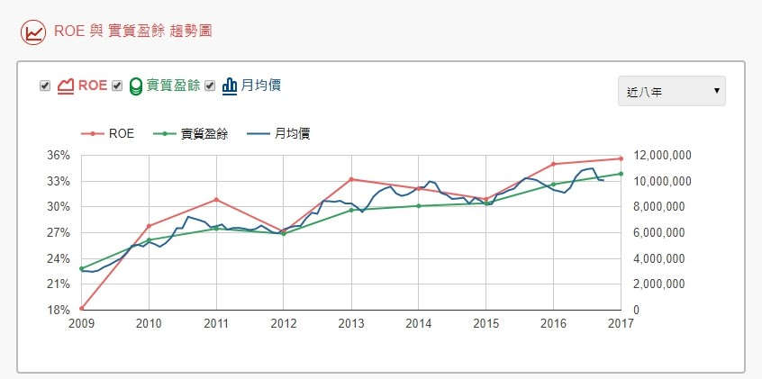
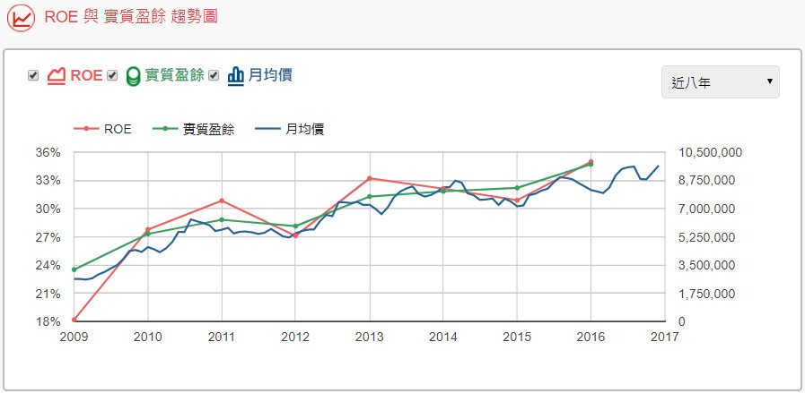
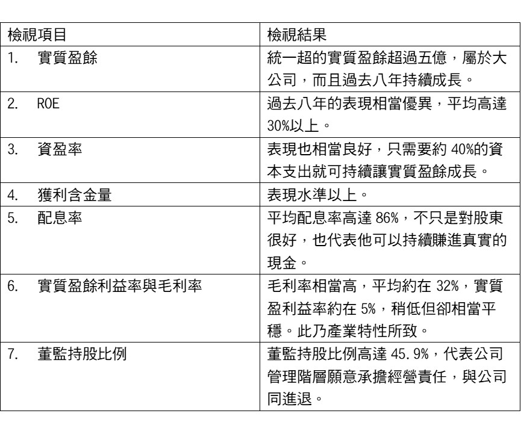

# 七項財務指標分辨好公司 (深論篇)


##價值投資的首要障礙 － 如何解讀財報：

 

許多長期表現優異的投資大師，例如巴菲特、霍華馬克思、葛拉漢、飛利浦費雪與坦普頓等，皆是奉行價值投資法，或是趨近於價值投資法的投資方式，他們之所以成為大師，講直接點，也就是因為使用價值投資法，並長期每年皆穩定賺取超過20%以上的投資報酬率。

 

我們應該都知道，所謂的價值投資，就是找出具有長期強大競爭優勢的公司股票，然後以合理的價格買進後，經長期持有數年以上的時間，我們不但有機會賺進股價的價差外，還能穩穩賺進配息(公司如有每年配息的條件下)。

 

這種投資方式等同把「時間」化為幫助我們獲利的力量，所以，懂得如何選出一家具有長期競爭優勢的好公司便成為是關鍵中之關鍵。

 

因為唯有具有長期競爭優勢的好公司，才能連年不斷地穩定幫股東賺進獲利，而我們也才會有信心長期抱得住他的股票，這是一種良性的循環。

 

##可是問題來了，到底我們如何得知一家公司是否具有強大的競爭優勢呢?


首先，我們來做個簡單比喻，假如要從一群短跑運動選手中挑選出誰最有機會成為奪冠的選手們，並組成一組冠軍隊伍，一開始在你都不了解他們的前提下，你會如何挑選呢?

 

自然是先將他們過去比賽的歷史數據拿出來研究一番，看看哪位選手的過去表現最優異，因為最優異的那幾位選手所組成的隊伍，奪冠的機會越高。


要分辨一家上市公司是否擁有強大的競爭優勢，道理也是一樣，我們先把他過去的歷史財報紀錄拿出來研究一番，並看他過去的財報紀錄是否表現優異，表現越是優異的公司，自然越有可能是擁有強大競爭優勢的公司。

 

但對於一般投資人而言，得面臨一項挑戰，那就是要懂得如何閱讀財報。畢竟財報數據這麼龐大與複雜，其中包含資產負載表、損益表及現金流量表，每年又有四季報與一次年報，再加上各種分析數據的計算，而且各式各樣的數據琳瑯滿目，如果我們不是相關科系出身，光是看到那些數字就可能頭暈轉向，更別說還得交叉比對與分析。

 

總之，光是閱讀財報這件事，就可能成為投資人想要學習價值投資的最大障礙之一。

## 不看財報得承擔的風險：

我相信，許多投資人也希望學習價值投資法，但光是閱讀財報這關就嚇阻了大部分人想要學習的動力，導致許多人仍以技術面或消息面來做為主要的投資依據，講明白點，這樣的投資方式也就是所謂的短線操作的投機方式。

 

許多做短的投資人也會稱謂他們自己其實也很重視基本面，也就是會看消息來得知最新的預估EPS，並以此來作為成長性的依據，但基本面的判斷並非只是參考單一年的EPS，所謂基本面的判斷還是得回歸到整體財報的評估。

 

所以，很可惜的是大部份投資人並不知道若單以技術面投資股市，勝率之低其實超乎許多人的想像，以下我們來做個簡單的邏輯推論，就會明白為什麼我會這麼說：


`真正的勝率才12.5%。(50% X 25% = 12.5%)`

 

好吧，有的人會號稱他以技術面來投資股市的技藝相當高超，投資勝率高達73.5%，這裡我們再以簡單的邏輯來推論看看是否真的如此之高：


`經計算，真正的勝率也才提高到27.01%。(73.5% X36.75% = 27.01%)，比到賭場賭大小的勝率50%還低。`


在勝率這麼低的原因之下，也難怪我們幾乎很少看到有人可以利用技術面，達到投資致富的境界，也就是這樣的原因，導致許多投資人最終都是賠錢出場。

 

真的很可惜，畢竟我們所投資的錢都是辛苦賺來的血汗錢，投資股市應該是要可以幫助我們賺錢，但卻因為對財報的懼怕而選擇了勝率如此之低的投資方式，與其如此，說實在的，倒不如不要投資股市，還不至於讓自己冒這麼大的風險，而血本無歸。

 

不過，畢竟龐大的財報資料閱讀起來，真的是艱深難懂，況且要確定一家公司是否具備強大的競爭優勢，還得閱讀他過去五到八年以上的財報資料，才能準確判斷，面對如此困境，也難怪許多投資人會選擇較於簡單易懂的技術面，即使技術面是如此的不準確。

###檢視財報的好處

 

有關於閱讀財報上的學習，我一直在深思一個問題，到底如何將複雜與艱深難懂的財報，化繁為簡，卻又不失其精準度呢?


###這個問題需要克服以下幾項重大的挑戰：


1.財報中有那些數據是最重要的財報數據，並且只要觀察這幾項數據，就可幫助我們判斷一家公司是否可能具備某種競爭優勢呢?

 

2.這些財報數據必須要能讓沒有學過財報基礎的投資人，都能容易理解其中的含意。

 

3.如何將這些重要數據依照個別年度整理好，並規劃在一張表格上?如此，投資人便可一目了然，不需再花時間按照每年的財報資料一一整理出來。

 

4.上市櫃公司近1600多家，除了龍頭股外，投資人如何能夠利用財報數據優先選擇或篩選出其他也具有研究價值的公司呢?

 

各位想像一下，如果能找到方法克服以上幾項障礙，投資人便能得到什麼樣的好處?

```
1.分析公司財報時，將會聚焦在重點之上，而且不會失真。
2.能夠在短時間內輕易辨識一家公司是否具備競爭優勢。
3.找出更多的投資機會。
4.更重要的是，還能輕易學習到閱讀財報的要領，並不再懼怕財報。
```

如此，踏進價值投資的門檻，將不再是那麼的遙遠，我們需要的只是建立好一套可以克服以上障礙的財報評估模組，也就是把觀察財報數據的過程模組化，而後再利用這套模組來判斷一家公司的競爭優勢，如此就能事半功倍，做好分析個股基本面的工作。


即使我們有了一套強大的財報評估模組來判斷一家公司的財報，但下個挑戰又來了，面對龐大的財報資料，我們如何將這些資料整理好，並計算好，讓我們能夠快速取得、分析、研究與判斷呢?

 

人類近代最大的進步，就屬網路、資訊與數據的應用，在整理與計算的部分，我們利用了網路科技與程式設計，來幫助我們整理與計算好所有需要觀察的財報數據，若是如此，選股與識別一家公司的競爭優勢，我們將可以創造以下的可能性：

```
1.不需要浪費太多時間，只需要一分鐘就可判斷一家公司是否具有研究價值。
2.投資不再毫無頭緒，道聽塗說，搞不清楚買進的公司是否具備競爭優勢。
3.讓更多人也能懂得如何執行價值投資法。
4.自己也有能力找出潛力股，掌握到更多的投資機會。
5.選股與分析可以靠自己，不須再依靠他人，有自我的分辨能力。
6.懂得分辨消息來源的正確性。
7.輕鬆建立觀察名單，並同時也可以輕鬆追蹤名單中的個股。
8.只要有一套標準與可用的財報觀察模組，便可以建立一套程式系統，幫助投資人更輕鬆觀察財報。
```


最後，也是最重要的，就是能夠幫助投資人利用價值投資法，在股市中賺到錢，並且不需要承擔過多的風險，畢竟，講得再多，做得再好，能不能賺到錢，才是重點。

 

 
 

###輕鬆觀察財報的具體方法：


為了能夠找出一個去蕪存菁與化繁為簡的評估財報模組，並且適合許多投資大眾使用，除了回頭研讀過去所學的財報基礎書籍外，我們更再次翻閱了許多大師所寫的書籍，參考他們選股時所使用的財報數據有哪些，一開始的時候，感到相當困擾，因為每位大師所使用的財報數據皆有他自己使用的道理，但卻也都不盡相同。

 

然而，在持續研究近半年的時間後，皇天終不負苦心人，漸漸地我們整理出了觀察一家公司的財報時，最需要觀察的數據其實就只有七項，而一家公司的財報只要符合這七項財報數據的標準，幾乎可以認定他可能俱備某種競爭優勢。


首先，我們參考巴菲特的選股原則，巴菲特的選股原則經歷了數十年的時間，仍然沒有變過：


```
1.    買大型股。
2.    長期表現出穩定的盈餘能力。
3.    好的ROE表現卻很少或沒有負債。
4.    好的經理團隊。
5.    簡單的生意。
6.    要賣的價格。
```


同時我們也參考了其他大師的著作，例如`影響巴菲特投資觀甚多的飛利浦．費雪、Walter Schloss、威廉．歐尼爾、彼得．林區等，透過他們的投資智慧，再去蕪存菁後`，漸漸地領悟出只要利用以下這七項財報數據，便可幫助我們辨識一家公司過去所繳的成績單是否表現良好。


### 七項財報數據如下：


有了以上的財報觀察模組，觀察一家公司過去是否具備某種競爭優勢，就變得相對簡單需多。

 

只要一家公司過去5~8年來的歷史財報紀錄都表現在以上表格所制定的水準之上，我們幾乎就可認定他具備某種競爭優勢。

 

不過得切記，觀察一家公司的財報數據，並非只是觀察數字的高低而已，還得觀察其趨勢。

 


`但接下來，我們又得克服另一項挑戰，那就是資料要從哪裡來?`

 

如何能一次就將所有的資料整理好，不需浪費時間整理與計算，便可直接專注在這些數據的觀察與研究呢?

 

欲達成這項目的，使投資人能精準、快速、省時地了解一家公司的體質，達到事半功倍的效率，我們得借助網路科技的技術，於是，在經歷了多年的研發與程式的編寫後，我們終於可以做到這點，以下我將利用台積電的例子來直接說明這項技術的研發成果，並介紹實質的使用方式：


透過以上的表格與線圖，我們便能輕而易舉看出台積電過去的歷史財報紀錄。

 

舉凡實質盈餘、ROE、資盈率、獲利含金量、配息率、實質盈餘利益率與毛利率、董監持股比例等，台積電的表現都相當令人驚艷，也難怪這家公司的股票每年持續上漲。

 

若是在2012年以84.08元的年度平均股價買進，並持股至2017年9月27日止，年平均報酬率為37.4%，也就是在2012年當時，若投資台積電100萬，在過去五年中它平均每年幫您賺取獲利37.4萬元，這就是價值投資的力量之所在。

 

除此之外，透過這套系統，我們能夠查詢台股中每一家上市公司的財報資料，而且這套系統已經將所有最重要的資料都整理好，並在同一頁面中顯示，由於剔除了那些較不重要的財報數據，投資人只需要專注在頁面中所顯示的那些最為重要的數據之上，便能在一分鐘的時間內，決定這家公司是否具有研究的價值。

 

因此，我們便能將時間用於專注在具有研究價值的公司上，不會浪費時間在不具研究價值的公司，更不須浪費時間整理財報資料，畢竟，大家的時間都是有限的。

 

同時，這套系統也把重要的數據圖形化，藉此，投資人便可藉由圖形來觀察與了解一家公司的成長趨勢。

 

舉例來說，我們在觀察一家公司的實質盈餘時，除了可以藉由數值的大小來判斷一家公司規模外，還得注重於實質盈餘的成長趨勢，尤其在辨識一家公司是否具備競爭優勢時，這點更為重要，我們直接以下列的公司作為說明：


### 統一超：




統一超的實質盈餘趨勢，不用多說了，一看便知，年年穩穩上漲，股價也是跟著穩穩上漲，這樣的公司就是最理想的公司，具有強大的護城河。

 

###儒鴻：


儒鴻這家公司在2015年前，實質盈餘表現應該是無庸置疑的，但自從2015年後，它的實質盈餘便開始往下墜落，股價也由原本的高點500多元跌回到300元最低。

 

如果當時我們以年度平均價433.5元買進，我們至少虧了100元之多。坦白說，這家公司仍是一家還不錯的公司，但並非是最好的公司，至於他的實質盈餘未來是否還會再回到高點，還需要點時間觀察了，總之，這樣的公司對我們而言，頂多是B咖的公司。

 

 

###興航：


興航這家公司，在盈餘還是賺錢的時期，實質盈餘就已經是相當不穩定的狀態，起伏很大，在陸客銳減的情況下，終於出現虧損，主因是這家公司並沒有任何強大的經濟護城河。(旅客可以輕易轉換至其他的航空公司，並沒有任何一定得搭興航的理由，所以興航本身並沒有什麼競爭優勢。)

 

在無法抵擋市場的變動，最後終於在2017年1月無預警宣布下市。

 

 

為了追求簡潔、操作簡單、明確卻又不失真，畢竟總不能為了簡單而刪減了重要的檢視數據，整個頁面的呈現是經過長時間的規劃與思考後，所設計而成，其目的就是為了讓即使不是財經出身或是對財報還不認識的投資人，都能夠輕易上手。

 


價值投資，畢竟要的不是貼近市場，但也不是遠離市場，但貼近與遠離之間的拿捏，總是要取得適當的平衡點，總不能股票買了就不理它，天下間沒有這麼一回事的投資法，別誤以為價值投資法是買後不理的投資法。

 

包括巴菲特本人，他號稱自己可以的話，會想抱某些公司的股票一輩子，但事實上，他也會適度地去調節自己的投資組合，遇到某檔組合中的股票變很貴時，或是公司的體質變得不好，或是他自己承認自己看錯某標的(IBM)時，他也會選擇賣出，所以，價值投資最終還是得回歸到觀察一家公司的財報變化。

### 看財報選股的證據：

透過財報的基礎辨識，我們將能輕易分辨出那家公司具有某種競爭優勢，那家公司沒有具備競爭優勢，如此，一家公司在通過的財報的辨識關卡後，我們接下來就可再進入下一個階段的研究，辨識一家公司的競爭優勢強度，與是否可以長長久久，這也就是巴菲特常掛在嘴邊的經濟護城河。

 

我們必須這樣說，財報的檢視是基本門檻，若是要長期持有一家公司，我們還得再下功夫研究公司的競爭優勢是否可以長長久久。

 

也就是說，透過財報的辨識，我們了解到一家公司過去確實具備某種競爭優勢，但除了了解他過去的實力外，我們還得了解他的競爭優勢是否可以歷久不衰，不怕其他競爭者的入侵。


在透過程式的開發與系統的整合後，我們可以快速地在短時間內找出具有研究價值的公司，這對價值投資者而言，有著絕對的好處，因為我們將可輕鬆建立30~50家可以長期觀察的公司名單，而當這些名單中的公司股價有天進入了可以購買的區間時，此時我們就可以依計畫買進。

 

###我們以統一超為例：




透過以上的表格，我們可以觀察到統一超最為關鍵的財報數據：




統一超的財報數據樣樣表現相當優異，是不可多得的好公司，這樣的公司若是長期持有，作為它的股東，可以穩定賺取相當高的獲利，請看下圖的長期持有報酬率：


若是在2012年以年度平均股價157.11元買進持股至今(2017年11月)，約五年的時間，平均年報酬率約17%，若是在2010年以歷史平均股價101.75元買進持股至今，持股約7年的時間，平均年報酬率為27%。

 

###27%年報酬率代表的是什麼?

 

代表當時若是花100萬的成本買進統一超，在持有它的股票7年之間，作為他的股東，每年可以賺取27萬的報酬，是的，真的就是這麼多。

 

這就是價值投資的力量，找對好的公司，以好的價格買進，而後便長期持有，穩定每年賺取高於10%以上的獲利，長期下來，累積的財富自然就會很可觀。

 

所以，利用財報檢視的基礎，可以讓我們更有效率地找出具有強大競爭優勢的公司，而藉由智股網的系統，在執行檢視財報這部分的工作又變得更有效率與簡單。

 

請不要小看這樣的方便性，因為節省下來的時間，我們可以更專注於思考公司的長期競爭優勢，畢竟，財報只是一項門檻，跨入了這門檻後，真正決勝負的關鍵還是一家公司的競爭力，因為一家競爭優勢偏弱的公司，不只是風險高，還可能隨時造成投資人虧損。
