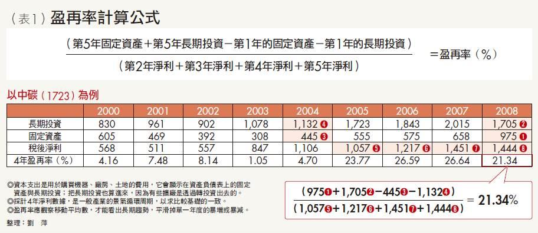

# 盈再率

這次的新功能是盈再率指標。常有版友問站狗類似的問題：”請問盈餘再投資率跟盈再率有麼不同？”。這邊為了不要再讓大家混淆，這次的更新，我們把比較不常見的”盈餘再投資率”和”本業再投資率”拿掉，放上大家熟悉的盈再率。

 

新增盈再率指標：
站狗最早接觸盈再率是看了洪瑞泰(Mike)的巴菲特選股魔法書這本書，當時就覺得該指標簡單明瞭又好用，之後就決定要把盈再率給實做出來。

盈再率是衡量公司資本支出佔盈餘的比率。 書中的公式如下：

`盈再率 = ( 長投4 + 固資4 – 長投0 – 固資0 ) / ( 淨利1 + 淨利2 + 淨利3 + 淨利4)`

備註：長投為長期投資，固資為固定資產，後面的數字為第幾期，例如0為當期，1為最近1期，依此類推

其實盈再率的概念很簡單，今天若是公司要花錢去投資，那麼這些錢通常是花在買土地廠房(固定資產)，或是投資於子公司(長期投資)，由於資產負債表中長期投資和固定資產皆為純量，我們用當年的減去4年前的，就會知道這4年來一共花了多少錢在投資上面。但是每個公司的能力不同，舉例來說，假設今天站狗有100元，花個80元去投資，跟站狗只有80元，也花了80元去投資，很明顯的，兩個情況承受風險的能力不同。也就是花錢的金額還得考慮一下這個公司的賺錢能力。盈再率就是把這4年年來所賺的錢加起來，和4年來花錢投資的項目去比較。

那麼該值到底為多少比較好呢？

1. 盈再率 < 80   即可，`沒有越低越好這回事`，
2. `盈再率 > 200 有可能是潛在的地雷股`，如已經下市的博達、陞技

##盈再率虧損和負的有何不同 ?

虧損：`分母為負`，過去4年`虧損`。 
負的：`分子為負`，過去4年`未添加新設備` 