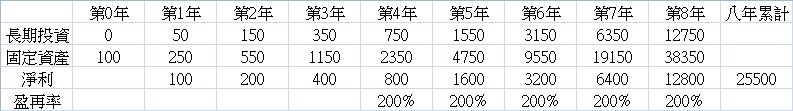
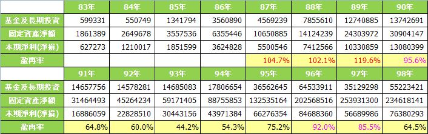
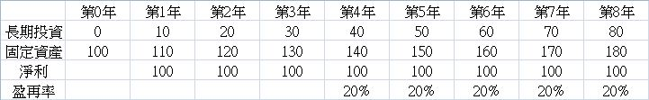
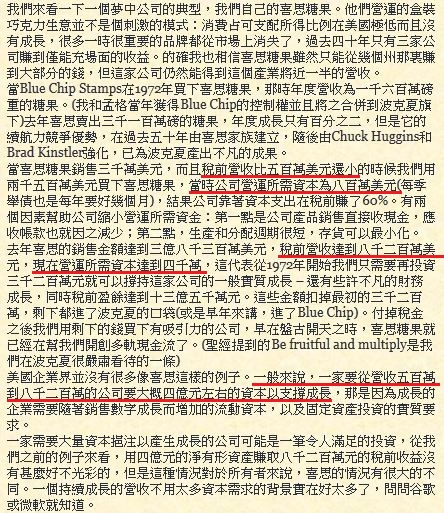
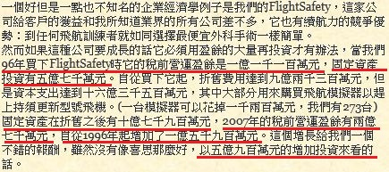
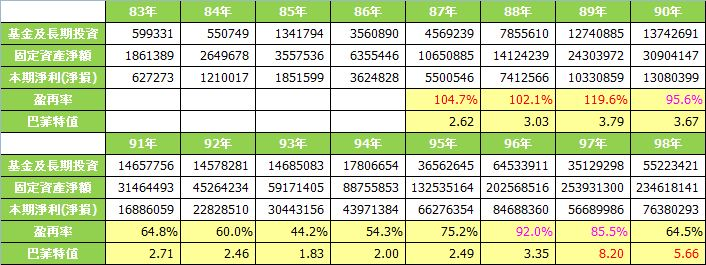

# 盈再率跟您想的不一樣

首先來了解什麼是盈再率

盈再率是洪瑞泰先生在巴菲特選股魔法書中所提出來的概念（指名道姓有點不太禮貌，以下以Mike稱之）

`定義盈再率=(長投4+固資4-長投0-固資0)/(淨利1+淨利2+淨利3+淨利4)`

別被公式嚇到了，其實涵義很簡單，就是四年來累積淨利中，再投入長期投資和固定資產的比例

也就是(四年來長期投資和固定資產的增加量)/(四年來的淨利總合)

舉個例子來說，假設我四年前開了一家公司

四年前公司的資產負債表中有100萬元的長期投資和500萬元的固定資產

四年後的今天資產負債表中有300萬元的長期投資和800萬元的固定資產

那麼也就是長期投資和固定資產四年中增加了`(300+800-100-500)=500萬元`

而四年來公司每年的淨利分別為100萬,200萬,300萬,400萬

也就是四來來的淨利總合為`(100+200+300+400)=1000萬`

而盈再率就等於`(300+800-100-500)/(100+200+300+400)=500/1000=50%`

Mike認為只要低盈再率+高配息，財報就沒有問題，可以作為檢定地雷股的照妖鏡

　　1.如果盈再率高於兩百，那麼就是很可能週轉不靈成為地雷公司

　　2.如果盈再率低於80%，最近4年配息率都高於40%，那麼公司財報就不會有問題

真的是如此嗎？我舉兩個比較極端的例子來說明

 

案例一　假設甲公司是一間每年淨利都可以成長一倍的所謂快速成長的公司

　　　　不過在快速成長的代價是必須付出高額的資本支出，所以長期投資和固定資產也快速增加，使得盈再率高達200%

　　　　也就是說公司每賺一塊錢後，全部再投入資本支出還不夠之外，還必需再向股東或者銀行要一塊錢來投入

　　　　假設投再投入的錢有四分之一進入長期投資，四分之三進入固定資產，

　　　　期初長期投資為零，固定資產為100，第一年獲利100，八年下來會得到下表
　　　　

試問這樣的公司會不會有問題呢？顯然問題大的很，即使公司每年獲利加倍，可是賺越大，借更大

　　　　八年來帳面淨利總合25500，但是長期投資和固定資產的增加量卻高達51000

　　　　代表資金缺口達25500的部份當然是要跟股東增資或跟銀行借，這樣的公司當然發不出現金股利

　　　　而我們知道現金增資會提高淨值，稀釋ROE，跟銀行借會增加利息支出

　　　　如果賺一塊要再支出兩塊的這個模式不變，這個賺越大借越大的泡泡遲早非破不可

　　　　實際上也很難相信會有銀行願意借錢給像這樣的公司，八年下來不但還不出本金還越借越大

　　　　所以盈再率高於兩百就很可能成為地雷公司這點是成立的，甚至我認為高於兩百的標準太寬鬆了

 

　　　　Mike在書中表示盈再率超過100其實就是自由現金流量小於零而已（嚴格說是不同，不過精神上差不多）

　　　　而他認為盈再率超過100不會有問題，只要週轉一下就過了，不會有事

　　　　他舉一個人薪水10萬，買了12萬的股票為例，兩萬塊的缺口，週轉一下就沒事了

　　　　但是我個人不認同這種說法，所謂的週轉，應該指的是暫時的形為，而不是長期的行為

　　　　一個人月薪10萬，買了12萬的股票，的確只要借個兩萬塊週轉一下就沒事了

　　　　可是一個人年薪120萬，四年領了薪水480萬，卻又借了96萬，總共買了576萬的股票，這可不是週轉一下就沒事了

　　　　假設這個收入10萬買股12萬的模式持續不變達10年

　　　　那麼十年下來收入1200萬，總共借了240萬，共買了1440萬的股票，請問240萬的借貸什麼時候有辦法還？

　　　　又有什麼人願意持續不斷地借錢給像這樣只借不還的人呢？

　　　　不可否認公司在經營上偶爾會有單一年度投資上的資金需求使得投資活動的現金流出大於營運活動的現金流入

　　　　但是這個情形不應該是常態

　　　　Mike設計的盈再率是一個以四年為期的指標，而不是單一年度的指標

　　　　我個人是認為盈再率大於100，或者長年自由現金流量為負就是一個相當危險的情形了

　　　　以鴻海這麼一間積極於資本擴張而且是有名的發不太出現金股利的公司

　　　　過去四年(96~99年)的盈再率也只有90　86　65　73（我用的是合併報表）
　　　　
　　　　

好奇地去把公開資訊測站上所有鴻海過去找得到的合併報表找出來算了一下

　　　　過去十幾年來鴻海頂多只有在2000年以前高成長的時期盈再率維持在100出頭

　　　　計算83年到98年的整體盈再率也只有65%而已（83到98年的長投固資增加量/84年到98年淨利合）

　　　　代表以鴻海這麼積極擴張的產業十多年來把賺的錢再投入的比例也只有65%

　　　　實在很難想像有公司可以長期維持在盈再率超過100還可以安然無恙的

　　　　看看很燒錢的LED產業，億光過去四年盈再率分別為64，98，124，148

　　　　一樣燒錢的太陽能產業，茂迪過去四年盈再率分別為53，66，122，85

　　　　以這麼燒錢的產業數據還離200那麼遠，我還是覺得盈再率200的限制太寬鬆了一些

 

案例二　乙公司是一間常年盈再率只有20%的好公司，夠棒了吧！

　　　　這樣的公司當然每年也絕對配得出40%以上的現金股利

　　　　但是這樣的公司財報就一定沒有問題嗎？

從表中我們可以看到乙公司每年都增加投資10到長期投資，也增加了10的固定資產

　　　　可是八年下來每年還是一樣只固定賺100塊，並沒有隨著資金的再投入而有所成長

　　　　後來才發現原來長期投資的標的物可能是某垃圾連動債券

　　　　　　　　　　　　　　　　　　　或者是董事長用人頭成立的海外紙上公司的股票

　　　　固定資產的投資標的物可能是某深山裡的一塊荒地

　　　　這樣顯然胡亂投資甚至有淘空疑慮的公司，財報會沒有問題嗎？

　　　　當然淨利沒有隨著長期投資和固定資產一起增加的話，我們可以發現ROE慢慢下滑

　　　　可是如果期初的ROE相當高，可能緩步下滑好多年還是在20以上的所謂好公司的位置

　　　　或者公司靠著盈餘轉增資再減資的方式，也是可以把ROE維持在一個相當高的位置的

　　　　如果我們只看盈再率和配息率這些帳面的數字，而不去找出數字背後的來龍去脈

　　　　真的就能把這些原本有高ROE卻開始胡搞的公司抓出來嗎？

　　　　起碼以上表為例，公司胡亂投資，亂搞了八年，只從盈再率這一點還是完全看不出來的

 

為什麼看不出來呢？

Mike提過他發明盈再率的原因是有一天他在閱讀巴菲特的年報時讀到一句話

『這些公司很好，資本支出佔盈餘比重很低』，所以就把這句話改成盈再率的公式

所以盈再率的分子是四年來的資本支出量，分母是四年來的淨利合

也就是說盈再率只看得出來公司把賺的錢再投入資本支出的比例

至於這些再投入的部份能不能再創造出合理的報酬？顯然從洪瑞泰先生的盈再率公式設計中並無法看出來

然而巴菲特選股的精神真的是如同洪瑞泰先生版本的盈再率嗎？

我們來看看年報是怎麼說的

2007的年報中巴菲特提到喜思糖果這間『夢中公司』

在1972年時公司的稅前營收500萬，營運所需資本為800萬

到了2006年公司稅前營收為8200萬，營運所需資本達到4000萬

也就是營運所需資本從800萬增加到4000萬，共增加了3200萬

卻可以讓稅前營收從500萬增加到8200萬，增加了7700萬

總合來說就是多增加了3200萬的資本支出，結果多增加7700萬的稅前營收

很棒的公司，多增加一塊錢的投入就可以多增加兩塊錢以上的獲利

巴菲特在後半段又說一般美國的企業營收要從500萬到8200萬大概要多投入4億元

也就是再投入五塊錢左右才能多賺一塊錢，這是比較普通的公司

喜斯糖果只要再投入不到半塊錢就能多賺一塊，這是巴菲特的『夢中公司』！

同樣是在2007年的年報，就在喜斯糖果那段的後面，巴菲特提到了FlightSafety這間公司

1996年時它的稅前盈餘是1億1100萬元，固定資產投資有5億7000萬元

到了2007年的稅前盈餘是2億7000萬元，固定資產有10億7900萬元

十年下來稅前盈餘增加了1億5900萬元，而固定資產增加了5億900萬元

也就是說每增加一塊錢的盈餘背後需要多投入約3.2元的固定資產

和喜斯糖果的不到1元比起來，顯然FlightSafety的獲利模式需要更多的資本支出

但是和一般公司再投入五塊才能多賺一塊比起來，還算不差

 

有沒有發現巴菲特的盈再率和Mike的有所不同呢？

分子一樣是長期投資和固定資產的變動量

但是分母是盈餘的變動量而非統計期間的盈餘總量

巴菲特看的是公司再投入資本支出的金額能夠創造出多少盈餘的增加

也就是多創造一塊錢盈餘背後要多付出多少資本支出

而不是總盈餘中有多少的比重再投入於資本支出

再舉Mike在巴菲特選股魔法書中197頁附錄1985年的年報摘要為例

文中談到內布拉斯家具，喜斯糖果和水牛城新聞報的表現出眾

『雖然每年增加了6400多萬元的盈餘，額外投入的資金卻只有4000萬美元而已』

又說『投入少量資金便能大幅提高盈餘,這種品牌商譽在高通膨時代更能發揮效力』

一樣提到『一般的美國公司便非如此.....平均每投入5元才能增加1元的盈餘....』

 

總合以上所舉三個例子

筆者認為`巴菲特先生`的盈再率公式應該是`(長投n+固資n-長投0-固資0)/(淨利n-淨利0)`

n值代表統計期間的長度，以下文章中的例子暫且和盈再率相同用4年來計算

以下為了方便描述，暫且稱之為`巴菲特值`吧！

如果此這個方法來檢驗前面盈再率很低配息率很高卻胡亂投資的乙公司

會發現分子為80，分母卻因為淨利完全沒有成長而為零，算出來是無限大，代表公司並沒有因為持續地投資而增加其獲利

這種獲利停止成長的公司應該要把錢吐出來還給股東，而不是持續胡亂投資，即使再投資的金額對比其獲利規模並不高

同樣用這個方法來檢驗鴻海過去十幾年的表現

可以看到鴻海雖然盈再率很高，賺的錢再投入資本支出的比例很高

可是在96年以前巴菲特值大概都在3上下，平均約為2.8

即使在87~89年的盈再率破百，可是巴菲特值還維持得不差

代表這些再投入的資本支出雖然佔淨利比例很高，卻有辦法創造出相對可觀的淨利增加

（這感覺有點像高負債比的公司不一定危險，只要能貢獻遠高於利息成本的獲利，高負債比代表高槓桿，反而賺更多）

可是從96年開始資本支出持續增加，淨利成長幅度卻開始跟不上，甚至衰退

即使盈再率並不像87~89年那麼高，但是得巴菲特值卻開始大於5，比巴菲特口中普通的公司還要差了

（這個表只計算到98年，算了一下99年的數字是23.3，簡直爛透了！）

繼LCD產業的失利之後後，最近又看到鴻海大張旗鼓地前進相當燒錢的太陽能產業

如果沒有辦法帶來淨利相當程度的成長的話，巴菲特值的指標想必會進一步惡化

從歷年盈再率數字的趨勢，我們無法得知鴻海體質的惡化

（87~89年盈再率破百，地雷風險比較高嗎？98，99年盈再率只有六七十，比較安全嗎？）

但是從巴菲特值的歷年趨勢，我們可以看到鴻海原本多投入三元就可以多賺一元，現在要多投入23元才能多賺一元

我認為巴菲特值才是一間公司真正的『耗油率』，才是檢視地雷股最好的辦法

盈再率只看得出公司投入多少比例的盈餘在資本支出，看不出這些再支出能不能有效貢獻獲利，有沒有亂搞

 

巴菲特勝券在握一書中有提到一美元的假設，其精神和巴菲特值有些相似

所謂一美元假設在上面連結中有清楚的說明

分母是公司的保留盈餘，也就是盈餘扣掉給股東的現金股利，分子則為市值的成長幅度

也就是公司每保留一塊錢的盈餘能夠創造出多少市值的成長的意思

不過由於分子為市值，我們都知道市值取決於當天的市價，是一個每天變動的數字

而巴菲特值是從財報數算出來的，是個固定不變的數字，不過也是個值得參考的作法

 

結論：1.Mike說『自由現金流量看不出地雷股』，卻又說『算盈再率就是在算自由現金流量』

他又說`『財務分析的許多指標其實大半是重覆或沒用的』，卻又說『算盈再率就是在算自由現金流量』`

我想這當中是不是有什麼矛盾的地方 

　　　2.Mike的盈再率的精神是公司盈餘再投入資本支出的比例

　　　   的確和現金流量表中用營運活動現金流入扣除投資活動資本支出的精神相似

　　　　不過既然相似，何不看現金流量表就好了呢？

　　　　另外在巴菲特的年報中，我尚未看到巴菲特以洪瑞泰先生的盈再率（也就是分母為淨利和的方法）來評估公司的作法

　　　　我要坦誠我還沒看完所有的年報，不過以我所謂巴菲特值（也就是分母為淨利增加量的方法）的作法已經看到很多次了

　　　3.盈再率的精神只是公司盈餘再投入資本支出的比例

　　　　對於再投入資本支出的保留盈餘能不能創造合理的報酬並沒有檢查的能力

　　　　如果公司的再投入的比例不高，但是卻都是無用的投資的話

　　　　我們從盈再率的角度看會以為公司不錯，然而這些無用的投資卻一點一滴地在拖累公司的ROE

　　　　如果公司保留盈餘再投入資本支出並不能創造出有效的獲利增加的話（最起碼再投入5元要能多賺1元）

　　　　公司應該把錢還給股東而不是選擇繼續增加資本支出

　　　4.這篇文章不代表對洪瑞泰先生本人以及其作品或者課程的否定，相反地我還要大力讚揚其作品及課程

　　　　Mike的兩本作品巴菲特選股魔法書以及巴菲特選股神功都是淺顯易懂，深入淺出的好書

　　　　對於完全沒有投資概念的芸芸眾生來說可以提供許多正確的觀念，而不是隨著垃圾新聞或者股市老師起舞

　　　　而看完其作品之後若仍有所不解的地方，Mike在全台定期都有巡迴的課程

　　　　課程內容生動風趣，內容紮實卻簡單易懂，Mike總可以把許多艱澀的內容用平易的比喻來說明

　　　　兩個整天的課程收費只有6000元，平均一小時才500元

　　　　還可以享有終身免費回鍋以及盈再表的終身保固，等於是交了一個終身的良師益友

　　　　而盈再表更是省去我們找尋數據以及計算數據的時間，只要輸入代號，就可以看到許多有用的資訊

　　　　筆者有幸在前一陣子上過課，上完課後在其同學討論區發表了一些個人不同的看法

　　　　Mike也都能廣納各種聲音，甚至還不吝將筆者的部落格放在其部落格連結，更見其氣度不凡

　　　　這篇文章只是就個人對於盈再率的體會作出一些不一樣的見解，就事論事

　　　　還望Mike以及同學們海涵並提出指教，謝謝