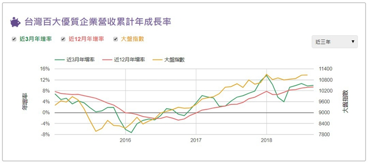
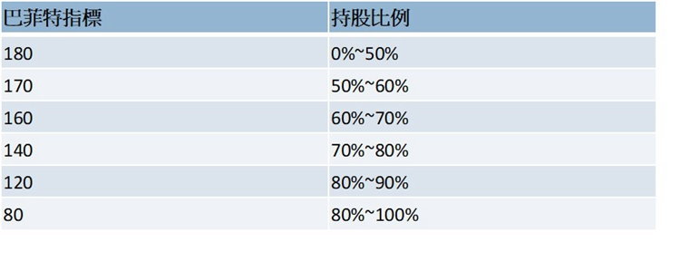
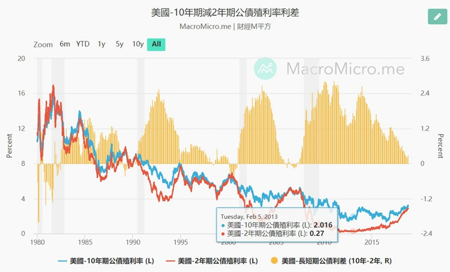

# 總經觀察指標 2018 / 10 / 22


近期台股似乎已從原本下殺的趨勢，轉為盤整的趨勢，接下來呢?

 

十月份這場股災，可說是出其不意，許多投資人都摔了一跤，從網路上各大討論區就可看出哀鴻遍野的慘狀。截至目前為止，台股自11000點下殺到9800點後，已在約10000點左右盤整了近6天，眾多解盤分析接連出現，有的說接下來將會有一波反彈，有的說這只是空頭的開始，有說長期趨勢仍然看好，可逢低布局，總之，各式各樣的多空解釋都有，但何者為真呢?

 

首先，我們得清楚了解，這次的閃崩，是全世界性的趨勢，並非單台股一方，美股、港股、日股、和德股等等，都一樣閃崩。許多人把這次的閃崩歸咎於近期的許多壞消息，例如：

 

1.美國利率持續調高。

2.中美貿易戰。

3.聯準會的緊縮的態度

4.中國債務與房市風險。

5.新興國家的債務危機。

 

其實，當市場高漲到一定程度時，並不需要太多的壞消息面，就會出現閃崩的情況。如柯斯托蘭尼所言，影響短期市場的因素，只有心理面與技術面，而心理面與技術面會直接影響資金的流動。也就是說，短期市場的漲跌，追根究柢，原因就是超買或超賣的因素所致，道理就這麼簡單。

 

當短期市場的高漲是因為超買的因素，遲早會超買出盡，轉折下來。但如果股市漲到相當高的位置時，若遇些風吹草動，就可能會來個閃崩(尤其是當市場在超高點之時)。反之，如市場下跌的因素是超賣的因素，則不久後也會因為超賣出盡，反彈高漲，也就是這樣的原因，造就股市短期的波動起伏。

 

當然，這道理雖然簡單，但卻沒有人能準確抓出時間點，例如買超多久後會轉折下來，又或賣超多久後會開始反彈，沒人能知曉。不過，這裡我要說的重點是，大部分的負面消息只是用來作為陪襯與歸咎的馬後炮，鮮少是壓垮駱駝的最後一根稻草，這點投資人得謹記在心。例如中國的軟著陸與硬著陸，都已喊了長達近8年之久，至今連個著陸都沒有。

 

以這次的情況來說，這次中期的多頭波段，是自2016年4月份開始，到這個月為止，已走了近2年半的時間，台股由8300點漲至11000點之上。前期的漲幅靠的是基本面與資金的追捧，但漲幅至此，除了基本面外，更多是靠資金在支撐，也就是持續的買超，只是這股買超的力量自6月份開始，已走緩下來。

 

至於接下來股市會如何走呢?我不知道，也沒有人會知道。但以短期來說，股市通常是當賣超出盡後，只要基本面仍然有支撐，遲早會開始反彈，只是沒有人知道低點會在哪，又或者何時才會反彈，一切終究得回歸於基本面。

 

觀察基本面，仍得回歸觀察五大經濟指標的態勢：

 
```
1.台灣百大優質企業的營收年增率趨勢。

2.巴菲特指標。

3.美國央行的貨幣政策(利率)。

4.市場大眾的投資氛圍。

5.美國長短期公債出現反利差。

 ```

 

台灣百大優質企業的營收年增率趨勢：




台灣百大優質企業營收累計年成長率的計算，是從台股中挑最優質的前100大公司，並以總和它們的營收後，估算出這100家公司的近3月累計營收年成長率，與近12月累計營收年成長率。主要觀察的方式為近3月累計年成長率如大於12月累計年成長率，同時12月累計年成長率也是成長的條件下，則趨勢向上。

 

台灣百大優質企業的營收如果是成長的趨勢，則代表台灣的上市公司賺錢的速度仍然在增長中，亦代表台灣的總體經濟是站在成長的軌道之上，道理就這麼簡單。以最新9月份的營收趨勢來看：

 

近3月累計年成長率為9.98% > 近12月累計年成長率為9.38%。
9月份的近12月累計年成長率為 9.38% > 8月份的近12月累計年成長率為9.25%。
 

透過以上的數據，我們可以相當肯定台灣總體經濟的趨勢仍然是向上發展的，所以就這點來看，並不需要太過於擔心總經的基本面。

 

 

##巴菲特指標：

`巴菲特指標 = 股市總市值⁄(國民生產毛額(GNP))`

 

巴菲特指標高，代表股票市值高，風險增加。反之，巴菲特指標低，代表股票市值低，風險減少。目前台股的巴菲特指標約落在171%。




## 美國央行的貨幣政策(利率)

這十年來的多頭行情，可以說是靠長期極低利率所引發的資金狂潮推升而成，尤其是美國央行的寬鬆貨幣政策，更是始作俑者。全世界不知有多少投資人是為了賺取比銀行定存1%更高的獲利，相繼把資金投入高殖利率股、ETF、基金、債券等風險較高的項目。近期，許多的資金更是開始追逐那些高風險的概念股，例如物聯網、自動駕駛、電動車或被動元件等。

 

但現在美國央行似乎開始轉向貨幣景縮的政策。今年以來，聯準會以升息三次，同時如果沒有意外，年底還會再升息一次，也就是說年底時，聯邦基準利率會調高至2.5%以上。

 

同時，觀察近期川普與聯準會因升息的關係而彼此抬槓，以及近期聯準會的發言，看來聯準會對貨幣緊鎖的態度是相當的堅定。也就是說，如果把錢放進銀行做定存，每年也有2.5%可以領，明年之後，會不會在升息個四次，把利率調高至3.5%呢?

 

如果利率真的調高至3.5%，以目前的股市總市值來看，股市將相對失去投資的光環，畢竟有太多壞消息流竄著，使許多投資人感到害怕，在這種氛圍下，除非經濟基本面有強力的成長力道，否則股市在缺乏新的資金之下，或甚至是淨流出，則上漲的力道將相當有限。

 

總之，就觀察美國央行對貨幣政策的態度而言，我仍持中立的態度，原因是雖然貨幣寬鬆的政策似乎已開始轉向，但畢竟基準利率還是維持在相對低檔之間，沒有必要在此時過於悲觀，但也沒有理由樂觀罷了。

## 市場大眾的投資氛圍：

由於近期股市的大跌，投資大眾似乎開始謹慎起來，這對股市而言是健康的，但我必須說，單是觀察之前被動元件類股如此極端的漲勢，就不難知道投資大眾之前是處於較樂觀的態度。

 

台股有一項特質，每當高價股出沒時，通常代表台股的高點將至，過一陣子之後，便會開始轉折下來。尤其是當那些高價股是屬於概念股、因供需失衡而成長的、轉機股、景氣循環股，或高科技類股等，這種關聯性越是準確。

 

例如之前的宏達電，在2011年登上千元高峰，成為當時的股王，台股當時也漲上波段的新高，指數漲至9000點以上，但隨後進入2012年景氣趨緩的時期，股市便開始修正，指數下跌至6800點，宏達電的股價至此開始下跌，從此一去不復返。

 

有一句話是這麼說的，國之將亡，必有妖孽，對應在股市上，則可修正為”股市將亡，必有高價股。”。總之，就目前的態勢來看，市場投資大眾的氛圍已轉為較謹慎許多，但因為利率還是維持在低檔，情況仍然是大多的錢在找比銀行定存更高的獲利，所以我對此項指標的態度仍然維持在中立。

 

 

##美國長短期公債出現反利差：




當美國10年期公債殖利率低於2年期公債殖利率，以及兩項殖利率都處在向上漲的趨勢，則代表經濟處於過熱的階段。

 

10年期公債的殖利率通常得比2年期的殖利率還高，因為持有時間長，相對承擔的風險偏高，自然風險溢價的行情要高些。如短期殖利率高於長期殖利率時，也就是反利差的情況出現，則代表市場只希望購買短期的債券，藉此避開可能更高的長期風險。

 

以目前的趨勢來看，我們可以觀察到兩項重點：

 
```
1.長短期公債的殖利率利差越來越少。

2.長短期公債的殖利率都是趨勢向上。
```
 

雖然兩者的殖利率還沒有出現反利差的情況，但卻是往此方向發展，所以對於這項觀察指標而言，我個人是偏向不宜樂觀的看法，但也不至於到需要悲觀的時候，畢竟還沒有出現反利差的情況。


##總結：

近期讀了一篇來自知名財經雜誌裡，最新的股市崩跌分析報導，前面解釋了一大堆觀察指標，以及此次崩跌的理由，但在最後的段落，卻又說”股市會不會就此由多轉空，還是只是多頭的一個回檔?仍待觀察。”，看到這段話後，我差點沒有把剛喝進口的水給噴了出來。

 

我自今年2月開始，所寫的每一篇總經分析，對股市後市發展的態度就已轉為”不宜樂觀”，這在當時股市行情仍好之時，我算是少數人有此見解，所以當時就已建議投資人的持股比例應該由最高的70%調降至60%。

 

綜觀以上五大指標目前的態勢來看，我個人仍然維持一樣在相對審慎的態度，一切回歸我所建議的巴菲特指標持股比例，此時仍然是最高不宜超過60%。

 

原因很簡單，五項指標最重要的一項，台灣百大優質企業的營收趨勢仍然是向上的，而其他的指標都是偏向中立，或是較不樂觀的態勢，尤其是此時市場人然處於相對高點之上，所以不宜樂觀，但也沒有理由過於悲觀的情況，一切回歸巴菲特指標的持股標準，是最適合現在的態勢。

 

智股網  投資執行長

洪鑑穩
