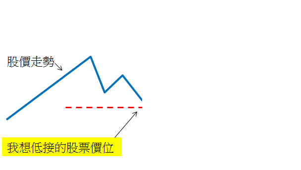
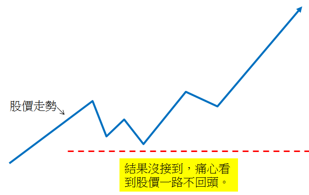
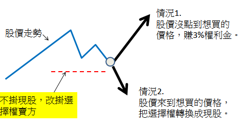

# 選擇權搖錢樹 專業投資 | 選擇權教學

獨大 : 我的學生GUCCI和他弟弟文奕一開始跟我學選擇權的課，後來一跟就是一年多，我只能說他們兄弟倆是超級認真、上進的人，每周從桃園開車到台北。這一年多的課程和聚會他倆的成長我都看在眼裡，哥哥GUCCI有工程師的性格，保守、認真、嚴謹，喜歡做研究，喜歡做有避險的長線單，弟弟文奕是天生的操盤手，上完當沖課以後 改變交易邏輯和交易方法，簡直就換了一個人，他的個性和反應太適合交易當沖。兄弟倆個性不同完全走不同路線。一個保守長線，一個交易短線、剛剛好互補。
美股選擇權也是在這段期間產出的投資方式，因為美股對台灣人有點障礙和陌生，GUCCI是少數實作的學生，證明他的行動力，如今可以開課分享 我也樂觀其成。
 
以下是我的另一個學生 程式交易社長阿亮 給GUCCI的介紹信
====================================================

【課程推薦】追日GUCCI將與你分享輕鬆做美股、穩穩撈美金的聰明交易方式

追日的社員及讀者們大家父親節快樂，團長在這邊要跟大家分享一個類似當父親的喜悅，就是我們追日社員之一的GUCCI將要開課與大家分享他的美股投資成功秘訣，如何每天不用熬夜盯盤美股就能穩穩讓美金自動滾滾入口袋，有興趣的讀者或社員可以先參加近日舉辦的兩場免費說明會 2014/08/16 or 201408/24 台大)，湊湊熱鬧順便看門道，真的有興趣再報名付費課程，團長跟GUCCI討教過，深覺這樣的交易法真是個好東西，團長真心推薦給大家 ^^
 
 
 
上次四月份追日網聚其中的一個主題就是請到GUCCI來分享，有參加網聚的人應該對GUCCI不陌生，並且對他這套投資方法也有初步的認識，這套投資方法從當初只是好友聚會時的零散閒聊分享，經過追日網聚時的初步整理，再經過GUCCI本人持續實做、思考與整理，今天終於可以有系統的教大家整個操作概念與如何實際去下單執行，對於樂見此事的團長我來說正有如一個新生兒 (值得推薦的有系統投資法) 在自己眼下誕生，所以這正是我所謂類似當父親喜悅的由來。
說起 GUCCI，團長覺得他是一個不花俏、踏實且非常誠懇的人，更重要的是我覺得他具有跟傳教士一樣強烈的熱情與使命感，想把正確的投資方法與觀念傳達給大家，只要你願意敞開心胸，給自己一次機會去認識這個投資好方法，相信你一定會受益良多，而且據團長所知，課程結束後GUCCI會持續指導上課學員，直到大家都能實際把方法與觀念內化成自己的投資方式，教你方法又包你學到會，這樣真是佛心來著，團長建議還沒聽過美股現金流的人不急著報課程，先去聽聽免費介紹講座，真的覺得適合有興趣再報名課程吧！！

團長碎碎念：
剛認識GUCCI時，這個人最讓我訝異的就是好好個DRAM工程師不乖乖當，穩穩賺死薪水就好，一天到晚跟我說他他最痛苦的就是天氣好時還要去上班 (他超熱愛騎單車)，還有計畫五年內就可以退休還可能提早達成，他年紀輕輕可以退休的秘密就在他的課程裡了，大家趕快去挖寶吧 ^^

程式交易作者 WEN 大文章
 
 
稱他是`「素人」`，我想還是叫`「神人」`比較恰當。在今年4月份，我出席了追日社團舉辦的網聚，當天從一個自稱素人的神人那裡學到一個以前從來沒接觸過的賺錢方式，`就是美股現金流交易策略(US Cash flow strategy)`，該方式為利用美國股票選擇權搭配價值型股票投資方式，平均每個月可以賺取一些小額利潤，適合無法忍受期貨風險的投資者。

自從4/26在追日的網聚認識了一個目前在DRAM廠當工程師的低調投資高手，當天我回到家後就開始著手研究他的交易策略，也翻閱了不少資料。很難想像，連索羅斯在過去持有部位揭露中，也可以看到類似的操作方式，我真是大開眼界。我想這個好東西是應該讓更多人知道，所以我今天介紹我學到的「美股現金流策略」，這是我所認知的版本。

●`為什麼我會想研究美股現金流策略？`

價值型的股票我一向不怕套牢，經過金融海嘯的人都知道，價值型的股票在低檔反而是要用力買，而且空頭第一波落底之後，價值型的股票會彈得很快，一下就脫離成本區。但是讓我害怕的不是套牢，而是我低掛的價位股價沒有來到，然後目送股價像噴射機一樣一去不回頭(如下圖所示)。

我一直都在找尋一種交易策略，是可以讓我進行價值型投資，有接到股票也賺錢，沒接到股票也照樣賺錢。而這個策略我在今年找到了，就是`「美股現金流策略」`，我目前正在研究中，已經有試單的經驗了。

●`什麼是美股現金流策略？`
 
簡單來說，就是選出價值投資的標的(如同巴菲特)，然後利用美股選擇權低接股票，如果股票沒有跌下來讓我買到，我就賺權利金；如果被我接到股票，我就賺股息及價差，因為這種交易策略可以創造定期現金流入帳(股息+權利金)，因此穩定性高，操作者被稱為股票界的包租公，適合低風險投資的接受者，平均每個月有3~5%的收益，而且很穩。

●`美股現金流策略的優缺點是什麼？`

我先說缺點，我努力計算了一下，這個策略雖然勝率有80-90%以上，但是每個月的報酬只會落在2-5%，`對於想用高風險換取高報酬的投資朋友，就不太適合了`；但是對於想穩穩賺一些小錢，然後長期投資的上班族，這種戰法很推薦。

優點就從我自己為什麼會想學這個策略說起，我會想學習這個策略，其實是因為想要健全我的投資組合，我手中有股票及期貨的程式交易模組，但是這些交易策略建構在高報酬高風險的模組上面，所以我一直很希望可以有個像當房東一樣的策略，每個月穩穩收一點租金，哪怕是1%也好。

最後，很多人對於這種交易策略有一點誤解，認為選擇權賣方是風險很高的交易模式，`但是跟台指選擇權不同的是，美股選擇權是擁有換成現股的權利，因此通常在交易的過程，只要預留可以把部位轉換成現股的空間，不會曝露在高額風險上，風險就跟買現股是一樣的而已`；也正因為如此，這個交易策略每個月的報酬就是2-5%而已。