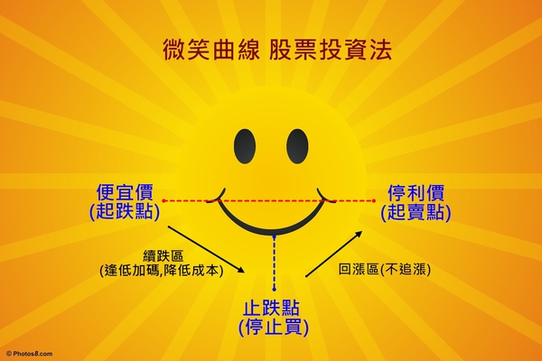

#冷靜 耐心 不賠錢 等待機會

- 轉 http://blog.yam.com/smart0806tw/article/98405476

---


自2008 年5月20日開立blog之後,
從每日少數的200多人次閱覽到現在平均每日的6~7千多閱覽次數
這數據的觀察不禁令人會心一笑.
原來潛移默化的作用是真的 !

與巴大經營blog 已經邁入第八個年頭了
愈來愈多人能逐漸地接受這種投資方式
簡單優雅卻又讓資產能慢慢穩定累積
這種意外的分享  成就更多穩定投資人
我想是當初我們單純分享時想像不到的事.

個股的資訊不斷地的更新
唯一要不變的就是投資人的心

心   只要確立目標   穩固信心   循序漸進  然後耐心地等待收割
就沒有什麼可以阻礙成功獲利了~

巴大常常在blog 與粉絲團跟大家討論他的投資方式與心法
很開心有人理解認同這樣的投資思考方式
也有人似懂非懂反正跟了再說   先拼個輸贏再觀察巴大是否有道理!
但很遺憾地也有人在不是很了解的情況下否定了他的投資模式

或許是因為blog當初經營方式是以討論園地為主
所以沒有系統性的規畫文章來輔佐大家該如何去有系統地學習與理解.

倘若不是從一開始在成立初期就加入我們的朋友
中途加入者都得要花好一段時間才能理解體會巴大的投資模式
通常具有豐富投資經驗的朋友大多會很有耐性並先爬文再求了解 ,
在看懂了文章及留言後才慢慢發問並加入討論行列.

然而對投資新手入門的朋友而言 ,
往往要耗費多時才能理解或是看了老半天可能還是無法了解
這究竟是什麼樣的投資模式 ??
亦或失去耐性無法接受這樣慢慢地賺錢方式而離去.

對於Blog的文章分類呈現方式會有些不習慣與理解上的困難
因為文章眾多千篇要重新分類整理確實不易,
在此跟大家說不好意思!

所以這篇文章的產生其實在心底蘊釀很久了.
該如何寫出一篇文章給大家 , 我給了自己一個這樣的小功課 ^^
目的只是希望讓大家能明白『我們的股票投資』 努力這麼多年
想傳遞的投資理念與心法而己!

巴大不是投資之神, 他也常對大家給他達人專家這個稱號有些為難.
因為他說只是一個平凡不過的投資人 ,
這個BLOG不是造神園地 ,是大家的園地.
只希望藉由他的活生生的例子讓大家明白投資是件簡單的事.

為了讓大家能更清楚地了解巴大是如何踏入價值投資的旅程
還有他過往的投資經驗是如何造就他目前的修煉與堅定信念
以及最後給投資人的一些建議等等,
於是啟發了我整理了這些當初智富月刊訪問時的手稿以及平時與他交談所獲得的啟示~

希望這篇有點漫長的文章能幫助大家~
請用點耐心來看喔!  (^__^)


 (以下為巴大未曾公開的自述手稿整理)  時間 :  2013年 8月

---

巴大的投資歷程 , 他是如何邁入價值投資這條路呢?

民國 77 年退伍，很幸運地隨即找到第一份工作在上櫃公司擔任維修工程師，工作內容是負責電腦主機板維修，當時月薪才 13,900 元，那時台灣主機板業正值發展期，經過了長達四年的工作時間，一路靠著不斷努力及虛心學習來累積程經驗 ，這時薪資收入已慢慢成長到 45,000 元，並具備了研發工程師的職位 (當時民國 80 年)。

在這當時公司宣布員工可認購股份，於是跟家人借了 60 萬元，再加上自己的儲蓄共 90 萬，跟公司購買股票，這是第一次在工作上拿到股票這東西(當時未集保所以是大張的紙本股票) 於是心裏對它產生了好奇，後來在高價時賣出，共獲利了 90 萬，這時開始對股票產生了好感， 當時的想法覺得 哇!原來股票買賣竟比本業更容易賺錢，可是仍然未去了解投資是怎麼一回事。

之後在前主管引薦下轉職到不同領域工作， 從事 Laptop 可攜型電腦、VGA 顯示 卡等研發工作，直到民國 85 年在一個偶然機會離開此公司，接觸到 DRAM 半導體記憶體產業。

由於之前累積的電腦硬體經驗，發現 DRAM 次級品產業的技術應用門檻並不高， 產品技術反而是另種商機，所以與公司協議獨立部門以合資方式共同創業 ，因緣際會下就這樣轉向 DRAM 產業並從此奠定對記憶體電子業技術根基，期間公司也歷經過多次整併體制的改革，最後也順利上興櫃，而本人在此時則被授與兼任董事一職，曾經有次意外得知公司在上櫃前後時期，為了能使順利通過審核而與會計務所聯合美化原本體質不佳的財務報表，從那時開始便因此事的印象，而開始對這種獲利普通的中小企業的財報可信度產生懷疑的態度。

有鑑於前面發生的事，所以當公司上興櫃沒多久我就直接出售部份持股，但由於具備董事身份，此舉未報備而惹得老闆非常不滿，最後卸任董事一職位。
後來公司正式上櫃時本人就全數出清了手上持有的公司股票，意外的率性反而卻賺了數百萬投資收入。

爾後民國 91 年在公司的同意下允許分割業務獨立創業，這是人生第一次的創業，直到民國 96 年期間我共創業三次，當中也因初期創業的經驗不足而遇到了些經營層面上會遇到困難，一直到第三次才開始漸入佳境， 公司也開始獲利並邁向穩定經營狀態。

此時月薪資已是 11 萬元，並擔任總經理一職，累積的工作經驗已達約21 年 (民國 96 年 12 月退休 )。有了三次創業的辛苦歷程 ，我對於公司的經營更是處處謹慎小心了，靠著日夜不斷地拼勁為公司創造利潤，也快速累積了一筆退休準備金。

在歷經 DRAM 產業的景氣循環問題重複不斷以及看盡職場與商場百態黑暗面之後，常常在內心燃起陶淵明的『採菊東籬下，悠然見南山』想法，後來想想這局勢何不是上帝賜予我的恩典，讓我幸運地在43歲時即可享有提早退休的機會！

自經營公司六年的期間以來深刻體悟到，企業若想要年年持續賺錢以維護營收並非易事，尤其對小型公司而言更是備感辛苦。因此在賺到錢的前提下決議合理分配盈餘 及紅利給夥伴後，便決定於在公司業務繁榮期時執行退休計畫，我把公司在最好的狀態下留給其它股東繼續經營，優雅從容地離開職場，去分享上帝的恩惠，學習過不一樣的退休人生 。

離開職場後 ，我選擇退休後的人生第一件事 ，便是做自己有興趣的事情 ，也就是『投資理財』以及好好研讀聖經。由於退休後 ，空出來的時間多了許多 ，我重新檢視自己手上的資產並著手該做什麼樣的資產配置與投資規畫 ，此時開始思考以前我在投資股票買賣上為什麼老是賠錢？
於是乎在把自己的過往投資記錄調閱出來攤開一一檢視後 ，才發現原因出在我操之過急的心態上！

我認真的開始努力研讀財務知識及修正投資心態 ，巴菲特價值投資思想的出現對我真的是一道曙光 ，也開始在各大財經討論版上瀏覽與大家討論交流，再從中找出適合自己的模式及修正心態 ！


我將自己投資過程分成三個時期給大家參考：
■80 年 ~ 90 年 期間   (標準菜籃族)
此階段完全不看財報，憑感覺買股票賺價差小買賺偶爾額虧損 ，
後來因為貪心去買認購權證慘賠 800 萬元。

■90 年 ~ 96 年期 間 ( 一般散戶型)
只看簡單財報的 EPS 、股利、股價高低點，採用波段操作，
持股期間 6~10 個月之間，有數次成功操作。此時期賺回之前慘賠的 800 萬 元。


■97 年 ~ 迄今期間   (企業股東型)
因為知道企業經營有不確定性，此偏好挑選大型經營穩定的公司投資，
這些企業它們對利空有較高承受能力，偏愛利空買股方式且持有期限拉長至 3~5 年。


###學習心態的轉換

真正想在投資路上認真學習是第三次創業末期時，除了藉由投資績優的企業來當股東領取穩定的股利之外，我也開始藉由大量閱讀來充實自己的投資知識 ，其中以價值投資大師 - 巴菲特先生的相關研究對我影響為最，大家可以去看他歷年來寫給股東的信。

其它還閱讀了洪瑞泰的**『巴菲特選股魔法書** 』及劉心陽的『**操盤人教你看財務報 表**』，這些書讓我在財務報有更進一步的認識 ，並建立了我閱讀基本財報數據能力以及學習如何從財報上看出隱藏的企業危機。

近兩年則閱讀了溫國信先生的『**我存好股穩穩賺**』 與林茂昌先生的『**用心於不交易** 』，這二本書更教會我如何堅定信念並用長期持有來取代單純賺價差的波段操作 。這二年則看了財報狗的『**教你挖好股穩賺 20%** 』與雷浩斯的『**小薪水存好股又賺波段**』則讓我了解如何巧妙運用財報上的數據來分析企業營運趨勢。

這些工具書都是每一個投資人必備的 ，選擇適合自己的工具書來閱讀勢必能加強 功力 。


---

開設「我們的股票BLOG」的原因與感想

當初從職場退休時想把對股票的熱誠與更多人分享 ，但因財經討論壇的投資人角色太複雜 ，而本人則較偏好以理性的方式來做價值投資 ，所以希望能集結這些相同理念的同好能在一個專屬的園地互相交流討論， 以用股票投資的虛擬經營企業模式取代真實的企業經營，所以有了初步的概想。

這時詢問以前的公司同事是否有人對理財有興趣並願意協助參與，於是很幸運地得到Alley及其他同事義務性的協助幫忙，原本想擬用論壇的討論方式，但礙於無網管架站能力 ，於是想出最簡便的免費資源就用時下流行的Blog 來建立吧！ 便開始積極地蒐集大量資源來建立討論區的個股資料及文章分享。

經過半年的籌畫與準備【我們股票投資 Blog】，在  2008/5/20 日正式開幕！
當初成立的宗旨是想留下個人投資紀錄與網友一起分享過程，所以特別感謝默幫忙的同事Alley，協助成就今日【我們股票投資 Blog】。

當初取名為【我們股票投資 Blog】而不以私人名義命名，是想告訴網友這是屬於大家的園地而非我一個人的部落格 ，在投資的路上若有人一起交流鼓勵的話，其實效益會更快 ！
想藉由互相分享價值投資觀念的推廣 ，讓更多在股市浮沉的投資人能慢慢改掉投機的觀念 ，協助他們用更穩健的心態去看待投資 ，這樣子讓大家都可以從股市中賺到錢而不再是賠錢 。

在Blog 成立不到一年時，馬上就遇到2008年全球金融風暴的考驗，這當中看到網友從樂觀到跌時的過度悲觀等等過程，再次證實投資人的信心實在非常的微弱啊！

除了與網友相互打氣加油之外，我從之前累積的投資經驗來看，認為價值投資的精神是不應該畏懼股災的 (別人恐懼時我勇敢)，我們應該視為這是投資**遇到大好機會的時機點，應勇敢繼續分批往下買進來降底持有成本**，甚至以降低帳面虧損來做換股操作來安全渡過股災才對！

在與網友互動過程中，我常提醒自己要堅持當初投資的初衷；要相信企業絕不會因股價重挫就完蛋了，並且學習體悟到投資要 **”多一份堅持** ”，這樣做會更好！

在2011年 時邀請經常熱心發言且有自己獨特思考的Emily(艾蜜莉)小姐當共同版主，她的加入讓網友們更可以欣賞到更多優質的討論，網友參與的熱情反應熱切 ，討論的主題也愈來愈加精彩 ，這是超乎當初的預期 。

 2012 年時發現 FB 是新興掘起的社群中，透過社員的討論更能容易顯現互動分享效果的工具， 而Blog觀看文章的人佔多數，僅少數網友會勇於發言，因此為了讓不同的朋友也能參與分享的美妙，所以成立了 FB 社團討論區 ，也因而結識更多來自四面八方志同道合的網友們。

為了鼓勵更多網友參與社團經營所以加入管理員，以集合大家的力量來服務廣大的散戶們！ 惟社團因故於2015年5月結束，因應BLOG的不穩定原因所以再度成立巴小智FB粉絲團，以巴大的30檔觀察名單為討論重點並加分享其它文章為輔。

### 投資的心態與觀念

投資股票與經營企業雷同之處在於不可預期性高，需要做最好的準備與最壞的打算。

**投資一檔企業遭逢利空時 ， 從陷入泥沼到回復正常軌道快則一年，慢則兩、三年，需要一些時間讓它營運回溫，因此短期股價重挫是可以預期到的，這時耐心持有便顯出它的重要性。** 持有股票的時間就是贏得投資的關鍵，一定要學習放下急躁心態！ 因此投資人需要有面對未實現『**帳損**』的最壞打算，並且要勇敢地用向下分批買進 ，來降低整體持股成本，以提升未來的獲利空間。

就短期看來，股票資產的風險確實極大，但只要選對企業及拉長時間操作，它是一個相當棒的投資工具， 我習慣把股票投資當成自己公司的股權來看待持股行為，把自己當成持有企業的股東角度來看，對於短期投資績效不需過於注重 ，反而看重長期靠長抱賺到時間的複利。

**不賠錢、冷靜 、  耐心、 等待機會**，是價值投資人應俱備的特質，所以特別將這四大點標示在部落格版面上，藉以時時提醒投資人。


### 巴大的選股原則與方法

我在選擇個股時，會盡量挑選**年年發的岀現金股利的企業**來做為投資衡量的因素之一，再者會注重**其稅後淨利與股價位置的相對關係**， 通常只有在企業遇到景氣不佳的重大利空考驗下，還可發得出現金股利的情況下才會買它 ；

而什麼是利空考驗呢?  比如產業前景不明 、企業營運衰退嚴重這些大情況 ！

因此當股價下跌至歷年度低檔區時，首先我會先檢視個股的性質是屬於大型權值股 、產業龍頭股 、還是利基型個股？根據不同的情況，投資之前會做資金額度與投資報酬率的期待估算，確定可行後才會進行買進動作。


本人喜歡挑選上市長達15年以上的大型權值股 (股本百億元以上 )、產業龍頭或利基型個股，而選股的條件為下︰

**(1)以產業大權值型個股來看，自上市以來發放股利需不能低於 1元者 **；
►例如電信類股 :台灣大 ；傳產類 :台塑 (1301) 、寶成 (9904)、正新 (2105)；
電子類股 :台達電 (2308)、廣達  (2382)、仁寶  (2324) 、聯強 (2347)…等等。

**(2)而產業龍頭股與利基型個股來看，發放的股利則不得低於 2元者** ，而股利持續每年發放的紀錄愈長愈好，盡量超過 15 年以上尤佳！。
►例如 :中碳 (1723)、聚陽 (1477) 、永紀 (1726)、中保 (9917)、中聯資(9930)、聯詠(3034) 、豐藝  (6189).. 等等。
**
(3)每年稅後淨利低於 5億的公司獲利規模太小 ，這性質為中小型的企業其財報容易作假美化 ，儘量不予列入投資名單 。**


我會從企業可否**持續多年的股利發放一致性**這個特點，去觀察企業是否具有可投資的價值！

企業經營時間越長其實愈不容易保持賺錢的記錄，這往往也是考驗企業在景氣不佳時的應變能力高低有關，若在景氣不好時還能發出股利 ，其財務體質通常也較佳，代表其能通過景氣影響因素的考驗，未來若持有後變成地雷股的機率也會相對降低許多。

通常**在績優個股遭逢利空或景氣問題而進入歷年度低檔區時，就是佈局買票的好時機   (逢低買股 )！**

一般而言，企業若發生重大利空時，它的財報數據肯定很糟糕的 ，不是獲利衰退不然就是獲利品質會變差，所以此時多數財報型投資者會寧可選擇不去碰它。
而我主張的逢低買股這種買法，則在此時會跟一般運用財報數據看趨勢而買股票的觀點會有相衝突。

有網友一定會有這些疑問，該怎麼說呢？
我的解釋在於它可能是市場崩盤過度反應而造成的價格修正。
一家超過 15 年以上的大型權值股，在歷經多次景氣空頭後若仍然未出現單季虧損的前提之下，我們應該要去相信它仍具有投資價值！

我們可以將它獲利、衰退與過往年度相比較 ，找出合理的買進價位來進行投資，但這時的投資就得先要有長期抗戰的心理準備才行 ，因為投資期限通常會偏長 ，這是一般人較無法忍受的地方！

不可否認對於中小型規模的個股，我們必需要具備更多財報解讀能力與產業趨勢去分析判斷才是，但這點對於非財經專業領域的上投資客應是較為弱勢，，我們能力專業上若缺乏的地方，就必需得藉由大量閱讀財報及書籍方式來提升，投資人若是能加強檢視個股的能力 ，將有幫助於將營運有疑慮的個股做篩選，那就能避開地雷陷井了。

### 我的交易操作方式

個人喜好利空買股，採用微笑曲線來操作 ，由曲線左側開始往下分批買進，只買跌不漲，買到股價止跌時便停止做買進動作。

而買進的價差幅度通常會以 5 %~10%的差異做為級距範圍，只要企業營運衰退在合理的條件預估下 ，便不畏懼帳面虧損， 持續買進直到預計持股資金購買完畢。

萬一股價跌勢超乎預期呢？若此時手上也已無預留的資金可再買進時，則不予理會跌勢 ，我們對於股價的無常變化要習慣性去忽略它的變動！

股價從谷底往右側曲線上升的過程中絕不買股票(也就是不追漲)，並耐心持有直到微笑曲線的右側方位置 (股價相當於左側上方的起跌點 )。


一般而言，若是重大利空的個股從起跌點到最低點價差約有 25%~40%  的幅度，
因此經由分批買進模式可將整體成本控制在下跌曲線與最低點的中間位置，就算日後企業營運無法在短期內回復，通常股價也能回到曲線的右上方位置這段中間是仍可獲利的空間。

再者 ，當初起買點價位應已經接近歷年度最低檔附近，已經有價格的安全邊際原則 ，再根據過往年度投資人對該公司股價所能接受的高點訂出 8折空間價，再訂定一個停利價位，這些都是投資前必需準備好的功課。這種操作模式需要投資人具有一定堅強的信心與耐心才能安心持有股票。

如果持有期間，股價遲遲不漲？
不用擔心，至少會有現金股利，那就領取約 5~8% 的股利報酬率，然後繼續持有它也不錯吧！

簡而言之，一筆好的投資必須具備下列四點：
```
(1) 挑對合適的股票
(2) 便宜價買進 (跌破歷年度低檔價位 )
(3) 合理價耐心持有 (以個股歷年度 收盤平均價 當做參考值 )
(4) 昂貴價到賣出 (以個股歷年度平均高價當做參考值 )
```

#資金配置與控管

由於我是退休後並未再有任何事業上的投資，單純僅靠股票來維持家庭支出，因此我是在當初選擇退休時，有做好一個完整的資金配置與風險控管，才敢安心過退休生活。

投資千萬要記住一個要點，一定要用閒錢才行，這是我的原則，而且絕對不碰自己不熟悉的金融商品如融資、融劵、期貨等財務槓桿高風險的操作與不熟悉未研究過的產業個股，除了這些原則，我會將手上資金分成三部份來嚴格執行控管與規畫：

###(1) 日常生活帳戶
平日生活支出費用來自每年的股利收入 , 但另備三年家庭支出的準備金 (平時不會拿出來用 ,目的為當股票市場不景氣 ，股利倘若縮水時會用來支付家庭開銷的支出的備用 )。

###(2)緊急備用金帳戶
保留總資金的 1/10 ，會給日後股災時買股逢低加碼用。

### (3)投資帳戶
剩餘的資金除了 部份房地產外，幾乎全數投入股票資產，並採取不過度分散與適當的集中投資相併的原則來買股票。


股票持有類型會分為下︰
###(1) 核心持股
多集中以大型權值股與龍頭股為限, 目前持股約在2~3檔左右.

###(2)衛星持股
以中小型個股或利基型個股為原則 , 並以不超過4檔為數

這樣的持股買賣模式，經過了 9年，我的實戰經驗告訴我一個令人想像不到的事實，我發現此投資方式不但可以用股利收入支應整年度家庭生活開銷支出，還可以用股票買賣賺來的價差讓我買了兩間房子(一間自住 + 一間巴小智工作室)，雖然我的資金部位不代表是一般年輕的投資人可以比照的，但我的投資方式絕對可以讓散戶投資人做為參考，讓他們明白藉由這種穩定簡單的股票投資也可以產生穩定的現金流，時間與複利的交叉操作下，多年後一定也是筆可觀的資產。


### 給投資人的建議

收入變少及資金不夠,會是現在年輕人或是資淺投資人的最大困難嗎 ?

年輕人最大的優勢在於年輕時頭腦較清晰、學習力與記憶力較佳，但在投資經驗上未經過股災洗禮，若冒然投資會是個很大的風險，所以我並不建議新鮮人馬上衝入股市來買股票繳學費！

一方面當投入股市資金過低時，很難可以藉由不停買賣股票然後馬上變成有錢，過低的資金也不適合做短線交易，因為未建立健全的投資心態，會容易產生浮燥與患得患失！

我常常勸導他們應該先把錢存下來，平時累積財經知識及靠大量閱讀來增強分析觀察力，努力多了解個股的股價與企業營運相對的關係後，等到合適機會、合適的買點再投入會更棒的！

因此建議年輕人應該專注在必要的專業工作技能上，第一步要先培養自己生存力與保留資金的存款力，等工作一段時間累積第一桶金後，也學會用正確的投資態度來訓練自己對金錢的複利投資力，努力將錢變大，這樣對他們而言才是更好的累積資產方式。

另外，台股已從主力時代慢慢地走到法人市場，許多人一直認為散戶很難賺到錢，沒錯,這是事實!! 因為市場籌碼本來就不在散戶身上，投資人必需了解到一件事，那就是您手上只剩下持股時間的籌碼，可以去閃避股價下跌時淪為法人的代罪羔羊風險 ！

與其花時間跟法人不斷的短線交易，不如花心思在挑選績效優良的公司，並在便宜價買入且耐心持有，好讓法人再度幫我們推升股價， 再到合理價或昂貴價時再行出售！然而這通常得需要一段時間的等待與發酵才會看的到效益。 而多數人會因受到景氣下滑及股價下挫的影響會習慣性抱怨與恐慌心理，而無法持續堅持價值投資行為，因此會建議價值投資人必須學習的是，『**您需要學習耐心持有股票**！』


最後感謝 主
在 主耶穌的恩典下
祝福大家都能在股市中 快樂投資  微笑歡呼收割 ~平安喜樂
以馬利內~

