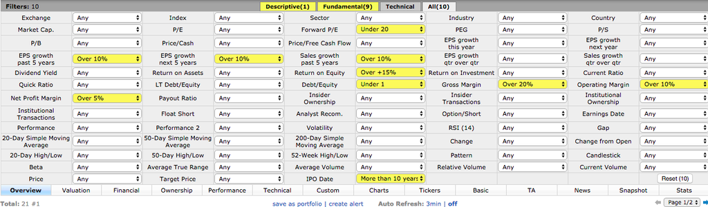

# 10個指標

###獲利指標: 
- 毛利率Gross Margin > 20% 
- 營利率Operating Margin > 10% 
- 純益率 Net Profit Margin > 5% 
- ROE > 15%

### 成長指標: 
- 營收成長Sales Growth > 10%
- EPS 過去/未來成長> 10%

###價值指標: 
- 未來本益比Forward P/E < 20 倍

###安全指標: 
- 債股比Debt /Equity < 1  
- IPO date > 10 years  ;上市超過10年

https://finviz.com/screener.ashx?v=111&f=fa_debteq_u1,fa_eps5years_o10,fa_estltgrowth_o10,fa_fpe_u20,fa_grossmargin_o20,fa_netmargin_o5,fa_opermargin_o10,fa_roe_o15,fa_sales5years_o10,ipodate_more10&ft=2