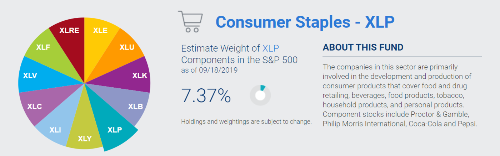
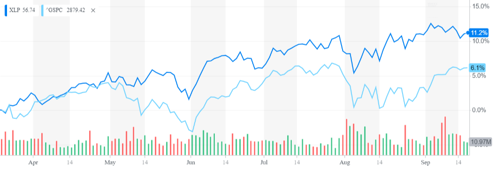
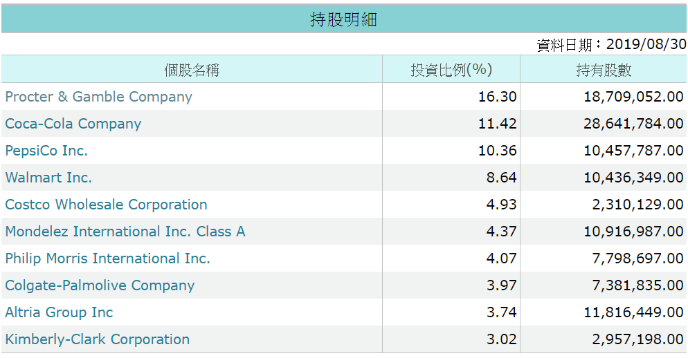
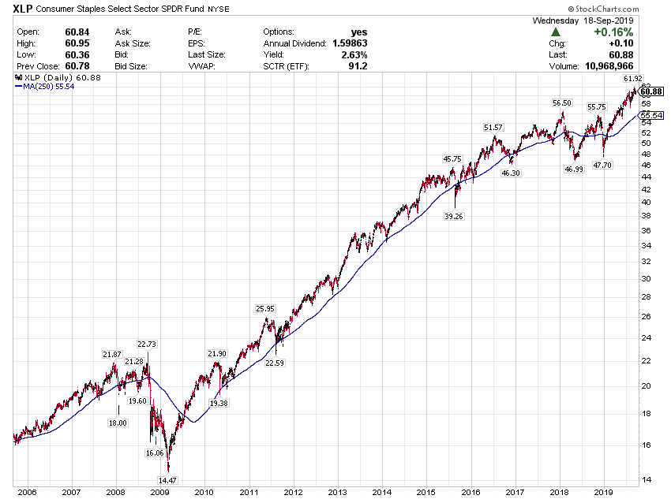

# 全球最強生活概念股!一次帶你認識10家最強企業

<strong>警語</strong>
 
文章內容僅供投資人參考，投資人須自行承擔風險，本文不負擔盈虧之法律責任，亦不代表任何投資或稅務建議。
 
 
美國產業非常多元，依照SPDR分類可以分為11大產業，每種產業都有對應的ETF投資，未來有機會再來介紹各種產業ETF，今天先來介紹必需性消費類股ETF(證券代碼:XLP)，目前占標普500指數權重7.37%。
 

 
資料來源:SPDR
 
<strong>所謂必須性消費類股顧名思義就是民生必需消費，通常包含基本的食衣住行需求，也就是生活概念股。這類消費即使景氣趨緩也很難縮減，會是空頭防禦的好標的，但相對在多頭市場時，漲幅比較溫吞。</strong>
 
過去半年來，必需性消費類股ETF(證券代碼:XLP)漲幅高達11.2%，遠勝同期標普500指數表現的6.1%，在全球經濟成長不確定性升高的前提下，必須性消費類股往往表現會相對良好。
 

 
資料來源:Yahoo Finance
 
<strong>那必須性消費類股到底持有那些公司呢?&nbsp;</strong>
 
其實非常簡單，只要連到MoneyDJ網站(<a class="js-outside-link" href="https://www.moneydj.com/ETF/X/Basic/Basic0007.xdjhtm?etfid=XLP" rel="noopener noreferrer" target="_blank">請點我</a>)，就可直接查詢XLP持股明細。(<strong>若想查詢其他ETF，更改網址後方證券代碼即可</strong>)
 

 
資料來源:MoneyDJ
 
<strong>從上面資料，可以看出目前XLP前10大持股如下:</strong>
 
<strong>1.Procter &amp; Gamble Company(寶僑，股票代號:PG):</strong>
 
全球最強消費品龍頭，知名品牌有Head &amp; Shoulders(海倫仙度絲)、Pampers(幫寶適)等。
 
<strong>2.Coca-Cola Company(可口可樂，股票代號:KO):</strong>
 
全球飲料龍頭企業，可口可樂就是它做的。
 
<strong>3.PepsiCo Inc.(百事可樂，股票代號:PEP):</strong>
 
可口可樂最大競爭對手，百事可樂就是它做的。
 
<strong>4.Walmart Inc.(沃爾瑪，股票代號:WMT):</strong>
 
世界最大連鎖量販店，日常消費都靠它。
 
<strong>5.Costco Wholesale Corporation(好市多，股票代號:COST):</strong>
 
世界最強會員制量販店，只要繳了會員費，就會乖乖去消費。
 
<strong>6.Mondelez International Inc(億滋，股票代號:MDLZ):</strong>
 
全球知名食品製造商，最知名品牌Oreo(奧利奧)餅乾。
 
<strong>7.Philip Morris International Inc.(菲利普莫里斯，股票代號:PM):</strong>
 
全球最大香菸集團，最知名品牌萬寶路(Marlboro)，專注於美國以外市場。
 
<a class="js-outside-link" href="https://www.pressplay.cc/project/vippPage/%E4%B8%96%E7%95%8C%E6%9C%80%E5%A4%A7%E9%A6%99%E8%8F%B8%E9%9B%86%E5%9C%98%EF%BC%8C%E8%82%A1%E5%88%A9%E9%80%A3%E7%BA%8C11%E5%B9%B4%E6%88%90%E9%95%B7%EF%BC%8C%E5%B9%B3%E5%9D%87%E6%AF%8F%E5%B9%B4%E6%88%90%E9%95%B711.29%EF%BC%85!!/247B0987873148FEB62AA3D568E33107" rel="noopener noreferrer" target="_blank"><strong>延伸閱讀:世界最大香菸集團，股利連續11年成長，平均每年成長11.29%!!(請點我)</strong></a>
 
<strong>8.Colgate-Palmolive Company(高露潔，股票代號:CL):</strong>
 
全球最強牙膏製造商，高露潔牙膏就是它做的。
 
<strong>9.Altria Group Inc(奧馳亞，股票代號:MO):</strong>
 
全球最大香菸集團，最知名品牌萬寶路(Marlboro)，專注於美國市場。
 
<strong>10.Kimberly-Clark Corporation(金百利克拉克，股票代號:KMB):</strong>
 
全球知名消費品製造商，最知名品牌Kleenex(舒潔)衛生紙，上廁所不能沒有它。
 
<strong>投資個股跟ETF最大差別是，個股有機會賺到超額報酬，但波動風險亦大，若企業失去競爭優勢時，股價可能一路往下，再也不會回頭，而投資ETF則可以享有平均報酬，波動風險亦較低。</strong>
 
此外，觀察XLP走勢也有助於瞭解美國消費狀況，從XLP目前走勢觀察，目前美國消費還是很強健，美國消費是全球多頭最後一道防線，若XLP如2008年般持續走弱，那就千萬要小心了。
 
<strong>XLP歷史走勢</strong>
 

 
<strong>找出生活概念股比你想得更簡單，現在就去試試看吧!!</strong>
 
<strong>喜歡這篇文章嗎？分享給你的朋友吧！</strong>
 
記得<strong><a class="js-outside-link" href="https://www.pressplay.cc/project/chooseReward/%E7%BE%8E%E8%82%A1%E5%A4%A2%E6%83%B3%E5%AE%B6-%20%E6%89%93%E9%80%A0%E7%A9%A9%E5%AE%9A%E7%8F%BE%E9%87%91%E6%B5%81/4C634684C8C75C7CE128F7707282FB4C" rel="noopener noreferrer" target="_blank">點我訂閱支持專案</a></strong>，讓我更努力寫出好文章。並<strong><a href="https://line.me/R/ti/p/%40dau7440r" rel="" target="_blank">點我加入LINE群組討論</a></strong>或搜尋LINE ID <strong>@dau7440r</strong>，就能隨時收到最新文章囉!!

