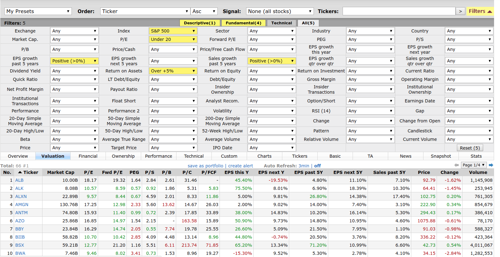
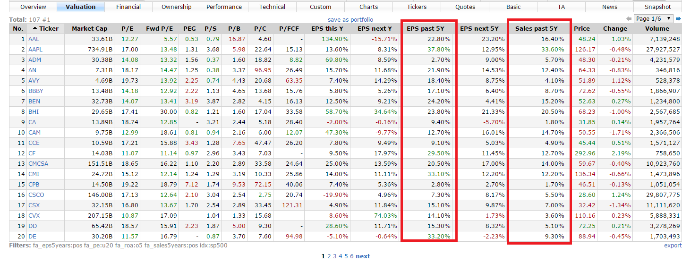
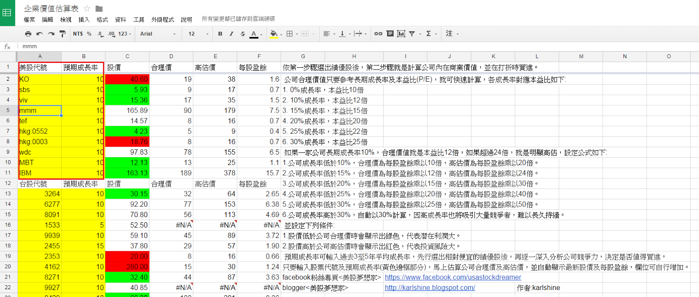

# 如何尋找低估的績優公司


finviz 設定第一組 標準選股
http://finviz.com/screener.ashx?v=111&f=fa_debteq_u0.6,fa_div_pos,fa_eps5years_pos,fa_epsyoy_pos,fa_roa_pos,fa_roe_o15,geo_usa,sh_avgvol_o1000,sh_curvol_o1000&ft=4&o=ticker

finviz 設定第二組 標準選股+pe<15
http://finviz.com/screener.ashx?v=111&f=fa_debteq_u0.6,fa_div_pos,fa_eps5years_pos,fa_epsyoy_pos,fa_pe_u15,fa_roa_pos,fa_roe_o15,geo_usa,sh_avgvol_o1000,sh_curvol_o1000&ft=4&o=ticker

finviz 設定第三組 高殖利率
http://finviz.com/screener.ashx?v=111&f=fa_debteq_u0.8,fa_div_veryhigh,fa_eps5years_pos,fa_epsyoy_pos,fa_roe_pos,geo_usa&ft=4&o=ticker


如何尋找低估的績優公司
由於美國有6000多家公司，一時之間可能不知道要投資哪家公司，可用下列選股網站Finviz，並設定下列條件:

```
1.SP500指數成分股:代表公司大到不能倒
2.本益比<20倍:代表價值可能低估
3.過去5年營收成長率>0%
4.過去5年EPS成長率>0%
5.資產報酬率ROA>5%
```


點進去下列網址，可發現目前符合上述條件的有107檔個股

http://finviz.com/screener.ashx?v=121&f=fa_eps5years_pos,fa_pe_u20,fa_roa_o5,fa_sales5years_pos,idx_sp500&ft=4







接者必須要分析這107檔的公司競爭力及公司價值，一般來說建議先簡單估算價值，篩掉已經明顯高估的，這樣比較節省時間，而這種重複的運算工作交給電腦即可。


可利用下列簡單試算表，快速估算公司價值，篩掉已經明顯高估的公司
https://docs.google.com/spreadsheets/d/14HWrd3TK4JLH7NUGsUyICa6k5V71TuCtC17nww4LqnA/edit#gid=0





上列試算表只要輸入兩個變數，股票代號及預期成長率。

預期成長率=(過去5年營收成長率*2+過去5年EPS成長率)/3

過去5年營收成長率及過去5年EPS成長率，可參考圖片一的紅框處。

上列公式的主要考量原因為營收比起EPS較不會受會計手法影響，能較精確反映公司產品或服務的成長力道。

篩出可能低估的股票後，接者就進入思考的階段，可先至Gurufocus或Moringstar參考公司過去10年的財務比率，一般至少看下列幾項，走勢都以穩定向上為佳

```
1.營收
2.毛利率
3.營業利益率
4.淨利率
5.資產報酬率
6.自由現金流占淨利比
```


確認公司過去財務比率穩定向上後，接者閱讀公司年報(10-K)及股東會通知(DEF 14A)，可至美國SEC網站下載。

讀公司年報為的是了解公司商業模式及競爭力，讀股東會通知為的是了解公司經營階層，有關公司資料的蒐集是越完善越好，蒐集程度因人而異，與個人生活經驗比較有關，只要蒐集到「股價下跌也不怕」的程度就可以了。


# finviz 篩選程式


```sh
https://github.com/mariostoev/finviz
```

- Installation finviz
    - pip install finviz 


```py
from finviz.screener import Screener

filters = ['fa_eps5years_pos', 'fa_pe_u20' ,'fa_roa_o5', 'fa_sales5years_pos', 'idx_sp500']  # Shows companies in NASDAQ which are in the S&P500
# Get the first 50 results sorted by price ascending
# 

'''
def __init__(self, tickers=None, filters=None, rows=None, order='', signal='', table=None, custom=None):
    """
    Initilizes all variables to its values

    :param tickers: collection of ticker strings eg.: ['AAPL', 'AMD', 'WMT']
    :type tickers: list
    :param filters: collection of filters strings eg.: ['exch_nasd', 'idx_sp500', 'fa_div_none']
    :type filters: list
    :param rows: total number of rows to get
    :type rows: int
    :param order: table order eg.: '-price' (to sort table by descending price)
    :type order: str
    :param signal: show by signal eg.: 'n_majornews' (for stocks with major news)
    :type signal: str
    :param table: table type eg.: 'Performance'
    :type table: str
    :param custom: collection of custom columns eg.: ['1', '21', '23', '45']
    :type custom: list
    :var self.data: list of dictionaries containing row data
    :type self.data: list
    """
'''

stock_list = Screener(filters=filters, order='price', table='Valuation')

# Export the screener results to .csv
stock_list.to_csv()

# Create a SQLite database
stock_list.to_sqlite('./aa')

#for stock in stock_list[9:19]:  # Loop through 10th - 20th stocks
#    print(stock['Ticker'], stock['Price']) # Print symbol and price
#
## Add more filters
#stock_list.add(filters=['fa_div_high'])  # Show stocks with high dividend yield
## or just stock_list(filters=['fa_div_high'])
#
## Print the table into the console
#print(stock_list)

```

- Installation sqlitebrowser
    -  sudo apt-get install sqlitebrowser
    


- Browse sqite data
    -  sqlitebrowser aa