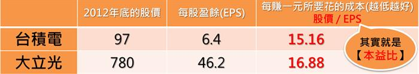

# 名詞解釋

- EPS 每股盈餘 : 稅後淨利

英文叫做EPS (Earning per Share)，
也就是『企業為一張股票 賺到多少錢』

假設一間公司一年淨賺2000萬，這間公司發行了10萬股股票，
那麼當年的EPS就是200。

EPS的公式＝稅後淨利÷股本×10

詳細例子 將已經計算出來的幾項預估參數導近公式：預估2016年營收9,043百萬、預估2016年稅後淨利率16.6％、2016年的最新股本1,104萬。

2016年預估EPS=9,043百萬×16.6％÷1104百萬×10=13.6元

- 本益比  越低越好

所謂的【股價/EPS】 其實就是投資人常在說的【本益比】，
這個數字代表說：每賺一塊錢 要花多少成本。
 
這麼說還是太饒口的話，有個簡單的記憶方式！
你就想，台積電成本97元，一年賺6.4元，要15.16年才能回本，
所以【本益比】就等於是【要花多久才會回本】，很容易記吧！

- 毛利=營業收入-營業成本 
毛利率=(營收-成本)/營業收入 
營業利益=營業收入-營業成本-營業費用 
營業利益率=(營業收入-營業成本-管銷費用)/營業收入 
淨利率 

阿田 開了一家阿田麵店，每個月賣麵收入100元，買入麵粉材料花了30
元，水、電10元，因為客人很多忙不過來，所以請了一個月薪20元的幫手來
幫忙。所以阿田真正賺多少錢呢?。

營業收入：賣麵收入100元 
營業成本：買入麵粉材料花了30元(原料費用) 
毛利=100-30=70元 
毛利率=70/100x100%=70% 
營業費用：水費、電費+人事的費用(不包含原料的錢，凡是製造過程所需的錢都叫營業費用) 
營業利益=100-30-10-20=40元 
營業利益率=40/100x100%=40% 

以`營業利益率`判斷公司`本業狀況`

有些不肖公司為了向法人誇耀其產品競爭力，因而將部分成本項目移到費用，看起來毛利率增加不少，但公司的獲力能力並無任何改變。所以我們在判斷公司本業獲利狀況時，還是要以公司的營益率為依歸。若公司的毛利率不斷上升，但營業利益率卻在悄悄下滑時，千萬不要貿然買進喔！

`淨利率`：了解公司本`最終獲利狀況`

`營業利益是公司的營收減去成本與費用`，也就是`本業的獲利金額`。但公司除了本業經營外，還有一些業外損益與稅額，所以把`營業利益再減去業外損失與稅額，就是淨利了`，也就是公司最終的獲利。淨利除以營收就是淨利率，`數值愈高就代表公司獲利能力愈強囉`！

---

(1)淨值，EPS與RoE      (2)本益比PER      (3)盈餘在投資率 
(4)流動資產比率      (5)自有資本率Eq％      (6)資產報酬率RoA 
(7)應收帳款週轉率      (8)存貨週轉率      (9)指數 

###(1)淨值，EPS與RoE

一家公司的資產，就像一片蔥油餅可以切成好幾塊，其中有一大塊是跟銀行借錢(負債)買的，要先還給銀行。剩下的稱淨值或股東權益，才是股東所有。

把一片餅切成幾塊即是股數，一股就是一小塊，如台積電的總股數是200億股，即是切成200億小塊。每一小塊因為單位太小，在交易上把1000股集成一張，不足1000股的稱為零股。打電話向營業員下單，要講買幾張，不要說買幾股，不然營業員會花轟。

每一小塊餅剛出爐時(公司新成立)，標價都是10元，即面額十元。股本＝股數 × 面額10元。

這一塊小餅拿到市面上去賣，價格(股價)會變動，好吃的(公司賺錢)會漲價；不好吃的(獲利衰退)會跌價，餿掉的(虧錢的)甚至會跌到10元以下。

屬於股東的錢，即淨值，把它切成小塊，即是每股淨值(NAV, Net Asset Value)。
NAV＝淨值 ÷ 股數

公司賺的錢，稅後淨利，把它切成小塊，即每股盈餘(EPS, Earnings Per Share)。
EPS＝稅後淨利(Net$m) ÷ 股數。EPS愈高，股價也愈高。

但光看EPS不能看出公司經營成績的好壞，還要比較原先投入多少資金。股東權益(又稱淨值)報酬率(RoE)，是衡量公司拿了股東多少錢，結果又幫股東賺了多少錢。

股東權益(又稱淨值)報酬率RoE＝稅後淨利 ÷ 淨值。

 

###(2)本益比 PER

本益比(PER, Price Earnings Ratio)是判斷股票賣的貴或便宜的指標，比較購入成本(股價)與每股收益(EPS)的關西。

PER＝股價 ÷ EPS

本益比越高，表示股票賣的愈貴，用這個價位買進股票，能回本的年數就愈長。例如本益比12倍，指若公司獲利EPS不變，要12年才能回本。所以用太高的本益比去買一檔股票，是很瘋狂的事。

像1999網路股的本益比動輒飆漲到100倍以上，若公司未來的獲利不能跟上，投資人要等100年才能回本。100年後人類早就上火星了。

本益比的倒數是收益率(earnings yield)，收益率＝1/PER＝EPS ÷ 股價。它可以和銀行利息比較，若股票的收益率高於一年定存利率，應該把錢拿來買股票；反之，則該把錢存在銀行。

 

###(3)盈餘在投資率

盈餘在投資率(盈再率)＝(固資4＋長頭4－固資0－長投0)／(淨利1＋淨利2＋淨利3＋淨利4)

資本支出是用於購買機器，廠房和土地的費用，他會顯示在資產負債表上的固定資產與長期投資兩項。把長期投資也算進來，是因為有些擴廠是透過轉投資出去的。

盈再率低於40％算低，是我們所喜愛的，大於80％就算偏高，頂多只是第二選擇。

以中碳1999年為例，盈再率為－3％，這表示賣苯與軟瀝青的中碳，不須添增太多的機器設備，在提列折舊之後，這四年的資本支出數字不增反減。

又比如盈再率8％，即表示每賺100元，只需要再投入8元。

 

###(4)流動資產比率

流動資產是指短期(通常是一年內)可變換成現金的資產，包括現金ˋ股票(短期投資)ˋ應收票據，及帳款ˋ存款及預付費用。

流動資產比率＝流動資產／資產，比率愈高，代表公司應變能力愈強。

 

###(5)自有資本率 Eq％

自有資本率Eq％是負債比例的相反，他是衡量公司資金狀況的指標之一。一般認為，自有資本率在75％以上，算財務健全的公司，50～75％是中等，以下則是不良；但盈再率低的公司可以容許負債高些，50％以上都 算正常。

Eq％＝1－負債／資產＝股東權益／資產

 

###(6)資產報酬率 RoA(Return on Asset)

資產報酬率是衡量公司運用資金的效率，總共動用多少資金結果又賺了多少錢，資產即公司可動用的總資金，包括淨值與負債。

RoA＝稅後淨利(Net$m)／期初資產，比率愈高，表示公司運用資產獲得利潤的效率愈高。

股東權益(又稱淨值)報酬率(RoE)＝資產報酬率 RoA／自有資本率 Eq％
 

###(7)應收帳款週轉率

應收帳款週轉率是用來衡量企業在特定期間內，收回應收帳款的能力。數值愈高，表示該公司信用即收款政策愈佳，或過分收縮信用；若數值偏低，則表示公司收款條件或政策不佳，或過分擴張，也可能是客戶財務出現困難。

應收帳款週轉率(次)＝營收／應收帳款

 

###(8)存貨週轉率

存貨週轉率用以衡量公司存貨周轉速度，間接顯示公司銷售商品的能力與經營績效。存貨週轉率愈高，表示存貨愈低，資本運用效率也愈高；但比率過高時，也可能表示公司存貨不足，導致銷貨機會喪失。若存貨周轉率低，則表示企業營運不佳，存貨過多。

存貨週轉率(次)＝營收／存貨

 

###(9)指數

Russel 2000 → 2000檔小型股組成的指數
那斯達克指數 → 高科技股
道瓊指數 → 傳統績優股
S&P500 → 取樣較全面，可視為美股大盤指數