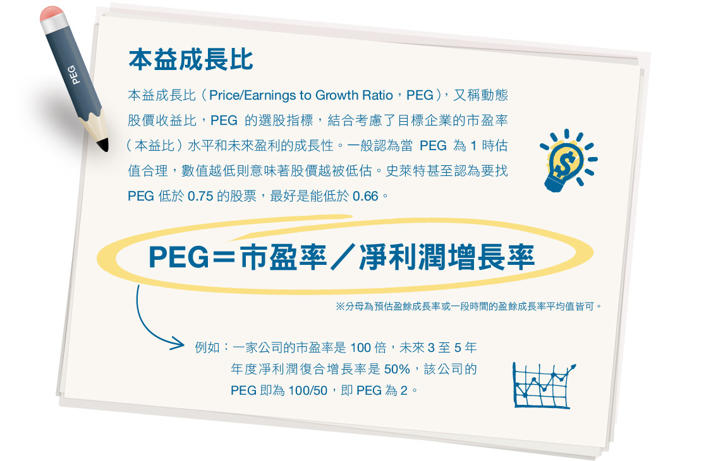

# 超越祖魯法則摘記

成長股大師費雪偏好長期集中持有能夠成長再成長的公司，也就是我們常聽到的成長類型股票！他最為人津津樂道的就是長抱了當時屬於成長股的摩托羅拉21年，大賺了20倍！而費雪所寫的[非常潛力股]一書被視為是投資成長股的經典著作！甚至連股神巴菲特都坦言受其投資思維影響！

無獨有偶，在英國也有成長股大師吉姆。史萊特在其1992年出版的經典著作[祖魯法則]一書中，對於成長股的選股原則多有著墨！

史萊特最成功的投資例子是他在1996年至1997年，投資Black Leisure公司，在17個月內股價由50英鎊上漲至549英鎊，獲利高達10倍，至1997年68歲時，已賺回比破產前還要多的財富。而也就在這令人驚奇的投資表現之後，這位成長股大師再度於1997年出版了新書：超越祖魯法則！

近期有國內出版社將這本1996年的投資經典著作翻譯成中文版，也讓台灣的投資人得以一窺這位英國的成長股大師選股的堂奧！以下有關於本書的一些精華語錄及投資原則摘引如下：

##散戶凌駕法人的三大優勢：

- 資金少，更方便投資小型企業！
- 頂多十支持股，法人要傷腦筋上百支！
- 能力圈易於派上用場！同道社群對散戶很好，可以提升本身投資知識，擴大懂的範圍。
- 正確選股加上複利效應，未來的資本利得將會十分可觀！
- 安全邊際可以建立在買進本益比相對於每股盈餘預測成長率要來得低的成長股！
- 時間盡量少花在研判整體盤勢，投資講求一板一眼，而且選股比擇時關鍵！
- 成長型企業每股盈餘成長幅度，具備年復一年高於大盤平均的能耐！
- 高度景氣連動的行業，不太可能成為好的成長型企業！
- 競爭優勢，像穩固的經營特許/專利/品牌…通常是成長型企業的主要特徵。
- 經營者的才幹是買進成長股的研判依據，但評判的難度很高，不妨從數據著手！
- 企業再現一項行為的能耐，像店面，餐廳，安養院，或室內球場的拓點，或在全國各地展店(及伺機跨足海外)，可帶來卓越的每股盈餘成長。
- 會發放股利的公司較受歡迎。股利擴大潛在的買主客群，同時彰顯董事對前景的信心。
- 多數散戶的持股理當納入十到十五支股票，口袋可觀的話增加為三十支左右。
- 別想著孤注一擲，依成本計算，15%是合理的投資上限。
- 若題材變了就賣股。
- 獲利續抱，賠錢停損。
- 要留下投資紀錄並定期對照大盤的績效。
- 投資人應當只拿沒有變現應急之虞的閒錢投資。
- 買在保險餘裕的價格然後長抱。
- 別盲目買進景氣循環股;應請教業界或懂相關產業的人士，盡量多吸收產業的基本資訊。
- 盡量挑現金部位亮眼或進步快速的企業。
- 董事集體買股向來是好現象。
- 各項因素都到位的個股，別怕出高價買入！

## 成長股擇股基準：

###必要條件：
本益成長比相對低，如低於0.75。 
前瞻本益比未達20;本益比區間宜落在10到20，預測成長率宜落在15到30%。 
每股現金流強勁，上次年報和五年平均雙雙勝過每股盈餘。 
現金結餘或槓桿不到50%(除非情況特殊，如每股現金流量破表或即將出售重要資產) 
一年的相對強弱高。 
占有競爭優勢，通常反映在高資本使用回報率和營業毛利率 
董事未集體賣股。 

### 高度誘人：
每股盈餘增長，源於自我複製活動尤佳！ 
董事集體買股。 
市值偏小，介於3000萬到2.5億英鎊之間(新台幣14億到116億元) 
股利收益 

###加分因子：
低股價營收比 
推陳出新 
低股價研發比 
合理的資產狀況 

## 名詞解釋：本益成長比

本益成長比（Price/Earnings to Growth Ratio，PEG），又稱動態股價收益比，最早是由英國投資大師吉姆·史萊特（Jim Slater）提出，經由美國證券投資家彼得·林奇（Peter Lynch）發揚彰顯，史萊特因而被稱為PEG選股法的創始人。PEG指標最先應用於英國證券市場，然當時英國證券市場的影響力較小，該指標並未引起國際間較大的關注。1992年，史萊特的著作《祖魯法則》（The Zule Principle）出版，始將PEG應用在投資和選股的方法推廣到美國。而後，在美國投資大師彼得·林奇的用心推廣下，終於獲得世人的看重，後人甚至將PEG方法的功績歸功於彼得·林奇。

PEG的選股指標，結合考慮了目標企業的市盈率（本益比）水平和未來盈利的成長性。一般認為當PEG為 1 時估值合理，數值越低則意味著股價越被低估。史萊特甚至認為要找PEG低於0.75的股票，最好是能低於0.66。

計算方法 
PEG＝市盈率／凈利潤增長率 
※分母為預估盈餘成長率或一段時間的盈餘成長率平均值皆可。 
例如：一家公司的市盈率是100倍，未來3至5年年度凈利潤復合增長率是 50%，該公司的PEG即為 100/50，即PEG為2。 

## 台股成長型公司列舉：

