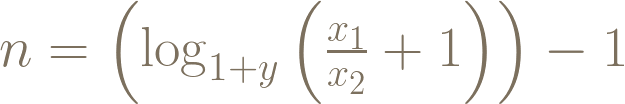

# 財務自由的計算公式

財務自由是很多人的夢想。根據維基百科的定義，財務自由是指你無需為生活開銷而為錢工作的狀態。簡單地說，當資產產生的被動收入至少要等於或超過日常開支時，就可以稱之為財務自由。達到財務自由後，我們就能較沒負擔的做自己想做的事，要繼續打拼事業或者是退休都可以。有許多人的生涯規劃都把財務自由跟退休畫上等號。財務自由跟退休對大部分人來說可能還遙不可及。我算出以下的等式，希望可以讓大家把這個目標量化：

- x_1 ：退休後每年所需生活費
- x_2 ：退休前每年可投資的金額
- y ：年報酬率
- n ：投資年數

要採用這個公式前，必須先決定x_1 及x_2 的數字。在估計以上兩個數字的時候，應該注意以下事項：

- x_1 ：宜高估不宜低估，如果退休後才發現入不敷出就麻煩了。還有要記得通貨膨脹對購買力的影響。
- x_2 ：應該只計算每年都能穩定獲得的資金，例如薪資收入。非經常性的一次性收入（例如賣屋收入等）不應該算在內。
-
決定了x_1 及x_2 的值之後，就只剩下報酬率跟年數這兩個變數。接下來就可以依照需求，把等式移項，就能設定其中一個變數的值，並求出另一個變數。以下是這個等式能處理的兩種情況及移項後的公式。大家請不要被這些公式嚇到，只要把數字代進去，按一按計算機就可以了！

### 問題一：想要在n年內退休，需要多少的年報酬率？

公式：

舉例

問題：預估退休後生活費一年50萬，現在每年可投資30萬。若希望20年內退休，需要多少的年報酬率？

計算：把數字代入上述公式

計算機按法：(500000/300000+1)^(1/(20+1))-1=

答案：4.78%

###問題二：每年可賺到y的報酬率，幾年後才可退休？

公式：

n=\left(\log_{1+y}\left(\frac{x_1}{x_2}+1\right)\right)-1

若計算機沒有log_a b 的功能，可以用換底公式log_a b = \frac{\log_c b}{\log_c a} ，就能用log_{10} 或ln 來計算。這裡需要注意的是，不要高估自己能獲得得報酬率（y ）。如果每年都穩定獲利就已經很不錯了。

###舉例

問題：預估退休後生活費一年80萬，現在每年可投資30萬。若每年可獲得6%（=0.06）的報酬，幾年後可退休？

計算：把數字代入上述公式

計算機按法：(ln(800000/300000+1)/ln(1+0.06))-1=

答案：22年

