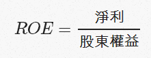
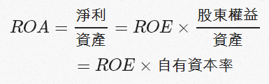
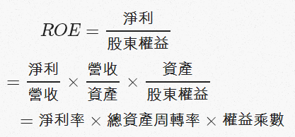

# 本益比、ROE及ROA的意義
基本分析是長期投資者最重要的分析方法。基本分析包含了許多種不同的比率。這次介紹其中三個很基本，也很重要的比率：本益比、ROE及ROA，還有三者之間的關係。

##介紹

###本益比（P/E Ratio）

本益比的意義是**現在的股價是公司一年獲利的幾倍**。本益比算是基本分析中最基本也是最常用的比率。對投資人來說，本益比也可以理解為「現在的股價買進的話，公司要幾年才能讓我回本」。本益比越低越好，因為低本益比代表可以更快回本。大家應該知道，要讓一個數字變小有兩個方法，讓分子變小或分母變大。所以本益比要低，就要股價低或者EPS高。簡單的說，**本益比是用來衡量公司便不便宜的工具**。順便一提，本益比的倒數，稱為收益率（收益率=EPS÷股價）。我認為收益率才是股東的報酬率。

補充：股東賺到的錢是EPS，不是股利。所以股東的報酬率是收益率，而不是股利殖利率。更多討論請看我其他的文章：**現金股利與股票股利的意義和以股東的心態投資股票**。

###股東權益報酬率（ROE）

ROE代表的是**公司用自有資本賺錢的能力**。這裡解釋一下甚麼是股東權益。首先大家要知道，公司實際持有的資產，其資金來源有兩個：股東出的錢（股東權益）及借來的錢（負債）。這就是會計恆等式：「資產=負債+股東權益」。一家公司如果用資產來還清負債，剩下的部分就是屬於股東的錢，叫做股東權益（股東權益=資產-負債）。ROE想要表達的意義是「公司用股東出的錢來賺取獲利的能力」。ROE越高越好，因為高ROE代表公司可以用同樣的股東權益賺到更多的錢。

要讓一個數字變大有兩個方法，讓分子變大和讓分母變小。所以ROE要高，就是淨利要高，還有股東權益要小。這裡就出現一個問題，就是股東權益變少竟然會讓ROE變高！股東權益少可以有兩種解釋，一是公司很小，二是公司不小但是資金都是借來的，所以股東出的錢很少。第一種情況沒有問題，但是第二種情況就有點詭異了。因為兩家規模一樣大，也一樣會賺錢的公司，借越多錢的公司ROE越高。

ROE高，合理的方式應該是增加獲利，而不是減少股東權益。但是我們單從高ROE無法得知公司到底是很會賺錢還是很會借錢。所以，我認為接下來介紹的ROA是個比ROE更適合的分析方法。

###資產報酬率（ROA）

ROA代表的是**公司用所有的資產賺錢的能力**。

上面提過，我認為ROA比ROE好。這是因為公司借錢會拉高ROE，而我不認為越會借錢得公司越好。ROA是用全部的資產去計算，就沒有這個問題。可能有人會說，適度得運用槓桿可以增加股東的收益，應該是好事。可是這個「適度」是多少實在很難定義，同時運用槓桿也會有利息費用或周轉風險等等的壞處。所以我認為用ROA來分析比較好，因為ROA不會把槓桿當作加分或扣分，只看公司能用資產賺多少錢。

另一個跟ROE不一樣的地方在於，提高ROA的兩個方法都是合理的，那就是提高獲利和減少資產。提高獲利當然是好事；而減少資產可以解釋為公司已經成熟及飽和，不需要過多的資金及資產來擴展，把多餘的資產退回給股東（減資或現金股利）也可以維持一樣的獲利。在這種情況，股東可以拿回一些資金用於其他投資，而且本來的公司賺的錢也沒有變少。對股東來說是好事。

總而言之，ROE和ROA都是用來衡量公司好不好的比率。

###杜邦分析（DuPont Analysis）

杜邦分析是一種把ROE分解成三個比率的方法。如上述公式，杜邦分析在ROE內加入了營收和資產這兩個數字，把ROE拆成淨利率、總資產周轉率及權益成數這三個比率。這個方法的確是非常巧妙，可是我人認為大家看看就好，不要過度依賴這個方法。因為重點還是在淨利跟股東權益這兩個參數。影響ROE的關鍵還是在淨利和股東權益，中間硬加進去營收跟資產這兩個數字的改變只會改變兩個相鄰的比率，最後並不會影響ROE的值。

舉例來說，如果公司的淨利跟股東權益都不便，只有營收上升，那ROE並不會改變。因為這時候總資產周轉率會上升，但淨利率會下降，兩者剛好抵銷。同理，只有營收減少也不會改變ROE。可能會有人想要反駁，說營收上升應該會讓淨利也上升，ROE也會升高。可是問題是我們不知道營收上升的同時淨利率會上升還是下降，所以重點還是在淨利，而不是營收。

ROA也可以用同樣的方法拆開成兩項。從上面的式子可以看出把ROE杜邦分析的權益乘數刪掉，就等於ROA。跟ROE一樣，中間硬塞進去的營收並不會影響ROA的值，所以重點還是淨利跟資產。

### 連結ROE與本益比

從以上的式子可以看出ROE跟本益比及淨值比的關係。剛剛有提過，股東權益越低的公司ROE越高。從上面的公式來看ROE也可以看到類似的結果。我們可以發現ROE跟本益比成反比，跟淨值比成正比。跟本益比成反比還算合理。可是跟淨值比成正比就很怪了。這表示在本益比一樣的情況下，淨值比越高的公司ROE也越高！所以ROE會傾向讓投資人選到高淨值比的公司，而高淨值比可不是一件好事。要注意的是，ROE跟股價一點關係也沒有。以上的公式跟這個方法跟杜邦分析一樣，都是在本來的公式中加入了新的參數。但是ROE在定義上是沒有「股價」這個元素的。

ROE跟股價並沒有關係，所以ROE並不能判斷公司便不便宜。同理，雖然我認為ROA比ROE好，但是ROA也一樣跟股價沒有關係。所以**投資人絕對不能把ROE或ROA當作唯一的買進依據，一定要搭配本益比等計算股價的比率才能知道公司便不便宜**。

最後再提醒大家，應該用收益率當作報酬率。有些人用把ROE當作股東的報酬率。我認為這只有在淨值比等於一的價位買進才合理。其他情況的持有成本不等於每股淨值，所以不能這樣算。ROE及ROA的功能是判斷公司賺錢得能力強不強，不能用於計算報酬率或衡量公司便不便宜。

###結論

- 本益比可判斷公司便不便宜，本益比越低公司越便宜
- ROE及ROA可判斷公司好不好，ROE/ROA越高公司越好
- 越會借錢的公司ROE越高，所以改用ROA比較好
- ROA及ROE沒有計算股價，所以不能當作買賣的唯一依據
- 收益率就是股東的報酬率
