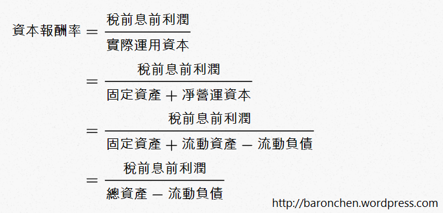
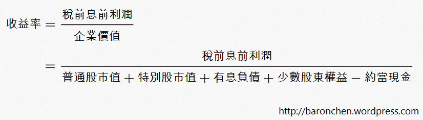

# 好書分享：《打敗大盤的獲利公式》

- 中文書名：《打敗大盤的獲利公式：五個月改變六十萬人的精準選股法》
- 原文書名：The Little Book That Beats the Market
- 作者：Joel Greenblatt
- 中文版ISBN：9789861247670
- 原文版ISBN：0471733067
- 原文版出版年份：2006

首先特別說明一下，本書的原文版年有2010年有出過一本增訂版，書名是The Little Book That Stills Beats the Market (ISBN: 9780470624159)，有多了一些新的內容。我閱讀的是中文版的跟原文的增訂版，都是學校圖書借的。以下摘要的章節與內容以原文增訂版為準。

我讀的那本中文版已經絕版多年。幸運的是，2015年10月有出了新的中文版喔！資訊如下：

- 書名：《超越大盤的獲利公式：葛林布萊特的神奇法則》
- ISBN：9789866320897

##內容摘要
###第一章
- 介紹企業價值的估計，作者用未來現金流來計算。
- 提出問題：價值1000元的企業，為甚麼有人要賣你500元？
- 如果你相信這本書的神奇公式(magic formula)，它就能幫你賺錢；如果不相信，它就無法幫你賺錢。

###第二章
- 存錢很重要。
- 存下來的錢有以下幾個處理(投資)方式：藏在枕頭下、存銀行、買債券。
- 定義無風險報酬率下限為6%：若美國10年期公債殖利率大於6%，則無風險報酬率等於公債殖利率；若殖利率小於6%，則無風險報酬率為6%。

###第三章
- 提出第四種投資方式：買股票。
- 股票的意義：可以分享公司一定比例的未來盈餘。
- 要計算付出的股價換來的未來盈餘划不划算。
- 介紹損益表、EPS、收益率(earning yield)。

###第四章
- 股價短時間內波動很大。但是價格不等於價值。股價每天都在波動，可是價值卻不會。
- 安全邊際(Margin of safety)的觀念：當你認為一檔股票的價值在10到12元之間，如果股價在11元，那你很難決定要不要買。不過你可以等到股價剩下6元，這時就很明顯可以買。
- 要有安全邊際的原因：因為計算股票價值(合理價)都是在估計，不是一定準的。
- 市場先生(Mr. Market)短期的情緒波動很大。

### 第五章
- 投資就是要買品質好、價格又便宜的公司。
- 定義品質好為資本報酬率(return on invested capital)高。
- 定義便宜為收益率(earning yield)高，也就是本益比(price-earning ratio, P/E)低。

###第六章
- 價值投資之父Benjamin Graham也有自己的投資公式，並且取得超過30年的優異報酬率。
- 他證明了簡單的投資策略也可以以低風險取得長期優異的報酬率。
- 提出magic formula，也就是用第五章的觀點，系統性地選出高資本報酬率且高收益率的公司。
- 具體方法是把美國最大的3500家上市公司，分別用去年的資本報酬率及收益率由高到低排名。把兩個排名相加，再排一次名。把資金平均買進最終排名前30的公司。每一年更新持股。
- 1988年至2004年這17年間，採用神奇公式的年化報酬率為30.8%；而同一時期美國S&P 500指數年化報酬率僅12.4%。

###第七章
- Magic formula是從很大型的公司中去篩選，所以一般投資人不會有無法買進的問題。
- Magic formula的成功不太可能是運氣。因為作者驗證過4500多組用神奇公式篩選出的投資組合，其報酬率都非常的令人滿意。
- Magic formula是用相對的方式來篩選公司，因此不管市場高低，都可以篩選出排名較前面的公司。

###第八章
- Magic formula過去的績效非常好。但是如果大家都知道了神奇公式並且也採用它，它還能保持這麼好的績效嗎？
- 雖然magic formula長期可以贏過大盤非常多，但是短期間卻因為市場先生的情緒波動而常常輸。因此大部份投資人就算知道神奇公式，也無法堅持使用。
- 你必須打從心底相信神奇公式可以幫你打敗大盤並賺大錢，才能夠堅持使用它，最後才能賺大錢。

### 第九章
- 要了解magic formula背後的原理，才會真正相信它。
- Magic formula的原理：系統性地篩選出品質在平均之上，且價格在平均之下的公司。
- 資本報酬率很重要的原因是：讓公司有機會把保留盈餘投資在報酬率很高的地方，這可能可以讓公司的獲利大幅成長。
- 資本報酬率很高的公司，很有可能有某方面的競爭優勢。(這部分的討論請參考我的其他文章：``護城河與質化分析(上)、護城河與質化分析(下))`

### 第十章
- 很多人就算不在行，也喜歡親自動手(包括投資)。用magic formula績效會很好，但是卻少了親自動手投資的樂趣。
- 就算要親自動手投資，也可以運用神奇公式背後的原理來幫助選股。
- 風險的定義：長期賠錢與長期報酬率輸給其他策略的可能性。
- 拿短期的績效來比較是沒有意義的。因為短期內光是運氣就可以決定一切，根本還看不出策略的優劣。作者認為最少要觀察5年才有意義，最好10或20年。
- 市場先生(Mr. Market)短期很情緒化，股價波動很大，可能會偏離價值很多；但是長期來看，股價終究會向價值靠攏。

### 第十一章
- 大部分人不適合主動投資(自行選股)。投資人完全搞不清楚狀況就自行選股，就好像是拿著點燃的火柴在炸藥工廠亂跑。就算僥倖沒死，依然是個白癡。
- Magic formula用去年的獲利來計算資本報酬率及收益率。但是自行選股應該要估計以後一般年度的獲利。如果沒有估計能力，就不應該自行選股。
- 如果有能力自行選股，不要貪心，選5到8家不同產業，且你可理解的好公司就夠了。
- 如果沒有估計獲利的能力，還是有折衷的辦法。那就是用magic formula算出前50或100名的公司，自己從其中選出10至30家來投資。

###第十二章
- 股市中沒有牙仙子會把錢放在你的枕頭下。沒有人會照顧你，一切都要靠自己。
- 股票營業員不知道怎麼幫你從投資賺錢，他們只知道怎麼讓你不斷交易，賺你的錢。
- 大部分基金經理人會輸給大盤。過去績效好的基金經理人不代表未來績效也會好。
- 指數型基金(被動基金，index fund)不錯，報酬率可以接近大盤。
- 建議投資人如果可以接受大盤報酬率，那就投資指數型基金。如果不滿足，那就自行選股，或者用magic formula。

###第十三章
- 鼓勵年輕人存錢及花時間研究投資的方法，以發揮複利的效果。
- 作者希望讀者如果靠投資賺大錢了，可以回饋給社會。

##附註
這部分者要是在解釋資本報酬率跟收益率的算法和意義：

####資本報酬率 (Return on invested capital, ROIC)

資本報酬率的意義是公司用資本賺錢的效率，所以資本報酬率越高表示公司越好。

####收益率 (Earning yield, EY)

資本報酬率的意義是衡量我們要買下公司所付出的錢，能夠賺到多少報酬，所以資本報酬率越高表示公司越好。

##閱讀心得
作者Joel Greenblatt是一位我非常尊敬的投資人。1985到2006這20年間，他投資的年化報酬率高達40%！這是高得非常誇張的成績，甚至比巴菲特都還要高上不少。我認為這是一本非常優秀的書。內容很充實，寫的也很直白很好懂，相信就算是初學者也能看得懂。英文版也寫得不難，沒有甚麼深澀的詞彙。作者的寫作風格很幽默詼諧，用一些很有意思的小故事，讓讀者可以輕鬆了解一些重要的觀念。整體來說讀起來非常輕鬆有趣，讓我有想要一章接著一章地看下去的感覺。又因為寫得不難，我幾個小時就能看完一遍。

我認為作者提出的magic formula是一個很棒的概念。Magic formula經過邏輯及實證的考驗，是非常成功的一個投資策略。Magic formula只需要參考兩個指標：資本報酬率與收益率。這是非常簡潔的一個公式。`其背後的精神是：「以便宜價買進好公司」`，這也正是價值投資的真理。我完全相信magic formula長期可以打敗大盤，當然在台股也適用。不過，magic formula看起來很容易，但是要實際去採用，卻沒有那們簡單。這是因為，雖然magic formula長期可以打敗大盤，但是在短期卻不一定。Magic formula甚至有可能連續一兩年都落後大盤，這時候投資人如股信心與信任不夠，就很容易放棄，也就沒有辦法享受到最後的果實。所以說，容易了解和容易做，是完全不同的概念(延伸閱讀：`投資一點都不簡單`)。

不過，我就是作者說的，喜歡自己動手的投資人。一部分原因是因為我還是學生，資金不足，所以很難把資金平均分散到30甚至50家公司。再來就是我也希望自己可以在主動投資的過程中，不斷提升自己的投資能力。所以這本書對我幫助最大的其實是第十到十二章。就像作者說的，就算要自行選股，magic formula背後的原理還是可以有很多幫助。就是剛剛提到的「以便宜價買進好公司」的概念。

作者也提醒我們，要有能力分析公司的價值，才有資格自行選股投資股票。大部分人都沒有這個能力，或者沒有去學習這項能力，所以根本不應該自行選股(關於指數基金與自行選股的討論，請參考：`關於效率市場假說`)。作者說：「完全搞不清楚狀況就自行選股，就好像是拿著點燃的火柴在炸藥工廠亂跑。就算僥倖沒死，依然是個白癡。」我覺得這句話很有意思，也讓我非常警惕。作者認為，`計算公司價值的具體方法就是估計一般年份(沒有特別好或特別壞的年份)的獲利，來算EY及ROIC`。這對我是非常認同的一個概念。我一直都在努力思考，怎麼估計企業未來的獲利比較合理。之前用的方法是五年平均減標準差，應該也算在估計公司未來的獲利，甚至比「一般年分」還要保守一點。希望以後我能想出更適合估計企業未來獲利的方法。

作者在介紹magic formula的時候不斷強調：`「要相信與了解，才會賺錢。」`我認為這個想法不只適用於magic formula；在我們主動投資時也適用。試想，如果我們對於自己投資的公司很了解，也相信它。那就算股價下跌了，我們也可以抱得很穩，甚至加碼買進以降低成本。反之，如果我們不了解也不相信我們的公司，那就可能會在下跌的時候忍不住，而賣在低點。不過，這個說法的前提是：我們必須要看對。所以，除了要了解與相信之外，我們也必須要加強我們基本分析的能力，並在等到夠便宜、有足夠安全邊際的價位才買進。

