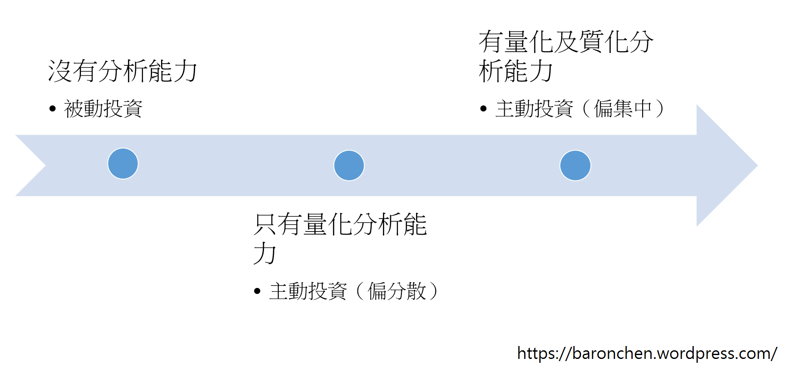

# 護城河與質化分析(上)

我從小就非常喜歡數字，有興趣的也都是數理科目。所以一直以來，我都是把投資的重心放在量化的部分，對於質化分析一直都是懵懵懂懂的狀態。最近看到越來越多人在討論質化分析，又想到巴菲特所說的護城河的概念也是屬於質化的範疇。才讓我決定要來加強質化分析這個部分。以下是我最近對質化分析進行的思考與心得。這篇文章沒有辦法告訴你進行質化分析的詳細步驟，只是提出一些思考的方向。

##基本觀念
巴菲特用經濟護城河(economic moat，簡稱護城河)一詞來稱呼一家公司的長期競爭優勢。城堡不管再怎麼漂亮華麗，如果沒有護城河的保護，就很容易被敵人攻佔。公司也是一樣。如果公司有很賺錢的業務，卻沒有護城河的保護，就很容易被競爭對手跟進分食利潤，而變得不好賺。相反的，如果公司有很寬廣的護城河的保護，競爭對手就算知道公司的業務很好賺，也無法模仿。所以公司可以維持很長一段時間的高獲利。

跟大多數學問一樣，投資也同時包含科學與藝術兩個面向。這兩個面向可以分別用量化與質化的方式來進行分析。量化分析(quantitative analysis)是指用各種數字與數學方法來分析一家公司的好壞。例如用財報數字、數學模型等等來計算公司的內在價值。這是投資比較客觀且比較偏科學的部分。質化分析(qualitative analysis)則是著重於用一些較難量化的資訊來分析公司。像是今天要討論的護城河。這些則是屬於比較主觀且偏藝術的部分。簡單的說，我認為量化分析是在分析基本面，判斷一家公司過去及現在好不好(價值多少)；而質化分析則是去嘗試去了解公司的護城河，探討是甚麼原因讓這家公司這麼好(為甚麼會有這些價值)，以及思考公司在未來有沒有能力維持現在的優勢。

我對於量化分析與質化分析的態度是：`量化分析是基本題；而質化分析是加分題`。也就是說，我認為要有量化分析的基礎，質化分析才有意義。如果同時具備量化分析與質化分析的能力，應該可以得到最好的成績。只會量化分析，也可以達到不錯的報酬率。但是如果沒有量化分析的能力，只會質化分析的意義並不大。所以我建議先把量化分析的基礎打穩，再來學習更進階的質化分析，勿本末倒置。這是因為，經過基本分析的好公司才有進行質化分析的必要性。

##投資策略
我認為投資人適合的投資策略，跟量化分析與質化分析的能力有很大的關係。並不是說沒有分析能力的人就不應該投資，而是應該根據自己的分析能力，採取最適合的投資策略。我認為基本的方向是越有分析能力的投資人，就可以越集中投資(這方面的討論請參考：分散持股及集中持股的優缺點)。

如上圖所示，對於不具有分析能力的投資人來說，最好的策略應該是被動投資，也就是買進指數型基金，以獲得大盤報酬率(相關論點請參考：`關於效率市場假說`)。投資人如果具有分析的能力，就有資格可以進行主動投資，也就是自行選股。只會量化分析的投資人，雖然可以主動投資，但是不應該太集中持股。這是因為，雖然用量化分析篩選出來的都是好公司，但是量化分析不會告訴我們哪些在未來還會是好公司。所以這類投資人應該要稍微分散一點，讓公司未來好壞互相抵銷，平均起來績效應該還是有機會打敗大盤。這類做法可以參考Joel Greenblatt在《打敗大盤的獲利公式》(原文：The Little Book That Beats the Market；可參考我的閱讀心得)中提到的Magic Formula策略。惟有同時具有量化與質化分析能力的投資人，才適合採取像巴菲特這類的集中投資策略。

接下來我會介紹我對於質化分析的初步分析方法。我必須承認，雖然我現在是想要加強質化分析，但是我還是有把質化分析量化的傾向。不過我相信我只是用量化的方式把思考護城河的過程，拆成幾個比較清楚的面向，讓我們比較容易去一項一項思考。這樣做應該比直接思考整個公司在哪裡有護城河，要容易一些。當然，我並不是要把護城河用完全量化的方法來分析。有些東西在本質上就是質化的，硬要量化實在沒有意義。至於量化分析，建議大家看看我的其他文章：我的投資流程(上)和我的投資流程(下)。

##護城河與ROA

在Pat Dorsey的著作《尋找投資護城河》(原文：The Little Book That Builds Wealth)中，作者把護城河定義為「長時間維持高資本報酬率的能力」。這是因為護城河就是公司的某種競爭優勢。那這個優勢是用來幹嘛的呢？當然是為了賺錢。也就是說，有護城河的公司，就可以用資產在未來創造更多的獲利。書中也提到三種衡量公司資本報酬率的方法，分別是ROA、ROE、ROIC。ROA跟ROE之間我選擇的是ROA，主要是因為ROE有越會借錢的公司ROE越高的傾向。(更多關於ROA與ROE的討論請參閱：`本益比、ROE及ROA的意義`)至於ROIC比較複雜，我也還不是很了解，所以先不討論，等我以後有機會了解後再跟大家分享。

基於以上的原因，我選擇用ROA來當作護城河的代理，也就是把`護城河定義為長時間維持高ROA的能力`。這個說法固然有些過度簡化，不過卻是我們去了解及分析護城河的一個不錯的開始。根據這個定義，有護城河的公司都有長期高ROA。但是長期高ROA的公司不一定有護城河。也就是說，過去一段時間有高ROA的公司，並不保證在未來也可以維持高ROA。那過去沒有高ROA的公司，有沒有可能發展出護城河並在未來長期維持高ROA呢？當然有可能，但是我認為要判斷這個的難度與不確定性都太高，我可不敢指望靠這個來賺錢。所以我還是會先找出長期高ROA的公司，再嘗試找出它的護城河。

如果我們在這些長期高ROA的公司中找不到護城河，那我們就不應該投資這間公司，或者至少不能集中投資。這是因為，這種情況有兩種可能：

- 公司沒有護城河，過去的高ROA未必能延續
- 公司有護城河，但是我們看不懂

如果是第一種可能，沒有護城河的公司我們當然不考慮。至於第二種可能，既然我們找不出公司的護城河，當然更沒有能力去分析公司未來的狀況。所以我們不應該投資。巴菲特說過，他在挑選公司的時候都會想像桌上擺著三個籃子，分別寫著「好」、「壞」、「太難」。而有很大一部分的公司會被他丟到「太難」的籃子裡，直接略過。巴菲特只專注在他看的懂的公司裡面尋找投資機會。至於那些「太難」的公司，因為不在自己的能力範圍內，所以就算因為略過而錯失賺錢的機會，也不必覺得可惜。這就是巴菲特所說的能力圈的概念。

