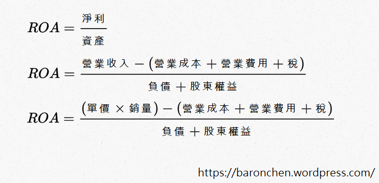

# 護城河與質化分析(下)

分析ROA的方法
希望講到這裡，大家可以接受用長期維持高ROA的能力來代表護城河。接下來我會介紹我分析ROA的方法。這個方法是我自己想出來的。不過其實原理跟一般常用的杜邦分析類似，都是把一個比率拆開成多項來分析。只是我拆的方式比較不一樣。關於杜邦分析的討論可參考下文及本益比、ROE及ROA的意義。在這之前我必須先提醒各位，這個分析方法的重點不是告訴你有沒有護城河，而是嘗試分析該公司的護城河在哪裡。所以，這個分析方法的前置條件是公司必須有長期高ROA。如果用來分析過去ROA紀錄不佳的公司，意義就不大。

具體的方法如下圖：

從上面的公式可以看到，我是用數學與會計的方式把ROA拆成七個項目。我們可以把這七個項目歸類成三群，這樣會比較好理解：

- 單價、銷量：用來計算營收，營收越高越好
- 營業成本、營業費用、稅：用來算淨利率，淨利率越高越好
- 負債、股東權益：用來計算資產，資產越少越好

簡單的說，`單價與銷量這兩項是越高越好；而營業成本、營業費用、稅、負債、股東權益這五項則是越低越好`。接著，我們就可以一項一項去思考。思考如果這家公司其他六項都跟同業相仿，那他的這一項有沒有比同業好。如果有比同業好，那就要試著找出是甚麼原因讓他比同業好、有沒有能力維持該優勢。如果現在沒有比同業好，就思考未來有沒有潛力可以變好、機率有多高。要注意的是，未來變數太多，有可能變好不代表一定會變好。所以，未來可能會有的優勢，遠遠比不上現在已經有的優勢。另外，一家公司可以在不只在一項上面有優勢。不過，並不是越多項有優勢，護城河就越大。重點應該是要思考，在他有優勢的項目上，優勢到底有多大。

接下來簡單說明公司在每一項可能的優勢和意義：

- 單價：賣得比別人貴，顧客還是願意買。
- 銷量：價格相仿，但是就是賣得比別人好。
- 營業成本：生產同樣的產品，但是成本比別人低
- 營業費用：所需的費用比同業低。費用可以進一步分為研發費用、推銷費用及管理費用。
- 稅：我自認沒有能力分析這一項，因為稅可能隨著政策改變。所以我直接略過，不嘗試在這裡找護城河。
- 負債：錢借得比同業少，還是可以經營。
- 股東權益：不用保留太多盈餘，可以都發回給股東，還是可以經營。

如果大家自認有某些項目看不懂，大可直接略過，去看下一項。不用強迫每一項都一定要分析。像我就自認沒有能力分析稅的部分。如果七項看完了並沒有找到護城河，那也沒關係，再找下一檔吧！`承認自己不懂而放棄可能獲利的機會，總好過不懂裝懂而造成虧損`。這就是上面有提到的能力圈的道理。另外，我們當然也可以把這七項繼續拆成更細的會計項目。要拆的多細就看個人的能力與需求而定。對我現階段來說，拆到這七項就夠了。

##與杜邦分析的比較

在我另一篇文章(本益比、ROE及ROA的意義)中有介紹過杜邦分析。關於杜邦分析，我最有疑慮地方在於它是把一個比率拆成幾個比率的連續乘積，比率的分母會為下一個比率的分子。因此除了頭尾兩個值之外，其他中間的值只要變動就會同時影響左右兩個比率，一個變高，一個變低。因此乘起來ROA並不會變。至於杜邦分析的這個特性是不是缺點，我相信是因人而異。不過我的方法就沒有這個特性。

我認為不論是我的這個分析法，或是一般常用的杜邦分析，都不是提出一個理論或定理，而只是嘗試去用一些方法來描述、了解一家公司的狀況。因此沒有絕對的對錯，也沒有誰好誰壞的問題。我無意貶低杜邦分析，也不是說我的方法比杜邦分析好。只是對我來說，這個方法我用的比較安心，也比較順手。只能說`適合的才是最好的`吧！

## 結論
- 量化分析是基本題；而質化分析是加分題
- 越有分析能力的投資人，就可以越集中投資
- 護城河定義是長時間維持高ROA的能力
- 我的分析方法是把ROA拆成七項：單價、銷量、營業成本、營業費用、稅、負債、股東權益
- 這個方法重點不是告訴你有沒有護城河，而是嘗試分析公司的護城河在哪
- 單價、銷量越高越好；而營業成本、營業費用、稅、負債、股東權益這五項則是越低越好
- 承認自己不懂而放棄可能獲利的機會，總好過不懂裝懂而造成虧損
- 適合自己的方法才是最好的方法
