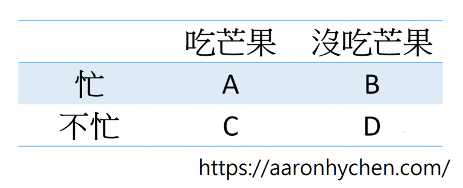

# 論投資中的歸納與演繹

邏輯是非常重要的。不論是在投資、生活、還是其他各個方面，我們都不斷地在做邏輯推理(logical reasoning)。可能是有意識或者無意識的。這篇文章整理了我對於邏輯推理的想法，以及介紹我如何在投資中運用邏輯推理。今天的內容包含邏輯推理的簡介、常見的錯誤及應對方式，可能會稍微複雜一點。我會盡量避開數學的部分，只從邏輯上分析，讓大家比較容易理解。

##邏輯推理
歸納(Inductive reasoning)與演繹(deductive reasoning)是邏輯上常用的推理方式。歸納是從觀察到的現象去做出猜測；而演繹則是由邏輯及因果關係上去做出結論。舉例來說：

- 歸納：我們觀察到一隻本來不是紅色的蝦子，煮了之後變紅了。於是做出「蝦子被煮後會變紅」的結論。
- 演繹：我們已知飲料加糖會變甜，現在往一杯不甜的黑咖啡裡加糖。我們可以推理出「這杯黑咖啡加糖後會變甜」。

`在我們掌握的事實與推理過程都正確的情況下，演繹是必然正確的；但是歸納則不必然正確。`這是非常非常重要的基本觀念。用以上的例子來看，我們根據觀察而歸納出「蝦子拿來煮會變紅」的結論，並不一定是對的。因為在邏輯上(不是常識上)，有可能只有我們觀察到的那一隻蝦子煮後會變紅，其他蝦子不一定會。相反的，只要「飲料加糖會變甜」這個規則是對的，且黑咖啡屬於飲料的一種，那我們就可以保證這杯黑咖啡加糖後會一定會變甜。

塔雷伯(Nassim Nicholas Taleb)在《黑天鵝效應》中提過一個關於歸納的例子：「有一隻火雞，每天都有人餵給牠食物。隨著人類餵食給牠的次數越多，牠越來越有把握地做出『這是個友善的人類，他每天都會來餵我』的結論。直到牠被宰來吃的那一天。」

上面說過，演繹的結果一定正確，但這有一個前提。那就是我們掌握的事實與演繹的過程都必須是正確的。以上面演繹的例子來看，我們也必須思考「飲料加糖會變甜」的這個規則，本身是經由歸納還是演繹得出的。不過，我對於演繹而來的知識的信心，還是遠遠高於歸納而來的知識。

## 平庸世界與極端世界

塔雷伯在《黑天鵝效應》中把各種領域，依照其隨機性分為兩類：平庸世界與極端世界。所謂平庸世界是指當你的樣本很大時，沒有任何單一個案可以顯著改變整體或全部。而在極端世界，單一觀察點就能不成比例地影響整體或全部。舉例來說，如果我們隨機找來一百個人，測量他們的身高，然後計算平均值。接著我們把全世界最高的人的身高加進去，會發現平均值並沒有很大的改變。接著再想像把身高換成財富。全世界最有錢的人的財富可能比那一百人的財富總和還要多非常非常多倍。所以說，身高是屬於平庸世界；而財富則屬於極端世界。

區分這兩種隨機性的重要性是在於：`在平庸世界可以放心地用歸納來做出結論；在極端世界則不行`。以上面的例子來看，如果我們想知道台灣成年男性的平均身高，我們可以隨機找來一百位成年男性，測量他們的身高並計算平均值，就可以很有把握地說這個結果跟全台灣成年男性的平均身高很接近。可是換成財富，我們就不能這麼做了。萬一這一百個人中包含了大富豪，那我們算出來的平均值就沒有意義了。

塔雷伯認為(我也同意)投資屬於極端世界。因此，我們在投資中使用歸納的時候要非常小心謹慎。

##投資中的歸納與演繹
投資的各種理論或策略等等，可以是從歸納或者演繹而來。我認為可以依照思考方式，把投資人的風格分成三類：

- 盲從式：毫無邏輯推理，只是人云亦云
- 歸納式：喜歡舉很多案例來導出或支持其投資方法
- 演繹式：盡量從原理上去導出投資方法

舉一個例子來跟大家說明這三種不同的風格。相信大部分投資人都同意ROA(或ROE)高的公司比ROA低的好。雖然這三種風格的投資人都得出「ROA高的公司比較好」的結論，但是他們都是經過不同的方式得出的。盲從式的投資人是根據「大家都說要找ROA高的公司」而得出這個結論。歸納式投資人的理由是「觀察到很多ROA高的公司之後的報酬率都很好」。而演繹式投資人則是思考ROA真正的意義，然後從邏輯上推理出「ROA高的公司比較好」的結論。(推理出高ROA比較好的過程可參考：ROA的意義與公司的成長性)

我個人認為，`演繹式的投資是最好的；歸納式的投資稍差一點；盲從式的甚至根本就稱不上是投資了`。所以，我們在運用各種指標、公式、模型等等工具時，應該關注的是這些工具背後的原理，而不是只用舉例來支持。至於人云亦云、完全不自己思考，就更不可取了。

當然，有很多投資策略及理論在一開始都是受到某些歸納而來的想法的啟發。這無可厚非，但我認為這些想法必須經過演繹去確認其合理性。換句話說，我認為在投資中，純粹的經驗論(empiricism)是很不好的。過去的經驗，對於未來的方向或許有一定的幫助。但是，你不知道它會不會失靈，或者甚麼時候會失靈。

回測(backtesting)及資料探勘(data mining)是投資界很常用的歸納。塔雷伯在《隨機騙局》中批評過這兩者。他說：「在隨機的數據中總是找得到一些『型態』。我相信一定存在一檔西方世界的股票的走勢，跟蒙古烏蘭巴托的氣溫走勢有100%的相關性。」我們應該思考，這真的有意義嗎？

正是因為以上的原因，大家可以發現，我很少舉個股的例子來支持我的投資方法(我舉例通常是為了更清楚地表達我的想法)。我更喜歡先了解策略背後的原理，並用演繹去檢視這個策略是不是合理的。支持一個投資策略的，不是過去成功的例子；而是它有一個合理、說得通的邏輯。你無法光用舉例來證明你的策略有效。

我們不能從「過去這樣的股票會漲」，來推斷「所有未來這樣的股票也會漲」。就如同我們不能因為過去看到的天鵝都是白色的，就斷定所有天鵝都是白色的。

##我們只看到我們想看的
上面有提到，即使是正確地使用歸納，都不能保證一定正確了。更何況我們經常連歸納都用錯。查理．蒙格(Charlie Munger)說過：「對於一個拿著鐵鎚的人來說，所有東西看起來都像釘子。」簡單地說，我們只看到我們想看的。人類的這個傾向，很可能會導致我們在看這個世界的時候產生非常多的偏誤(bias)。至於甚麼是我們想看的呢？比較常見的有「能建立起因果關係的」及「符合我們想法、刻板印象(stereotype)或偏見的」。以下舉兩個例子做說明。

###芒果
我們在醫院上班的，大多都聽過「吃芒果會很忙」(芒與忙諧音)的說法。大家只要想想，都不難了解這是沒有科學根據的。醫護人員們大部分也知道這是迷信，只是以開玩笑的態度來說這個。不過偶爾有人犯戒的時候，大家還是會覺得：「真的好準啊！」

要怎麼客觀地來討論這個問題呢？我覺得一個不錯的方法是，把兩個變數的所有組合用表格畫出來：

相信吃芒果會變忙的人，大部分只看到A(吃芒果、很忙)，也有一些人同時看到A跟D(沒吃芒果、不忙)。至於B(沒吃芒果、很忙)跟C(吃芒果、不忙)，則比較少人有想到。這是因為上面說的，我們只看得見我們想看的。在這個例子，我們想看的是「有因果關係的」一個故事。

試想，如果有人跟我們說，或者我們自己遇到A的經驗，我們會很有印象，因為這是一個可以建立起因果關係的故事。當我們有了A的印象後，D也就成了支持我們A的說法的一種「證據」。相對的，如果有人跟我們說「我昨天吃了芒果，沒有很忙」。這個對我們來說非常無聊，不像A一樣可以變成一個有因果關係的故事。所以很容易被忽略。

如果我們同時看A、B、C、D，就會明白其實這四種可能性都有。至於A、D的可能性有沒有高於B、C？這個就不是我們可以隨便斷言的；而是必須要用統計學的方法去計算。下一段會稍微提到統計學的部分。

###胖子
第二個例子是有關「胖子比較會流汗」的說法。我相信社會上多少都有一些「胖子比較會流汗」的刻板印象。現在，我們一樣把這個問題用表格來展開：

或許是因為這種刻板印象的存在，所以我們比較容易記得A、D的狀況。而B、C則自動被我們忽略。至於胖子是不是真的比較會流汗？我不知道。我沒有說「胖子很會流汗」這個說法是錯的。或許對，或許錯。我要說的是，我們不能夠單從觀察到A、D，就做出這個結論。我們要同時觀察A、B、C、D，並用統計方法去分析，才能知道這兩者是否真的有相關性。

以上只是最簡單的兩個變數的情況，實際上常常會遇到有更多變數的問題。這時候情況就更複雜了，也難怪我們的思考這麼容易出現偏誤。所以說，我們應該要`從客觀、全面的角度去看事情，以降低這些偏誤對我們的影響`。

## 正確地使用歸納

如果要正確地使用歸納，`我們應該要用統計學的方法，去計算是否真的有相關性`。例如上述「吃芒果會不會忙」和「胖子是不是比較會流汗」這兩個題目，就可以用皮爾森卡方檢定(Pearson’s chi-squared test)來分析。`但即使統計檢定的結果顯示兩者確實有相關性，我們還是不能夠從「有相關性」跳到「有因果關係」`。

就算我們得出「肥胖與流汗有相關性」的結論，也不代表我們就能直接跳到「胖會導致一個人很會流汗」這個結論。「胖子比較會流汗」跟「肥胖會導致人流更多汗」，是兩個不同的概念。這是因為，在邏輯上我們只知道這兩者有相關性。但是除了「肥胖會導致人流更多汗」這個可能性以外，也有可能是「流很多汗會導致一個人變胖」。甚至可能是有第三個我們所不知道的因素，例如存在某種疾病，會「同時導致一個人又胖又很會流汗」。

如果想要研究因果關係，就應該去做縱向研究(longitudinal study)。例如用世代研究(cohort study)或甚至是隨機對照試驗(randomized control trial, RCT)去分析。

其實，推論性統計(inferential statistics)所說的「有相關性」或者「有因果關係」，意思是「有很高的機率有相關性」及「有很高的機率有因果關係」。並不是保證「一定」。本文一開始就提過，這是歸納在邏輯上本來就存在的缺陷。當然，在平庸世界裡用統計來歸納，還是很安全的；但是在極端世界可就不能這樣了。

在某些領域，用統計來歸納出的結果或許非常有意義，但是在投資中就比較麻煩了。就算確定了因果關係，`我們在投資中還是不能夠從「過去有因果關係」去推論「未來也會有因果關係」`。這是因為我們的模型可能有非常多的變數是沒有考慮到的。因此，如果有某些我們沒控制到的變數改變了，就可能導致過去的因果關係在未來消失。另外，上面有說過投資是屬於極端世界的。極端世界裡有黑天鵝，也就是說，只要一個極端值就足以摧毀我們。

##我的建議
我們在投資中，難免還是會用到歸納，甚至大部分時間都還是得使用歸納。有些領域，尤其是經濟、社會這類比較沒有標準答案的學科，是不可能完全用演繹來推理的(其實連物理學也會用歸納，例如庫倫定律等等)。

我認為，我們在推理並做出結論的時候，首先要有意識地了解自己究竟是在演繹還是在歸納。接著，在合理及能力可及的程度下，盡量多用演繹。必須使用歸納時，要正確及謹慎地使用。具體來說就是，嘗試去看事情的全貌，並用合理的統計方式去分析。分析出的結論要用演繹去檢查是否合理。最後，隨時記得歸納不是一定正確的，並做好歸納出的結論出錯的準備。

要養成正確的邏輯推理的習慣，最好的方法就是多練習。大家可以參考我的其他文章，來看看我是怎麼樣在投資中運用演繹的：所有文章。

以上有關邏輯推理的介紹與建議，除了在投資以外，我相信對學術研究、生活、思考等等各方面，都是適用的。希望對大家有幫助！

##結論
- 在我們掌握的事實與推理過程都正確的情況下，演繹是必然正確的；但是歸納則不必然正確。
- 在平庸世界可以放心地用歸納來做出結論；在極端世界則不行。
- 演繹式投資最好；歸納式投資稍差；至於盲從的，根本稱不上是投資。
- 我們應該要從客觀、全面的角度去看事情，以降低這些偏誤對我們的影響。
- 應該用統計學去計算是否有相關。但是，有相關不代表就有因果關係。甚至在投資中，過去有因- 果關係也不保證未來還會有因果關係。
