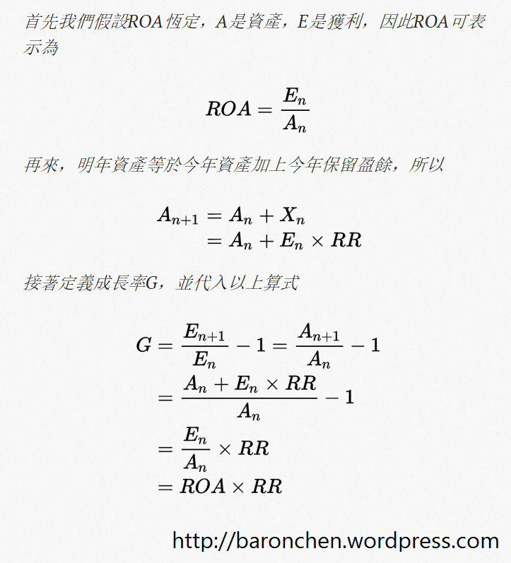
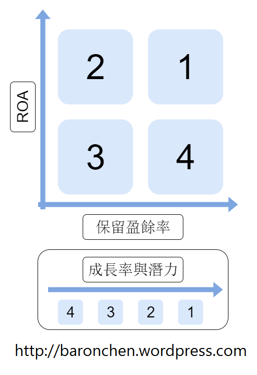

# ROA的意義與公司的成長性

一直以來，我都比較少去評估公司的成長。主要是因為我沒有找到合適的方法估計成長率。我嘗試過營收年增率、淨利年增率等方法，但是都因為覺得太高估，用得不放心，所以放棄。今天我會先討論ROA對投資人的意義，然後再介紹一種以ROA與股利政策來估計公司成長的方法。

##ROA高真的有意義嗎？

我之前的投資方法，是用ROA和其他一些比率來判斷公司好壞；再用本益比來判斷公司便不便宜。(我喜歡用ROA，而不是ROE，原因請看：`本益比、ROE及ROA的意義和護城河與質化分析)`有一天，我突然想到一個問題：「ROA真的有意義嗎？」如果兩家公司的本益比一樣，那ROA高的為甚麼比ROA低的好呢？有人說ROA高的公司比較穩定、對於資本市場比較有效率等等。但都這些都無法說服我。ROA比較偏獲利能力，跟安全性關係不大。而「資本市場比較有效率」這個說法乍看之下好像很有道理，可是仔細想，對資本市場有效率，然後呢？對股東具體的好處是甚麼？甚至於還有看到有些人直接把ROA或ROE當作股東的報酬率，這是我無法接受的。

這個問題想了很久都沒有想通。之後又讀了一遍《`打敗大盤的獲利公式`》，才看到「高資本報酬率的公司可以藉由保留盈餘，把錢留在公司以賺取很高的報酬率」這段。簡單的說，ROA的意義就是可以提供公司成長的潛力。我才想起以前有看過這段，而且在巴菲特相關的書中也有看過這個觀念，只是忘記了。

##ROA與成長率的關係

ROA與成長率的關係可以表示為：G = ROA × RR。G是成長率；RR是保留盈餘率，英文稱為retention ratio、plowback ratio等等，我簡稱之為RR。(保留盈餘率 = 1 – 現金股利 / EPS = 1 – 現金發放率)。以下為計算過程，沒興趣的話可以跳過。

另外，像一開始提到的，如果投資人比較喜歡ROE或者ROIC，也可以用來取代ROA，套進這個公式計算成長率。不過我個人還是喜歡用ROA就是了。

##成長率四象限分析
回顧一下公式：G = ROA × RR，可以發現影響公司成長率的有ROA和RR兩個因子。兩個都是越高越好，又因為「RR = 1 – 現金發放率」，所以現金發放率越低，公司的成長可能越高。(`再論現金股利與股票股利`)接下來我們`把ROA跟RR這兩個變數做成一個坐標系，畫出一個四象限`。其中X軸是RR；Y軸是ROA。

ROA高低的界限或許可以用無風險報酬率；而RR則可能要與其他公司互相比較。現在來簡單介紹四個象限：

- 第一象限(ROA高、RR高)：好，高成長性，保留盈餘可以充分投資
- 第二象限(ROA高、RR低)：普通，低成長，但是如果公司決定保留盈餘，則有成長潛力
- 第三象限(ROA低、RR低)：普通，低成長，也無成長潛力
- 第四象限(ROA低、RR高)：差，低成長，還浪費股東的錢

上圖有提到，`第一象限的公司最好，第二象限次之，第三象限再次之，第四象限最爛`。現在我們來分別解釋四個象限的公司的特性，還有為甚麼我會做出這樣的排序。

第一象限的成長性是最高的。有些投資人會希望無論公司ROA高或低，都要把獲利以現金股利配回。不過我認為對於ROA高的公司，把錢留在公司繼續投資對股東才是比較好的策略。舉例來說，如果一家公司的ROA維持在25%，那我們可預期公司的保留盈餘也有25%的報酬率。如果這家公司把獲利都發回給股東，股東要自行投資獲得25%的報酬率可不容易。

高ROA的公司，如果把獲利都配回給股東，就是第二象限的公司。這些公司因為保留盈餘不多，高ROA無法發揮效果，所以成長率會偏低。這雖然是有點浪費公司的高ROA，但是考慮到如果以後公司改變股利政策，公司可能還是有成長的潛力。另外，如果公司的生意規模可能無法繼續做大，那把獲利配回給股東也是合理的。

第三象限的公司是低ROA，且把獲利都配回給股東的公司。這些的公司跟第二象限的公司一樣成長率都不高，而且因為他的ROA低，所以也不太有成長潛力。所以，我認為這些公司沒有第一、第二象限的公司那麼優秀。不過，這些公司清楚自己的ROA低，沒有資格保留盈餘，而把獲利大部分配回給股東。所以如果有機會以非常便宜的價格買進這些公司，獲得頗高的現金殖利率的話，我覺得也是可以接受的一個選擇。

按照公式來看，第四象限的成長率可能比第三象限高。但如果ROA低於無風險報酬率，或者投資人一般可以得到的報酬率，那這些保留盈餘對投資人來說反而是不划算的。因為如果他發回現金股利，我們自己投資可以賺得比公司ROA更高的報酬率。我覺得這種公司比較沒有自知之明，或者沒有站在股東的立場經營。所以第四象限的公司是最差的公司。原則上我是不會碰的。

## 這個算法的侷限

雖然說這個估計公司成長率的方法很簡單，也很好用。不過，它還是有一些限制。問題出在這個公式的基本假設：ROA跟RR永遠維持不變。這是為了方便我們計算，但是並不太符合現實。先看看ROA的狀況。公司的ROA隨著時間可能會上升、持平或下降。如果是上升或持平還沒關係。如果公司的ROA持續下降，那公式就高估了他的成長率，可能會使我們買的太貴。所以，我們需要關察公司有沒有護城河。(更多關於護城河的討論：`護城河與質化分析`)夠寬的護城河才能保護公司的業務，以維持公司的高ROA。另外，我們也要考慮公司的生意有沒有辦法做得更大。如果說公司的生意已經飽和了，那就算有強大的護城河可以維持高ROA，也沒有辦法藉由保留盈餘來創造更多的報酬。

這個公式也假設公司的股利政策(RR)維持不變。事實上，公司很有可能會隨著公司經營的狀況及未來展望等等的因素，來調整股利政策。因此，這個公式只是給予公司成長率一個參考的數值，並不是告訴你公司未來必然會有這樣的成長率。`我們要主宰公式；不要讓公式主宰我們`。我們要加上用自己的判斷，才可以對公司的成長性及內在價值做出最好的估計。而既然是估計，難免有錯誤的可能，所以我們也應該要預留足夠大的安全邊際。最後，對我來說價值遠比成長重要。因為成長代表的是未來可能實現的價值。但是未來充滿變數，所以現在已經有的價值，勝過未來可能的成長。

## 結論
- ROA的意義：提供公司成長的潛力。
- G = ROA × RR
- 把ROA跟RR做成一個坐標系：第一象限的公司最好，第二象限次之，第三象限再次之，第四象限最爛。
- 我們要主宰公式；不要讓公式主宰我們。
- 
