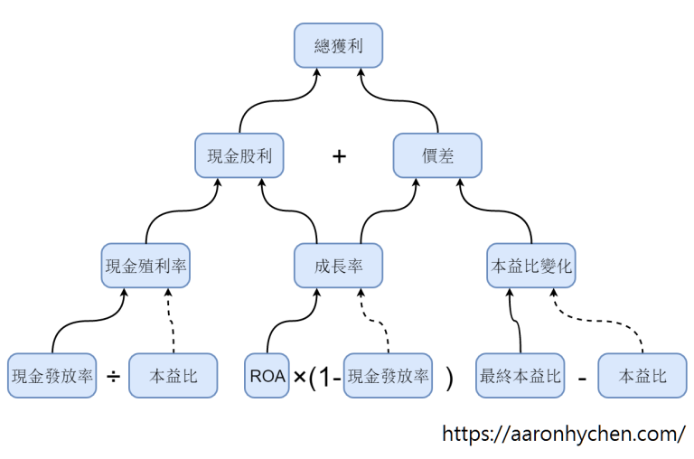
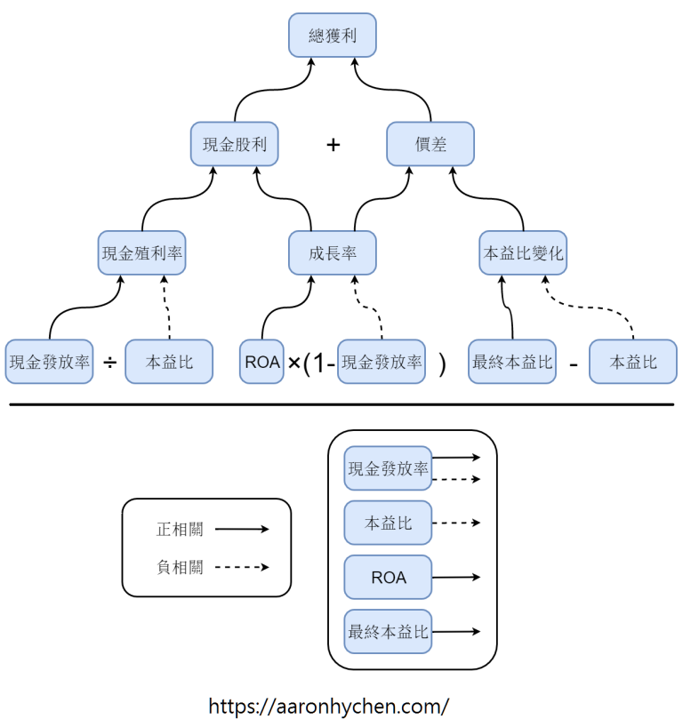
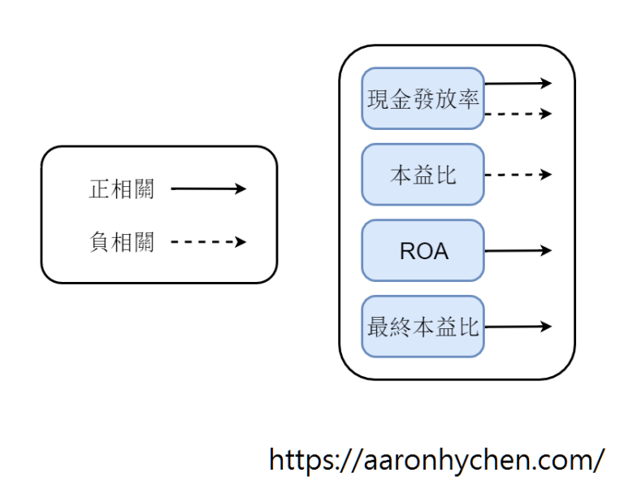

# 演繹分析：使股票報酬率最大化的因素

在股票的基本分析中，有非常多的指標或比率供我們參考。我一直都希望可以用演繹的方式，分析哪些因素是最直接與投資股票的報酬率有相關性的。這個問題我花了非常長的時間思考，終於有點心得，在此跟大家分享。希望我們可以藉此來使投資報酬率最大化。除此之外，這是一個大量運用演繹（而不是歸納）的推理方式的思考過程（參考：論投資中的歸納與演繹）。希望大家也能從本文觀察到在投資中使用演繹的方法。

前言
要瞭解如何使投資報酬率最大化，我們要先分析投資股票的獲利來源。早在研究高登成長模型（Gordon Growth Model，GGM）及其他股票評價模型的時候， 我就常思考：「我們投資股票的報酬率是甚麼？」很多人說現金殖利率就是報酬率；有些人說ROE等於報酬率；我曾經認為earning yield是報酬率是（詳見：本益比、ROE及ROA的意義）；GGM也表示它就是報酬率。眾說紛紜，到底哪個才是報酬率呢？

於是，我開始分解投資的獲利來源。先請各位看我做的這張圖：

基本上這張圖就包含了本文大部分的結論。不過除了結論，我認為本文更有價值的是導出這個結論的整個推理過程。接下來我將會一層一層詳細地介紹這張圖的意義與推理過程。

##起點
為了邏輯上的通順，我們以GGM作為演繹的起點。

前面提到，GGM說它就是投資的報酬率。GGM要表達的意思簡單來說就是：「永久持有一檔股票所得到的現金股利，經折現率（discount rate）調後的現值（present value）。」一般上GGM較常用來計算合理價；但我們也可以反過來估算「以現在的股價買進這檔股票所能得到的報酬率」。以上僅簡單介紹GGM，其他有關GGM的內容可參考：`淺談股票評價模型：GGM與SPM`。

GGM最明顯的缺點就是，它假設公司未來的成長率與股利政策都是固定的，永遠不會改變。不過，在本文中更重要的一點是GGM假設我們永遠持有該檔股票。作為長期投資者，我當然希望股票持有越久越好。奈何市場總有變化、人類壽命也有極限。強如巴菲特，長期持股周轉率是4%左右，亦即平均持股約25年。這已經是非常非常難以達到的境界了。所以，這個公式估計我們持有到永遠，是不合理的。而且，就算我們不賣，也可以根據現在的股價與當初我們成本的差異，來計算潛在的報酬率（如果現在賣掉可以得到多少報酬率）。

因此，我們投資的獲利除了現金股利以外，還應該加上價差。

很多投資人會說股票股利也是一種獲利。但其實股票股利只是會計上的手法，本身對投資人沒什麼意義，有發跟沒發對投資人的獲利都沒有差別。硬要歸類的話，是可以歸類在價差的部分。關於現金股利與股票股利的更多討論，請參考`再論現金股利與股票股利`。因此，我們可以做出第一步的結論：`「獲利 = 現金股利 + 價差」`。

##第一層：現金股利與價差
###現金股利
我們繼續把源自現金股利的獲利，繼續拆解成更基本的因子。方式就是上面提過的GGM。用GGM反過來計算出的報酬率，就是我們投資股票的獲利當中，源自現金股利的部分。而GGM的報酬率可表達為：「報酬率 = 現金殖利率 + 成長率」。也就是說，我們源自現金股利的獲利，可以再分解成現金殖利率與成長率這兩個因素。我們思考一下會發現這是合理的。用同樣的本金去購買股票，未來一段時間內我們所領到的現金股利的總額，基本上就取決於現金殖利率與成長率這兩個因素。就好比你未來一段時間內的薪資總額取決於起薪與薪資成長率。其他例如稅務等因素不在本篇的討論範圍，先忽略。

「報酬率 = 現金殖利率 + 成長率」看起來好像是隨便加上去的。但實際上，這是經過嚴謹的數學演算出來的。只是剛好就可以把算式整理得這麼簡潔。舉例來說，一檔股票如果現在現金殖利率是5%，且我們預期現金股利會以每年成長3%，那長期下來源自現金股利的報酬率就是8%。

### 價差

接著我們分析價差的來源。這裡要先提到一本書：Pat Dorsey所著的`《尋找投資護城河》`（英文：The Little Book That Builds Wealth）。這是一本非常優秀的書。作者在書中把投資獲利分為兩種來源：`本益比改變與非本益比改變`。我認為這個分類方法非常聰明且合邏輯。

舉例說明這個分法：

舉例說明這個分法：

- A股票：我們在股價50元買進，當時EPS是5元，本益比為10倍。最後在100元賣出，這時EPS依然是5元，本益比上升至20倍。這是本益比改變所帶來的獲利。

- B股票：我們在股價50元買進，當時EPS是5元，本益比為10倍。最後在100元賣出，這時EPS成長至10元，本益比維持在10倍。這是非本益比改變所帶來的獲利。

- C股票：我們在股價50元買進，當時EPS是5元，本益比為10倍。最後在200元賣出，這時EPS成長至10元，同時本益比也上升至20倍。這檔股票的獲利同時包含了本益比改變與非本益比改變所帶來的獲利。

不過，關於這個分法我有兩點不認同。第一，我認為Pat Dorsey忽略了現金股利的部分。他的這個分法只能是價差的分類，而不是整個投資獲利的分類。第二，Pat Dorsey把本益比改變所帶來的獲利稱為「投資獲利」；而非本益比改變所帶來的獲利則稱為「投機獲利」。我不認同這種解讀。我認為兩種獲利都是投資獲利，比較好的解讀方式是把前者稱為「價值投資獲利」；而把後者稱為「成長投資獲利」。

把後者稱為「成長」的原因是，如果股價上漲，本益比維持，那就意味著公司的獲利上升了，也就是成長。因此，我們可以把價差分解成兩個因素：成長率與本益比變化。

這裡要說明，我不認為股票可以非黑即白地分成價值股與成長股。比較恰當的說法應該是，任何股票潛在的價差獲利，都包含價值與成長兩種成分。只是在每檔股票中這兩種所貢獻的大小不同，甚至在有些股票中可能是負的。

##第二層：現金殖利率、成長率、本益比變化
回顧一下，一開始我們先把投資的獲利分解成現金股利與價差。在上一段又分別把這兩者再分成兩個因素。現金股利可以分解成現金殖利率與成長率；而價差也可以分成成長率與本益比變化。

有趣的是，我們發現在現金股利與價差這兩項中，都出現了成長率這個因子。思考一下會發現這也是合理的。一家公司的獲利成長，那它同時可以增加現金股利（EPS上升，如果現金發放率維持，那現金股利會變多）及價差（EPS上升，就算本益比沒有上漲，股價也可以上漲）。因此，我們可以把影響現金股利及價差的因素總結為三個：現金殖利率、成長率、本益比變化。現在我們再分別分解這三項，就可以得到最後一層的結果。

###現金殖利率
經過簡單的數學計算，我們會發現：`「現金殖利率 = 現金發放率 ÷ 本益比」`。這個我就不放上證明了，大家如果有興趣可以動筆算算看。這裡我們可以知道，現金殖利率與現金發放率呈正相關；與本益比呈負相關。也就是說，現金發放率越高、本益比越低，現金殖利率就越高。

###成長率
接著分析成長率。在我的另一篇文章`（ROA的意義與公司的成長性）`有解釋過，公司的成長率可以表示為：「成長率 = ROA × 保留盈餘率 = ROA × (1 – 現金發放率)」。根據這個式子，成長率與ROA呈正相關；與現金發放率呈負相關。亦即，ROA越高、現金發放率越低，成長率越高。

###本益比變化
最後是本益比變化。本益比的變化就等於賣出時的本益比減買進時的本益比`（本益比變化 = 最終本益比 – 本益比）。本益比變化與最終本益比呈正相關；與本益比呈負相關。也就是說，買進時的本益比越低、賣出時的本益比越高，本益比變化就越大。

## 第三層：現金發放率、ROA、本益比、最終本益比

經過了前面的分析，我們終於來到最後一層。現在我們再看一次這張圖：

總結第三層，我們可以得到四個因子：

- 現金發放率
- ROA
- 本益比
- 最終本益比

接著我們再一一瞭解這四個因子與我們投資報酬率的關係。

###本益比
為了邏輯上的通順，我改變一下順序，先從本益比講起。`本益比 = 股價 ÷ EPS`。這裡的本益比是指買進時的本益比。本益比的意義是「現在的股價是公司一年獲利的幾倍」。或者也可以理解為「現在的股價買進的話，公司要幾年才能讓我回本」。根據我們上面的分析，本益比越低越好。這是合理的，因為低本益比代表可以更快回本。

###ROA
接著是ROA。`ROA = 淨利 ÷ 總資產 = 淨值比 ÷ 本益比`。ROA代表公司用全部資產去賺錢的能力。我們上面的演繹顯示ROA越高越好。這也是合理的，越會賺錢的公司當然越好。另外，這部分有些人喜歡的是ROE，我覺得也不錯。大家也可以直接用ROE取代ROA來計算。只是我個人更喜歡ROA就是了。兩者的方向是類似的，只是大小有些差異。

關於本益比、ROE及ROA的討論可參考我的另一篇文章：本益比、ROE及ROA的意義。

###現金發放率
大家可能有發現，上一段的推理中竟然導出現金發放率與現金殖利率呈正比；但卻與成長率呈反比。那現金發放率到底要高還是要低？我們先從根本上來瞭解。現金發放率的定義是每年公司賺到的盈餘中有多少以現金股利發回給股東。現金發放率 = 每股現金股利 ÷ EPS，英文稱為payout ratio。

這裡要提一個很常見的誤會。大部分投資人搞不清楚現金股利的意義。事實上，我們身為公司的股東，公司的盈餘不管有沒有發回給我們，都是屬於我們的。這時候有人會想說，盈餘不發回來我們怎麼拿到錢？答案就是「錢留在公司繼續投資，幫股東賺更多錢」。而當公司的獲利上升，就可以在未來配更多的現金股利給股東，或是藉由股價上漲來使股東獲利。

大家還是會有疑問：錢留在公司也不保證可以賺錢啊！沒錯，所以我們還要加上一個重點——ROA。上面提過，ROA代表公司運用資產賺錢的能力。因此，如果公司的ROA維持，那我們預期保留盈餘（也就是獲利中沒有以現金股利發放的部分）可以以ROA的速度來為我們創造更多獲利。因此，高ROA的公司如果現金發放率低，它的成長性就可能更高。不過，我們也要考慮公司的生意有沒有辦法做得更大。如果說公司的生意已經飽和了、又或者公司不需要這麼多資金，那就算有高ROA，也沒有辦法藉由保留盈餘來創造更多的報酬。

因此，`如果公司符合「ROA高」與「尚有成長空間」這兩個條件，那這家公司的現金發放率越低對我們越有利；反之，只要任一條件不符，現金發放率越高對我們越有利。`

有關現金發放率、保留盈餘率、ROA、成長率等等的討論，可參考：ROA的意義與公司的成長性。

###最終本益比
最後要談的是最終本益比，也就是我們賣得好不好（價錢高不高）。理所當然地，賣得越高我們賺越多。不過我認為這是我們比較不可控的一項因素。我們在投資時不能預期要賣得很好。Howard Marks説：「買得好就是賣出一半。」我完全認同他的說法。`我們應該把重點擺在買得好（夠便宜，也就是買進時的本益比夠低）`。因為買得好是我們可以努力的；而賣得好則是可遇不可求的。買進時我們能夠選擇要買哪檔股票，也能決定要什麼時候買；但賣出時，因為我們已經買了這檔股票，所以只能決定什麼時候賣出。也就是說，賣出時我們只能被動地等待，看看市場會不會給你好的賣出機會。

同時，我們不該預期每次都能靠「賣得好」來賺錢。因為如果我買在很便宜的價位，只要我對公司內在價值的判斷還算正確，就可以很有信心市場總會讓它回到合理價。但是我可不敢在不便宜的價位買進股票，再要求它一定要漲到遠高於內在價值的價位讓我獲利。

##小結
這張圖整理了第三層的四個因素與投資報酬率的關係：

- 現金發放率：不一定，要考慮公司的ROA及其他因素
- ROA：越高越好
- 本益比：越低越好
- 最終本益比：越高越好，但可遇不可求

##使股票報酬率最大化的因素

經過了我們上述的分析，我們終於可以回答這篇文章想探討的問題。符合以下四點的股票，我們預期其報酬率最高：

- 低本益比
- 高ROA
- 公司尚有成長空間
- 低現金發放率

要注意的是，這個結論的推理是建立在長期投資上，所以也僅適用於長期投資人。其他風格的投資人恐怕要根據自己的投資策略來進行演繹才能得到適合的答案。另外，這四點只包含獲利的面向。其他例如安全性等面向，尚需要靠更多量化和質化分析才能釐清。順便一提，其中ROA高、本益比低這兩點與Joel Greenblatt在其著作（參考：好書分享：`《打敗大盤的獲利公式》`）中的Magic Formula是相符的。

以上是我對這個問題的思考過程。結論雖然簡單明瞭，但我認為`搞懂整個演繹的過程，才能夠真正瞭解這些結論的意義，並將之貫徹在未來的投資策略中`。

##結論
- 使股票報酬率最大化：低本益比、高ROA、公司尚有成長空間、低現金發放率。
- 買得好是我們可以努力的；賣得好是可遇不可求的。
- 如果公司ROA高且尚有成長空間，那現金發放率越低越好；反之，只要任一條件不符，現金發放- 率越高越好。
- 搞懂演繹得過程才能把結論融會貫通。

