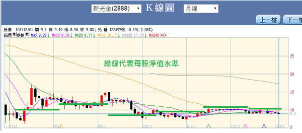
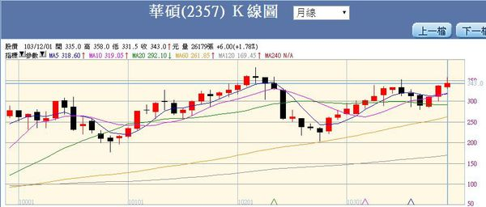

# 價值投資法的盲點與缺點（二）


##(二)、股價淨值比的不合理

 

股價跌到或跌破每股淨值，不一定意味著有超跌或物超所值，以新光金控為例，該公司股價五年多以來都在淨值上下掙扎，如果秉持著股價跌破淨值就超跌而買進的投資人根本討不到什麼便宜。





投資人絕對要誠實地問自己一個根本的問題：`投資的目的到底是要賺取資本利得？還是只是想要賺取現金股利？`


這個問題沒有人可以幫自己解答，而且通常許多投資人完全無法釐清這個問題，更誇張的是，投資的目的對許多投資人而言，「初一十五不太一樣」，一旦套牢之後，原本只想要賺取資本利得的立場馬上被迫轉變成「長線投資賺取股利」。尤其是空頭的初期，當多數人套牢幅度還不是太深的階段，許多專業財經投資媒體總會刊出「現金殖利率」或「長期投資價值」之類的文章來討好投資人，套牢的投資人可憐兮兮地買進財經媒體圖的往往只是「精神安慰」。


專業嚴肅且負責任的文章絕對不需特意討好讀者，越是讓多數散戶看得氣得牙癢癢的文章，就是好文章。我想起2008年1月的往事，當時台股仍然處於9000點高檔，我參加一場由所謂財經雜誌所舉辦的投資講座擔任主講人之一，我提出一大堆總體經濟隱憂，以及大量個別公司的財務數字所顯示的衰退證據，在場八百多人，百分之八十以上的人臉上充滿憤怒、不屑和鄙視，我講完之後只能用「夾著尾巴落荒而逃」來形容，當我在場外等電梯的時候，清楚聽到後面的死多頭主講人對我的揶揄，以及滿場的爆笑和掌聲。


然而我參加該演講的目的就是想要探知群眾是否盲目？那場演講我並沒有向主辦單位拿演講費，但是現場的氣氛卻給了我「群眾陷入盲目多頭」的山雨欲來風滿樓的重要啟示，第二天我在九千多點出清所有持股，九個多月後台股一路狂跌到3995點。


賺取差價和賺取股利是截然不同的投資邏輯，賺取股價上漲的差價著眼點在於盈餘成長、資產品質，賺取穩定股利在於公司的現金流量、股利政策和股價穩定。千萬不要混為一談。


價值投資法論者第二個東西是`「股價淨值比」(Price-Book Ratio  PBR)`，與「每股淨值」相比多了股價這個關鍵因子，公式是：股價除以每股淨值  。外表上似乎可以更實際地反應股價與淨值之間的關係。


PBR通常用來評估一家公司市價和其帳面價值的距離，當投資者在股價淨值比低於1時買進股票，代表是以公司價值打折的情況下投資，但是因為公司會計政策的差異及資產真正出售時價格可能不及帳面價值，因此，班傑明．葛拉漢(Benjamin Graham)認為投資者以此比率分析，應保留一定水準的安全邊際，亦即股價應低於每股帳面價值某一比率。但沒有人可以確實告訴投資人到底要低到多少，也很少有公司每年或每波段的PBR低檔區會具有一致性。


許多價值論者告訴我們，股價淨值比跌破1，表示公司的投資價值浮現，彷彿有「股價底部浮現」的暗示，然而多數情況是經不起檢驗，此篇文章撰寫的時間是2014年12月，當時台股的加權指數依舊處於九千點以上這個長期高檔區，然而卻有超過六分之一的股票的股價淨值比依舊在1以下，這個現象肯定讓價值投資論者匪夷所思，股市從2009年的4000點大漲六年來到9000點以上，怎麼還會有超過六分之一的上市櫃公司的股價還處於底部區？


大立光2008～2014年淨值、股價與股價淨值比區間

<table style="border-top-style: none;" border="1" cellspacing="0" cellpadding="0">
<tbody>
<tr>
<td style="padding: 0cm 5.4pt; border-top-width: 1pt; border-top-style: solid; border-top-color: windowtext;" valign="top" width="80">
<p><span style="font-family: 新細明體; font-size: 14pt;" lang="EN-US">&nbsp;</span></p>
</td>
<td style="padding: 0cm 5.4pt; border-top-width: 1pt; border-top-style: solid; border-top-color: windowtext; border-left-style: none;" valign="top" width="98">
<p><span style="font-family: 新細明體; font-size: 14pt;" lang="EN-US">2008</span></p>
</td>
<td style="padding: 0cm 5.4pt; border-top-width: 1pt; border-top-style: solid; border-top-color: windowtext; border-left-style: none;" valign="top" width="98">
<p><span style="font-family: 新細明體; font-size: 14pt;" lang="EN-US">2009</span></p>
</td>
<td style="padding: 0cm 5.4pt; border-top-width: 1pt; border-top-style: solid; border-top-color: windowtext; border-left-style: none;" valign="top" width="98">
<p><span style="font-family: 新細明體; font-size: 14pt;" lang="EN-US">2010</span></p>
</td>
<td style="padding: 0cm 5.4pt; border-top-width: 1pt; border-top-style: solid; border-top-color: windowtext; border-left-style: none;" valign="top" width="98">
<p><span style="font-family: 新細明體; font-size: 14pt;" lang="EN-US">2011</span></p>
</td>
<td style="padding: 0cm 5.4pt; border-top-width: 1pt; border-top-style: solid; border-top-color: windowtext; border-left-style: none;" valign="top" width="80">
<p><span style="font-family: 新細明體; font-size: 14pt;" lang="EN-US">2012</span></p>
</td>
<td style="padding: 0cm 5.4pt; border-top-width: 1pt; border-top-style: solid; border-top-color: windowtext; border-left-style: none;" valign="top" width="80">
<p><span style="font-family: 新細明體; font-size: 14pt;" lang="EN-US">2013</span></p>
</td>
<td style="padding: 0cm 5.4pt; border-top-width: 1pt; border-top-style: solid; border-top-color: windowtext; border-left-style: none;" valign="top" width="80">
<p><span style="font-family: 新細明體; font-size: 14pt;" lang="EN-US">2014</span></p>
</td>
</tr>
<tr>
<td style="padding: 0cm 5.4pt; border-top-style: none;" valign="top" width="80">
<p><span style="font-family: 新細明體; font-size: 14pt;">每股淨值</span></p>
</td>
<td style="padding: 0cm 5.4pt; border-style: none solid solid none; border-right-width: 1pt; border-right-color: windowtext; border-bottom-width: 1pt; border-bottom-color: windowtext;" valign="top" width="98">
<p><span style="font-family: 新細明體; font-size: 14pt;" lang="EN-US">91.7</span></p>
</td>
<td style="padding: 0cm 5.4pt; border-style: none solid solid none; border-right-width: 1pt; border-right-color: windowtext; border-bottom-width: 1pt; border-bottom-color: windowtext;" valign="top" width="98">
<p><span style="font-family: 新細明體; font-size: 14pt;" lang="EN-US">102</span></p>
</td>
<td style="padding: 0cm 5.4pt; border-style: none solid solid none; border-right-width: 1pt; border-right-color: windowtext; border-bottom-width: 1pt; border-bottom-color: windowtext;" valign="top" width="98">
<p><span style="font-family: 新細明體; font-size: 14pt;" lang="EN-US">122</span></p>
</td>
<td style="padding: 0cm 5.4pt; border-style: none solid solid none; border-right-width: 1pt; border-right-color: windowtext; border-bottom-width: 1pt; border-bottom-color: windowtext;" valign="top" width="98">
<p><span style="font-family: 新細明體; font-size: 14pt;" lang="EN-US">148</span></p>
</td>
<td style="padding: 0cm 5.4pt; border-style: none solid solid none; border-right-width: 1pt; border-right-color: windowtext; border-bottom-width: 1pt; border-bottom-color: windowtext;" valign="top" width="80">
<p><span style="font-family: 新細明體; font-size: 14pt;" lang="EN-US">172</span></p>
</td>
<td style="padding: 0cm 5.4pt; border-style: none solid solid none; border-right-width: 1pt; border-right-color: windowtext; border-bottom-width: 1pt; border-bottom-color: windowtext;" valign="top" width="80">
<p><span style="font-family: 新細明體; font-size: 14pt;" lang="EN-US">227</span></p>
</td>
<td style="padding: 0cm 5.4pt; border-style: none solid solid none; border-right-width: 1pt; border-right-color: windowtext; border-bottom-width: 1pt; border-bottom-color: windowtext;" valign="top" width="80">
<p><span style="font-size: 14pt;"><span style="font-family: 新細明體;" lang="EN-US">288</span><span style="font-family: 新細明體;">（＊）</span></span></p>
</td>
</tr>
<tr>
<td style="padding: 0cm 5.4pt; border-top-style: none;" valign="top" width="80">
<p><span style="font-family: 新細明體; font-size: 14pt;">年度股價高點</span></p>
</td>
<td style="padding: 0cm 5.4pt; border-style: none solid solid none; border-right-width: 1pt; border-right-color: windowtext; border-bottom-width: 1pt; border-bottom-color: windowtext;" valign="top" width="98">
<p><span style="font-family: 新細明體; font-size: 14pt;" lang="EN-US">470</span></p>
</td>
<td style="padding: 0cm 5.4pt; border-style: none solid solid none; border-right-width: 1pt; border-right-color: windowtext; border-bottom-width: 1pt; border-bottom-color: windowtext;" valign="top" width="98">
<p><span style="font-family: 新細明體; font-size: 14pt;" lang="EN-US">465</span></p>
</td>
<td style="padding: 0cm 5.4pt; border-style: none solid solid none; border-right-width: 1pt; border-right-color: windowtext; border-bottom-width: 1pt; border-bottom-color: windowtext;" valign="top" width="98">
<p><span style="font-family: 新細明體; font-size: 14pt;" lang="EN-US">765</span></p>
</td>
<td style="padding: 0cm 5.4pt; border-style: none solid solid none; border-right-width: 1pt; border-right-color: windowtext; border-bottom-width: 1pt; border-bottom-color: windowtext;" valign="top" width="98">
<p><span style="font-family: 新細明體; font-size: 14pt;" lang="EN-US">1005</span></p>
</td>
<td style="padding: 0cm 5.4pt; border-style: none solid solid none; border-right-width: 1pt; border-right-color: windowtext; border-bottom-width: 1pt; border-bottom-color: windowtext;" valign="top" width="80">
<p><span style="font-family: 新細明體; font-size: 14pt;" lang="EN-US">899</span></p>
</td>
<td style="padding: 0cm 5.4pt; border-style: none solid solid none; border-right-width: 1pt; border-right-color: windowtext; border-bottom-width: 1pt; border-bottom-color: windowtext;" valign="top" width="80">
<p><span style="font-family: 新細明體; font-size: 14pt;" lang="EN-US">1250</span></p>
</td>
<td style="padding: 0cm 5.4pt; border-style: none solid solid none; border-right-width: 1pt; border-right-color: windowtext; border-bottom-width: 1pt; border-bottom-color: windowtext;" valign="top" width="80">
<p><span style="font-family: 新細明體; font-size: 14pt;" lang="EN-US">2640</span></p>
</td>
</tr>
<tr>
<td style="padding: 0cm 5.4pt; border-top-style: none;" valign="top" width="80">
<p><span style="font-family: 新細明體; font-size: 14pt;">年度股價低點</span></p>
</td>
<td style="padding: 0cm 5.4pt; border-style: none solid solid none; border-right-width: 1pt; border-right-color: windowtext; border-bottom-width: 1pt; border-bottom-color: windowtext;" valign="top" width="98">
<p><span style="font-family: 新細明體; font-size: 14pt;" lang="EN-US">167</span></p>
</td>
<td style="padding: 0cm 5.4pt; border-style: none solid solid none; border-right-width: 1pt; border-right-color: windowtext; border-bottom-width: 1pt; border-bottom-color: windowtext;" valign="top" width="98">
<p><span style="font-family: 新細明體; font-size: 14pt;" lang="EN-US">194</span></p>
</td>
<td style="padding: 0cm 5.4pt; border-style: none solid solid none; border-right-width: 1pt; border-right-color: windowtext; border-bottom-width: 1pt; border-bottom-color: windowtext;" valign="top" width="98">
<p><span style="font-family: 新細明體; font-size: 14pt;" lang="EN-US">388</span></p>
</td>
<td style="padding: 0cm 5.4pt; border-style: none solid solid none; border-right-width: 1pt; border-right-color: windowtext; border-bottom-width: 1pt; border-bottom-color: windowtext;" valign="top" width="98">
<p><span style="font-family: 新細明體; font-size: 14pt;" lang="EN-US">466</span></p>
</td>
<td style="padding: 0cm 5.4pt; border-style: none solid solid none; border-right-width: 1pt; border-right-color: windowtext; border-bottom-width: 1pt; border-bottom-color: windowtext;" valign="top" width="80">
<p><span style="font-family: 新細明體; font-size: 14pt;" lang="EN-US">464</span></p>
</td>
<td style="padding: 0cm 5.4pt; border-style: none solid solid none; border-right-width: 1pt; border-right-color: windowtext; border-bottom-width: 1pt; border-bottom-color: windowtext;" valign="top" width="80">
<p><span style="font-family: 新細明體; font-size: 14pt;" lang="EN-US">681</span></p>
</td>
<td style="padding: 0cm 5.4pt; border-style: none solid solid none; border-right-width: 1pt; border-right-color: windowtext; border-bottom-width: 1pt; border-bottom-color: windowtext;" valign="top" width="80">
<p><span style="font-family: 新細明體; font-size: 14pt;" lang="EN-US">1105</span></p>
</td>
</tr>
<tr>
<td style="padding: 0cm 5.4pt; border-top-style: none;" valign="top" width="80">
<p><span style="font-family: 新細明體; font-size: 14pt;">股價淨值比區</span></p>
</td>
<td style="padding: 0cm 5.4pt; border-style: none solid solid none; border-right-width: 1pt; border-right-color: windowtext; border-bottom-width: 1pt; border-bottom-color: windowtext;" valign="top" width="98">
<p><span style="font-size: 14pt;"><span style="font-family: 新細明體;" lang="EN-US">5.1</span><span style="font-family: 新細明體;">～1.8</span></span></p>
</td>
<td style="padding: 0cm 5.4pt; border-style: none solid solid none; border-right-width: 1pt; border-right-color: windowtext; border-bottom-width: 1pt; border-bottom-color: windowtext;" valign="top" width="98">
<p><span style="font-size: 14pt;"><span style="font-family: 新細明體;" lang="EN-US">4.6</span><span style="font-family: 新細明體;">～1.9</span></span></p>
</td>
<td style="padding: 0cm 5.4pt; border-style: none solid solid none; border-right-width: 1pt; border-right-color: windowtext; border-bottom-width: 1pt; border-bottom-color: windowtext;" valign="top" width="98">
<p><span style="font-size: 14pt;"><span style="font-family: 新細明體;" lang="EN-US">6.3</span><span style="font-family: 新細明體;">～3.2</span></span></p>
</td>
<td style="padding: 0cm 5.4pt; border-style: none solid solid none; border-right-width: 1pt; border-right-color: windowtext; border-bottom-width: 1pt; border-bottom-color: windowtext;" valign="top" width="98">
<p><span style="font-size: 14pt;"><span style="font-family: 新細明體;" lang="EN-US">6.8</span><span style="font-family: 新細明體;">～3.2</span></span></p>
</td>
<td style="padding: 0cm 5.4pt; border-style: none solid solid none; border-right-width: 1pt; border-right-color: windowtext; border-bottom-width: 1pt; border-bottom-color: windowtext;" valign="top" width="80">
<p><span style="font-size: 14pt;"><span style="font-family: 新細明體;" lang="EN-US">5.3</span><span style="font-family: 新細明體;">～2.7</span></span></p>
</td>
<td style="padding: 0cm 5.4pt; border-style: none solid solid none; border-right-width: 1pt; border-right-color: windowtext; border-bottom-width: 1pt; border-bottom-color: windowtext;" valign="top" width="80">
<p><span style="font-size: 14pt;"><span style="font-family: 新細明體;" lang="EN-US">5.5</span><span style="font-family: 新細明體;">～3</span></span></p>
</td>
<td style="padding: 0cm 5.4pt; border-style: none solid solid none; border-right-width: 1pt; border-right-color: windowtext; border-bottom-width: 1pt; border-bottom-color: windowtext;" valign="top" width="80">
<p><span style="font-size: 14pt;"><span style="font-family: 新細明體;" lang="EN-US">9.2</span><span style="font-family: 新細明體;">～4.1</span></span></p>
</td>
</tr>
</tbody>
</table>

＊    ：2014年第三季數據


以大立光為例，從2008～2014年，其股價淨值比的每年低值從1.8到4.1不等，而高值也從4.6到9.2之間不等，從它的股價淨值比實在找不出合理的推估邏輯，倘若投資人在2010年想要按照2008～2009年的P/E區間去等待買點，但忙了一整年卻發覺其股價根本沒有跌到1.8～1.9的股價淨值比區間，反之，當投資人習慣2010～2011那兩年的3.2～6.8的股價淨值比區間，但這個區間對於2012～2013年的大立光投資人卻根本沒有參考意義，因為根本找不到股價淨值比在6以上的賣點出現。


大立光2008～2014年EPS、股價與本益比（P/E）區間


<table style="border-top-style: none;" border="1" cellspacing="0" cellpadding="0">
<tbody>
<tr>
<td style="padding: 0cm 5.4pt; border-top-width: 1pt; border-top-style: solid; border-top-color: windowtext;" valign="top" width="80">
<p><span style="font-family: 新細明體; font-size: 14pt;" lang="EN-US">&nbsp;</span></p>
</td>
<td style="padding: 0cm 5.4pt; border-top-width: 1pt; border-top-style: solid; border-top-color: windowtext; border-left-style: none;" valign="top" width="98">
<p><span style="font-family: 新細明體; font-size: 14pt;" lang="EN-US">2008</span></p>
</td>
<td style="padding: 0cm 5.4pt; border-top-width: 1pt; border-top-style: solid; border-top-color: windowtext; border-left-style: none;" valign="top" width="98">
<p><span style="font-family: 新細明體; font-size: 14pt;" lang="EN-US">2009</span></p>
</td>
<td style="padding: 0cm 5.4pt; border-top-width: 1pt; border-top-style: solid; border-top-color: windowtext; border-left-style: none;" valign="top" width="98">
<p><span style="font-family: 新細明體; font-size: 14pt;" lang="EN-US">2010</span></p>
</td>
<td style="padding: 0cm 5.4pt; border-top-width: 1pt; border-top-style: solid; border-top-color: windowtext; border-left-style: none;" valign="top" width="98">
<p><span style="font-family: 新細明體; font-size: 14pt;" lang="EN-US">2011</span></p>
</td>
<td style="padding: 0cm 5.4pt; border-top-width: 1pt; border-top-style: solid; border-top-color: windowtext; border-left-style: none;" valign="top" width="80">
<p><span style="font-family: 新細明體; font-size: 14pt;" lang="EN-US">2012</span></p>
</td>
<td style="padding: 0cm 5.4pt; border-top-width: 1pt; border-top-style: solid; border-top-color: windowtext; border-left-style: none;" valign="top" width="80">
<p><span style="font-family: 新細明體; font-size: 14pt;" lang="EN-US">2013</span></p>
</td>
<td style="padding: 0cm 5.4pt; border-top-width: 1pt; border-top-style: solid; border-top-color: windowtext; border-left-style: none;" valign="top" width="80">
<p><span style="font-family: 新細明體; font-size: 14pt;" lang="EN-US">2014</span></p>
</td>
</tr>
<tr>
<td style="padding: 0cm 5.4pt; border-top-style: none;" valign="top" width="80">
<p><span style="font-family: 新細明體; font-size: 14pt;" lang="EN-US">EPS</span></p>
</td>
<td style="padding: 0cm 5.4pt; border-style: none solid solid none; border-right-width: 1pt; border-right-color: windowtext; border-bottom-width: 1pt; border-bottom-color: windowtext;" valign="top" width="98">
<p><span style="font-family: 新細明體; font-size: 14pt;" lang="EN-US">24.4</span></p>
</td>
<td style="padding: 0cm 5.4pt; border-style: none solid solid none; border-right-width: 1pt; border-right-color: windowtext; border-bottom-width: 1pt; border-bottom-color: windowtext;" valign="top" width="98">
<p><span style="font-family: 新細明體; font-size: 14pt;" lang="EN-US">18.4</span></p>
</td>
<td style="padding: 0cm 5.4pt; border-style: none solid solid none; border-right-width: 1pt; border-right-color: windowtext; border-bottom-width: 1pt; border-bottom-color: windowtext;" valign="top" width="98">
<p><span style="font-family: 新細明體; font-size: 14pt;" lang="EN-US">29.8</span></p>
</td>
<td style="padding: 0cm 5.4pt; border-style: none solid solid none; border-right-width: 1pt; border-right-color: windowtext; border-bottom-width: 1pt; border-bottom-color: windowtext;" valign="top" width="98">
<p><span style="font-family: 新細明體; font-size: 14pt;" lang="EN-US">38.2</span></p>
</td>
<td style="padding: 0cm 5.4pt; border-style: none solid solid none; border-right-width: 1pt; border-right-color: windowtext; border-bottom-width: 1pt; border-bottom-color: windowtext;" valign="top" width="80">
<p><span style="font-family: 新細明體; font-size: 14pt;" lang="EN-US">40.9</span></p>
</td>
<td style="padding: 0cm 5.4pt; border-style: none solid solid none; border-right-width: 1pt; border-right-color: windowtext; border-bottom-width: 1pt; border-bottom-color: windowtext;" valign="top" width="80">
<p><span style="font-family: 新細明體; font-size: 14pt;" lang="EN-US">70.6</span></p>
</td>
<td style="padding: 0cm 5.4pt; border-style: none solid solid none; border-right-width: 1pt; border-right-color: windowtext; border-bottom-width: 1pt; border-bottom-color: windowtext;" valign="top" width="80">
<p><span style="font-size: 14pt;"><span style="font-family: 新細明體;" lang="EN-US">118</span><span style="font-family: 新細明體;">（＊）</span></span></p>
</td>
</tr>
<tr>
<td style="padding: 0cm 5.4pt; border-top-style: none;" valign="top" width="80">
<p><span style="font-family: 新細明體; font-size: 14pt;">年度股價高點</span></p>
</td>
<td style="padding: 0cm 5.4pt; border-style: none solid solid none; border-right-width: 1pt; border-right-color: windowtext; border-bottom-width: 1pt; border-bottom-color: windowtext;" valign="top" width="98">
<p><span style="font-family: 新細明體; font-size: 14pt;" lang="EN-US">470</span></p>
</td>
<td style="padding: 0cm 5.4pt; border-style: none solid solid none; border-right-width: 1pt; border-right-color: windowtext; border-bottom-width: 1pt; border-bottom-color: windowtext;" valign="top" width="98">
<p><span style="font-family: 新細明體; font-size: 14pt;" lang="EN-US">465</span></p>
</td>
<td style="padding: 0cm 5.4pt; border-style: none solid solid none; border-right-width: 1pt; border-right-color: windowtext; border-bottom-width: 1pt; border-bottom-color: windowtext;" valign="top" width="98">
<p><span style="font-family: 新細明體; font-size: 14pt;" lang="EN-US">765</span></p>
</td>
<td style="padding: 0cm 5.4pt; border-style: none solid solid none; border-right-width: 1pt; border-right-color: windowtext; border-bottom-width: 1pt; border-bottom-color: windowtext;" valign="top" width="98">
<p><span style="font-family: 新細明體; font-size: 14pt;" lang="EN-US">1005</span></p>
</td>
<td style="padding: 0cm 5.4pt; border-style: none solid solid none; border-right-width: 1pt; border-right-color: windowtext; border-bottom-width: 1pt; border-bottom-color: windowtext;" valign="top" width="80">
<p><span style="font-family: 新細明體; font-size: 14pt;" lang="EN-US">899</span></p>
</td>
<td style="padding: 0cm 5.4pt; border-style: none solid solid none; border-right-width: 1pt; border-right-color: windowtext; border-bottom-width: 1pt; border-bottom-color: windowtext;" valign="top" width="80">
<p><span style="font-family: 新細明體; font-size: 14pt;" lang="EN-US">1250</span></p>
</td>
<td style="padding: 0cm 5.4pt; border-style: none solid solid none; border-right-width: 1pt; border-right-color: windowtext; border-bottom-width: 1pt; border-bottom-color: windowtext;" valign="top" width="80">
<p><span style="font-family: 新細明體; font-size: 14pt;" lang="EN-US">2640</span></p>
</td>
</tr>
<tr>
<td style="padding: 0cm 5.4pt; border-top-style: none;" valign="top" width="80">
<p><span style="font-family: 新細明體; font-size: 14pt;">年度股價低點</span></p>
</td>
<td style="padding: 0cm 5.4pt; border-style: none solid solid none; border-right-width: 1pt; border-right-color: windowtext; border-bottom-width: 1pt; border-bottom-color: windowtext;" valign="top" width="98">
<p><span style="font-family: 新細明體; font-size: 14pt;" lang="EN-US">167</span></p>
</td>
<td style="padding: 0cm 5.4pt; border-style: none solid solid none; border-right-width: 1pt; border-right-color: windowtext; border-bottom-width: 1pt; border-bottom-color: windowtext;" valign="top" width="98">
<p><span style="font-family: 新細明體; font-size: 14pt;" lang="EN-US">194</span></p>
</td>
<td style="padding: 0cm 5.4pt; border-style: none solid solid none; border-right-width: 1pt; border-right-color: windowtext; border-bottom-width: 1pt; border-bottom-color: windowtext;" valign="top" width="98">
<p><span style="font-family: 新細明體; font-size: 14pt;" lang="EN-US">388</span></p>
</td>
<td style="padding: 0cm 5.4pt; border-style: none solid solid none; border-right-width: 1pt; border-right-color: windowtext; border-bottom-width: 1pt; border-bottom-color: windowtext;" valign="top" width="98">
<p><span style="font-family: 新細明體; font-size: 14pt;" lang="EN-US">466</span></p>
</td>
<td style="padding: 0cm 5.4pt; border-style: none solid solid none; border-right-width: 1pt; border-right-color: windowtext; border-bottom-width: 1pt; border-bottom-color: windowtext;" valign="top" width="80">
<p><span style="font-family: 新細明體; font-size: 14pt;" lang="EN-US">464</span></p>
</td>
<td style="padding: 0cm 5.4pt; border-style: none solid solid none; border-right-width: 1pt; border-right-color: windowtext; border-bottom-width: 1pt; border-bottom-color: windowtext;" valign="top" width="80">
<p><span style="font-family: 新細明體; font-size: 14pt;" lang="EN-US">681</span></p>
</td>
<td style="padding: 0cm 5.4pt; border-style: none solid solid none; border-right-width: 1pt; border-right-color: windowtext; border-bottom-width: 1pt; border-bottom-color: windowtext;" valign="top" width="80">
<p><span style="font-family: 新細明體; font-size: 14pt;" lang="EN-US">1105</span></p>
</td>
</tr>
<tr>
<td style="padding: 0cm 5.4pt; border-top-style: none;" valign="top" width="80">
<p><span style="font-size: 14pt;"><span style="font-family: 新細明體;" lang="EN-US">P/E</span><span style="font-family: 新細明體;">區間</span></span></p>
</td>
<td style="padding: 0cm 5.4pt; border-style: none solid solid none; border-right-width: 1pt; border-right-color: windowtext; border-bottom-width: 1pt; border-bottom-color: windowtext;" valign="top" width="98">
<p><span style="font-size: 14pt;"><span style="font-family: 新細明體;" lang="EN-US">19.3</span><span style="font-family: 新細明體;">～6.8</span></span></p>
</td>
<td style="padding: 0cm 5.4pt; border-style: none solid solid none; border-right-width: 1pt; border-right-color: windowtext; border-bottom-width: 1pt; border-bottom-color: windowtext;" valign="top" width="98">
<p><span style="font-size: 14pt;"><span style="font-family: 新細明體;" lang="EN-US">25.3</span><span style="font-family: 新細明體;">～10.5</span></span></p>
</td>
<td style="padding: 0cm 5.4pt; border-style: none solid solid none; border-right-width: 1pt; border-right-color: windowtext; border-bottom-width: 1pt; border-bottom-color: windowtext;" valign="top" width="98">
<p><span style="font-size: 14pt;"><span style="font-family: 新細明體;" lang="EN-US">25.6</span><span style="font-family: 新細明體;">～13</span></span></p>
</td>
<td style="padding: 0cm 5.4pt; border-style: none solid solid none; border-right-width: 1pt; border-right-color: windowtext; border-bottom-width: 1pt; border-bottom-color: windowtext;" valign="top" width="98">
<p><span style="font-size: 14pt;"><span style="font-family: 新細明體;" lang="EN-US">26.3</span><span style="font-family: 新細明體;">～12.2</span></span></p>
</td>
<td style="padding: 0cm 5.4pt; border-style: none solid solid none; border-right-width: 1pt; border-right-color: windowtext; border-bottom-width: 1pt; border-bottom-color: windowtext;" valign="top" width="80">
<p><span style="font-size: 14pt;"><span style="font-family: 新細明體;" lang="EN-US">22</span><span style="font-family: 新細明體;">～11.3</span></span></p>
</td>
<td style="padding: 0cm 5.4pt; border-style: none solid solid none; border-right-width: 1pt; border-right-color: windowtext; border-bottom-width: 1pt; border-bottom-color: windowtext;" valign="top" width="80">
<p><span style="font-size: 14pt;"><span style="font-family: 新細明體;" lang="EN-US">17.7</span><span style="font-family: 新細明體;">～9.6</span></span></p>
</td>
<td style="padding: 0cm 5.4pt; border-style: none solid solid none; border-right-width: 1pt; border-right-color: windowtext; border-bottom-width: 1pt; border-bottom-color: windowtext;" valign="top" width="80">
<p><span style="font-size: 14pt;"><span style="font-family: 新細明體;" lang="EN-US">22.3</span><span style="font-family: 新細明體;">～9.4</span></span></p>
</td>
</tr>
</tbody>
</table>


＊    估計值


反觀若用本益比的概念，比較容易釐清大立光的股價高低相對區域，從2009到2014年，只要在本益比20倍以上找賣點，在本益比12倍找買點，可以從容地來回賺差價。


為什麼一家公司的股價淨值比長期無法出現穩定的高低區間？因為公司的淨值無法忠實反應盈餘成長，如果公司的配發股息的比率很高，則淨值成長速度便會相當慢，理論上若公司配發現金股利的比率為100％（也就是把盈餘全數發放給股東），那麼它的淨值會呈現不變的狀態。


用比較極端的假設來說明，如果一家公司一開始的每股淨值是20，如果過去五年來每年賺到每股淨利分別是1、2、3、4、5元，該公司每年都將淨利全數當成股利發放給股東，其它狀況（如資產價值）不變的情況下，該公司過去五年的每股淨值應該都還是20。然而有經驗的投資人都知道，這種每年EPS都會成長的公司，股價自然是易漲難跌，在這種假設下，這家公司的股價淨值比當然每年大幅提高，沒有所謂的固定區間可供參考。


另外一個超級大盲點在於，股價淨值比的計算相當困難，雖然公式看起來只是簡單地股價除以每股淨值，但難就難在每股淨值的計算，在財務分析的實務運用中，所有的比值、比率必須用「同一個時間點」的不同數據來計算，試問，股價淨值比如果用現在的股價去除以去年的每股淨值，怎麼會有意義呢？相同的情況也發生在本益比的計算，本益比的計算一定是得用現在的股價（廢話）除以現在的每股淨利。


但問題在於公司的經營屬於「現在進行式」，投資人能夠找到的財務報表頂多只是上一季的報表，甚至上一年度的報表，但是「每股淨值」卻是個隨時變動的數字，投資人必須能夠事先估計出現在與未來的每股淨值，但每股淨值的估計可說是困難度極高的數理推估過程，比起EPS的推估更是難上加難，要推估未來的每股淨值必須得估計下列數字：
```
1、本季與下一兩季的稅後淨利

2、合併稅後淨利中屬於少數股權的金額

3、公司配發現金股利的比重

4、股本的變動

5、長期投資的未實現損益

6、資產減損的可能與金額高低

7、可轉債或現金增資對股本與資本公積的影響數

8、不屬於業務範圍的匯兌損益的變動預估

9、其它
```
 

好了！讓我告訴你們，連我也無法正確或有邏輯性地推估出一家公司未來的淨值，更不想去計算，因為比起EPS的推估，推估每股淨值的不準確率高到嚇人。


股價淨值比如果有投資學的意易必須建立在「淨值成長會帶動股價成長」的假設，但許多公司淨值成長不代表股價一定會有所表現


華碩每股淨值表
<table style="border-top-style: none;" border="1" cellspacing="0" cellpadding="0">
<tbody>
<tr>
<td style="padding: 0cm 5.4pt; border-top-width: 1pt; border-top-style: solid; border-top-color: windowtext;" valign="top" width="116">
<p><span style="font-family: 新細明體; font-size: 14pt;" lang="EN-US">&nbsp;</span></p>
</td>
<td style="padding: 0cm 5.4pt; border-top-width: 1pt; border-top-style: solid; border-top-color: windowtext; border-left-style: none;" valign="top" width="116">
<p style="text-align: center;" align="center"><span style="font-size: 14pt;">103/3Q</span></p>
</td>
<td style="padding: 0cm 5.4pt; border-top-width: 1pt; border-top-style: solid; border-top-color: windowtext; border-left-style: none;" width="121">
<p style="text-align: center;" align="center"><span style="font-size: 14pt;">102</span></p>
</td>
<td style="padding: 0cm 5.4pt; border-top-width: 1pt; border-top-style: solid; border-top-color: windowtext; border-left-style: none;" width="121">
<p style="text-align: center;" align="center"><span style="font-size: 14pt;">101</span></p>
</td>
<td style="padding: 0cm 5.4pt; border-top-width: 1pt; border-top-style: solid; border-top-color: windowtext; border-left-style: none;" width="121">
<p style="text-align: center;" align="center"><span style="font-size: 14pt;">100</span></p>
</td>
<td style="padding: 0cm 5.4pt; border-top-width: 1pt; border-top-style: solid; border-top-color: windowtext; border-left-style: none;" valign="top" width="116">
<p style="text-align: center;" align="center"><span style="font-size: 14pt;">99</span></p>
</td>
</tr>
<tr>
<td style="padding: 0cm 5.4pt; border-top-style: none;" valign="top" width="116">
<p><span style="font-family: 新細明體; font-size: 14pt;">每股淨值</span></p>
</td>
<td style="padding: 0cm 5.4pt; border-style: none solid solid none; border-right-width: 1pt; border-right-color: windowtext; border-bottom-width: 1pt; border-bottom-color: windowtext;" valign="top" width="116">
<p style="text-align: center;" align="center"><span style="font-size: 14pt;">198.07</span></p>
</td>
<td style="padding: 0cm 5.4pt; border-style: none solid solid none; border-right-width: 1pt; border-right-color: windowtext; border-bottom-width: 1pt; border-bottom-color: windowtext;" width="121">
<p style="text-align: center;" align="center"><span style="font-size: 14pt;">182.02</span></p>
</td>
<td style="padding: 0cm 5.4pt; border-style: none solid solid none; border-right-width: 1pt; border-right-color: windowtext; border-bottom-width: 1pt; border-bottom-color: windowtext;" width="121">
<p style="text-align: center;" align="center"><span style="font-size: 14pt;">167.47</span></p>
</td>
<td style="padding: 0cm 5.4pt; border-style: none solid solid none; border-right-width: 1pt; border-right-color: windowtext; border-bottom-width: 1pt; border-bottom-color: windowtext;" width="121">
<p style="text-align: center;" align="center"><span style="font-size: 14pt;">152.70</span></p>
</td>
<td style="padding: 0cm 5.4pt; border-style: none solid solid none; border-right-width: 1pt; border-right-color: windowtext; border-bottom-width: 1pt; border-bottom-color: windowtext;" width="116">
<p style="text-align: center;" align="center"><span style="font-size: 14pt;">169.12</span></p>
</td>
</tr>
</tbody>
</table>

華碩四年多以來月線圖





從華碩的例子可以看出，其淨值一路從169.12增長到198.07，但其股價長期表現只能用盤整來形容；這類的例子不勝枚舉，如鴻海、中鋼、日月光、全部金控股、多數營建公司等等。

 

淨值無法反應公司營業與淨利的變動全貌


淨值（股東權益）變動乃是存量變動的概念，假設有一家公司去年EPS賺1元，去年底每股淨值為20元，但今年該公司業績與淨利都大幅成長，今年EPS躍升到4元，如果該公司完全不配發現金股利，且其它狀況不變的假設下，該公司今年的每股淨值為24元。就每股淨值而言，不過才成長20％（20→24），但就EPS而言卻成長了300％（1→4），兩者之間有如天差地遠，可見單純看淨值或每股淨值，無法窺視公司營運全貌。


##結論：
既然淨值的預估難度過高、既然淨值成長與股價成長與盈餘成長沒有必然關係、既然很難找到每家公司的固定PBR歷史區間，為什麼還要大費周章地藉由淨值或PBR的計算來評估股價偏低或偏高？難道只因為五十年前的某本經典教科書曾經提到這些理論，投資大眾就得抱殘守缺地將錯就錯嗎？在科學上，所有的原理與經典最大的用處是拿來「質疑與挑戰」，但屬於社會科學範疇的投資理論，卻罕有挑戰的聲音。


我無從得知擁抱舊教條的投資人的封藏在內心深處不願讓外人得知的虧損折磨，也不知道如何從淨值或PBR去捕捉失落的漲幅？
