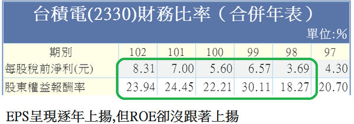

# 價值投資法的盲點與缺點（三）關於ROE這個玩具兵

財務分析比率的玩具兵

 

有太多人偏好股東權益報酬率在投資上的運用，股東權益報酬率(Return On Equity，簡稱ROE)

 

###ROE = 稅後純益÷股東權益

 

###股東權益 = 總資產－總負債

所以在學理上，股東權益是所有股東所握有公司的真正價值，感覺上似乎可以衡量公司的價值，但我還得再三強調投資人買進的是表彰代表「股本」的股票，而非「股東權益」，實務上會面臨股東權益的衡量的情況不多見，譬如面臨清算、譬如面臨公司引進超大資金的策略性投資股東，除此之外，股東權益的數目多半只是淪為學術上的嘴泡工具而已。

財務比率分析是大學會計系與財金系的必修課程，一年下來少說有100~120個小時，教授們如果不拿出多一點東西出來教，恐怕有大半的課程得開天窗，況且ROE分析是股神巴菲特的拿手絕活，課堂上拿出來教一教也無可厚非，但如果真的要拿到股票市場運用一番的話，就別亂開玩笑了。

ROE的分析對我而言不過只是財務分析上的「玩具兵」，乍看之下很華麗，要拿到股票市場的投資戰場可是完全不中用。

為什麼？

一、再度重申，資人買進的是表彰代表「股本」的股票，而非「股東權益」。

二、股東權益項下有太多與股本無關的科目，如「長期投資跌價損失」、「少數股權」與「資本公積」

##狀況一

譬如股東權益項下有「長期投資跌價損失」科目，用最簡單的例子，譬如某公司(以金控最多)，今年稅後淨利與去年稅後淨利都是200萬，股本都是1000萬，去年的股東權益是1500萬。

若以每股淨利(EPS)來看，兩年都是2塊錢。

但是如果該金控今年提列「長期投資跌價損失」300萬，請投資人注意，提列長期投資跌價損失無須放在損益表，所以該金控的今年的稅後淨利仍是200萬，但股東權益卻成為1200萬(1500-300)，股東權益報酬率卻反向從13.3%升到16.7％。

其實該金控今年的投資狀況是很糟糕的

 <table style="border-top-style: none;" border="1" cellspacing="0" cellpadding="0">
<tbody>
<tr>
<td style="padding: 0cm 5.4pt; border-top-width: 1pt; border-top-style: solid; border-top-color: windowtext;" valign="top" width="227">

&nbsp;

</td>
<td style="padding: 0cm 5.4pt; border-top-width: 1pt; border-top-style: solid; border-top-color: windowtext; border-left-style: none;" valign="top" width="144">

去年

</td>
<td style="padding: 0cm 5.4pt; border-top-width: 1pt; border-top-style: solid; border-top-color: windowtext; border-left-style: none;" valign="top" width="131">

今年

</td>
</tr>
<tr>
<td style="padding: 0cm 5.4pt; border-top-style: none;" valign="top" width="227">

稅後淨利

</td>
<td style="padding: 0cm 5.4pt; border-style: none solid solid none; border-right-width: 1pt; border-right-color: windowtext; border-bottom-width: 1pt; border-bottom-color: windowtext;" valign="top" width="144">

200萬

</td>
<td style="padding: 0cm 5.4pt; border-style: none solid solid none; border-right-width: 1pt; border-right-color: windowtext; border-bottom-width: 1pt; border-bottom-color: windowtext;" valign="top" width="131">

200萬

</td>
</tr>
<tr>
<td style="padding: 0cm 5.4pt; border-top-style: none;" valign="top" width="227">

股本

</td>
<td style="padding: 0cm 5.4pt; border-style: none solid solid none; border-right-width: 1pt; border-right-color: windowtext; border-bottom-width: 1pt; border-bottom-color: windowtext;" valign="top" width="144">

1000萬

</td>
<td style="padding: 0cm 5.4pt; border-style: none solid solid none; border-right-width: 1pt; border-right-color: windowtext; border-bottom-width: 1pt; border-bottom-color: windowtext;" valign="top" width="131">

1000萬

</td>
</tr>
<tr>
<td style="padding: 0cm 5.4pt; border-top-style: none;" valign="top" width="227">

EPS

</td>
<td style="padding: 0cm 5.4pt; border-style: none solid solid none; border-right-width: 1pt; border-right-color: windowtext; border-bottom-width: 1pt; border-bottom-color: windowtext;" valign="top" width="144">

2元

</td>
<td style="padding: 0cm 5.4pt; border-style: none solid solid none; border-right-width: 1pt; border-right-color: windowtext; border-bottom-width: 1pt; border-bottom-color: windowtext;" valign="top" width="131">

2元

</td>
</tr>
<tr>
<td style="padding: 0cm 5.4pt; border-top-style: none;" valign="top" width="227">

長期投資跌價損失

</td>
<td style="padding: 0cm 5.4pt; border-style: none solid solid none; border-right-width: 1pt; border-right-color: windowtext; border-bottom-width: 1pt; border-bottom-color: windowtext;" valign="top" width="144">

0

</td>
<td style="padding: 0cm 5.4pt; border-style: none solid solid none; border-right-width: 1pt; border-right-color: windowtext; border-bottom-width: 1pt; border-bottom-color: windowtext;" valign="top" width="131">

300萬

</td>
</tr>
<tr>
<td style="padding: 0cm 5.4pt; border-top-style: none;" valign="top" width="227">

股東權益

</td>
<td style="padding: 0cm 5.4pt; border-style: none solid solid none; border-right-width: 1pt; border-right-color: windowtext; border-bottom-width: 1pt; border-bottom-color: windowtext;" valign="top" width="144">

1500萬

</td>
<td style="padding: 0cm 5.4pt; border-style: none solid solid none; border-right-width: 1pt; border-right-color: windowtext; border-bottom-width: 1pt; border-bottom-color: windowtext;" valign="top" width="131">

1200萬

</td>
</tr>
<tr>
<td style="padding: 0cm 5.4pt; border-top-style: none;" valign="top" width="227">

ROE

</td>
<td style="padding: 0cm 5.4pt; border-style: none solid solid none; border-right-width: 1pt; border-right-color: windowtext; border-bottom-width: 1pt; border-bottom-color: windowtext;" valign="top" width="144">

13.3％

</td>
<td style="padding: 0cm 5.4pt; border-style: none solid solid none; border-right-width: 1pt; border-right-color: windowtext; border-bottom-width: 1pt; border-bottom-color: windowtext;" valign="top" width="131">

16.7％

</td>
</tr>
</tbody>
</table>
 

##狀況二

如果該公司今年辦理現金增資，股本增加10%，但因為承銷價是用很高的股價，所以會增加高額資本公積如狀況二，就EPS而言該公司今年是成長，但ROE卻反向降低。

<table style="border-top-style: none;" border="1" cellspacing="0" cellpadding="0">
<tbody>
<tr>
<td style="padding: 0cm 5.4pt; border-top-width: 1pt; border-top-style: solid; border-top-color: windowtext;" valign="top" width="227">

&nbsp;

</td>
<td style="padding: 0cm 5.4pt; border-top-width: 1pt; border-top-style: solid; border-top-color: windowtext; border-left-style: none;" valign="top" width="144">

去年

</td>
<td style="padding: 0cm 5.4pt; border-top-width: 1pt; border-top-style: solid; border-top-color: windowtext; border-left-style: none;" valign="top" width="131">

今年

</td>
</tr>
<tr>
<td style="padding: 0cm 5.4pt; border-top-style: none;" valign="top" width="227">

稅後淨利

</td>
<td style="padding: 0cm 5.4pt; border-style: none solid solid none; border-right-width: 1pt; border-right-color: windowtext; border-bottom-width: 1pt; border-bottom-color: windowtext;" valign="top" width="144">

200萬

</td>
<td style="padding: 0cm 5.4pt; border-style: none solid solid none; border-right-width: 1pt; border-right-color: windowtext; border-bottom-width: 1pt; border-bottom-color: windowtext;" valign="top" width="131">

240萬

</td>
</tr>
<tr>
<td style="padding: 0cm 5.4pt; border-top-style: none;" valign="top" width="227">

股本

</td>
<td style="padding: 0cm 5.4pt; border-style: none solid solid none; border-right-width: 1pt; border-right-color: windowtext; border-bottom-width: 1pt; border-bottom-color: windowtext;" valign="top" width="144">

1000萬

</td>
<td style="padding: 0cm 5.4pt; border-style: none solid solid none; border-right-width: 1pt; border-right-color: windowtext; border-bottom-width: 1pt; border-bottom-color: windowtext;" valign="top" width="131">

1100萬

</td>
</tr>
<tr>
<td style="padding: 0cm 5.4pt; border-top-style: none;" valign="top" width="227">

EPS

</td>
<td style="padding: 0cm 5.4pt; border-style: none solid solid none; border-right-width: 1pt; border-right-color: windowtext; border-bottom-width: 1pt; border-bottom-color: windowtext;" valign="top" width="144">

2元

</td>
<td style="padding: 0cm 5.4pt; border-style: none solid solid none; border-right-width: 1pt; border-right-color: windowtext; border-bottom-width: 1pt; border-bottom-color: windowtext;" valign="top" width="131">

2.18元

</td>
</tr>
<tr>
<td style="padding: 0cm 5.4pt; border-top-style: none;" valign="top" width="227">

資本公積

</td>
<td style="padding: 0cm 5.4pt; border-style: none solid solid none; border-right-width: 1pt; border-right-color: windowtext; border-bottom-width: 1pt; border-bottom-color: windowtext;" valign="top" width="144">

0

</td>
<td style="padding: 0cm 5.4pt; border-style: none solid solid none; border-right-width: 1pt; border-right-color: windowtext; border-bottom-width: 1pt; border-bottom-color: windowtext;" valign="top" width="131">

300萬

</td>
</tr>
<tr>
<td style="padding: 0cm 5.4pt; border-top-style: none;" valign="top" width="227">

股東權益

</td>
<td style="padding: 0cm 5.4pt; border-style: none solid solid none; border-right-width: 1pt; border-right-color: windowtext; border-bottom-width: 1pt; border-bottom-color: windowtext;" valign="top" width="144">

1500萬

</td>
<td style="padding: 0cm 5.4pt; border-style: none solid solid none; border-right-width: 1pt; border-right-color: windowtext; border-bottom-width: 1pt; border-bottom-color: windowtext;" valign="top" width="131">

1900萬

</td>
</tr>
<tr>
<td style="padding: 0cm 5.4pt; border-top-style: none;" valign="top" width="227">

ROE

</td>
<td style="padding: 0cm 5.4pt; border-style: none solid solid none; border-right-width: 1pt; border-right-color: windowtext; border-bottom-width: 1pt; border-bottom-color: windowtext;" valign="top" width="144">

13.3％

</td>
<td style="padding: 0cm 5.4pt; border-style: none solid solid none; border-right-width: 1pt; border-right-color: windowtext; border-bottom-width: 1pt; border-bottom-color: windowtext;" valign="top" width="131">

12.6％

</td>
</tr>
</tbody>
</table>

##狀況三

如果該公司今年沒有「長期投資跌價損失」、「少數股權」與「資本公積」等干擾，只是把賺到的錢都保留下來(不配股利)，如下表，就EPS是成長，但ROE卻下跌。

<table style="border-top-style: none;" border="1" cellspacing="0" cellpadding="0">
<tbody>
<tr>
<td style="padding: 0cm 5.4pt; border-top-width: 1pt; border-top-style: solid; border-top-color: windowtext;" valign="top" width="227">

&nbsp;

</td>
<td style="padding: 0cm 5.4pt; border-top-width: 1pt; border-top-style: solid; border-top-color: windowtext; border-left-style: none;" valign="top" width="144">

去年

</td>
<td style="padding: 0cm 5.4pt; border-top-width: 1pt; border-top-style: solid; border-top-color: windowtext; border-left-style: none;" valign="top" width="131">

今年

</td>
</tr>
<tr>
<td style="padding: 0cm 5.4pt; border-top-style: none;" valign="top" width="227">

稅後淨利

</td>
<td style="padding: 0cm 5.4pt; border-style: none solid solid none; border-right-width: 1pt; border-right-color: windowtext; border-bottom-width: 1pt; border-bottom-color: windowtext;" valign="top" width="144">

200萬

</td>
<td style="padding: 0cm 5.4pt; border-style: none solid solid none; border-right-width: 1pt; border-right-color: windowtext; border-bottom-width: 1pt; border-bottom-color: windowtext;" valign="top" width="131">

220萬

</td>
</tr>
<tr>
<td style="padding: 0cm 5.4pt; border-top-style: none;" valign="top" width="227">

股本

</td>
<td style="padding: 0cm 5.4pt; border-style: none solid solid none; border-right-width: 1pt; border-right-color: windowtext; border-bottom-width: 1pt; border-bottom-color: windowtext;" valign="top" width="144">

1000萬

</td>
<td style="padding: 0cm 5.4pt; border-style: none solid solid none; border-right-width: 1pt; border-right-color: windowtext; border-bottom-width: 1pt; border-bottom-color: windowtext;" valign="top" width="131">

1000萬

</td>
</tr>
<tr>
<td style="padding: 0cm 5.4pt; border-top-style: none;" valign="top" width="227">

EPS

</td>
<td style="padding: 0cm 5.4pt; border-style: none solid solid none; border-right-width: 1pt; border-right-color: windowtext; border-bottom-width: 1pt; border-bottom-color: windowtext;" valign="top" width="144">

2元

</td>
<td style="padding: 0cm 5.4pt; border-style: none solid solid none; border-right-width: 1pt; border-right-color: windowtext; border-bottom-width: 1pt; border-bottom-color: windowtext;" valign="top" width="131">

2.2元

</td>
</tr>
<tr>
<td style="padding: 0cm 5.4pt; border-top-style: none;" valign="top" width="227">

股東權益

</td>
<td style="padding: 0cm 5.4pt; border-style: none solid solid none; border-right-width: 1pt; border-right-color: windowtext; border-bottom-width: 1pt; border-bottom-color: windowtext;" valign="top" width="144">

1500萬

</td>
<td style="padding: 0cm 5.4pt; border-style: none solid solid none; border-right-width: 1pt; border-right-color: windowtext; border-bottom-width: 1pt; border-bottom-color: windowtext;" valign="top" width="131">

1720萬

</td>
</tr>
<tr>
<td style="padding: 0cm 5.4pt; border-top-style: none;" valign="top" width="227">

ROE

</td>
<td style="padding: 0cm 5.4pt; border-style: none solid solid none; border-right-width: 1pt; border-right-color: windowtext; border-bottom-width: 1pt; border-bottom-color: windowtext;" valign="top" width="144">

13.3％

</td>
<td style="padding: 0cm 5.4pt; border-style: none solid solid none; border-right-width: 1pt; border-right-color: windowtext; border-bottom-width: 1pt; border-bottom-color: windowtext;" valign="top" width="131">

12.8％

</td>
</tr>
</tbody>
</table>

高ROE與高EPS到底哪一項對股價比較具有影響性呢？讓我們來作實務上的探討吧，我把2013年第四季到2014年第三季這四個會計季度的台股作些篩選，但我把大立光這家超高股價剔除，因為大立光的股價實在太高，會影響平均數的統計。

 

表一是台股2013年第四季到2014年第三季累積股東權益報酬率前三十名的公司，她們的股價情況：

表一：2013/4Q-2014/3Q`累積股東權益報酬率top30排行榜`(扣掉超高價的大立光)

<table style="border-top-style: none;" border="1" cellspacing="0" cellpadding="0">
<tbody>
<tr>
<td style="padding: 0cm 5.4pt; border-top-width: 1pt; border-top-style: solid; border-top-color: windowtext;" valign="top" width="101">

公司

</td>
<td style="padding: 0cm 5.4pt; border-top-width: 1pt; border-top-style: solid; border-top-color: windowtext; border-left-style: none;" valign="top" width="162">

累積ROE％

</td>
<td style="padding: 0cm 5.4pt; border-top-width: 1pt; border-top-style: solid; border-top-color: windowtext; border-left-style: none;" valign="top" width="144">

股價(12/29)

</td>
<td style="padding: 0cm 5.4pt; border-top-width: 1pt; border-top-style: solid; border-top-color: windowtext; border-left-style: none;" valign="top" width="108">

公司

</td>
<td style="padding: 0cm 5.4pt; border-top-width: 1pt; border-top-style: solid; border-top-color: windowtext; border-left-style: none;" valign="top" width="144">

累積ROE％

</td>
<td style="padding: 0cm 5.4pt; border-top-width: 1pt; border-top-style: solid; border-top-color: windowtext; border-left-style: none;" valign="top" width="144">

股價(12/29)

</td>
</tr>
<tr>
<td style="padding: 0cm 5.4pt; border-top-style: none;" valign="top" width="101">

南亞科

</td>
<td style="padding: 0cm 5.4pt; border-style: none solid solid none; border-right-width: 1pt; border-right-color: windowtext; border-bottom-width: 1pt; border-bottom-color: windowtext;" valign="top" width="162">

128.6

</td>
<td style="padding: 0cm 5.4pt; border-style: none solid solid none; border-right-width: 1pt; border-right-color: windowtext; border-bottom-width: 1pt; border-bottom-color: windowtext;" valign="top" width="144">

78

</td>
<td style="padding: 0cm 5.4pt; border-style: none solid solid none; border-right-width: 1pt; border-right-color: windowtext; border-bottom-width: 1pt; border-bottom-color: windowtext;" valign="top" width="108">

上緯

</td>
<td style="padding: 0cm 5.4pt; border-style: none solid solid none; border-right-width: 1pt; border-right-color: windowtext; border-bottom-width: 1pt; border-bottom-color: windowtext;" valign="top" width="144">

30.2

</td>
<td style="padding: 0cm 5.4pt; border-style: none solid solid none; border-right-width: 1pt; border-right-color: windowtext; border-bottom-width: 1pt; border-bottom-color: windowtext;" valign="top" width="144">

139.5

</td>
</tr>
<tr>
<td style="padding: 0cm 5.4pt; border-top-style: none;" valign="top" width="101">

三豐

</td>
<td style="padding: 0cm 5.4pt; border-style: none solid solid none; border-right-width: 1pt; border-right-color: windowtext; border-bottom-width: 1pt; border-bottom-color: windowtext;" valign="top" width="162">

68.3

</td>
<td style="padding: 0cm 5.4pt; border-style: none solid solid none; border-right-width: 1pt; border-right-color: windowtext; border-bottom-width: 1pt; border-bottom-color: windowtext;" valign="top" width="144">

22.1

</td>
<td style="padding: 0cm 5.4pt; border-style: none solid solid none; border-right-width: 1pt; border-right-color: windowtext; border-bottom-width: 1pt; border-bottom-color: windowtext;" valign="top" width="108">

泰林

</td>
<td style="padding: 0cm 5.4pt; border-style: none solid solid none; border-right-width: 1pt; border-right-color: windowtext; border-bottom-width: 1pt; border-bottom-color: windowtext;" valign="top" width="144">

29.2

</td>
<td style="padding: 0cm 5.4pt; border-style: none solid solid none; border-right-width: 1pt; border-right-color: windowtext; border-bottom-width: 1pt; border-bottom-color: windowtext;" valign="top" width="144">

24

</td>
</tr>
<tr>
<td style="padding: 0cm 5.4pt; border-top-style: none;" valign="top" width="101">

華亞科

</td>
<td style="padding: 0cm 5.4pt; border-style: none solid solid none; border-right-width: 1pt; border-right-color: windowtext; border-bottom-width: 1pt; border-bottom-color: windowtext;" valign="top" width="162">

66.1

</td>
<td style="padding: 0cm 5.4pt; border-style: none solid solid none; border-right-width: 1pt; border-right-color: windowtext; border-bottom-width: 1pt; border-bottom-color: windowtext;" valign="top" width="144">

50

</td>
<td style="padding: 0cm 5.4pt; border-style: none solid solid none; border-right-width: 1pt; border-right-color: windowtext; border-bottom-width: 1pt; border-bottom-color: windowtext;" valign="top" width="108">

單井

</td>
<td style="padding: 0cm 5.4pt; border-style: none solid solid none; border-right-width: 1pt; border-right-color: windowtext; border-bottom-width: 1pt; border-bottom-color: windowtext;" valign="top" width="144">

28.9

</td>
<td style="padding: 0cm 5.4pt; border-style: none solid solid none; border-right-width: 1pt; border-right-color: windowtext; border-bottom-width: 1pt; border-bottom-color: windowtext;" valign="top" width="144">

121

</td>
</tr>
<tr>
<td style="padding: 0cm 5.4pt; border-top-style: none;" valign="top" width="101">

智崴

</td>
<td style="padding: 0cm 5.4pt; border-style: none solid solid none; border-right-width: 1pt; border-right-color: windowtext; border-bottom-width: 1pt; border-bottom-color: windowtext;" valign="top" width="162">

44.4

</td>
<td style="padding: 0cm 5.4pt; border-style: none solid solid none; border-right-width: 1pt; border-right-color: windowtext; border-bottom-width: 1pt; border-bottom-color: windowtext;" valign="top" width="144">

435

</td>
<td style="padding: 0cm 5.4pt; border-style: none solid solid none; border-right-width: 1pt; border-right-color: windowtext; border-bottom-width: 1pt; border-bottom-color: windowtext;" valign="top" width="108">

光耀

</td>
<td style="padding: 0cm 5.4pt; border-style: none solid solid none; border-right-width: 1pt; border-right-color: windowtext; border-bottom-width: 1pt; border-bottom-color: windowtext;" valign="top" width="144">

28.8

</td>
<td style="padding: 0cm 5.4pt; border-style: none solid solid none; border-right-width: 1pt; border-right-color: windowtext; border-bottom-width: 1pt; border-bottom-color: windowtext;" valign="top" width="144">

57

</td>
</tr>
<tr>
<td style="padding: 0cm 5.4pt; border-top-style: none;" valign="top" width="101">

昇陽

</td>
<td style="padding: 0cm 5.4pt; border-style: none solid solid none; border-right-width: 1pt; border-right-color: windowtext; border-bottom-width: 1pt; border-bottom-color: windowtext;" valign="top" width="162">

44.3

</td>
<td style="padding: 0cm 5.4pt; border-style: none solid solid none; border-right-width: 1pt; border-right-color: windowtext; border-bottom-width: 1pt; border-bottom-color: windowtext;" valign="top" width="144">

21

</td>
<td style="padding: 0cm 5.4pt; border-style: none solid solid none; border-right-width: 1pt; border-right-color: windowtext; border-bottom-width: 1pt; border-bottom-color: windowtext;" valign="top" width="108">

成霖

</td>
<td style="padding: 0cm 5.4pt; border-style: none solid solid none; border-right-width: 1pt; border-right-color: windowtext; border-bottom-width: 1pt; border-bottom-color: windowtext;" valign="top" width="144">

28.7

</td>
<td style="padding: 0cm 5.4pt; border-style: none solid solid none; border-right-width: 1pt; border-right-color: windowtext; border-bottom-width: 1pt; border-bottom-color: windowtext;" valign="top" width="144">

16

</td>
</tr>
<tr>
<td style="padding: 0cm 5.4pt; border-top-style: none;" valign="top" width="101">

聯上

</td>
<td style="padding: 0cm 5.4pt; border-style: none solid solid none; border-right-width: 1pt; border-right-color: windowtext; border-bottom-width: 1pt; border-bottom-color: windowtext;" valign="top" width="162">

44.2

</td>
<td style="padding: 0cm 5.4pt; border-style: none solid solid none; border-right-width: 1pt; border-right-color: windowtext; border-bottom-width: 1pt; border-bottom-color: windowtext;" valign="top" width="144">

22

</td>
<td style="padding: 0cm 5.4pt; border-style: none solid solid none; border-right-width: 1pt; border-right-color: windowtext; border-bottom-width: 1pt; border-bottom-color: windowtext;" valign="top" width="108">

台灣大

</td>
<td style="padding: 0cm 5.4pt; border-style: none solid solid none; border-right-width: 1pt; border-right-color: windowtext; border-bottom-width: 1pt; border-bottom-color: windowtext;" valign="top" width="144">

28.7

</td>
<td style="padding: 0cm 5.4pt; border-style: none solid solid none; border-right-width: 1pt; border-right-color: windowtext; border-bottom-width: 1pt; border-bottom-color: windowtext;" valign="top" width="144">

101

</td>
</tr>
<tr>
<td style="padding: 0cm 5.4pt; border-top-style: none;" valign="top" width="101">

鴻儒

</td>
<td style="padding: 0cm 5.4pt; border-style: none solid solid none; border-right-width: 1pt; border-right-color: windowtext; border-bottom-width: 1pt; border-bottom-color: windowtext;" valign="top" width="162">

36.4

</td>
<td style="padding: 0cm 5.4pt; border-style: none solid solid none; border-right-width: 1pt; border-right-color: windowtext; border-bottom-width: 1pt; border-bottom-color: windowtext;" valign="top" width="144">

323.5

</td>
<td style="padding: 0cm 5.4pt; border-style: none solid solid none; border-right-width: 1pt; border-right-color: windowtext; border-bottom-width: 1pt; border-bottom-color: windowtext;" valign="top" width="108">

厚生

</td>
<td style="padding: 0cm 5.4pt; border-style: none solid solid none; border-right-width: 1pt; border-right-color: windowtext; border-bottom-width: 1pt; border-bottom-color: windowtext;" valign="top" width="144">

28.3

</td>
<td style="padding: 0cm 5.4pt; border-style: none solid solid none; border-right-width: 1pt; border-right-color: windowtext; border-bottom-width: 1pt; border-bottom-color: windowtext;" valign="top" width="144">

33.15

</td>
</tr>
<tr>
<td style="padding: 0cm 5.4pt; border-top-style: none;" valign="top" width="101">

興富發

</td>
<td style="padding: 0cm 5.4pt; border-style: none solid solid none; border-right-width: 1pt; border-right-color: windowtext; border-bottom-width: 1pt; border-bottom-color: windowtext;" valign="top" width="162">

36.2

</td>
<td style="padding: 0cm 5.4pt; border-style: none solid solid none; border-right-width: 1pt; border-right-color: windowtext; border-bottom-width: 1pt; border-bottom-color: windowtext;" valign="top" width="144">

63.7

</td>
<td style="padding: 0cm 5.4pt; border-style: none solid solid none; border-right-width: 1pt; border-right-color: windowtext; border-bottom-width: 1pt; border-bottom-color: windowtext;" valign="top" width="108">

美律

</td>
<td style="padding: 0cm 5.4pt; border-style: none solid solid none; border-right-width: 1pt; border-right-color: windowtext; border-bottom-width: 1pt; border-bottom-color: windowtext;" valign="top" width="144">

27.4

</td>
<td style="padding: 0cm 5.4pt; border-style: none solid solid none; border-right-width: 1pt; border-right-color: windowtext; border-bottom-width: 1pt; border-bottom-color: windowtext;" valign="top" width="144">

112

</td>
</tr>
<tr>
<td style="padding: 0cm 5.4pt; border-top-style: none;" valign="top" width="101">

聯鈞

</td>
<td style="padding: 0cm 5.4pt; border-style: none solid solid none; border-right-width: 1pt; border-right-color: windowtext; border-bottom-width: 1pt; border-bottom-color: windowtext;" valign="top" width="162">

34.9

</td>
<td style="padding: 0cm 5.4pt; border-style: none solid solid none; border-right-width: 1pt; border-right-color: windowtext; border-bottom-width: 1pt; border-bottom-color: windowtext;" valign="top" width="144">

106.5

</td>
<td style="padding: 0cm 5.4pt; border-style: none solid solid none; border-right-width: 1pt; border-right-color: windowtext; border-bottom-width: 1pt; border-bottom-color: windowtext;" valign="top" width="108">

鑽全

</td>
<td style="padding: 0cm 5.4pt; border-style: none solid solid none; border-right-width: 1pt; border-right-color: windowtext; border-bottom-width: 1pt; border-bottom-color: windowtext;" valign="top" width="144">

27.1

</td>
<td style="padding: 0cm 5.4pt; border-style: none solid solid none; border-right-width: 1pt; border-right-color: windowtext; border-bottom-width: 1pt; border-bottom-color: windowtext;" valign="top" width="144">

45.4

</td>
</tr>
<tr>
<td style="padding: 0cm 5.4pt; border-top-style: none;" valign="top" width="101">

明基材

</td>
<td style="padding: 0cm 5.4pt; border-style: none solid solid none; border-right-width: 1pt; border-right-color: windowtext; border-bottom-width: 1pt; border-bottom-color: windowtext;" valign="top" width="162">

34.4

</td>
<td style="padding: 0cm 5.4pt; border-style: none solid solid none; border-right-width: 1pt; border-right-color: windowtext; border-bottom-width: 1pt; border-bottom-color: windowtext;" valign="top" width="144">

33.6

</td>
<td style="padding: 0cm 5.4pt; border-style: none solid solid none; border-right-width: 1pt; border-right-color: windowtext; border-bottom-width: 1pt; border-bottom-color: windowtext;" valign="top" width="108">

宜鼎

</td>
<td style="padding: 0cm 5.4pt; border-style: none solid solid none; border-right-width: 1pt; border-right-color: windowtext; border-bottom-width: 1pt; border-bottom-color: windowtext;" valign="top" width="144">

26.9

</td>
<td style="padding: 0cm 5.4pt; border-style: none solid solid none; border-right-width: 1pt; border-right-color: windowtext; border-bottom-width: 1pt; border-bottom-color: windowtext;" valign="top" width="144">

94.3

</td>
</tr>
<tr>
<td style="padding: 0cm 5.4pt; border-top-style: none;" valign="top" width="101">

中碳

</td>
<td style="padding: 0cm 5.4pt; border-style: none solid solid none; border-right-width: 1pt; border-right-color: windowtext; border-bottom-width: 1pt; border-bottom-color: windowtext;" valign="top" width="162">

33.9

</td>
<td style="padding: 0cm 5.4pt; border-style: none solid solid none; border-right-width: 1pt; border-right-color: windowtext; border-bottom-width: 1pt; border-bottom-color: windowtext;" valign="top" width="144">

159

</td>
<td style="padding: 0cm 5.4pt; border-style: none solid solid none; border-right-width: 1pt; border-right-color: windowtext; border-bottom-width: 1pt; border-bottom-color: windowtext;" valign="top" width="108">

川湖

</td>
<td style="padding: 0cm 5.4pt; border-style: none solid solid none; border-right-width: 1pt; border-right-color: windowtext; border-bottom-width: 1pt; border-bottom-color: windowtext;" valign="top" width="144">

26.6

</td>
<td style="padding: 0cm 5.4pt; border-style: none solid solid none; border-right-width: 1pt; border-right-color: windowtext; border-bottom-width: 1pt; border-bottom-color: windowtext;" valign="top" width="144">

400.5

</td>
</tr>
<tr>
<td style="padding: 0cm 5.4pt; border-top-style: none;" valign="top" width="101">

揚華

</td>
<td style="padding: 0cm 5.4pt; border-style: none solid solid none; border-right-width: 1pt; border-right-color: windowtext; border-bottom-width: 1pt; border-bottom-color: windowtext;" valign="top" width="162">

32.7

</td>
<td style="padding: 0cm 5.4pt; border-style: none solid solid none; border-right-width: 1pt; border-right-color: windowtext; border-bottom-width: 1pt; border-bottom-color: windowtext;" valign="top" width="144">

66.4

</td>
<td style="padding: 0cm 5.4pt; border-style: none solid solid none; border-right-width: 1pt; border-right-color: windowtext; border-bottom-width: 1pt; border-bottom-color: windowtext;" valign="top" width="108">

營邦

</td>
<td style="padding: 0cm 5.4pt; border-style: none solid solid none; border-right-width: 1pt; border-right-color: windowtext; border-bottom-width: 1pt; border-bottom-color: windowtext;" valign="top" width="144">

26.3

</td>
<td style="padding: 0cm 5.4pt; border-style: none solid solid none; border-right-width: 1pt; border-right-color: windowtext; border-bottom-width: 1pt; border-bottom-color: windowtext;" valign="top" width="144">

120

</td>
</tr>
<tr>
<td style="padding: 0cm 5.4pt; border-top-style: none;" valign="top" width="101">

網家

</td>
<td style="padding: 0cm 5.4pt; border-style: none solid solid none; border-right-width: 1pt; border-right-color: windowtext; border-bottom-width: 1pt; border-bottom-color: windowtext;" valign="top" width="162">

31.8

</td>
<td style="padding: 0cm 5.4pt; border-style: none solid solid none; border-right-width: 1pt; border-right-color: windowtext; border-bottom-width: 1pt; border-bottom-color: windowtext;" valign="top" width="144">

340.5

</td>
<td style="padding: 0cm 5.4pt; border-style: none solid solid none; border-right-width: 1pt; border-right-color: windowtext; border-bottom-width: 1pt; border-bottom-color: windowtext;" valign="top" width="108">

F-君耀

</td>
<td style="padding: 0cm 5.4pt; border-style: none solid solid none; border-right-width: 1pt; border-right-color: windowtext; border-bottom-width: 1pt; border-bottom-color: windowtext;" valign="top" width="144">

26.3

</td>
<td style="padding: 0cm 5.4pt; border-style: none solid solid none; border-right-width: 1pt; border-right-color: windowtext; border-bottom-width: 1pt; border-bottom-color: windowtext;" valign="top" width="144">

82.9

</td>
</tr>
<tr>
<td style="padding: 0cm 5.4pt; border-top-style: none;" valign="top" width="101">

協益

</td>
<td style="padding: 0cm 5.4pt; border-style: none solid solid none; border-right-width: 1pt; border-right-color: windowtext; border-bottom-width: 1pt; border-bottom-color: windowtext;" valign="top" width="162">

31.7

</td>
<td style="padding: 0cm 5.4pt; border-style: none solid solid none; border-right-width: 1pt; border-right-color: windowtext; border-bottom-width: 1pt; border-bottom-color: windowtext;" valign="top" width="144">

65.3

</td>
<td style="padding: 0cm 5.4pt; border-style: none solid solid none; border-right-width: 1pt; border-right-color: windowtext; border-bottom-width: 1pt; border-bottom-color: windowtext;" valign="top" width="108">

台積電

</td>
<td style="padding: 0cm 5.4pt; border-style: none solid solid none; border-right-width: 1pt; border-right-color: windowtext; border-bottom-width: 1pt; border-bottom-color: windowtext;" valign="top" width="144">

26

</td>
<td style="padding: 0cm 5.4pt; border-style: none solid solid none; border-right-width: 1pt; border-right-color: windowtext; border-bottom-width: 1pt; border-bottom-color: windowtext;" valign="top" width="144">

141

</td>
</tr>
<tr>
<td style="padding: 0cm 5.4pt; border-top-style: none;" valign="top" width="101">

碩禾

</td>
<td style="padding: 0cm 5.4pt; border-style: none solid solid none; border-right-width: 1pt; border-right-color: windowtext; border-bottom-width: 1pt; border-bottom-color: windowtext;" valign="top" width="162">

30.9

</td>
<td style="padding: 0cm 5.4pt; border-style: none solid solid none; border-right-width: 1pt; border-right-color: windowtext; border-bottom-width: 1pt; border-bottom-color: windowtext;" valign="top" width="144">

490.5

</td>
<td style="padding: 0cm 5.4pt; border-style: none solid solid none; border-right-width: 1pt; border-right-color: windowtext; border-bottom-width: 1pt; border-bottom-color: windowtext;" valign="top" width="108">

艾訊

</td>
<td style="padding: 0cm 5.4pt; border-style: none solid solid none; border-right-width: 1pt; border-right-color: windowtext; border-bottom-width: 1pt; border-bottom-color: windowtext;" valign="top" width="144">

25.9

</td>
<td style="padding: 0cm 5.4pt; border-style: none solid solid none; border-right-width: 1pt; border-right-color: windowtext; border-bottom-width: 1pt; border-bottom-color: windowtext;" valign="top" width="144">

76

</td>
</tr>
<tr>
<td style="padding: 0cm 5.4pt; border-top-style: none;" colspan="2" valign="top" width="263">

30檔股價平均

</td>
<td style="padding: 0cm 5.4pt; border-style: none solid solid none; border-right-width: 1pt; border-right-color: windowtext; border-bottom-width: 1pt; border-bottom-color: windowtext;" colspan="4" valign="top" width="540">

<strong>128</strong>

</td>
</tr>
</tbody>
</table>

表二是台股2013年第四季到2014年第三季累積EPS前三十名的公司，她們的股價情況：

表二：2013/4Q-2014/3Q四個季度`EPS top30排行榜`(扣掉超高價的大立光)

<table style="border-top-style: none;" border="1" cellspacing="0" cellpadding="0">
<tbody>
<tr>
<td style="padding: 0cm 5.4pt; border-top-width: 1pt; border-top-style: solid; border-top-color: windowtext;" valign="top" width="101">

公司

</td>
<td style="padding: 0cm 5.4pt; border-top-width: 1pt; border-top-style: solid; border-top-color: windowtext; border-left-style: none;" valign="top" width="162">

EPS

</td>
<td style="padding: 0cm 5.4pt; border-top-width: 1pt; border-top-style: solid; border-top-color: windowtext; border-left-style: none;" valign="top" width="144">

股價(12/29)

</td>
<td style="padding: 0cm 5.4pt; border-top-width: 1pt; border-top-style: solid; border-top-color: windowtext; border-left-style: none;" valign="top" width="108">

公司

</td>
<td style="padding: 0cm 5.4pt; border-top-width: 1pt; border-top-style: solid; border-top-color: windowtext; border-left-style: none;" valign="top" width="144">

EPS

</td>
<td style="padding: 0cm 5.4pt; border-top-width: 1pt; border-top-style: solid; border-top-color: windowtext; border-left-style: none;" valign="top" width="144">

股價(12/29)

</td>
</tr>
<tr>
<td style="padding: 0cm 5.4pt; border-top-style: none;" valign="top" width="101">

聯發科

</td>
<td style="padding: 0cm 5.4pt; border-style: none solid solid none; border-right-width: 1pt; border-right-color: windowtext; border-bottom-width: 1pt; border-bottom-color: windowtext;" valign="top" width="162">

30

</td>
<td style="padding: 0cm 5.4pt; border-style: none solid solid none; border-right-width: 1pt; border-right-color: windowtext; border-bottom-width: 1pt; border-bottom-color: windowtext;" valign="top" width="144">

467.5

</td>
<td style="padding: 0cm 5.4pt; border-style: none solid solid none; border-right-width: 1pt; border-right-color: windowtext; border-bottom-width: 1pt; border-bottom-color: windowtext;" valign="top" width="108">

上銀

</td>
<td style="padding: 0cm 5.4pt; border-style: none solid solid none; border-right-width: 1pt; border-right-color: windowtext; border-bottom-width: 1pt; border-bottom-color: windowtext;" valign="top" width="144">

9.3

</td>
<td style="padding: 0cm 5.4pt; border-style: none solid solid none; border-right-width: 1pt; border-right-color: windowtext; border-bottom-width: 1pt; border-bottom-color: windowtext;" valign="top" width="144">

266.5

</td>
</tr>
<tr>
<td style="padding: 0cm 5.4pt; border-top-style: none;" valign="top" width="101">

華碩

</td>
<td style="padding: 0cm 5.4pt; border-style: none solid solid none; border-right-width: 1pt; border-right-color: windowtext; border-bottom-width: 1pt; border-bottom-color: windowtext;" valign="top" width="162">

27.8

</td>
<td style="padding: 0cm 5.4pt; border-style: none solid solid none; border-right-width: 1pt; border-right-color: windowtext; border-bottom-width: 1pt; border-bottom-color: windowtext;" valign="top" width="144">

345.5

</td>
<td style="padding: 0cm 5.4pt; border-style: none solid solid none; border-right-width: 1pt; border-right-color: windowtext; border-bottom-width: 1pt; border-bottom-color: windowtext;" valign="top" width="108">

聯鈞

</td>
<td style="padding: 0cm 5.4pt; border-style: none solid solid none; border-right-width: 1pt; border-right-color: windowtext; border-bottom-width: 1pt; border-bottom-color: windowtext;" valign="top" width="144">

9.2

</td>
<td style="padding: 0cm 5.4pt; border-style: none solid solid none; border-right-width: 1pt; border-right-color: windowtext; border-bottom-width: 1pt; border-bottom-color: windowtext;" valign="top" width="144">

106.5

</td>
</tr>
<tr>
<td style="padding: 0cm 5.4pt; border-top-style: none;" valign="top" width="101">

碩禾

</td>
<td style="padding: 0cm 5.4pt; border-style: none solid solid none; border-right-width: 1pt; border-right-color: windowtext; border-bottom-width: 1pt; border-bottom-color: windowtext;" valign="top" width="162">

21.5

</td>
<td style="padding: 0cm 5.4pt; border-style: none solid solid none; border-right-width: 1pt; border-right-color: windowtext; border-bottom-width: 1pt; border-bottom-color: windowtext;" valign="top" width="144">

490.5

</td>
<td style="padding: 0cm 5.4pt; border-style: none solid solid none; border-right-width: 1pt; border-right-color: windowtext; border-bottom-width: 1pt; border-bottom-color: windowtext;" valign="top" width="108">

營邦

</td>
<td style="padding: 0cm 5.4pt; border-style: none solid solid none; border-right-width: 1pt; border-right-color: windowtext; border-bottom-width: 1pt; border-bottom-color: windowtext;" valign="top" width="144">

9.1

</td>
<td style="padding: 0cm 5.4pt; border-style: none solid solid none; border-right-width: 1pt; border-right-color: windowtext; border-bottom-width: 1pt; border-bottom-color: windowtext;" valign="top" width="144">

120

</td>
</tr>
<tr>
<td style="padding: 0cm 5.4pt; border-top-style: none;" valign="top" width="101">

可成

</td>
<td style="padding: 0cm 5.4pt; border-style: none solid solid none; border-right-width: 1pt; border-right-color: windowtext; border-bottom-width: 1pt; border-bottom-color: windowtext;" valign="top" width="162">

19.8

</td>
<td style="padding: 0cm 5.4pt; border-style: none solid solid none; border-right-width: 1pt; border-right-color: windowtext; border-bottom-width: 1pt; border-bottom-color: windowtext;" valign="top" width="144">

243

</td>
<td style="padding: 0cm 5.4pt; border-style: none solid solid none; border-right-width: 1pt; border-right-color: windowtext; border-bottom-width: 1pt; border-bottom-color: windowtext;" valign="top" width="108">

台積電

</td>
<td style="padding: 0cm 5.4pt; border-style: none solid solid none; border-right-width: 1pt; border-right-color: windowtext; border-bottom-width: 1pt; border-bottom-color: windowtext;" valign="top" width="144">

8.8

</td>
<td style="padding: 0cm 5.4pt; border-style: none solid solid none; border-right-width: 1pt; border-right-color: windowtext; border-bottom-width: 1pt; border-bottom-color: windowtext;" valign="top" width="144">

141

</td>
</tr>
<tr>
<td style="padding: 0cm 5.4pt; border-top-style: none;" valign="top" width="101">

群聯

</td>
<td style="padding: 0cm 5.4pt; border-style: none solid solid none; border-right-width: 1pt; border-right-color: windowtext; border-bottom-width: 1pt; border-bottom-color: windowtext;" valign="top" width="162">

17.5

</td>
<td style="padding: 0cm 5.4pt; border-style: none solid solid none; border-right-width: 1pt; border-right-color: windowtext; border-bottom-width: 1pt; border-bottom-color: windowtext;" valign="top" width="144">

218.5

</td>
<td style="padding: 0cm 5.4pt; border-style: none solid solid none; border-right-width: 1pt; border-right-color: windowtext; border-bottom-width: 1pt; border-bottom-color: windowtext;" valign="top" width="108">

景碩

</td>
<td style="padding: 0cm 5.4pt; border-style: none solid solid none; border-right-width: 1pt; border-right-color: windowtext; border-bottom-width: 1pt; border-bottom-color: windowtext;" valign="top" width="144">

8.5

</td>
<td style="padding: 0cm 5.4pt; border-style: none solid solid none; border-right-width: 1pt; border-right-color: windowtext; border-bottom-width: 1pt; border-bottom-color: windowtext;" valign="top" width="144">

105.5

</td>
</tr>
<tr>
<td style="padding: 0cm 5.4pt; border-top-style: none;" valign="top" width="101">

川湖

</td>
<td style="padding: 0cm 5.4pt; border-style: none solid solid none; border-right-width: 1pt; border-right-color: windowtext; border-bottom-width: 1pt; border-bottom-color: windowtext;" valign="top" width="162">

16.6

</td>
<td style="padding: 0cm 5.4pt; border-style: none solid solid none; border-right-width: 1pt; border-right-color: windowtext; border-bottom-width: 1pt; border-bottom-color: windowtext;" valign="top" width="144">

400.5

</td>
<td style="padding: 0cm 5.4pt; border-style: none solid solid none; border-right-width: 1pt; border-right-color: windowtext; border-bottom-width: 1pt; border-bottom-color: windowtext;" valign="top" width="108">

瑞儀

</td>
<td style="padding: 0cm 5.4pt; border-style: none solid solid none; border-right-width: 1pt; border-right-color: windowtext; border-bottom-width: 1pt; border-bottom-color: windowtext;" valign="top" width="144">

8.5

</td>
<td style="padding: 0cm 5.4pt; border-style: none solid solid none; border-right-width: 1pt; border-right-color: windowtext; border-bottom-width: 1pt; border-bottom-color: windowtext;" valign="top" width="144">

102.5

</td>
</tr>
<tr>
<td style="padding: 0cm 5.4pt; border-top-style: none;" valign="top" width="101">

F-鎧勝

</td>
<td style="padding: 0cm 5.4pt; border-style: none solid solid none; border-right-width: 1pt; border-right-color: windowtext; border-bottom-width: 1pt; border-bottom-color: windowtext;" valign="top" width="162">

15.3

</td>
<td style="padding: 0cm 5.4pt; border-style: none solid solid none; border-right-width: 1pt; border-right-color: windowtext; border-bottom-width: 1pt; border-bottom-color: windowtext;" valign="top" width="144">

179

</td>
<td style="padding: 0cm 5.4pt; border-style: none solid solid none; border-right-width: 1pt; border-right-color: windowtext; border-bottom-width: 1pt; border-bottom-color: windowtext;" valign="top" width="108">

台達電

</td>
<td style="padding: 0cm 5.4pt; border-style: none solid solid none; border-right-width: 1pt; border-right-color: windowtext; border-bottom-width: 1pt; border-bottom-color: windowtext;" valign="top" width="144">

8.4

</td>
<td style="padding: 0cm 5.4pt; border-style: none solid solid none; border-right-width: 1pt; border-right-color: windowtext; border-bottom-width: 1pt; border-bottom-color: windowtext;" valign="top" width="144">

190

</td>
</tr>
<tr>
<td style="padding: 0cm 5.4pt; border-top-style: none;" valign="top" width="101">

興富發

</td>
<td style="padding: 0cm 5.4pt; border-style: none solid solid none; border-right-width: 1pt; border-right-color: windowtext; border-bottom-width: 1pt; border-bottom-color: windowtext;" valign="top" width="162">

14.8

</td>
<td style="padding: 0cm 5.4pt; border-style: none solid solid none; border-right-width: 1pt; border-right-color: windowtext; border-bottom-width: 1pt; border-bottom-color: windowtext;" valign="top" width="144">

63.7

</td>
<td style="padding: 0cm 5.4pt; border-style: none solid solid none; border-right-width: 1pt; border-right-color: windowtext; border-bottom-width: 1pt; border-bottom-color: windowtext;" valign="top" width="108">

鴻海

</td>
<td style="padding: 0cm 5.4pt; border-style: none solid solid none; border-right-width: 1pt; border-right-color: windowtext; border-bottom-width: 1pt; border-bottom-color: windowtext;" valign="top" width="144">

8.4

</td>
<td style="padding: 0cm 5.4pt; border-style: none solid solid none; border-right-width: 1pt; border-right-color: windowtext; border-bottom-width: 1pt; border-bottom-color: windowtext;" valign="top" width="144">

87.8

</td>
</tr>
<tr>
<td style="padding: 0cm 5.4pt; border-top-style: none;" valign="top" width="101">

嘉澤

</td>
<td style="padding: 0cm 5.4pt; border-style: none solid solid none; border-right-width: 1pt; border-right-color: windowtext; border-bottom-width: 1pt; border-bottom-color: windowtext;" valign="top" width="162">

11.7

</td>
<td style="padding: 0cm 5.4pt; border-style: none solid solid none; border-right-width: 1pt; border-right-color: windowtext; border-bottom-width: 1pt; border-bottom-color: windowtext;" valign="top" width="144">

153

</td>
<td style="padding: 0cm 5.4pt; border-style: none solid solid none; border-right-width: 1pt; border-right-color: windowtext; border-bottom-width: 1pt; border-bottom-color: windowtext;" valign="top" width="108">

聯上

</td>
<td style="padding: 0cm 5.4pt; border-style: none solid solid none; border-right-width: 1pt; border-right-color: windowtext; border-bottom-width: 1pt; border-bottom-color: windowtext;" valign="top" width="144">

8.3

</td>
<td style="padding: 0cm 5.4pt; border-style: none solid solid none; border-right-width: 1pt; border-right-color: windowtext; border-bottom-width: 1pt; border-bottom-color: windowtext;" valign="top" width="144">

22

</td>
</tr>
<tr>
<td style="padding: 0cm 5.4pt; border-top-style: none;" valign="top" width="101">

協益

</td>
<td style="padding: 0cm 5.4pt; border-style: none solid solid none; border-right-width: 1pt; border-right-color: windowtext; border-bottom-width: 1pt; border-bottom-color: windowtext;" valign="top" width="162">

11.6

</td>
<td style="padding: 0cm 5.4pt; border-style: none solid solid none; border-right-width: 1pt; border-right-color: windowtext; border-bottom-width: 1pt; border-bottom-color: windowtext;" valign="top" width="144">

65.3

</td>
<td style="padding: 0cm 5.4pt; border-style: none solid solid none; border-right-width: 1pt; border-right-color: windowtext; border-bottom-width: 1pt; border-bottom-color: windowtext;" valign="top" width="108">

上緯

</td>
<td style="padding: 0cm 5.4pt; border-style: none solid solid none; border-right-width: 1pt; border-right-color: windowtext; border-bottom-width: 1pt; border-bottom-color: windowtext;" valign="top" width="144">

8.1

</td>
<td style="padding: 0cm 5.4pt; border-style: none solid solid none; border-right-width: 1pt; border-right-color: windowtext; border-bottom-width: 1pt; border-bottom-color: windowtext;" valign="top" width="144">

139.5

</td>
</tr>
<tr>
<td style="padding: 0cm 5.4pt; border-top-style: none;" valign="top" width="101">

鴻儒

</td>
<td style="padding: 0cm 5.4pt; border-style: none solid solid none; border-right-width: 1pt; border-right-color: windowtext; border-bottom-width: 1pt; border-bottom-color: windowtext;" valign="top" width="162">

11.3

</td>
<td style="padding: 0cm 5.4pt; border-style: none solid solid none; border-right-width: 1pt; border-right-color: windowtext; border-bottom-width: 1pt; border-bottom-color: windowtext;" valign="top" width="144">

323.5

</td>
<td style="padding: 0cm 5.4pt; border-style: none solid solid none; border-right-width: 1pt; border-right-color: windowtext; border-bottom-width: 1pt; border-bottom-color: windowtext;" valign="top" width="108">

研華

</td>
<td style="padding: 0cm 5.4pt; border-style: none solid solid none; border-right-width: 1pt; border-right-color: windowtext; border-bottom-width: 1pt; border-bottom-color: windowtext;" valign="top" width="144">

8

</td>
<td style="padding: 0cm 5.4pt; border-style: none solid solid none; border-right-width: 1pt; border-right-color: windowtext; border-bottom-width: 1pt; border-bottom-color: windowtext;" valign="top" width="144">

228

</td>
</tr>
<tr>
<td style="padding: 0cm 5.4pt; border-top-style: none;" valign="top" width="101">

聯詠

</td>
<td style="padding: 0cm 5.4pt; border-style: none solid solid none; border-right-width: 1pt; border-right-color: windowtext; border-bottom-width: 1pt; border-bottom-color: windowtext;" valign="top" width="162">

10.4

</td>
<td style="padding: 0cm 5.4pt; border-style: none solid solid none; border-right-width: 1pt; border-right-color: windowtext; border-bottom-width: 1pt; border-bottom-color: windowtext;" valign="top" width="144">

175.5

</td>
<td style="padding: 0cm 5.4pt; border-style: none solid solid none; border-right-width: 1pt; border-right-color: windowtext; border-bottom-width: 1pt; border-bottom-color: windowtext;" valign="top" width="108">

瑞昱

</td>
<td style="padding: 0cm 5.4pt; border-style: none solid solid none; border-right-width: 1pt; border-right-color: windowtext; border-bottom-width: 1pt; border-bottom-color: windowtext;" valign="top" width="144">

8

</td>
<td style="padding: 0cm 5.4pt; border-style: none solid solid none; border-right-width: 1pt; border-right-color: windowtext; border-bottom-width: 1pt; border-bottom-color: windowtext;" valign="top" width="144">

105.5

</td>
</tr>
<tr>
<td style="padding: 0cm 5.4pt; border-top-style: none;" valign="top" width="101">

中碳

</td>
<td style="padding: 0cm 5.4pt; border-style: none solid solid none; border-right-width: 1pt; border-right-color: windowtext; border-bottom-width: 1pt; border-bottom-color: windowtext;" valign="top" width="162">

10.1

</td>
<td style="padding: 0cm 5.4pt; border-style: none solid solid none; border-right-width: 1pt; border-right-color: windowtext; border-bottom-width: 1pt; border-bottom-color: windowtext;" valign="top" width="144">

159

</td>
<td style="padding: 0cm 5.4pt; border-style: none solid solid none; border-right-width: 1pt; border-right-color: windowtext; border-bottom-width: 1pt; border-bottom-color: windowtext;" valign="top" width="108">

美律

</td>
<td style="padding: 0cm 5.4pt; border-style: none solid solid none; border-right-width: 1pt; border-right-color: windowtext; border-bottom-width: 1pt; border-bottom-color: windowtext;" valign="top" width="144">

7.8

</td>
<td style="padding: 0cm 5.4pt; border-style: none solid solid none; border-right-width: 1pt; border-right-color: windowtext; border-bottom-width: 1pt; border-bottom-color: windowtext;" valign="top" width="144">

112

</td>
</tr>
<tr>
<td style="padding: 0cm 5.4pt; border-top-style: none;" valign="top" width="101">

智崴

</td>
<td style="padding: 0cm 5.4pt; border-style: none solid solid none; border-right-width: 1pt; border-right-color: windowtext; border-bottom-width: 1pt; border-bottom-color: windowtext;" valign="top" width="162">

9.7

</td>
<td style="padding: 0cm 5.4pt; border-style: none solid solid none; border-right-width: 1pt; border-right-color: windowtext; border-bottom-width: 1pt; border-bottom-color: windowtext;" valign="top" width="144">

435

</td>
<td style="padding: 0cm 5.4pt; border-style: none solid solid none; border-right-width: 1pt; border-right-color: windowtext; border-bottom-width: 1pt; border-bottom-color: windowtext;" valign="top" width="108">

F-臻鼎

</td>
<td style="padding: 0cm 5.4pt; border-style: none solid solid none; border-right-width: 1pt; border-right-color: windowtext; border-bottom-width: 1pt; border-bottom-color: windowtext;" valign="top" width="144">

7.7

</td>
<td style="padding: 0cm 5.4pt; border-style: none solid solid none; border-right-width: 1pt; border-right-color: windowtext; border-bottom-width: 1pt; border-bottom-color: windowtext;" valign="top" width="144">

84.1

</td>
</tr>
<tr>
<td style="padding: 0cm 5.4pt; border-top-style: none;" valign="top" width="101">

聚陽

</td>
<td style="padding: 0cm 5.4pt; border-style: none solid solid none; border-right-width: 1pt; border-right-color: windowtext; border-bottom-width: 1pt; border-bottom-color: windowtext;" valign="top" width="162">

9.3

</td>
<td style="padding: 0cm 5.4pt; border-style: none solid solid none; border-right-width: 1pt; border-right-color: windowtext; border-bottom-width: 1pt; border-bottom-color: windowtext;" valign="top" width="144">

169.5

</td>
<td style="padding: 0cm 5.4pt; border-style: none solid solid none; border-right-width: 1pt; border-right-color: windowtext; border-bottom-width: 1pt; border-bottom-color: windowtext;" valign="top" width="108">

網家

</td>
<td style="padding: 0cm 5.4pt; border-style: none solid solid none; border-right-width: 1pt; border-right-color: windowtext; border-bottom-width: 1pt; border-bottom-color: windowtext;" valign="top" width="144">

7.6

</td>
<td style="padding: 0cm 5.4pt; border-style: none solid solid none; border-right-width: 1pt; border-right-color: windowtext; border-bottom-width: 1pt; border-bottom-color: windowtext;" valign="top" width="144">

340

</td>
</tr>
<tr>
<td style="padding: 0cm 5.4pt; border-top-style: none;" colspan="2" valign="top" width="263">

30檔股價平均

</td>
<td style="padding: 0cm 5.4pt; border-style: none solid solid none; border-right-width: 1pt; border-right-color: windowtext; border-bottom-width: 1pt; border-bottom-color: windowtext;" colspan="4" valign="top" width="540">

<strong>201.3</strong>

</td>
</tr>
</tbody>
</table>

從上面兩個表可以很明顯的區分，台股前30高ROE公司的平均股價是128元，反觀台股前30高EPS公司的平均股價是201.3元，顯然：

`EPS高低對股價高低的影響遠遠大於ROE。`

 

讓我們繼續舉些例子來看看ROE與EPS之間關係

