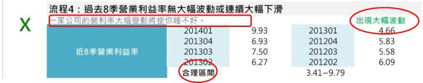
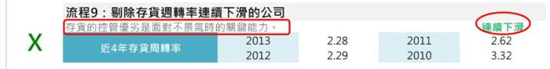
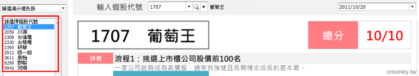
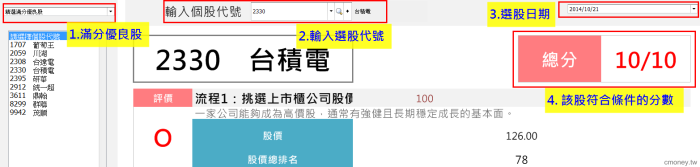

# 用總幹事的 10個選股流程

『財務自由的世界』作者 黃國華總幹事在書中仔細講解關於財報的相關問題，

書中舉例提供如何判斷一間公司的好壞的方法，

並在最後提供了一套挑股票的篩選條件，

而我們應用 這套方法製作成免費開放使用的理財寶: 

進入財務自由的世界 財務分析選股的標準程序

替大家解決不知道該如何選股的煩惱！！

 

##選股10步驟 SOP : 
###1. 挑選上市櫃公司股價前100名
以上市櫃前100作為目標，

一家公司能夠成為高價股，通常有強健且長期穩定成長的基本面。  

                             

###2.丟棄掛牌不到2年的公司及在開曼群島註冊之F-股票
作者認為，一間新掛牌的公司，

利用短期業績移轉，及籌碼優勢炒作出來的股價，

絕對無法撐過兩年考驗期。

所以成立兩年以上的公司比較沒有這種顧慮。

而"F-"開頭的公司，能避免就避免。

                   

###3. 過去4年內不能產生虧損
一家好的公司，是不可以有虧損的，

於是作者以「近四年稅後純益須全大於0」作為篩選條件，

股價位居上市櫃前100名，不容許產生虧損的狀況，

否則股價可能難以持久。

 

###4. 過去8季營業利益率無大幅波動或連續大幅下滑
一家公司的營利率大幅變動，代表公司時好時壞，

作者利用統計方法找出波動的合理區間(下圖紅圈處)

若此8季內有超出此區間

右上角即顯示出「出現大幅波動」。

###5. 過去3年累積自由現金流量須為正數
一家合格的公司得保持長期的正流入。  

一家公司若現金流量為負數，表示公司的現金一直減少，

沒有現金進來的公司則不必多考慮。

 

###6. 最近3個月合併營收年增率至少要大於0
一間公司連生意都衰退的話，空有良好的經營與資產品質也不具投資價值。                                    

投資一家公司就是希望有所成長，

故近三月合併營收年增率要大於0才有投資的意義。

 

 

###7. 過去3年不能辦理現金增資
一間好公司是不會隨便向股東借錢的,

所以近三年不可以有現金增資，

投資擴產的資金應由本業支應才對。                                    

 

###8. 剔除市值不到50億的公司
太低的股本與市值，其高價背後的原因很有可能是人為操控。                                

因為我們在第一項就挑選股價前100名的公司

若高股價公司的股本卻很低

表示其股價會這麼高應該不單純

所以應將股本太小的公司剔除較保險

 

###9. 剔除存貨週轉率連續下滑的公司                      
由於存貨的控管為不景氣時的關鍵

故存貨週轉率出現連續下降表示公司的存貨控管須檢討

若存貨周轉率出現連續下降

右上角會顯示「連續下滑」

###10. 遠離股市名嘴點名的股票
股市名嘴點名股票都是為出貨做準備，

成交量會出現大幅度的上升

若當日成交量比起近20日均量超出350%，應小心為妙!

                               

以10/20的選股為例: 
「精選滿分優良股」條件，可選出以下9 檔滿分的股票:

「精選滿分優良股」條件，可選出以下9 檔滿分的股票:

葡萄王 (1707)

川湖(2059)

台達電(2308)

台積電(2330)

研華(2395)

統一超(2912)

鼎翰(3611)

群聯(8299)

茂順(9942)

使用方法
符合各項標準的「精選滿分優良股」
「精選滿分優良股」清單內的個股，

符合總幹事所列的各項標準，也就是得到滿分10分!!

另外，可以自己在代號欄輸入想要觀察的股票，

也可以更改日期，觀察在某個時點該個股的分數

評價方式
若該篩選項目符合作者要求

便會在前方欄位顯示一個紅色的「O」

若不符合條件即顯示一個綠色的「X」

評價後的總分，會顯示在右上角，

表示該股符合條件的分數。

 

這本書的10個條件，可以幫我們分析公司的各種狀況，

可 確保公司體質良好，

 

但如果現在價格太高，長期持有成本會很高。

這時候，還可以搭配 艾蜜莉定存股

檢視該股的價格到底是低水位? 還是高水位?
