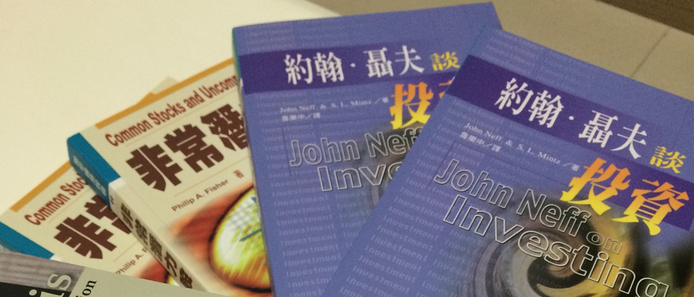

# 約翰・聶夫談投資：低本益比策略的七大選股條件

有時候，某些投資策略就是特別有效。但是有效頂多一兩年，之後風水輪流轉，換成另一種投資策略特別傲人。如果你的投資哲學不夠穩固，那麼你就有可能會因為羨慕其他人的績效，而背棄自己仰賴已久的投資法則。

   約翰聶夫過人的特點在於：不管股市是漲、跌、還是盤整，他的投資風格始終不變，遵守以下的七大選股條件：

- 低本益比
- 基本成長率7%
- 收益有保障
- 總報酬率與支付的本益比兩者關係極佳
- 如果本益比沒有補償，不買週期性股票
- 成長領域中的穩健公司
- 基本面強

現在我們來探討這幾個選股條件的重點：

### 1. 低本益比：統計上最好的策略
低本益比幾乎等於是約翰聶夫的招牌，他不認為自己是『反向操作投資人』，也不認為自己是『價值投資人』，他認為『低本益比投資人』這個稱號更適合自己。

低本益比策略是歷史統計上最好的策略，溫莎基金的績效讓這個策略更有說服力，這個策略有兩個好處：股市上漲的時候能夠參與漲幅，股市下跌的時候則有下檔風險。

但是低本益比的股票不見得就是金礦，你要思考某一間公司的股票為什麼本益比這樣低？通常原因有三：遭人誤解、被人冷落、前景黯淡三種，你要避開前景黯淡的公司，尋找其他好東西。

這些好東西如果搭配第二個選股重點：『基本成長率7%』，那麼未來的增值潛力將如虎添翼，如果市場認清這些好傢伙的價值，未來的增值潛力就能提高50%-100%左右。

###2. 基本成長率7%：保留盈餘成長率加上EPS年增率
基本成長率可以定義為『保留盈餘成長率：Ｇ』Ｇ的數字最好是7%-20％左右，如果同時搭配該公司單季EPS持續提高、並且發放現金股息的情況下，這檔個股的生命跡象就可能被低估。

最後要注意，成長率如果用完，那就有可能回歸平均值。

###3. 收益有保障：現金股息先入袋
收益有保障代表公司有發現金股息，低本益比策略的好處就是現金股息殖利率高，好公司如果願意提高現金股息更好。

股息收益可以帶來等待時間的機會成本補償，如等吃正餐之前，先吃一點開胃菜。

###4. 總報酬率與支付的本益比兩者關係極佳：高登估價法和本益比同時使用。
在本書中，總報酬率指的就是保留盈餘成長率Ｇ加上現金股息收益率，實際上這個公式就是『高登公式報酬率』。

如果把高登報酬率和本益比同時比較，就是『彼得林區評價法』，這個估價法約翰聶夫和彼得林區都有使用。

在使用這個方法的時候要記得：

- 先『預估明年的EPS』，此時可以比較今年的EPS，得到EPS年增率。
- 再預估明年的現金股息，除上現在的股價，得到未來的『現金股息利率』。
- 再計算未來的保留盈餘成長率Ｇ。
- 把Ｇ＋殖利率Ｙ＝預估高登報酬率
- 把預估高登報酬率除上目前的本益比，得到結果。

（注：這些方法在我的書中也有詳細的解釋，可以參考本人著作，或者使用學員專屬功能區加快計算。）

###5. 如果本益比沒有補償，不買週期性股票：
景氣循環股的買進點，就是在股價跌得很慘，EPS成長之前買入，要能夠做到這點，投資人要知道該行業的需求變化以及了解景氣循環。

### 6. 成長領域中的穩健公司
找小池塘的大魚，就是一些沒被注意到，卻是不錯的好公司。但是眾所皆知的好公司下跌時也可以買進，兩者間的比例分配要使用『衡量式參與』

###7. 基本面強：
約翰聶夫只看幾個簡單的數字：營收成長和獲利成長、現金流量表穩定，股東權益報酬率高，營業利益率高。

總結：

這七大指標的原因，背後都只有一點『賣出獲利』，約翰聶夫說：『溫莎每一檔股票都是拿來賣的』，雖然沒人能保證自己的投資一定能獲利，但是七大指標和低本益比能夠幫助你提高勝算。
