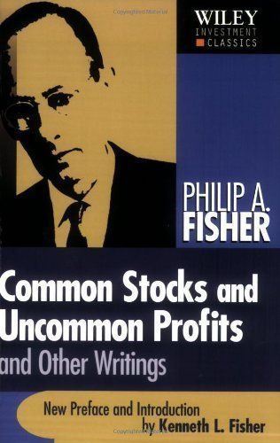

# 非常潛力股：找好股票的15個要點



菲力普‧費雪 Philip A Fisher在非常潛力股這本鉅作中的`第三章：「買進哪支股票」`，列出了投資人要關心的十五的要點，

費雪認為：

```
1.要買 「符合要點」很多的公司
2.「避開」不符合要點的公司
3.有些要點跟公司政策有關
4.有些要點要check 外部資訊
5.有些要點要靠閒聊法。
```

費雪十五要點是尋找成長股的重要質化分析術，價值投資者可以以此提升質化分析的思考，以下是費雪15要點的簡化版，並且附上：銀行家尼莫 對費雪15要點的筆記和註解。


#費雪15要點 (簡化版) 如下：

1.這間公司的產品或者服務有沒有充分的市場潛力，使這幾年可以讓營收大幅成長？
2.管理階層是不是決心繼續開發產品或者製程，在用完目前已經很優越的成長潛力之前，進一步提升總銷售潛力？
3.和公司的規模相比，這家公司的研究發展努力，有多大的效果?

銀行家尼莫 要點一到三註解版：
http://nemochan.statementdog.com/archives/40


4.這家公司有沒有高人一等的銷售組織？
5.這家公司的利潤率高不高？
6.這家公司做了什麼事，以維持獲改善利潤率？

銀行家尼莫 要點四到六註解版：
http://nemochan.statementdog.com/archives/41


7.這家公司的勞資和人事關係是不是很好？
8.這家公司的高階主管關係很好嗎？
9.公司管理階層的深度夠嗎？

 銀行家尼莫 要點七到九註解版：
http://nemochan.statementdog.com/archives/42


10.這家公司的成本分析和會計記錄做的多好？

11.是不是有其他的經營層面，尤其是本行業較為獨特的地方，投資人能夠得到重要的線索， 曉得一公司相對於競爭同業，可能多突出？

12.這家公司已沒有短期或長期的盈餘展望？

13.在可預見的將來，這家公司是否會因為成長而發行股票，以取得足夠的資金，使得發行在外股數增加，現有持股人的利益將因預期中的成長而大幅受損？

14.管理階層是不是只向投資人報喜不報憂？諸事順暢時口沫橫飛，有問題或叫人失望的事情發生時，則「三緘其口」？

15.這家公司管理階層的誠信正直態度是否無庸置疑？

銀行家尼莫 要點十到十五註解版：
http://nemochan.statementdog.com/archives/43
