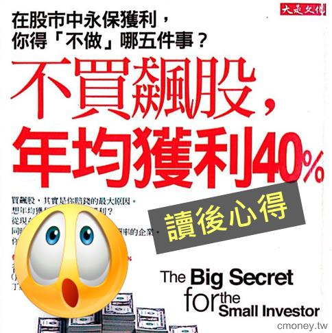
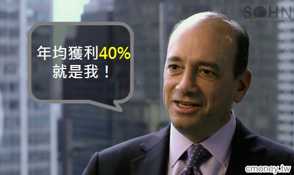

# 不買飆股，年均獲利40%

##巴菲特 年報酬27.7%；他 ，葛林布雷 報酬率高達40%
我是個上班族，領著死薪水，

但我很想改變這個狀況，擺脫小資女的稱號，

於是決定開始研究投資，

上週在博客來找投資理財的書籍的時候，找到了這本書

《不買飆股，年均獲利40%》

以下是我的讀後心得，有問題歡迎留言跟我討論喔！

 

講到投資，你第一個會想起的人是誰？

沒錯，就是股神巴菲特。

那你知道巴菲特的平均報酬率多少嗎？ 是27.7%

但今天我們要介紹的人，他在20年間投資報酬率是40%！

他是誰？他是葛林布雷。

##年均獲利40%的秘訣大公開！
要關心的是股票的價值，而不是市值
一家公司的價值在於未來它能賺多少錢，

但說實話，沒有人能準確預估未來這家公司的獲利狀況，

因此，用股票現在的市值決定投資的股票是天大的錯誤，

你只會買進被高估的、過熱的股票，

所以作者並不打算用市值來決定他該投資哪支股票。

##葛林 只關心殖利率和資本報酬率（ROC）這２個因素

###1.利用現金殖利率，找出便宜股票
要找出被低估的股票，可以用殖利率，

`現金殖利率 ＝ 現金股利 / 股價`　

從公式上看來，殖利率與價格成反比，

所以高殖利率的股票，代表現在股票價格是便宜的，也可能是被低估的，

再拿股價和其他因素比較，如營業額、過去獲利平均值等

以決定股價的「便宜程度」。

##2.資本報酬率(ROC)看出公司運用資金的效果
資本報酬率(ROC)是指投入的資本和得到的獲利的比率，

高資本報酬率是指能用最少的資源創造最大的績效，

代表是能善用資金賺取高報酬的企業，

葛林布雷用這2個因素當作權重產生出價值加權型指數。

這個價值加權指數所決定出的股票組合，

是根據股價的「便宜程度」及一家公司的「品質」。

 

`運用散戶的優勢 對抗法人、大戶`

因為散戶的存在感太小、力量太弱，

是不能夠跟大型機構和法人競爭的，

既然如此，何不利用散戶力量小的優勢，找出自己的獲利公式？

 

##1. 買小公司的股票
因為這些小公司的股票利潤對大型機構和法人來說太低，

所以他們是不會花費時間和精神再研究這些小公司，

市場比較可能忽略或錯估這些小股票的價格，

所以，對於規模小的股票，

積極進取的投資人是有優勢的。

 

但我認為在選擇這些小公司的時候，投資人要慎選，

別忘記前面說到殖利率時要同時比對這家公司的其他基本面。

##2. 別貪心，固定投資幾家就好
謝天謝地，我們沒有客戶要應付，

不會因為一兩個月沒獲利而被客戶淘汰，

所以，我們只要專注在自己的股票上，

也不用多，只要專注研究幾家公司就好。

`時間，是你最好的盟友`

葛林布雷和大多數的投資專家一樣，

認為要談投資績效，

我們必須先持有四年以上，

每日每月的短期資訊，在長期來看是相對無意義的，

在市場是越來越受投資機構主導，

且績效資訊、統計數據無所不在的情況下，

持長期觀點的人將會越來越有優勢。

 

在這裡還是要提醒一下讀者，

畢竟美股和台股的情況有所不同，

如果進場是因為看好基本面，那就別被那些短期資訊影響，

但如果是看技術面、籌碼面，這點可能就不太適合了

 

`投資大師們的共通點：投資心態最重要！`

最後，你可能會好奇，

到底葛林布雷的獲利40%到底是怎麼來的?

其實書裡面並沒有太多的描述，

我本人也一直對這個數字抱持著懷疑?

 

但是，

我想他想表達並不是他有多厲害，或是他能賺到多少錢，

而是想表達雖然 

`好的投資方法重要但正確的投資心態更重要！`

 

人往往過於高估自己的能力，

認為自己夠理性、判斷夠正確，

但其實不然，

我們很容易受到市場上的影響。

因此，擁有正確的投資心態，才有機會能 年均獲利40%。

 

跟葛林布雷一樣專注在公司價值上的 小資女艾蜜莉

專注在股票價值上，檢查公司體質、獲利狀況，

利用`艾蜜莉定存股`，找出目前股價被低估的股票，

在適當的時間進場，領到股利也能賺到價差！

 

最後，《不買飆股，年均獲利40%》這本書是葛林布雷的第三本書，

前面還有《你可以是股市天才》和《打敗大盤的獲利公式》 這兩本著作

如果您認同葛林布雷的投資觀點，

不妨把三本書都看完，因為前兩本更受投資人推崇，

也有詳盡說明他的獲勝公式是怎麼計算的喔。