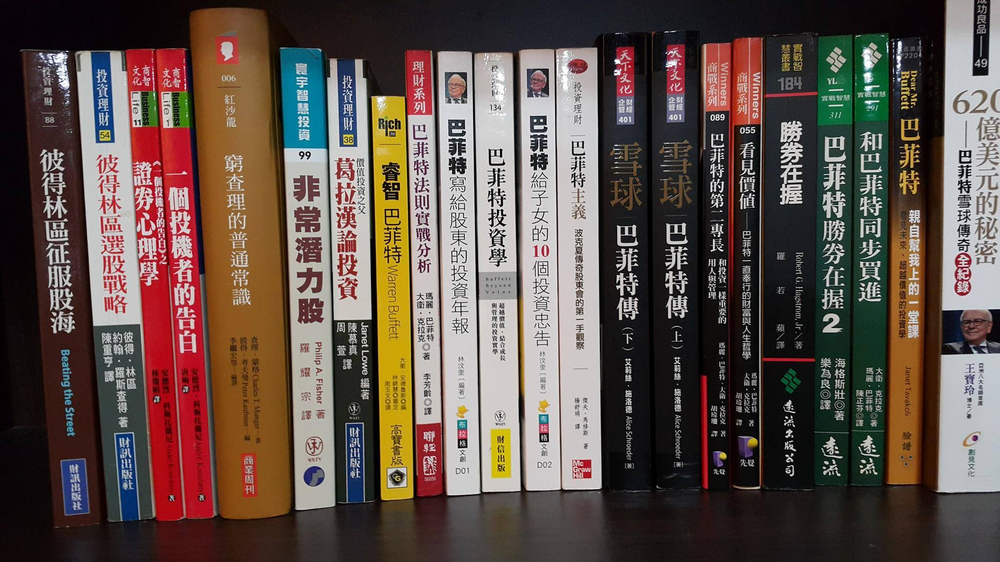

# 流浪教師存零股存到3000萬

01.四處求明牌，不如學習從生活中找尋簡單好瞭解，能創造穩定現金流的賺錢公司，然後堅守存股慣性，坐享複利威力。

02.投資要賺錢，先學會怎麼避開風險，購買毫無生產力的公司，是投機而非投資，一味跟隨媒體追逐主流股，很難在市場生存。

03.營業員的工作，不是真正要你買好股票，真正目的是要叫你一直交易、不停交易。在價值投資裡最重要就是，學習「如何不交易」，有時投資會賠錢，不是因你沒做什麼，而是因你做了太多。

04.想安心存股穩穩賺，還是少碰科技股，因高科技產品，變化速度實在太快，可能公司原本辛苦經營好幾年的根基，一下子就被競爭對手超越取代了。

05.沒有人會比你更在乎你自己的錢，不管是哪支飆股專家說的再天花亂墜，不是你親自下苦工做過功課的，還是少碰為妙。

06.不需要盲從，不受群眾影響，或受到短期利多、利空因素而心生動搖，有時接收太多資訊，還不如完全沒有資訊。

07.一家好公司，營運狀況不要有太多不確定的因素，如果自己當下無法搞清楚，最好的方式就是不要碰。

08.短線價差交易並不是不好，而是你會為了很多不相干的事情影響到工作、生活、情緒，而且必須隨時處在為了解總體經濟、追蹤籌碼、緊盯K線、全球動態等的壓力之下，更何況人只要一有壓力，智商就會降低，容易判斷失準，長久下來還不一定會賺到錢，甚至更導致精神耗弱，反而得不償失。

09.就算是好公司，如股價沒有進入自己設定的合理價位內，就不要輕易出手，也應避免重壓單一產業，需適當控制整體持股風險。

10.絕不借錢投資，才不會遭斷頭難翻身，檢視自己資金狀況，投資比重勿超過容忍上限。

11.人都有一種心態，不怕買貴，但就是怕買得比別人貴，所以不要忘記能分批進場的好處。

12.永遠保持謙卑，因股票市場什麼事情都可能發生，有時寧願不賺，也不要賠錢。

民生消費類型好股6大特點：

◎具有「壟斷」或「寡佔」特性，最好在該產業市占排名前二名。 
◎簡單易懂、經久不變、具有持久性。 
◎自由訂價能力高、受景氣影響小，並且能讓人重複消費。 
◎具有高毛利率或高存貨週轉率，股東權益報酬率最好大於15%。 
◎長期負債占稅後淨利比重低，小於2才合格。 
◎獲利穩定成長且持續每年配息。 

※食品製造業：統一、佳格、聯華食、大統益、宏亞、南僑、中華食、天仁。 
※公用事業：台塑化、全國、崑鼎、日友、可寧衛、台汽電、大台北、欣天然、新海。 
※電信與有線電視：中華電、台灣大、遠傳、大豐電。 
※物流：大榮、宅配通。 
※零售：統一超、全家。 
※資訊服務：一零四、網家、富邦媒。 
※保全：中保、新保。 
※塗料：永記。 
※汽車：和泰車。 
※金融：中信金、國泰金、富邦金。 