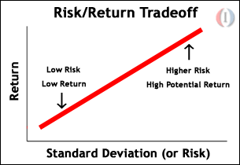
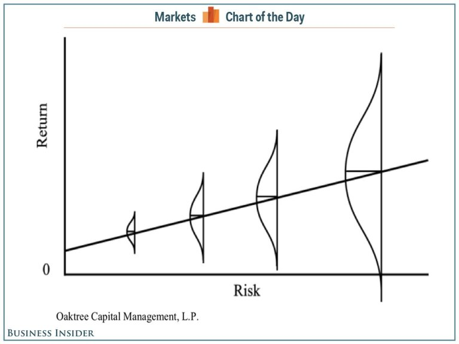
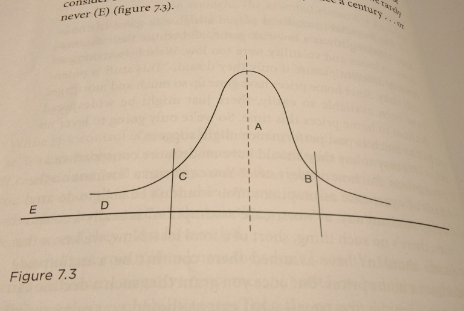

# 投資最重要的事

## 投資最重要的事 (一)

原文書名叫做The Most Important Thing Illuminated: Uncommon Sense for the Thoughtful Investor，作者是知名價值投資大師霍華馬克思(Howard Marks)。巴菲特對此書的評價是:"This is that rarity, a useful book." 可見這本書有多麼厲害!

我看過的投資書籍還不少，投資最重要的事是我看過最喜歡的一本，大約重覆看了三次，而且我確定自己還會一直重覆看下去。也因為這本書每個章節都是投資中最重要的事，所以我遲遲沒有寫閱讀筆記(太多了，不知道怎麼寫)。最近台灣出了繁中版，所以我想我就趁這機會來寫一下自己從此書得到最大的收穫吧。(如果有英文閱讀能力，建議上亞馬遜買原文書。翻譯作品往往和原文會有些微不同。)

我一開始接觸投資時就讀了關於巴菲特的書，而市面上巴菲特的書講的大部分都是他後期的投資方式，簡單說就是`用便宜或合理的價格買進好公司`。巴菲特說過，他寧願用合理的價格買進優秀的企業，也不要用便宜的價格買進普通的公司。這樣的觀念在我腦海裡根深蒂固，直到我讀了霍華馬克思的投資最重要的事。

霍華馬克思說，`資產本身的好壞並不是重點，沒有一種資產是爛到再便宜的價格都不值得買進的，也沒有一種資產是好到再貴的價格都值得買進。重點是你付出的價格；你付出的價格決定了你的風險`。

霍華馬克思說，資產本身的好壞並不是重點，沒有一種資產是爛到再便宜的價格都不值得買進的，也沒有一種資產是好到再貴的價格都值得買進。重點是你付出的價格；你付出的價格決定了你的風險。

讀到此時我有種醍醐灌頂的感覺。沒錯，資產本身的好壞並不是重點，價格才是重點! 舉例來說，垃圾對大多數人來說都是沒有用的，但如果免費給我數萬噸的垃圾，我要。為什麼? 因為我所在的歐洲某國家環保做得太好了，焚化廠沒垃圾燒，還要從鄰國進口垃圾。如果免費給我大量的垃圾我可以賣給焚化廠賺錢。資產本身的好壞並不是重點!

再舉一個例子。在全新的iPhone與HTC手機兩者間作選擇，大多數人會認為前者品質較好。現在假設我一台全新iPhone賣你台幣五萬，另一台全新HTC賣台幣一千，理性的人都應該選後者。雖然iPhone對多數人來說價值較HTC高，但付出五萬的價格去購買並不划算；反之，若能以一千台幣購入全新的HTC，在網路上隨便轉賣個五千塊也一定有人會買，因此風險幾乎是零。投資也是一樣的道理。公司的好壞並不是風險的決定性因素，重點在投資人付出的價格。

事實上巴菲特早期就是偏向這種觀念。受老師Ben Graham影響，他早期偏好投資在所謂的"雪茄屁股"上，並且獲得了驚人的報酬。巴菲特說在遇到查理芒格後他想法進化了，變成以合理價格買進優秀公司為主。這跟他管理的資金大小也有關係，巴菲特後來的資金越來越大，要用原本的方法會變得越來越困難，而且到後來巴菲特往往是收購整家公司，雪茄屁股的投資法就不適用了。

另一名價值投資大師賽斯克拉曼(Seth Klarman)曾說過，他還沒進化，還停留在第一階段。霍華馬克思(Howard Marks), 麥可貝瑞(Michael Burry)等人也都偏向如此。但他們也都有非常優異的投資績效。

對於資金不是很大的人，我覺得這觀念尤其有用。如果沒有讀過這書，我去年就不會去研究海運業和能源業這種糟糕的產業，也就不會從中找到獲利的機會。但我還是同意巴菲特說的；長期來看，用合理價格買進優秀的企業，透過長時間的複利，會帶給投資人最大的報酬。以低價買進價格低於內在價值的普通公司，等到價格接近內在價值時就應該賣出，這樣的公司並不適合長期持有。以上面的手機例子來看，如果是要自己長期使用不是要賺價差的話，大多數人還是會選擇以合理價格買入iPhone，而不是買HTC。

不管是第一種或第二種方式使用得當都是能獲利的。但`價格才是關鍵因素這點`，看似簡單，我卻過了很久才領悟。感謝霍華馬克思。

## 投資最重要的事 (二)

上一篇講到了這本書中所說的–`價格才是重點`–大大地改變了我的觀念。這篇要講的是`第二層思考(Second-Level Thinking)、反向投資(Contrarianism)、以及尋找便宜貨(Finding Bargains)`。

什麼是第二層思考(Second-Level Thinking)? 第一層思考的人會想: 這是個好公司，所以我要買那公司的股票。第二層思考的人會想: 這是個好公司，但每個人都覺得這是家非常棒的公司，所以股價可能被高估了，我要賣出。

第一層思考的人會想: 這公司前景不好，我要拋售股票。第二層思考的人會想: 這公司前景不好，但每個人都驚慌地拋售，股價可能過度反應了，是買進的好時機!

第一層思考的人看到公司接連有好消息會想: 這公司看起來前景很棒，我要買入! 第二層思考的人會想: 這些可能是用來出貨的利多消息，且股價已經高於內在價值了，我要賣出!

這跟反向投資(Contrarianism)道理是一樣的。當別人瘋狂搶購時你要賣出，當別人瘋狂拋售時，你要買入。也就是巴菲特所說的: 別人貪婪時，我恐懼；別人恐懼時，我貪婪。

跟反向投資相反的就是動能投資(momentum)，簡單說就是看趨勢是上漲/下跌就跟著買進/賣出，或者可以更簡單說就是追漲殺跌。這樣的投資策略在學界和業界都很常見，大部分的散戶也是如此(這與心理學有關)。然而，你聽過許多價值投資大師(巴菲特、霍華馬克思等)，但你聽過哪個非常成功的投資者是動能投資大師嗎? 零，一個也沒有。所以哪種投資策略能帶給投資人報酬，答案已經很明顯了。

第三點是尋找便宜貨(Finding Bargains)。最佳的投資機會通常可以在眾人不喜歡的地方找到。這是再合理不過的事了；如果大家都喜歡，那麼價格一定不便宜。關於去哪裡尋找便宜貨，可以參考我[另一篇文章](https://valuepartnersblog.wordpress.com/2017/02/02/%E5%B0%8B%E6%89%BE%E5%83%B9%E5%80%BC-%E8%82%A1%E5%83%B9%E8%A2%AB%E4%BD%8E%E4%BC%B0%E7%9A%84%E5%85%AC%E5%8F%B8%E5%8E%BB%E5%93%AA%E6%89%BE%EF%BC%9F/)。

## 投資最重要的事 (三)

第一篇講到了這本書中所說的–`價格才是重點`–大大地改變了我的觀念。`第二篇介紹了第二層思考(Second-Level Thinking)、反向投資(Contrarianism)、以及尋找便宜貨(Finding Bargains)`。這篇要講的是關於`風險`。

霍華馬克思在書中花了三章講風險，可見風險在投資中有多麼重要。另一位大師賽斯克拉曼(Seth Klarman)也說過，風險是最重要的，專注在報酬之前，應先專注在風險。不過一般人在投資時往往相反，只看到潛在報酬，沒考慮虧損的風險。

 

###什麼是風險?

學術界將風險定義為波動性(volatility)，這是錯的。風險不是波動性，波動性創造機會。 風險是虧損的機率，還有在虧損的情況下你能承受多少損失。巴菲特也說過，風險是資本永久性損失的機率，不是波動性。

學術界以及大多數投資人以為的風險-報酬關係是像上圖這樣的，也就是高風險帶來高報酬。霍華馬克思認為風險-報酬的關係應該是像下面這個圖。較高風險的投資，是那些結果比較不確定的；也就是說報酬的機率分布比較廣。

多數人視承受風險為主要的獲利方式。承受風險通常帶來高報酬；市場必須讓這件事看起來是如此，要不然就沒人會做有風險的投資。但承受風險並不總是帶來高報酬，要不然它就不會有風險了。

(價值投資是一種追求低風險高報酬的投資方式，可以參考另一篇文章介紹的[下重注的本事：當道投資人的高勝算法則](http://www.books.com.tw/products/0010744315?utm_source=nsc2014&utm_medium=ap-books&utm_content=recommend&utm_campaign=ap-201702)。)

霍華馬克思寫到，在判斷一個投資經理的績效時不能只光看報酬，僅僅是報酬，尤其是短期的報酬，無法說明投資決策的品質到底好不好。報酬要以相對承受的風險去衡量。我舉個例子: 假設一把左輪手槍裡只有一發子彈，你朝自己腦袋開槍，如果你沒死可以獲得一千萬，結果你扣板機後真的沒死得到了一千萬。一千萬，報酬不錯吧? 但這風險是無法承受的高，雖然得了一千萬，但這無疑是個愚蠢的決定。有許多投機者槓桿開很大，平常好像賺很多，但遇到一次意外就陣亡，和這例子是一樣的道理。

###要如何辨識風險?

`高風險主要來自過高的價格`。價值投資者認為高風險和低預期報酬是一體兩面，兩者都是過高的價格所致。過高的價格，常常來自過度的樂觀和不足的風險趨避。

`風險產生的一個主要因素是相信該投資的風險很低`，這樣的想法會推高價格並導致投資人擁抱風險。2008年前的房市泡沫就是這樣來的；人人都認為房價只會漲不會跌，加上貸款很容易，風險就隨著泡沫越疊越大。反之，當每個人都認為某樣資產風險很高，沒有人願意買入，常常導致該資產的價格下降到幾乎無風險的程度。

 

###控制風險

在市況好的時候很難去判斷一個投資組合承受了多少風險，或者風險控制好不好。誠如巴菲特所說，只有當潮水退去才知道誰在裸泳。風險控制在市況好的時候是看不見但必要的，因為市場很可能急轉直下。

我們通常會預期結果是接近"正常值"(A)，但我們知道有時候也會見到比較好(B)或比較差(C)一點的結果。我們往往會忘記離群值(D)發生的可能，更重要的是，我們幾乎不會考慮百年發生一次的結果(E)，就像2008金融海嘯發生時那樣。

控制風險和完全避免風險是不同的，完全避免風險也意味著避免了報酬。霍華馬克思在適當的時機、適當的價格對風險是持歡迎的態度。長期的投資成功靠的是控制風險；大部分投資者的績效是由有多少虧損的投資、虧損有多大而決定的，而不是由賺錢的投資而決定。霍華馬克思曾舉一個退休基金為例，該基金在其投資年限內，排名從未有一年低於前47%，或者高於前27%，結果14年下來的總體業績卻排名在前4%。也就是說，避免災難性的損失，長期而言複利的效果將使你擁有出眾的績效。