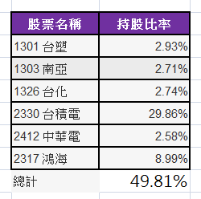

# 0050ETF 每季會有個前十大持股名單

有稍微研究0050ETF 的人都知道，它每季會有個前十大持股名單。

今天好奇的逐季比對，沒錯！我核對了55季的前十大名單。
果真是看盡個股興衰，有些股票爬上來幾季又跌出榜外，或來來去去。這就是0050ETF 以市值加權指數機制！

從中發現有6檔是一直在榜單內，從未跌出。在此表揚一下：
下次看0050前十大持股的成份股，我相信這6檔股票未來仍然在內。
網友一定感到奇怪，我怎麼一直提這些呢？哈哈^ ^
.
.

巴小智 2017.5.9