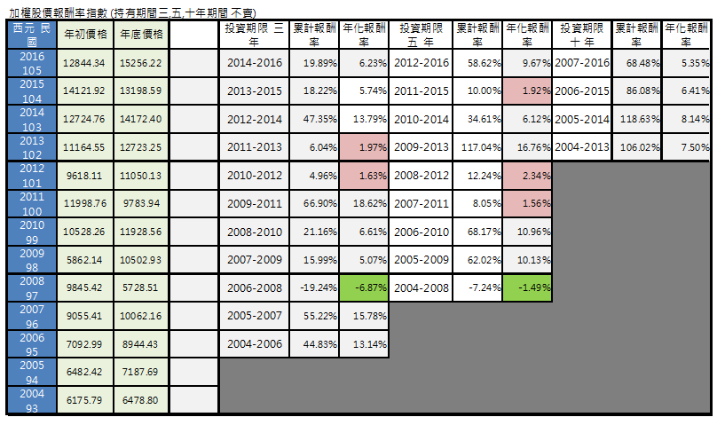

# 0050ETF 與 發行量加權股價報酬指數

##認識 0050 - 

討論0050的文章多如牛毛,就不再累述。0050是追蹤臺灣50指數之績效表現，成分股是由上市股票中評選出50檔市值最大、符合篩選條件的上市股票。

市值加權指數是指一種以每隻成分股的流通數量乘上每隻股票的價格為基礎確定數值的股票指數。是以股票市值作為權重計算出來的指數。

市值加權指數的計算公式請參閱圖一 ,在此並不打算深入理解計算過程。而是了解市值排名越前面,流動性佳的個股它就會待在0050內。

圖二,三 是目前0050成份股的市值排名。這是前幾天做的表格因此數值可能跟今日有些許差異。因為市值=股本X股價 
然而股價每個交易日都會變動,因此市值也會跟著改變。

根據統計0050的市值約佔大盤比重的 69.44% ,台灣上市公司約900家。50家公司佔大盤市值約7成.相當驚人。

0050 成份股的產業類別分佈,參閱圖八。其中電子股約佔61.79% ,傳產 19.33% ,金融 17.37%

##認識 發行量加權股價報酬指數

台灣加權股價指數有兩種：一種是「台灣發行量加權股價指數」，另一種則是「台灣發行量加權股價報酬指數」。兩者的差別是考慮配息對指數的影響。

台灣證券交易自91年12月31日起，開始編列台灣加權股價報酬指數，主要目的就是以配息的再投資角度，計入加權股價指數。方法是每當有上市公司除息時，就會調整指數的基期，使得指數維持不變，不會因為配息而降低。這樣的目的讓指數好似沒有經歷過配息一樣，也就是相當於把配息再投入。因此我們應該以

加權股價報酬指數來計算大盤報酬率才對!

認識市場報酬率 (2004 - 2016年期間.總共13年)

圖 四 加權股價報酬率指數 (年初買,年底賣)
單年度 負報酬率 3次, 低於5% 1次。
三年期 負報酬率 1次 , 低於5% 2次。
五年期 負報酬率 1次 , 低於5% 3次。

圖 五 加權股價報酬率指數 (持有期間三,五,十年期間 不賣)
三年期 負報酬率 1次 , 低於5% 2次。
五年期 負報酬率 1次 , 低於5% 3次。

圖 六 0050 ETF (年初買,年底賣)
單年度 負報酬率 3次, 低於5% 1次。
三年期 負報酬率 1次 , 低於5% 4次。
五年期 負報酬率 1次 , 低於5% 3次。

圖 七 0050 ETF (持有期間三,五,十年期間 不賣或永遠持有)
三年期 負報酬率 1次 , 低於5% 4次。
五年期 負報酬率 1次 , 低於5% 3次。
持有13.5年不賣 年化報酬率 8.6%

註: 綠色代表負報酬率 ; 暗紅代表報酬率低於5%
由於加權股價報酬率指數與表格的0050股息再投入時間不同,因此當作參考就好!
結論:持有十年時間的年化報酬率至少超過5%

在此無意比較0050與加權股價報酬指數報酬率的差異。
而是提醒投資人,投資時間越短,報酬率的波動越巨大。不同時期的三年,五年的年化報酬率差異甚大。

哇!怎麼會這樣呢?這就是市場報酬率。就算你是投資個股也是如此,而且多數人長期下來還輸給0050。

以長期持有(十年時間)觀察,年初買,年底賣 股息再投入!年化報酬率約略 在5.5~7.4%之間。

若是0050成立時就開始投資至今13年半,年化報酬率約8.6% 

當然不是人人都這樣年初買,年底賣 0050。因此認知的報酬率也會跟表格內的數字不同。

在忽略買賣交易費,手續費的前提下。可以發現年初買,年底賣跟年初買且持續再投資不賣的報酬率差異並不大。

明天我們將繼續談如何提升0050ETF的投資報酬率？

巴小智 2017.5.18