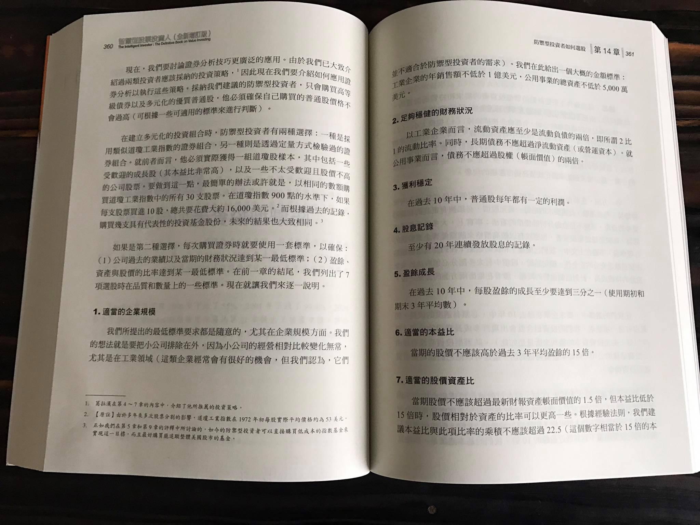
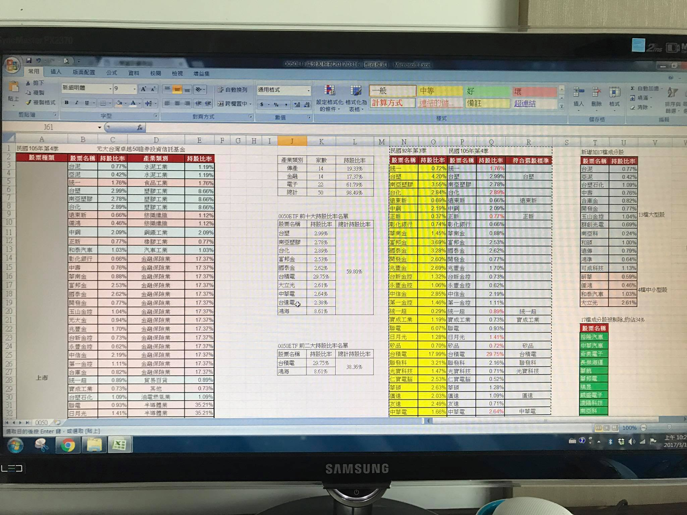
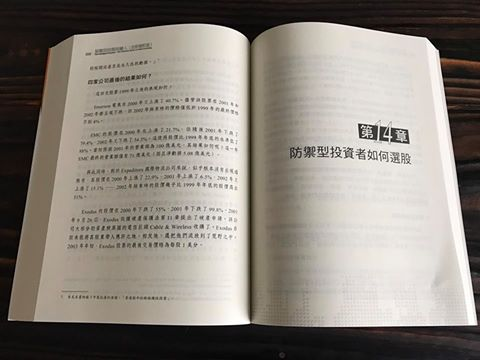

# 2017.3.16

這兩天在拆解0050ETF 成份股92年度迄今過去14年的演變情形。持續深入瞭解它！
同時也在複習「智慧型股票投資人」ㄧ書，葛拉漢的投資思維很值得我們反覆的思考並且學習。
投資組合的建立與多次買賣回測，確認自己真的很適合防禦性股票投資。
這次提出的觀察名單將以大型權值股為主，同時保持化繁為簡的投資原則。
個股分析、股價回測系統皆已經初步完成，剩下的會交由好友幫我確認資料的正確性。
再來就是開始專心寫文章論述如何看待這份投資組合，希望未來這份資料真的可以幫到工作忙碌的人們。^_^

