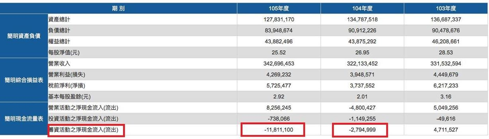
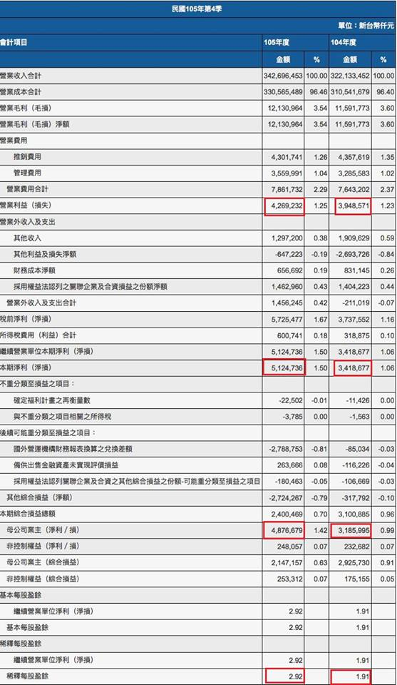
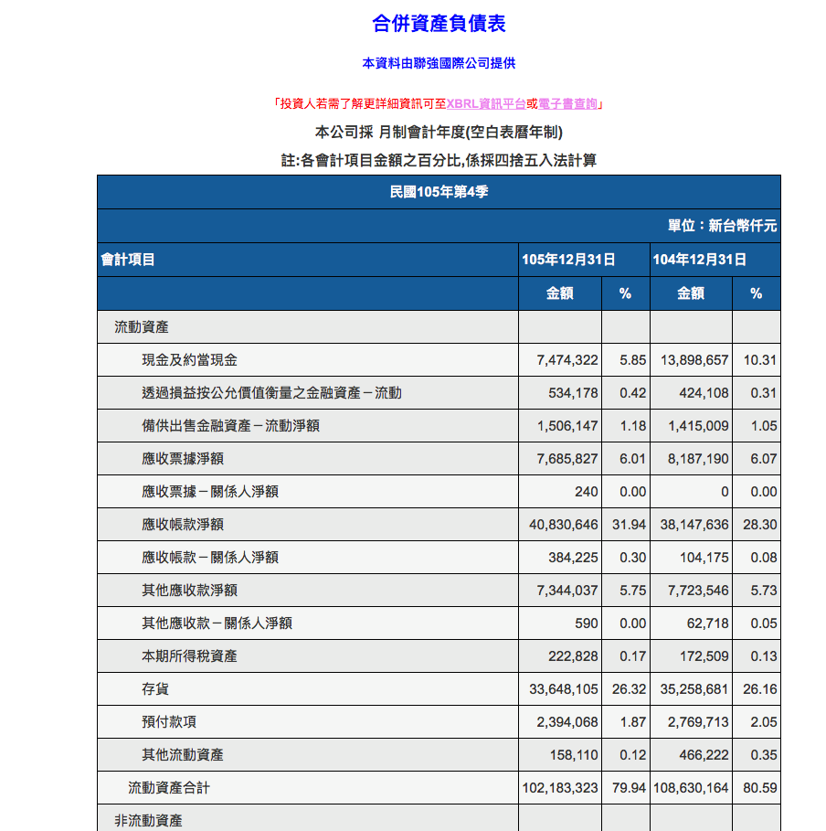

# 20173.17

今晚的大事 - 聯強配息 一元。
抱聯強的網友應該難掩失望之情.....
居然打破了20年來保持的最低股利記錄。
其實我也蠻意外的,聽到股利後的第一個反應,年報公布了嗎?
看到損益表 eps 2.92元 鬆了一口氣!
再看現金流量表,自由現金流為正,但融資活動流出118億元,造成公司約當現金剩下74.7億元比去年同期139億元減少許多。
我認為這是聯強擴展業務流出的資金,並無異常。
不過股利低於2元總是令人遺憾!這要看網友看重的是今年股利或是將來營運更好的資本利得。目前看來聯強對不起股東的是股利太低,但營運確是比我們預期的eps2.8元好。
出自善意分享自己的觀點,你可以不認同。網友務必要獨立思考,判斷。謝謝大家 ~

