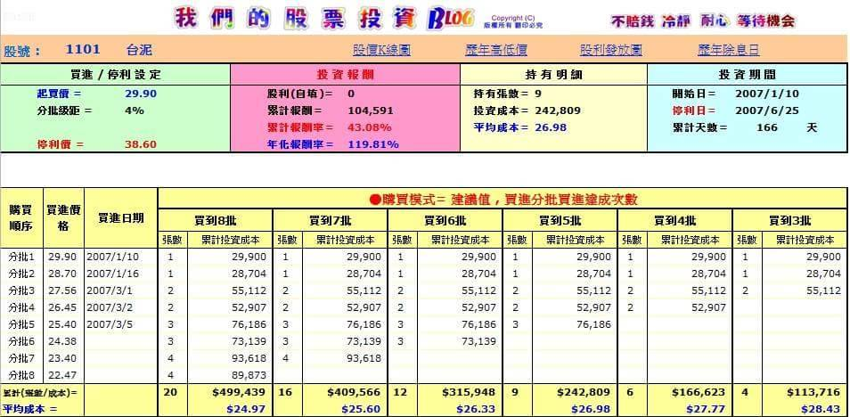
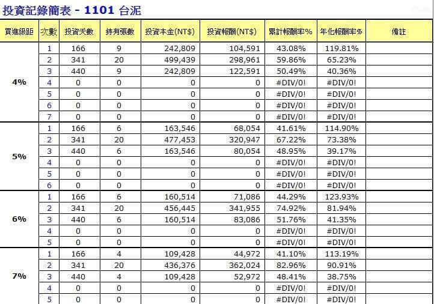

# 巴大107.01.05筆記

關注自己`「慎選」想買進的股票後`，從第一次買進理由開始，就要認真的持有它，`若基本面沒有變差`，而僅是`市場先生的殺出`，設定可用的資金實施「分批」並「勇敢」的往下買，讓自己有個想法「有現金在手，看到綠的比紅的開心」。股價低迷期慢慢增加張數，直到企業營運回溫，當你持有時間長久，慎選的股價高低點都會碰到，等到「期待對自己有利的價格」來臨時出場，相信能讓自己收獲滿滿！而對於「股票」熟悉，它在季節中的高低點，我們是應該知道的，如此ㄧ來，股價在相對低點才能勇敢買進！

##備註：
（一）以5%或7%為一個級距，以五批買進，雖不容易買到，但買到後比較安心。 
（二）分批級距的大小，取決於第一次買進的價格。並非固定，可以自由選擇。 
（三）如果是以分批買進操作前提，買進價設定過低也未必是好事！因為只買一兩批就到最低價。而未來出現雖有高報酬率，但因為張數少，其實賺不到大錢。 

