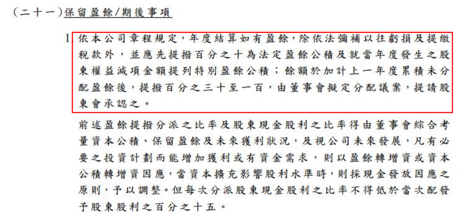
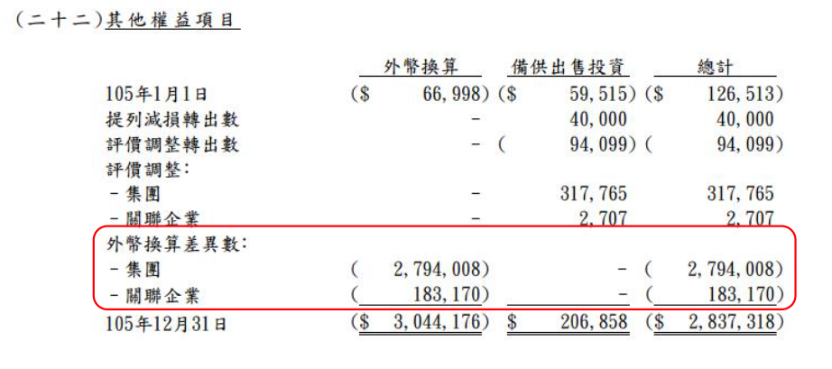
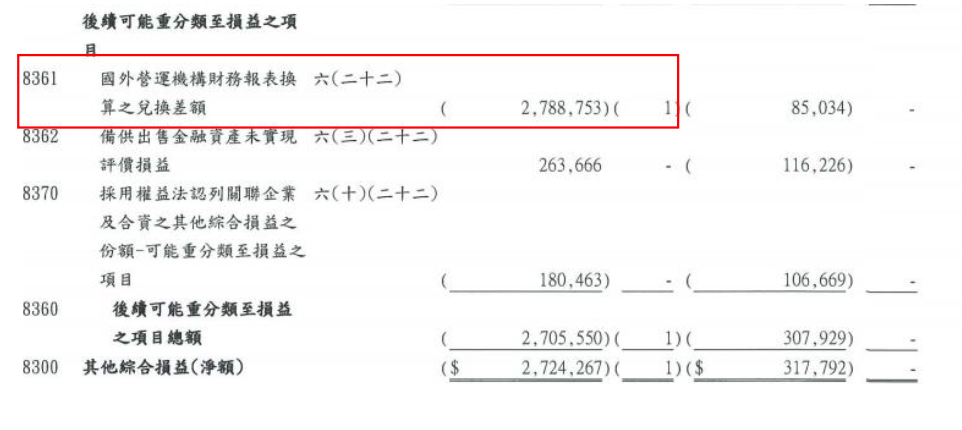
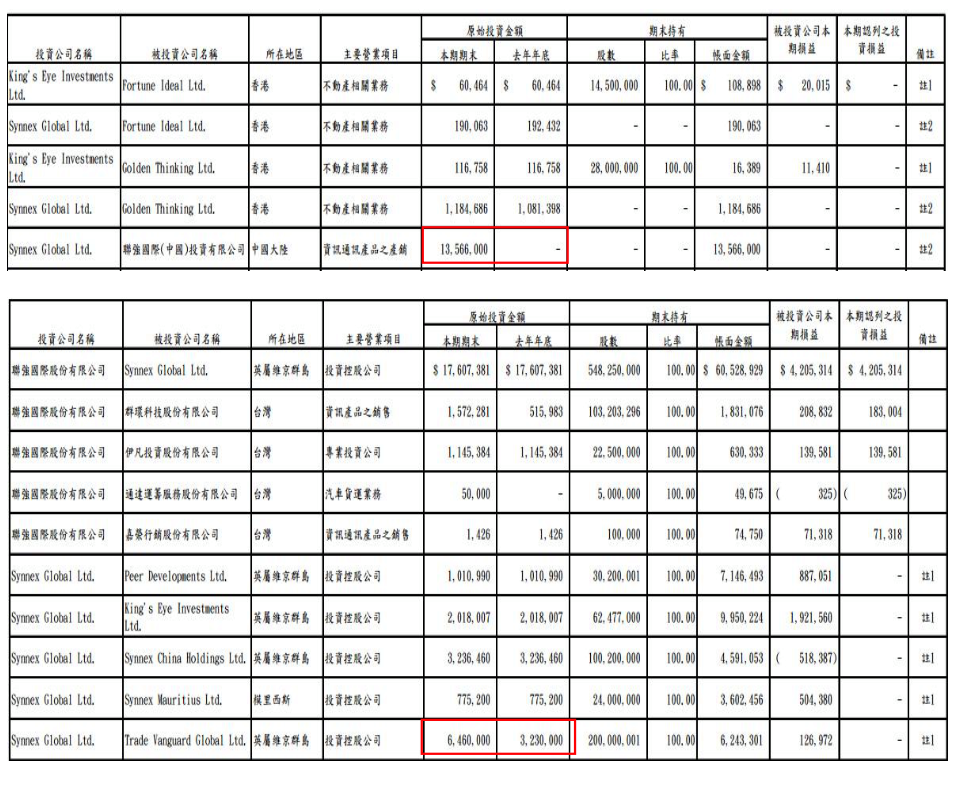

# 巴小智 2017.3.22

這位網友不僅很認真在投資聯強,而且大方的分享他的觀點。他不願透露自己的名字,因為只是出於分享的熱忱。
代表粉絲團再次表達感謝之意 ~
ps 跟回應單車大的那篇是同一位作者。
.
.
.
巴小智 2017.3.22
-----------------------
由於這次自己因為倚賴自己以往的經驗，導致沒仔細看財報附註該項的疏失，造成自己在看 到聯強股利的時候也一頭霧水，不過後來發現其實原因財報上一直都有，於是，算對自己的 一個反省，決定做一下整理。提醒自己，魔鬼就藏在細節裡。

A、首先看一下聯強關於保留盈餘處理方式的規定，係遵循公司的公司章程來做處理 (圖A）

B、再來看一下，下表關於”資產負債表”中，”股東權益”項下的的”其他權益”breakdown （圖 B)

C、接下來是”損益表”內的”其他綜合損益”關於”國外營運機構財務報表換算之兌換差額”金額 (圖C）

先提一下會計恆等式，資產=負債+股東權益，另外如果稍微挪動一下公式， 變成資產-負債=股東權益來看，股東權益也就是所謂的"淨值"(資產-負債)， 所以雖然這個所謂的”國外營運機構財務報表換算之兌換差額”沒有顯現在一般損益上，而是 顯現在綜合損益內，但是在結進資產負債表時，他是有造成企業的股東權益(淨值)下降的; 故針對這一部分去扣住相對應的盈餘，其實也是在保護長期的投資人。

關於說為何 2015 跟 2016 的匯損會體現在不同地方，這部分主要是 2015 年採取的方式是將 所需的資金由母公司借給子公司，所以在借款的評價上產生了影響損益表的匯兌損益，但也 是因為這樣的原因造成損益表有很大的波動，所以在 2016 年改成將資金改成直接"投資"子 公司，也就是變成長期投資科目了，所以變成體現在綜合損益表內。至於說為何以往不如 2016 年處理，個人解讀是，墊借款的性質收放比較方便，改成投資的話變成子公司的股本， 要收回變成要子公司辦減資才能退回，是比較不方便的，所以相關處理方式當然是用墊借款 方式會比較靈活比較好。（圖 D)

另外說明一下聯強保留盈餘相關的政策，其實他要多發是可以的，未分配盈餘是累計的概念， 政策以是帳上的未分配餘額去扣除當年度的權益減項金額當做可以供股利分發的基數，以 2016 年來說，2016 年底未分配盈餘餘額是 7,992,064(仟元)，2016 年度權益減項為 2,710,805(仟元)，兩者相減後為 5,281,259，也就是他必須發放 5,281,259 的 30%~100%，此 次發放金額是該在區間無誤。

很多投資人(我自己也是)通常可能因為像我一樣沒細看政策， 而且經驗上沒碰到的原因是多數企業其實都有一定程度的累積未分配盈餘(以前年度留下的) 可以配發，所以配發上看不出端倪。所以此次聯強配發政策除要看到”國外營運機構財務報 表換算之兌換差額”的影響外，另外還要注意聯強是刻意要留現金的，不然要配他還是能配到 3 元以上的。(這部分可以參考定錨投資隨筆內聯強 2016Q4 法說簡評中有提到的聯強依然 在留意購併機會，故留下現金。)

