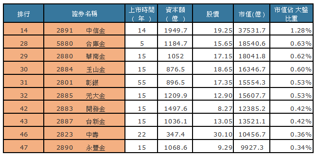

# 巴小智的投資組合

##前言
投資0050 可以得到接近市場的報酬率,我想應該沒人會質疑。0050內的50檔成分股是用市值加權指數篩選而來的,它成功的追蹤台灣50指數。0050 持股周轉率低,並且每季依據市值加權指數調整成份股。
任何選股的工具多有其侷限性,市值加權指數選股法也是如此。有些人不想買0050是看到成分股內有一些營運績效並不突出,只因為市值高而入選深感疑惑,而寧願自己挑選個股投資。
這段時間深入了瞭解0050成份股內容發現確實如雷大(雷浩斯)所講的個股營運水準表現不一。

圖一 

投資組合 個股名單

圖二 
投資組合個股的短,中,長期 營運績效」

`ROE 不適用金融股`，因此只有16檔個股統計ROE。

圖三 

投資組合個股佔台灣50成份股持股比重高達 69.88%

圖四 

投資組合個股 產業類別分佈

##投資組合選股原則

一 . `在市值加權指數基礎上搭配觀察企業的短,中,長期營運績效(ROE),將基本面不佳的成份股去除。`

例如 : ( 圖 五 )

2303 聯電 , 2408 南亞科, 3481 群創, 2409 友達, 1102 亞泥 , 2002 中鋼 

`營運長期不佳的個股`

2408 南亞科 受惠於DRAM景氣翻多而拉高ROE,但營運起伏過大。不適合長期投資人! 這是看天吃飯的產業,少碰為妙!

二 . `對於防禦型投資人應該盡量少碰觸高成長股、高價股，尤其是競爭激烈的科技類股。因為很難判斷其企業價值`

例如 : ( 圖六 )

3008 大立光, 2454聯發科, 2357 華碩, 2207 和泰車, 
1476 儒鴻, 2395 研華, 2474 可成

營運良好的成長股
`防禦型投資人受限財報知識不足,無法判斷成長股的投資價值。因此避開為宜!`

三 . `保留四檔優質金控股即可,其餘刪除。`
例如 : (圖七 )
2891 中信金, 5880 合庫金, 2880 華南金, 2884 玉山金, 2801 彰銀, 2885 元大金, 2883 開發金, 2887 台新金, 
2823 中壽, 2890 永豐金

四 . `上市未滿十年,不投資。`
例如 :
4938 和碩

五 . `0050依據市值加權指數調整成份股的做法是為了每季都維持市場前50名高市值加權指數的個股。`

我們只需要20檔個股就夠了，因此尋找`市值排名35以內的個股`,降低未來持股調整次數。`用心於不交易!` `因此將市值排名35名以後刪除。`
例如 : ( 圖八 )
9904 寶成, 2301 光寶科 , 2324 仁寶 , 1402 遠東新 , 2354 鴻準 , 1101 台泥

剩下的20檔個股就是我們這次公佈的投資組合名單。
例如 : ( 圖二 )
半導體代工 - 2330 台積電, 2311 日月光, 2325 矽品

電子代工 - 2308 台達電, 2317 鴻海, 2382 廣達

電信 - 2412 中華電, 3045 台灣大, 4904 遠傳

食品 - 1216 統一

塑膠 - 1301 台塑, 1303 南亞 ,  1326 台化

油電燃氣 - 6505 台塑化

百貨業 - 2912 統一超

輪胎 - 2105 正新 

金融 - 2881 富邦金, 2882 國泰金, 2886 兆豐金, 2892 第一金

這是一份「主動」的選股名單,從0050成份股內挑選市值排名在前35名，且過去十年營運績效(ROE)良好的成份股,未來盡量減少更換持股原則下,進行長期投資。

明天我們將公佈這些入選個股過去10年的基本營運資料,與過去13年的投資績效回測數據。
其它的問題,我們會一篇一篇的詳細解釋。請稍安勿躁!
謝謝。

巴小智 2017.5.20