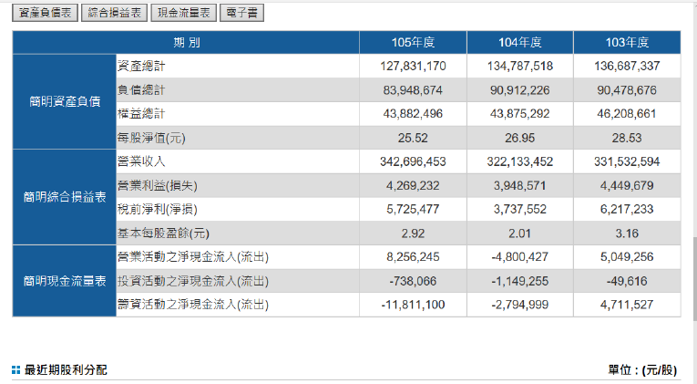
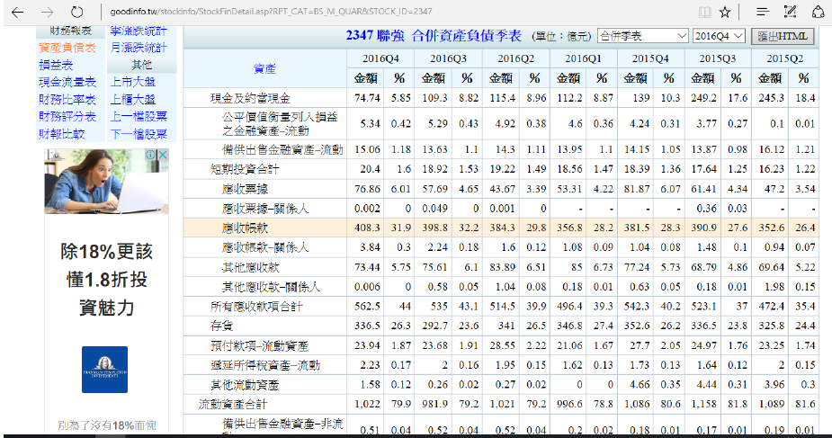
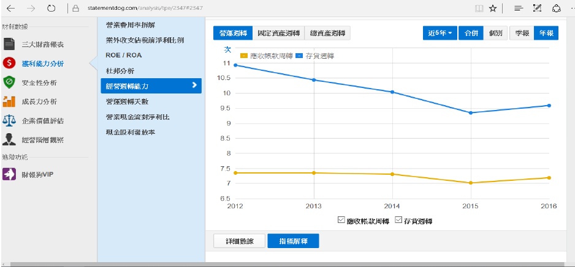
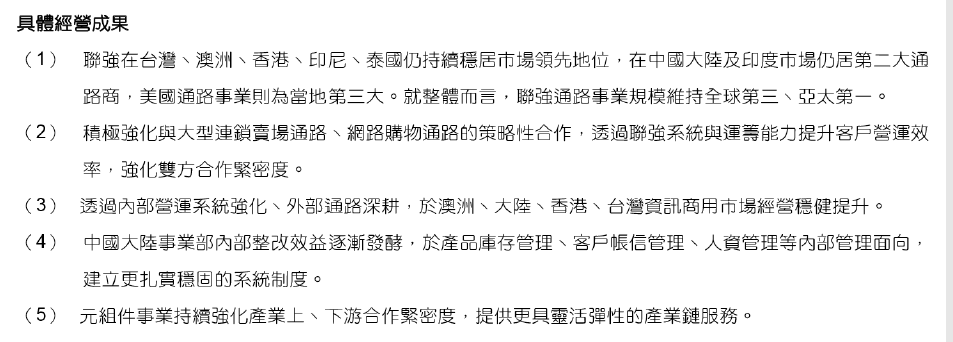
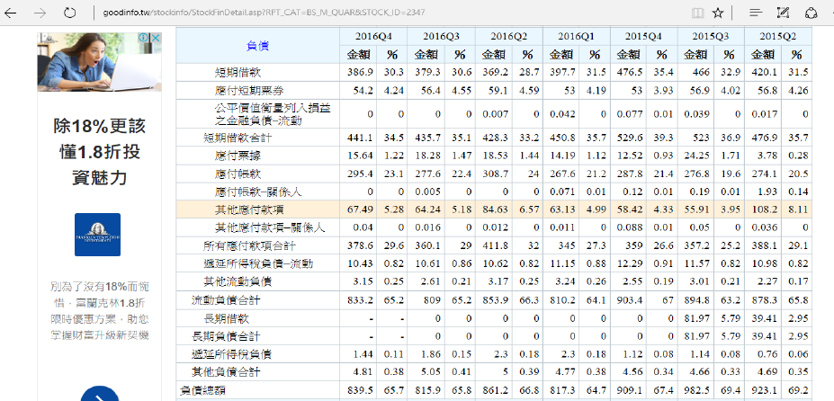
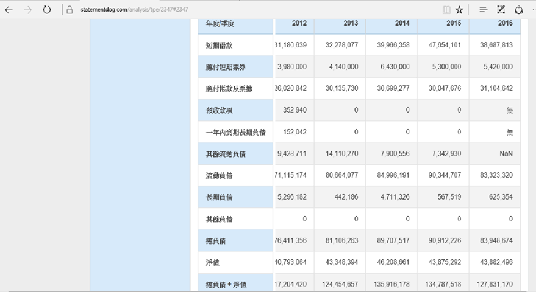
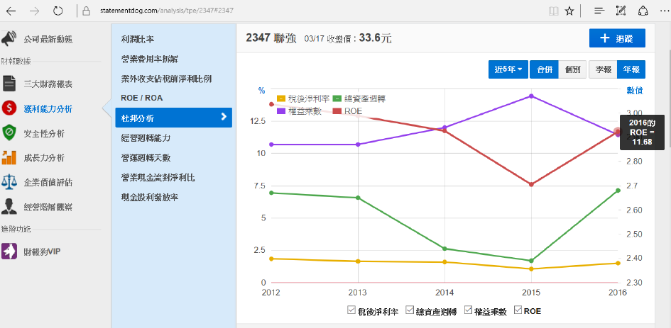

# 關於聯強的二、三事 單車小子 觀點

「關於聯強的二、三事」
單車小子 觀點
今年聯強的配息打破過去長久的習慣只配一元。聽到這個訊息時，自己不得不承認心頭震了一下。不過當初買進就打算長期持有，(配息當作退休一個月的生活費)，今天如果要賣出，還是要回頭檢視一下這檔股票真的變差了嗎?

(一)關於老闆
首先，聯強的大老闆叫做杜書伍，被2016年哈佛商業評論選為亞洲前50強執行長。但是這樣的名聲是真的還假的，我用幾個角度可以看到的事情去思考。

聯強去年還了不少短期借款(參閱圖表一),讓他的短期負債大幅下降，這有甚麼意義呢?別忘了，美國已經開始進入升息循環，借錢的成本大增，若借來的錢沒法創造出高於定存的績效，那麼還錢是聰明的。而且還可以降低利息支出，變相增加盈餘。與其配息或減資拿來創造話題，對於這點自己是比較認同的。

而且聯強去年持續投資東南亞地區、印度和中國大陸，(自己也非常認同)。所以從去年聯強的投資現金流可以看出，他仍不斷投資(參閱圖表二,三)，但未來的投資績效如何?這就只能信任執行長的能力了。

中國大陸和東南亞的內需消費市場不斷成長，尤其是中國大陸，自己非常看好他未來的內需成長，儘管目前大陸股市積弱不振，但不代表消費力道也是如此。前年拜人民幣貶值的福，盈餘大減，若未來人民幣轉貶為升呢?而這是另一個大議題，就先不細述。

而且去年大聯大和文曄等不少公司都踩到樂視的地雷，可是聯強沒有，自己也不知道為什麼?不過只能佩服老闆的睿智。

再來看一下他的轉投資事業並不多，主要就幾家，而且幾乎都是100%持有的子公司，每年都帶來豐厚的認列收益。光這點就打敗一大堆的企業經理人了。

(二)獲利狀況
去年聯強第四季獲利，0.36元，整年2.01元。今年第四成獲利0.79，整年2.92元。雖然第四季應是托匯兌收益回沖的福成長一倍，但以全年來看也大幅成長。

今年第一季，聯強整體累計年成長-2%，跟去年差不多，目前看起來沒甚麼變化，但穩定經營和去年一樣就夠了。想想，目前股價33.6，星期一說不定還跌，本益比才11倍左右，其實他有持續配息2元的實力，就看他的經營策略如何?這樣的公司自己覺得挺不錯的。

從下表可以看出，聯強的ROE大幅增加，這和他的金融債大幅降低有關，連帶使他的權益成數，槓桿經營降低，總資產周轉力提高有關。(參閱圖表四)
此外，它的營運周轉狀況好轉中。再加上他去年的投資，今年會否重回成長軌道呢?(參閱圖表五)

(三)財務狀況
就財務狀況來說，自己最不滿意和最擔心的就是負債狀況。聯強帳上現金只有74億(因還債加上投資資出，而大幅減少)。但是短期要支付的有54億，感覺手頭很緊。一年內到期的負債還有386億~~~>”<~~~(參閱圖表六)
不過好在他的應收帳款也不少，可以周轉抵銷一部分
此外存貨挺多的，會否有折價損失，這是必須審慎去對待的。
(參閱圖表七)

(四)結語
聯強去年因為還短債與投資導致帳上現金減少，但整體短期金融負債約30%，並不算高。可是也因此今年配息只有一元。從另一個角度來看，不打腫臉衝胖子也是值得稱許的。

而去年獲利大幅成長，季獲利更是成長100%。在公司成長與配息(拿自己的錢配給自己的安慰獎)間，要選誰呢?

過去不少人一直說，公司若能拿獲利去投資，讓公司更成長比較好，美國不少企業就是如此，所以配息都普普。現在這種狀況來了，倒底是嘴巴說說，還是如何?就看周一投資人怎麼反應了。

只是從上周股市最後一盤有人拉升聯強股價來看，到底是預留下跌空間，還是強力肯定?就看下周過後，鹿死誰手囉。

