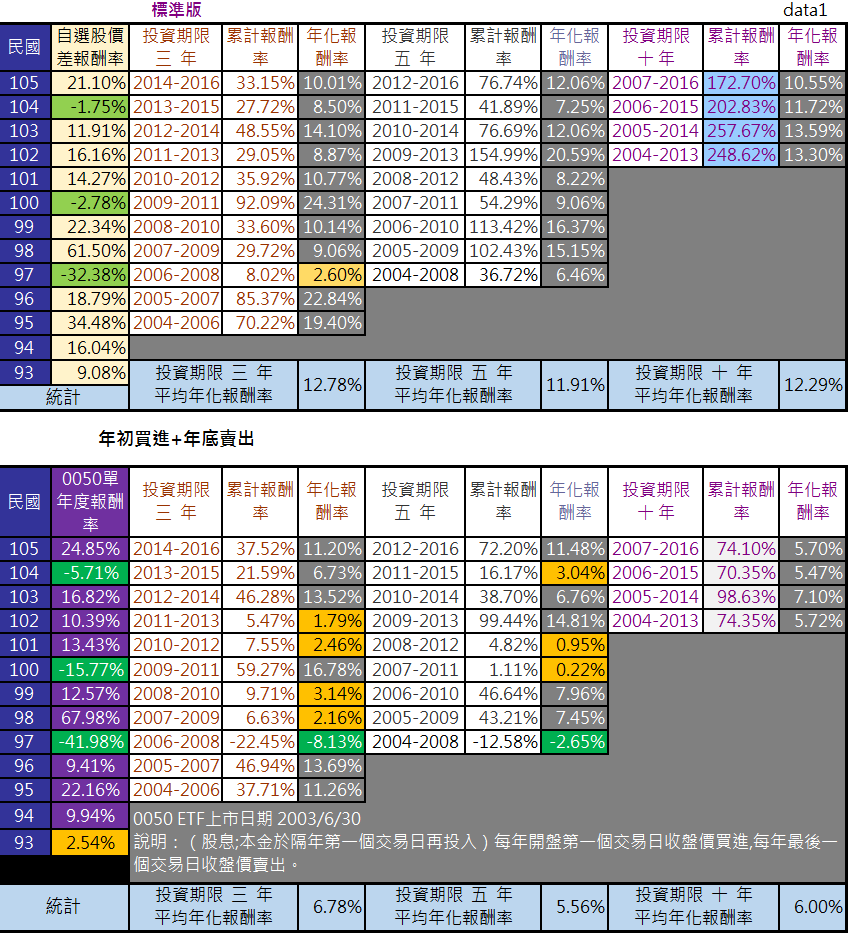
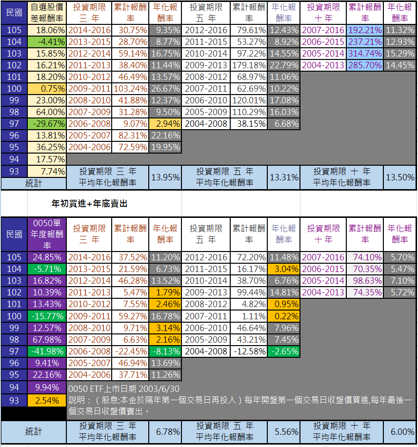
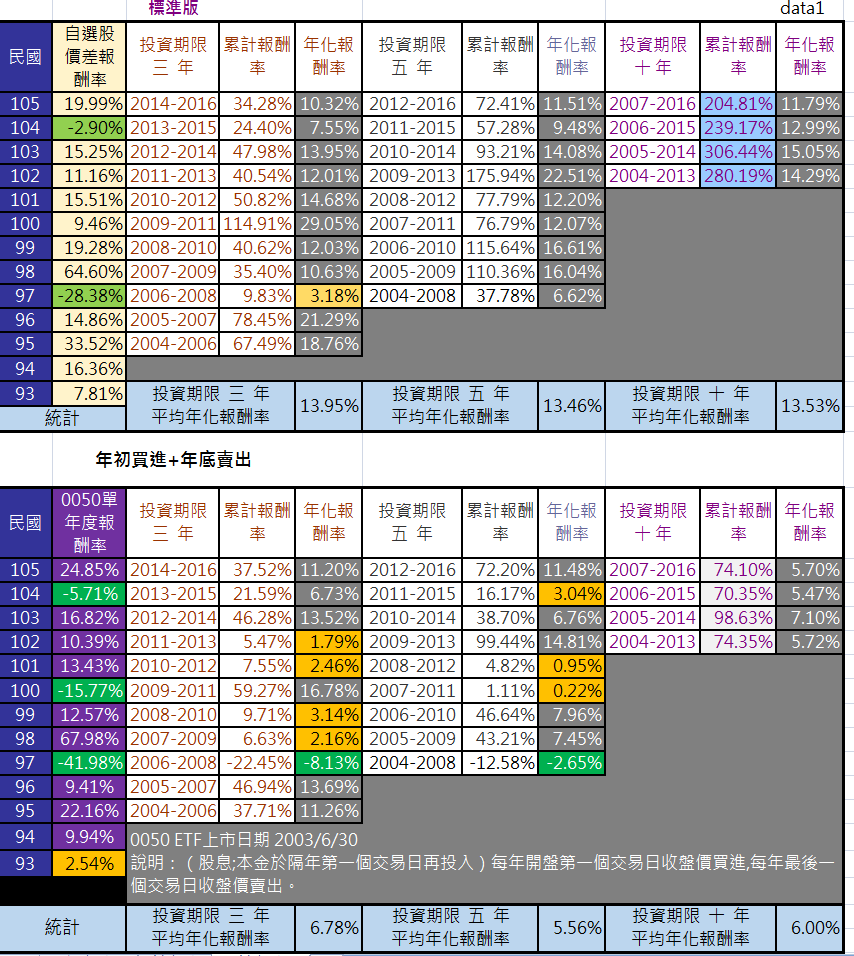
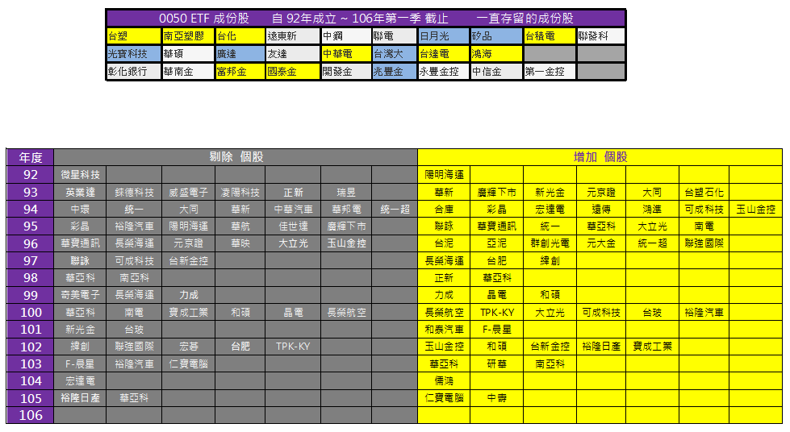

# 精選20檔-適合防禦型投資人之個股研究

翻開文件可以看到.....
這些藍籌股在台股的市值排名與最近三,五,十年的平均ROE。
個股基本資料則顯示過去十年股本,營收,稅後淨利,ROE,EPS,股利 等相關數據的變化。

標準買賣模式是指
每年年初第一個交易日買進股票 ;年底最後一日交易日賣出。

進階買賣模式是指
看到指數出現7700點或以下才開始買進股票;年底最後一個交易日賣出。萬一整年度沒出現7700點,則不買。

##為什麼投資績效回測要如此設計?
這是考量到不同時間點買賣股票,就算持有股票期限相同,報酬率經常出現巨大差異。但多數人誤以為只要抱牢三年或五年 「必賺 ?」從股價回測歷史看來並非如此。

單年度報酬率波動最大,也最容易出現虧損機率。三年次之,五年更次之。十年時間則不易出現虧損。

##不是要長期投資嗎,那為什麼需要年底賣出?
這是為了方便跟0050 比較不同持有時間的投資績效。因此年底賣出股票,隔年初把再股息與本金再投入。

如果不預設買進條件,這樣的操作績效跟長期投資不賣,再投入股息的效果有雷同長期報酬率，因為買賣支付的費用會略低一些。

##為什麼一定要跟0050比較報酬率?

如果投資人費盡心力,仍然經常輸給0050的三,五年的年化報酬率,代表自選的投資組合有問題,應該擁抱0050才是!

投資的侷限性 - 
一籃子股票採用相同的時間或指數條件下買賣,不一定適合每一檔個股。我們從個股回測績效表很明顯看出差異。

儘管如此,整體投資組合仍然多數年度都超越市場報酬率。至少過去13年是如此。

##為什麼認為這個投資組合在未來會贏過0050?

0050是靠平均的力量讓高成長股,停滯型股,衰退股 同時並陳，只要市值加權排名在前50名。雖然市值加權指數可以刪掉後面排名的公司,但股本很大的金融股或半導體股 市值再怎麼衰退，多數不受影響<請看圖一>。

圖一
顯示過去14年屹立不搖的公司,但真的都是營運良好的公司嗎?
由於市值加權指數選股,因此頻繁更換個股也降低了些投資績效。

因此整體報酬率還是深受影響。(回測證明它們是拖累0050報酬率的元兇)

##0050 ETF
投資期限 三年 平均年化報酬率 6.78%  
投資期限 五年 平均年化報酬率5.56%  
投資期限 十年 平均年化報酬率6%  

列舉20檔,15檔,12檔 隨意組合 ( 圖 二 三 四) 
在過去多數時間都超越0050。原因在於多數不同階段的三年,五年報酬率波動程度較小,虧損幅度也是。因此才能經常贏過0050。

精選20檔個股組合看重的是 
相對穩健的ROE 
以停滯型企業為主,成長型為輔,搭配原物料景氣循環股。 
追求的是，高於0050的中,長期年化報酬率。 

２０檔精選股ＰＤＦ ：https://1drv.ms/b/s!AitGjsckPGIOgVDyNk8IfGXwUcrn

回測EXCEL :https://1drv.ms/x/s!AitGjsckPGIOgU7YTpBEh6HnGepV

下一篇將針對個股入選問題提出簡要說明,請網友不要急躁...

這些日子頻繁核對數據,花太多時間看螢幕,眼睛有些不適。想將未來的文章改在星期日晚上發表!避免影響身體健康與生活品質。謝謝大家的體諒 ~